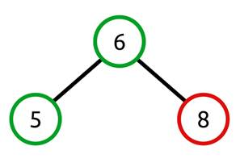
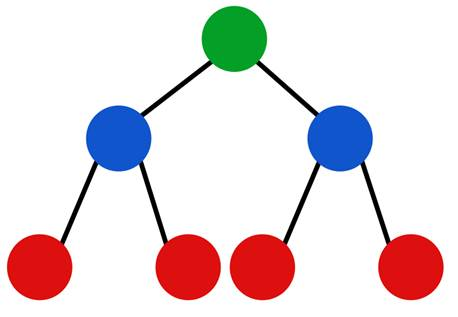
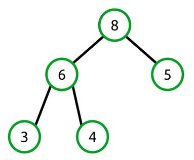
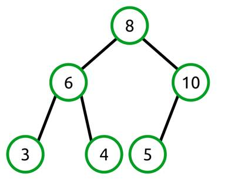
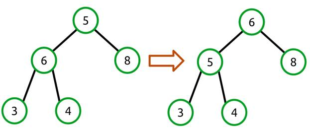
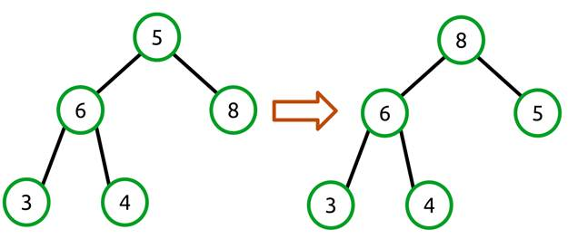

# 第 3 章堆和优先级队列

## 概述

堆数据结构提供了两种简单的行为:

1.  允许向集合中添加值。
2.  根据是“最小”堆还是“最大”堆，返回集合中的最小值或最大值。

虽然这些行为起初看起来可能过于简单，但这种简单的性质允许数据结构在时间和空间上非常有效地实现，同时提供了一种通常需要的行为。

考虑堆的一个简单方法是将其视为二叉树，它有两个简单的规则:

1.  任何节点的子值都小于该节点的值。
2.  这棵树将是一棵完整的树。

不要在规则 1 中读到比它说的更多的东西。任何节点的子节点都将小于或等于其父节点。订购没有任何意义，不像二叉查找树，订购非常重要。

那么规则 2 是什么意思呢？完整的树是每一层都尽可能满的树。唯一可能不满的级别是最后一个(最深的)级别，它将从左到右填充。

当这些规则在树中递归应用时，应该清楚堆中的每个节点本身就是堆中子堆的父节点。

让我们看看一些无效的堆树:



图 16:无效，因为子值 8 大于父值 6


图 17:无效，因为子节点填充在右边，而不是左边

现在是有效的堆:


图 18:遵循属性和完整性规则的有效堆

## 二叉树为数组

### 结构概述

虽然堆在概念上很容易映射到树，但实际上它们通常不存储在树结构中。相反，使用非常简单的算法将树结构投影到数组中。因为我们使用的是一个完整的树，所以这变成了一个非常简单的操作。

让我们先来看一棵树，它的节点是根据它们在树中的级别来着色的。



图 19:基于级别的颜色树

这是一个完整的树，有三个层次的七个节点。我们将此逐级放入一个数组中，如下所示:


图 20:投影到数组中的二叉树

根节点(级别 1)位于第一个数组索引中。它的孩子(下一级)紧随其后。他们的孩子跟着。这种模式持续到树的每一层。请注意，在数组的末尾甚至还有一个未使用的数组索引。当我们想要向堆中添加更多数据时，这将变得非常重要。

让我们看一个具体的例子，其中这个有效的堆映射成一个数组。


图 21:作为二叉树的有效堆


图 22:映射到数组中的有效堆树

### 像树一样导航数组

树的一个好处是它们很容易以迭代和递归的方式导航。在树中上下移动就像导航到子节点或返回到父节点一样简单。

如果我们要有效地使用数组来包含我们的树数据，我们需要同样有效的机制来确定两个事实:

1.  给定一个索引，什么索引代表它的子索引？
2.  给定一个索引，哪个索引代表它的父索引？

原来这很简单。

任何索引的子代都是:

*   左子索引= 2 × <current index="">+ 1</current>
*   右子索引= 2 × <current index="">+ 2</current>

让我们证明这是可行的。回想一下，根节点存储在索引 0 中。使用该公式，我们可以看到它的左子可在索引 1 处找到(使用公式 2 × 0 + 1)，它的右子可在索引 2 处找到(2 × 0 + 2)。

找到任何节点的父节点只是该函数的逆函数:

父=(索引- 1) / 2

从技术上讲，它是 floor((index - 1) / 2)。然而，C#为我们处理整数截断。

### 关键点

从这一节中要带走的关键点是:堆中最大的值总是数组中的第一项。

## 堆类

我们将实现的堆类是一个最大堆，这意味着它非常有效地返回最大值。这门课非常简单。它有一个添加新值、移除最大值、查看最大值、清除集合以及获取堆中当前项目数的方法。

堆要求其泛型类型参数实现`IComparable<T>`接口，并且有两个字段:后备数组和堆中当前的项目计数。这里还显示了两种实用方法`Swap`和`Parent`。

请注意，没有枚举或执行其他查找操作的方法，例如确定堆是否包含特定值或直接索引到堆中。虽然这些方法并不难添加，但它们与堆是什么有冲突。堆是返回最小值或最大值的不透明容器。

```cs
    public class Heap<T>
        where T: IComparable<T>
    {
        T[] _items;
        int _count;
        const int DEFAULT_LENGTH = 100;

        public Heap()
            : this(DEFAULT_LENGTH)
        {
        }

        public Heap(int length)
        {
            _items = new T[length];
            _count = 0;
        }

        public void Add(T value);

        public T Peek();

        public T RemoveMax();

        public int Count { get; }

        public void Clear();

        private int Parent(int index)
        {
            return (index - 1) / 2;
        }

        private void Swap(int left, int right)
        {
            T temp = _items[left];
            _items[left] = _items[right];
            _items[right] = temp;
        }
    }

```

## 添加

| 行为 | 将提供的值添加到堆中。 |
| 表演 | *O* (日志 *n* ) |

向堆中添加值有两个步骤:

1.  将该值添加到支持数组的末尾(如有必要，可以增加)。
2.  将该值与其父值交换，直到满足堆属性。

例如，让我们看看之前的有效堆:



图 23:有效堆

我们将把值 10 添加到堆中。使用所描述的算法，我们从将值添加到后备数组的末尾开始。由于我们在数组中存储了一个完整的树，这意味着我们在最后一层最左边的空闲槽中添加了一个新节点。


图 24:向有效堆中添加 10

我们的后备数组现在看起来如下:

```cs
    [8, 6, 5, 3, 4, 10]

```

您应该注意到这违反了堆属性，该属性要求每个节点的子节点小于或等于父节点的值。在这种情况下，值 5 有一个值为 10 的子级。要解决这个问题，我们需要交换节点，如下所示:



图 25:交换 10 和 5 个节点

我们的后备数组现在如下所示:

```cs
    [8, 6, 10, 3, 4, 5]

```

我们现在已经修复了 10 和 5 之间的关系，但是 10 的父节点是 8，这违反了堆属性，所以我们也需要交换这些。


图 26:交换 10 和 8 个节点

我们的后备数组现在看起来如下:

```cs
    [10, 6, 8, 3, 4, 5]

```

该树现在满足堆属性，并且仍然是完整的，因此`Add`操作完成。

请注意，随着树的重新平衡，在数组中执行的操作只是父索引和子索引值的简单交换。

```cs
    public void Add(T value)
    {
        if (_count >= _items.Length)
        {
            GrowBackingArray();
        }

        _items[_count] = value;

        int index = _count;

        while (index > 0 && _items[index].CompareTo(_items[Parent(index)]) > 0)
        {
            Swap(index, Parent(index));
            index = Parent(index);
        }

        _count++;
    }

    private void GrowBackingArray()
    {
        T[] newItems = new T[_items.Length * 2];
        for (int i = 0; i < _items.Length; i++)
        {
            newItems[i] = _items[i];
        }

        _items = newItems;
    }

```

## 删除最大值

| 行为 | 移除并返回堆中最大的值。如果堆为空，则会引发异常。 |
| 表演 | *O* (日志 *n* ) |

`RemoveMax`的工作原理与`Add`相似，但方向相反。`Add`从树的底部(或数组的末尾)开始，将值向上移动到适当的位置，`RemoveMax`从存储堆中最大的值开始，该值在数组索引 0 中。这是将返回给调用者的值。

由于该值正在被移除，数组索引 0 现在是空闲的。为了确保我们的数组没有任何间隙，我们需要向其中移动一些东西。我们要做的是抓取数组中的最后一项，并将其向前移动到索引 0。在树形视图中，它看起来像这样:


图 27:将最后一个数组项移动到索引 0

我们的后备数组变化如下:

```cs
    [10, 6, 8, 3, 4, 5]     =>     [5, 6, 8, 3, 4]

```

与`Add`一样，树不处于有效状态。但是，与`Add`不同，坏节点是根(数组索引 0)，而不是最后一个节点。

我们需要做的是将较小的父节点与其子节点交换，直到满足堆属性。这就留下了一个问题:我们和哪个孩子交换？答案是我们总是和最大的孩子交换。想想如果我们和小一点的孩子交换会发生什么。树会从一个无效状态切换到另一个无效状态。例如:



图 28:用较小的值交换不会创建有效的堆

我们还没有解决问题！相反，我们需要像这样与两个孩子中较大的一个交换:



图 29:与最大的子代交换创建一个有效的堆

我们的后备数组变化如下:

```cs
    [5, 6, 8, 3, 4]     =>     [8, 6, 5, 3, 4]

```

这个例子只需要一次交换就可以使堆有效。但实际上，交换操作可能需要在每个级别执行，直到满足堆属性，或者直到节点处于最后一个级别(可能回到它开始的位置)。

```cs
    public T RemoveMax()
    {
        if (Count <= 0)
        {
            throw new InvalidOperationException();
        }

        T max = _items[0];

        _items[0] = _items[_count - 1];
        _count--;

        int index = 0;

        while (index < _count)
        {
            // Get the left and right child indexes.
            int left = (2 * index) + 1;
            int right = (2 * index) + 2;

            // Make sure we are still within the heap.
            if (left >= _count)
            {
                break;
            }

            // To avoid having to swap twice, we swap with the largest value.
            // E.g.,
            //      5
            //    6   8
            //
            // If we swapped with 6 first we'd have
            //
            //      6
            //    5   8
            //
            // and we'd require another swap to get the desired tree.
            //
            //      8
            //    6   5
            //
            // So we find the largest child and just do the right thing at the start.
            int maxChildIndex = IndexOfMaxChild(left, right);

            if (_items[index].CompareTo(_items[maxChildIndex]) > 0)
            {
                // The current item is larger than its children (heap property is satisfied).
                break;
            }

            Swap(index, maxChildIndex);
            index = maxChildIndex;
        }

        return max;
    }

    private int IndexOfMaxChild(int left, int right)
    {
        // Find the index of the child with the largest value.
        int maxChildIndex = -1;
        if (right >= _count)
        {
            // No right child.
            maxChildIndex = left;
        }
        else
        {
            if (_items[left].CompareTo(_items[right]) > 0)
            {
                maxChildIndex = left;
            }
            else
            {
                maxChildIndex = right;
            }
        }
        return maxChildIndex;
    }

```

## Peek

| 行为 | 返回堆中的最大值，如果堆为空，则引发异常。 |
| 表演 | *O* (1) |

```cs
    public T Peek()
    {
        if (Count > 0)
        {
            return _items[0];
        }

        throw new InvalidOperationException();
    }

```

## 计数

| 行为 | 返回堆中的项数。 |
| 表演 | *O* (1) |

```cs
    public int Count
    {
        get
        {
            return _count;
        }
    }

```

## 晴

| 行为 | 从堆中移除所有项目。 |
| 表演 | *O* (1) |

`Clear`将计数设置为 0，并分配一个新的默认长度数组。进行数组分配是为了确保垃圾收集器有机会释放在调用`Clear`之前被堆引用的任何对象。

```cs
    public void Clear()
    {
        _count = 0;
        _items = new T[DEFAULT_LENGTH];
    }

```

## 优先队列

优先级队列是队列和堆之间的交叉。它看起来和感觉上都像一个队列——项目可以入队和出队。但是，返回的值是最高优先级的项目。

优先级队列通常用于处理许多项目的场景，其中一些项目比其他项目更重要。

网络路由是一个例子，我想我们都能理解。并非所有网络流量都是相等的。一些数据(如实时语音通信)需要高质量的服务，而其他数据(如网络备份程序的后台文件传输)需要较低的服务质量。

如果我的电脑正在为 VoIP 电话连接发送数据包，并且正在传输我去脸书度假的照片，那么我很可能希望语音连接优先于图片传输。图片传输时间长一点我可能不会注意到，但是你可以肯定我会注意到我的语音通话质量差。

在本例中，网络栈可能提供一种机制，允许网络流量为自己声明一些优先级属性，以确定数据的时间敏感性。网络栈可能会在内部使用优先级队列来实现这一点。这显然是一个复杂话题的琐碎化，但重点应该是明确的:有些数据集比其他数据集更重要。

### 优先级队列类别

优先级队列类是堆上非常薄的包装器。它真正做的只是分别用`Enqueue`和`Dequeue`包装`Add`和`RemoveMax`方法。

```cs
    public class PriorityQueue<T>
        where T: IComparable<T>
    {
        Heap<T> _heap = new Heap<T>();

        public void Enqueue(T value)
        {
            _heap.Add(value);
        }

        public T Dequeue()
        {
            return _heap.RemoveMax();
        }

        public void Clear()
        {
            _heap.Clear();
        }

        public int Count
        {
            get
            {
                return _heap.Count;
            }
        }
    }

```

### 用法举例

本示例创建一个简单的应用程序，其中消息按以下属性排队:

*   优先级从 0(最低)到 3(最高)。
*   消息的年代。
*   消息本身(字符串)。

优先级队列用于确保消息按优先级顺序处理。给定优先级内的多条消息从最早到最新进行处理。

`Data`类具有前面列表中提到的三个属性，一个以结构化方式打印属性的`ToString`方法，以及一个`IComparable<Data>`。`CompareTo`通过`Priority`和`Age`进行比较的方法。

```cs
    class Data : IComparable<Data>
    {
        readonly DateTime _creationTime;

        public Data(string message, int priority)
        {
            _creationTime = DateTime.UtcNow;
            Message = message;
            Priority = priority;
        }

        public string Message { get; private set; }

        public int Priority { get; private set; }

        public TimeSpan Age
        {
            get
            {
                return DateTime.UtcNow.Subtract(_creationTime);
            }
        }

        public int CompareTo(Data other)
        {
            int pri = Priority.CompareTo(other.Priority);
            if (pri == 0)
            {
                pri = Age.CompareTo(other.Age);
            }

            return pri;
        }

        public override string ToString()
        {
            return string.Format("[{0} : {1}] {2}",
                Priority,
                Age.Milliseconds,
                Message);
        }
    }

```

接下来，有一个简单的类将 1000 个随机优先级的消息添加到队列中，消息之间有 0–3 毫秒的短暂延迟，以确保可以通过优先级和时间来演示排序。

然后，应用程序按照优先级和时间顺序打印出消息，以演示如何使用优先级队列。

```cs
    static void PriorityQueueSample()
    {
        PriorityQueue<Data> queue = new PriorityQueue<Data>();

        queue = new PriorityQueue<Data>();
        Random rng = new Random();

        for (int i = 0; i < 1000; i++)
        {
            int priority = rng.Next() % 3;
            queue.Enqueue(new Data(string.Format("This is message: {0}", i), priority));
            Thread.Sleep(priority);
        }

        while (queue.Count > 0)
        {
            Console.WriteLine(queue.Dequeue().ToString());
        }
    }

```