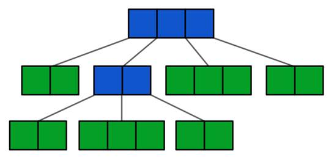
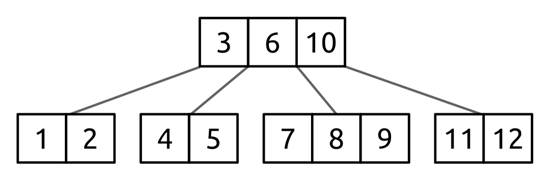
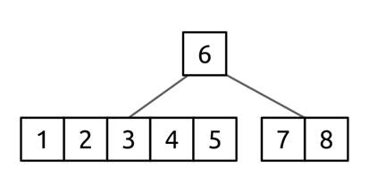
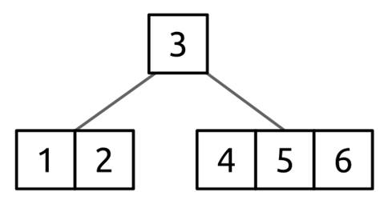
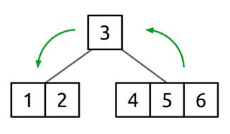
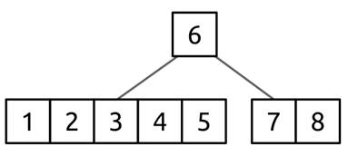
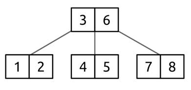

# 五、B 树

## 概述

B 树是一种有序、平衡的树结构。b 树通常用于访问存储在磁带驱动器和磁盘等低速介质上的数据。树层次结构使得能够以有效搜索的方式存储数据，同时仅将树的必要部分从存储介质加载到主存储器中。

本章不会讨论离线数据存储的问题，而是将重点放在完全内存中的数据结构上。一旦你理解了 B 树的概念，它们就可以应用于从磁盘加载数据，但这是一个你可以自己进行的练习。

## B-树结构

了解 B 树结构最简单的方法可能是看一下 B 树，并讨论它与我们已经熟悉的树结构的不同之处:二叉查找树。下面是一个 B 树的例子:


图 45:一个示例 B 树

需要说明的是，这是一个 B 树，其根节点包含值[3，6，10]和四个子节点。

我想强调这一点:这个树包含 5 个节点和 12 个值。虽然一个二叉查找树包含每个节点一个值，但是一个 B 树可以，而且经常会，每个节点有多个值。

您会注意到树中值的顺序与我们在二分搜索法树中看到的一致。较小的值在左边，较大(或等效)的值在右边。这在树结构(子节点)和节点中的值排序中都适用。

在本例中，根节点有三个值和四个子节点。这种 *n* 值和 *n* + 1 个孩子的模式是 B 树不可改变的特征。无论一个节点包含一个值还是一千个值，总会比值多一个子节点。花点时间想想为什么这是真的。

导航树时，我们从根节点开始。节点中的第一个值是 3。遵循“左边较小的值”规则，我们需要在左边有一个节点来向下遍历(除非该节点是叶节点，在这种情况下它没有子节点)。同样，对于大于 3(且小于其邻居值 6)的值，值 3 需要在其右边有一个子值。

请注意，值 3 的右子代也是值 6 的左子代。同样，值 6 的右子代是值 10 的左子代。最后一个值，10，有一个正确的孩子。

### 最小度数

B 树中一个关键且经常令人困惑的概念是最小度。也叫最小化因子、度、阶，大概还有很多其他的东西，关键概念都是一样的。

最小度是每个节点必须拥有的最小子节点数，根节点除外(根节点可以更少，但不能更多)。在本章中，我将用变量 *T* 来表示最小度数。

更正式地说，B 树中的每个非根节点至少包含 *T* 子节点，最多包含 2 × *T* 子节点。我们可以从中得出两个重要事实:

*   每个非根节点至少有 *T* - 1 个值。
*   每个非根节点最多有 2 × *T* - 1 个值。

具有 *T* - 1 值的节点处于其最小程度，不能从中移除值。具有 2 × *T* - 1 的节点处于其最大程度，并且不能向其添加其他值。处于这种状态的节点被称为“已满”

### 树高

B 树结构强制执行树中的每个叶节点深度相同并且每个叶节点包含数据的规则。

我们在图 45 中看到的树有四个叶节点，它们都在相同的深度 2。下面是两个无效 B 树的例子。



图 46:无效的 B 树。叶节点(绿色)并不都在同一层


图 47:无效的 B 树。叶节点(绿色)处于相同高度，但有一个是空的或缺失的

### 搜索树

由于其有序结构，搜索 B 树类似于搜索二叉查找树。在树中搜索值的算法非常简单。该算法使用以下算法从根开始递归处理每个节点:

```cs
    bool search(node, valueToFind)
      foreach value in node
        if valueToFind == value
          return true
        if valueToFind < value
          search(<left child>, valueToFind)
      end
      return search(<last child>, valueToFind)
    end

```

为了了解它是如何工作的，让我们通过几个场景搜索下图中的树:



图 48:用于搜索的 B 树

搜索值 3 是微不足道的。搜索从根节点开始，将节点(3)中的第一个值与正在搜索的值(3)进行比较，然后找到该值。

搜索 6 也差不多。根节点中的 3 与 6 进行比较。由于 6 大于 3，搜索将移动到节点中的下一个值。将下一个值(6)与正在寻找的值(6)进行比较，并找到该值。

搜索 2 有点复杂。首先，将根节点中的值 2 与 3 进行比较。因为 2 小于 3，所以搜索 3 左边的孩子。搜索包含[1，2]的子级中的第一个值。因为 1 小于 2，所以检查下一个值。值 2 与正在搜索的值匹配，因此找到了该值。

搜索 15 从比较 3、6 和 10 开始。因为它们都小于 15，所以搜索根节点的最后一个子节点。对照值 11 和 12 重复该过程。因为两者都较小，所以将检查当前节点的最后一个子节点；但是，节点[11，12]是叶节点，因此找不到该值。

应该清楚的是，搜索算法基本上与二叉查找树算法相同，区别在于每个节点可以有多个值进行比较。

### 放在一起

了解了树高、最小度以及如何搜索树之后，让我们花点时间考虑一下这个结构的效率。

想象一棵最小因子为 501 的树。此树在每个非根节点中至少有 500 个值(最多 1000 个)。如果根节点包含 500 个值，并且它的 501 个子节点中的每一个都包含 500 个值，则仅前两个级别就包含 500 × 502，即 251，000 个值。

为了找到一个特定的值，我们将从根节点开始，最多执行 500 次比较。在这个过程中，我们要么找到我们想要的值，要么决定下一步检查哪个节点。在下一个节点，我们将再次执行最多 500 次比较，或者确定该节点不在那里。这意味着我们将在一个有 251，000 个值的树中最多执行 1000 次比较。

但还可以更好！

由于每个节点包含一个排序的值数组，我们可以使用二分搜索法代替线性搜索。我们现在每个节点只能执行 9 次比较，在最坏的情况下，只需 18 次比较就可以确定该值是否存在于包含 251，000 个值的树中。

## 平衡操作

像 AVL 树一样，当改变树结构的操作发生时，B 树可能需要平衡，以确保它实现结构规则。虽然概念上相似，但实际操作与 AVL 的工作方式大不相同。

在本节中，我们将了解几种类型的平衡操作，并讨论它们的用途。

### 下推

下推一个值是一个过程，其中两个子节点合并在一起，父节点的值作为中间值下推到结果节点中。让我们看看这意味着什么。我们从下面的树开始:


图 49:向下推的 B 树

假设这是一棵 3 度的树。这意味着每个节点必须有 2 到 5 个值(根节点除外)。基于这样的理解，我们如何从这个树中删除值 2？如果我们简单地从叶节点中移除 2，子节点[1，2]将只剩下一个值。由于这将违反 B 树结构规则，因此不是一个可接受的解决方案。

我们需要的是值 2 存在于一个至少有 *T* 个值的节点中，该节点也遵守其他 B 树结构规则。为此，我们将通过执行以下操作来创建一个新节点:

1.  分配一个新节点。
2.  将值[1，2]放入新节点。
3.  将值[3]放入新节点。
4.  将值[4，5]放入新节点。
5.  放弃现有节点[1，2]和[4，5]。
6.  从父节点中移除值[3]。
7.  链接[4，5]之前链接的新节点。

这将生成如下所示的树:



图 50:向下推 B 树

我们现在有一个节点，其中有 2 × *T* - 1 个值，这足以删除值 2。

要点:

*   下推合并两个相邻的子级。
*   这些孩子每个都有 *T* - 1 值。
*   父值作为中间值相加。
*   生成的节点有 2 × *T* - 1 个值。

### 旋转值

值旋转非常类似于向下推，并且是出于相同的原因，只是情况略有不同。

考虑下面的树:



图 51:用于旋转的 B 树

就像我们对下推所做的那样，让我们看看当包含 2 的节点只有 *T* - 1 个值时，我们将如何从树中移除值 2。

解决这个问题的关键是[1，2]的兄弟节点[4，5，6]具有超过 *T* - 1 的值，因此可以从其获取值而不违反结构规则。这是通过旋转我们想要通过父代的值来完成的，如下所示。



图 52:旋转前的 B 树

我们要旋转的值(4)将旋转到父节点，父值(3)将旋转到子节点，得到的结果树为:


图 53:旋转后的 B 树

完成此循环后，值 2 现在可以从叶节点中删除。

这里发生的具体步骤是:

1.  将父值添加到左侧子值的末尾。
    1.  这是将值 3 添加到[1，2]节点，使节点成为[1，2，3]。
2.  将右兄弟值的第一个值(4)复制到父级(其中 3 是)。
    1.  此时，根节点[4]和[4，5，6]中都存在 4。
3.  如果[4，5，6]节点不是叶节点，请将[1，2，3]中 4 的左子节点移动到 3 的右子节点。
    1.  这是因为[4，5，6]中剩下的 4，根据定义，都小于 4 但大于 3。现在 4 是根，我们知道该子树上的所有值都属于它的左边。同样，我们知道该子树中的所有值都大于 3，因此它们属于它的右边。

请注意，我们刚才遵循的步骤是将节点从右向左旋转。从左向右旋转节点的相反过程可以通过简单地反转前面描述的操作方向来完成。

### 分割节点

拆分节点基本上与下推相反。我们不是用父节点提供的中值将两个节点合并在一起，而是将一个节点分成两半，并将中值向上拉到父节点中。

例如，给定以下树:



图 54:用于拆分的 B 树

我们希望拆分节点[1，2，3，4，5]，并将其中间值 3 移动到父节点，从而创建新的根节点[3，6]。这将导致以下树:



图 55:拆分左侧子节点后的 B-树

这里的步骤是:

1.  从节点[1，2，3，4，5]中选取中间值。
2.  创建新的左子项[1，2]。
3.  创建新的右子级[4，5]。
4.  将值 3 移动到根的前面，创建[3，6]。
5.  将新节点[1，2]和[4，5]链接为父值[3]的左右子节点。

我们什么时候做这个？

在我们的示例中，向节点[1，2，3，4，5]添加另一个值将导致该节点具有 2 个以上的 *T* - 1 值，这违反了 B 树结构规则。由于[1，2，3，4，5]是叶节点，我们不能简单地创建[1，2，3，4，5]的新子节点，因为这将使所有叶节点必须处于相同高度的规则无效。

我们可以使用节点拆分来解决这个问题，方法是将一个值从子节点移动到父节点，确保新的左右子节点都有足够的空间来添加新值，而不会使结构规则无效。

## 添加值

向 B 树中添加一个值是使用一个相对简单的算法来完成的，该算法利用了前面几节中描述的平衡操作。插入过程从发生以下逻辑的根节点开始:

```cs
    BTree::Add(value)
        IF root.Values.Count == (2 × T – 1) THEN
            root = SplitRootNode(root)
        END

        AddToNonFullNode(root, value)
    END      

```

这里有两条路径，走哪条取决于`Add`执行时根节点是否已满。让我们看看在这种情况下会发生什么。

我们从最小因子为 3 的树开始。这意味着根节点中可以有 0(空)到 5(满)个值。在这个场景中，整个树中有 5 个值，它们都存在于根节点中。起始树是:


图 56:所有值都在根节点的 B 树

此时，我们希望将值 6 添加到树中。将该值添加到根节点会给它 2 *T* 个值，这超出了它所能容纳的范围。为了解决这个问题，我们需要使用[节点分裂](#heading_id_106)算法。

为此，根节点的中值 3 被拉进一个新的根节点，相邻的值[1，2]和[4，5]成为根的子节点。完成后，树如下所示:


图 57:分割根节点后的 B 树

要理解的一个有趣且非常重要的点是，这个分裂根节点的过程是树的高度增长的唯一途径。

现在根节点没有满(或者如果调用`Add`时节点没有满)，可以执行非满插入算法。

该算法只需搜索适当的叶节点来添加值，并在遍历树时拆分遇到的任何完整节点。该算法的简化版本如下:

```cs
    BTree::AddToNonFullNode(node, value)
        IF node.Leaf THEN
            AddValueAtAppropriateIndex(node, value)
        ELSE
            child = FindAppropriateChildToInsert(node, value)
            IF child.Values.Count = (2 × T – 1) THEN
                SplitChildNode(node, child)
            END
            AddToNonFullNode(child, value)
        END
    END      

```

关于该算法，您需要了解两个要点:

*   值只添加到叶节点。
*   算法从不遍历到一个完整的节点；它总是在进入节点之前拆分完整的节点。这很关键，因为这意味着插入值的叶节点不能是满的。

## 移除值

很像二叉查找树树或 AVL 树，从 B 树中移除一个值比添加一个值更复杂。在 B 树的情况下，有三种潜在状态需要处理:

1.  要移除的值位于叶节点中。
    1.  在这种情况下，我们可以简单地移除该值。
2.  该值位于内部(非叶)节点中。
    1.  将要移除的值向下推一级(向叶节点)。使用各种平衡算法来确保当值被下推时树在结构上保持有效。
    2.  遍历到值被推入的子节点，并从步骤 1 开始重复。
3.  该值不在当前内部节点中。
    1.  如果值在树中，则查找该值所在的子节点。
    2.  确保子节点中至少有 *T* 个值。
        1.  在子节点上使用节点旋转或合并算法，确保它在遍历到它之前有 *T* 个节点。
    3.  遍历到子节点，重复步骤 1。

在一个非常高的层次上，我们正在沿着树往下走，从根到适当的叶节点，一路上确保以下几点:

1.  如果我们已经找到了要移除的值，我们将它向下推到一个叶节点。
2.  如果没有，请确保子节点有 *T* 个子节点，然后再前往。

我们做#1 的原因是因为我们只能移除(和添加)叶节点中的项目。这不仅仅是因为这样做“更容易”，而是因为这样做是强制性的。每个节点都有 *n 个*值和 *n 个* + 1 个子节点。在非叶节点中，这些子节点中的每一个都引用节点的整个子树。如果我们从内部节点移除一个值，我们将有 *n* - 1 个值和 *n* + 1 个子节点。我们如何管理那棵孤儿树？

我们可以安全地从树中移除(或添加)项目的唯一方法是在叶节点中。这是因为叶节点是唯一没有管理子节点问题的节点(因为它们没有子节点)。

我们为什么要做#2？我们这样做是因为如果我们不这样做，那么我们就不能做#1。#1 表示当我们进入内部节点时，我们将有 *n* 个值，当我们完成时，我们将有 *n* - 1 个值。如果我们以 *T* - 1 值(一个节点所能包含的最小值)开始这个过程，我们将无法在不违反 B 树的结构规则的情况下移除该节点。因此，为了确保我们能够安全地遍历该子节点，我们首先确保该节点至少有 *T* 个值。这样，如果我们向下推一个值，节点将仍然至少有 *T* - 1 个值，因此仍然有效。

## B 树节点

B 树有一个管理值的内部节点类，指向子节点的指针，以及一个指示该节点是否是叶节点的布尔指示器。

下一个例子中的`BTreeNode`类被广泛评论，所使用的概念在本章前面已经详细介绍过了。因此，大部分代码将独立存在，几乎没有附加注释。

### 偏置类别

`BTreeNode`类管理从叶节点添加和移除值、[将](#heading_id_101)值下推到子节点、[节点拆分](#heading_id_106)的操作。此外，它还提供了一些下推和拆分算法使用的辅助方法和属性。

还有一对由构造函数使用的验证方法，以及在更改树结构的操作期间使用的验证方法。它们用作健全性检查，以确保`BTree`类没有向构造函数提供不适当的参数，并且树没有从有效状态移动到无效状态。

```cs
    internal class BTreeNode<T>
        where T : IComparable<T>
    {
        private readonly List<T> _values;
        private readonly List<BTreeNode<T>> _children;

        internal BTreeNode(BTreeNode<T> parent, bool leaf, int minimumDegree, T[] values, BTreeNode<T>[] children)
        {
            ValidatePotentialState(parent, leaf, minimumDegree, values, children);

            Parent = parent;
            Leaf = leaf;
            MinimumDegree = minimumDegree;

            _values = new List<T>(values);
            _children = new List<BTreeNode<T>>(children);
        }

        /// <summary>
        /// Returns true if the node has (2 * T - 1) nodes, false otherwise.
        /// </summary>
        internal bool Full { get; }

        /// <summary>
        /// True if the node is a leaf node, false otherwise.
        /// </summary>
        internal bool Leaf { get; private set; }

        /// <summary>
        /// The node's values.
        /// </summary>
        internal IList<T> Values { get; }

        /// <summary>
        /// The node's children.
        /// </summary>
        internal IList<BTreeNode<T>> Children { get; }

        /// <summary>
        /// The minimum degree of the node is the minimum degree of the tree.
        /// If the minimum degree is T then the node must have at least T - 1
        /// values, but no more than 2 * T - 1.
        /// </summary>
        internal int MinimumDegree { get; private set; }

        /// <summary>
        /// The parent of the current node (or null if the root node).
        /// </summary>
        internal BTreeNode<T> Parent { get; set; }

        /// <summary>
        /// Splits a full child node, pulling the split value into the current node.
        /// </summary>
        /// <param name="indexOfChildToSplit">The child to split.</param>
        internal void SplitFullChild(int indexOfChildToSplit);

        /// <summary>
        /// Splits the full root node into a new root and two children.
        /// </summary>
        /// <returns>The new root node.</returns>
        internal BTreeNode<T> SplitFullRootNode();

        /// <summary>
        /// Insert the specified value into the non-full leaf node.
        /// </summary>
        internal void InsertKeyToLeafNode(T value);

        /// <summary>
        /// Removes the specified value from the leaf node if it exists.
        /// </summary>
        /// <param name="value">The value to remove.</param>
        /// <returns>True if a value was removed, false otherwise.</returns>
        internal bool DeleteKeyFromLeafNode(T value);

        /// <summary>
        /// Replaces the value at the specified index with the new value.
        /// </summary>
        internal void ReplaceValue(int valueIndex, T newValue);

        //     [3     6]
        // [1 2] [4 5] [7 8]
        // becomes
        //           [6]
        // [1 2 3 4 5] [7 8]
        internal BTreeNode<T> PushDown(int valueIndex);

        /// <summary>
        /// Adds the specified value to the front of the values and, if non-null,
        /// adds the specified value to the children.
        /// </summary>
        internal void AddFront(T newValue, BTreeNode<T> bTreeNode);

        /// <summary>
        /// Adds the specified value to the node and, if the specified node is non-null,
        /// adds the node to the children.
        /// </summary>
        internal void AddEnd(T valueToPushDown, BTreeNode<T> bTreeNode);

        /// <summary>
        /// Removes the first value and child (if applicable).
        /// </summary>
        internal void RemoveFirst();

        /// <summary>
        /// Removes the last value and child (if applicable).
        /// </summary>
        internal void RemoveLast();
    }

```

### 添加、删除和更新值

本节显示了管理从叶节点添加和移除值的方法的代码。此外，还显示了一种更新节点内值的方法(在移动值时由`BTree`类调用)。

```cs
    /// <summary>
    /// Insert the specified value into the non-full leaf node.
    /// </summary>
    /// <param name="value">The value to insert.</param>
    internal void InsertKeyToLeafNode(T value)
    {
        // Leaf validation is done by caller.
        if (!Leaf)
        {
            throw new InvalidOperationException("Unable to insert into a non-leaf node");
        }

        // Non-full validation done by caller.
        if (Full)
        {
            throw new InvalidOperationException("Unable to insert into a full node");
        }

        // Find the index to insert at.
        int index = 0;
        while (index < Values.Count && value.CompareTo(Values[index]) > 0)
        {
            index++;
        }

        // Insert.
        _values.Insert(index, value);

        // Sanity check.
        ValidateValues();
    }

    /// <summary>
    /// Removes the specified value from the leaf node if it exists.
    /// </summary>
    /// <param name="value">The value to remove.</param>
    /// <returns>True if a value is removed, false otherwise.</returns>
    internal bool DeleteKeyFromLeafNode(T value)
    {
        if (!Leaf)
        {
            throw new InvalidOperationException("Unable to leaf-delete from a non-leaf node");
        }

        return _values.Remove(value);
    }

    /// <summary>
    /// Replaces the value at the specified index with the new value.
    /// </summary>
    /// <param name="valueIndex">The index of the value to replace.</param>
    /// <param name="newValue">The new value.</param>
    internal void ReplaceValue(int valueIndex, T newValue)
    {
        _values[valueIndex] = newValue;
        ValidateValues();
    }

```

### 拆分节点

下面的代码显示了拆分完整子节点和拆分完整根节点的算法。这些是非常相似的操作，但是对于不同的场景，它们的行为略有不同。

```cs
    /// <summary>
    /// Splits a full child node, pulling the split value into the current node.
    /// </summary>
    /// <param name="indexOfChildToSplit">The child to split.</param>
    internal void SplitFullChild(int indexOfChildToSplit)
    {
        // Splits a child node by pulling the middle node up from it
        // into the current (parent) node.

        //     [3          9]
        // [1 2] [4 5 6 7 8] [10 11]
        //
        // Splitting [4 5 6 7 8] would pull 6 up to its parent.
        //
        //     [3     6     9]
        // [1 2] [4 5] [7 8] [10 11]
        int medianIndex = Children[indexOfChildToSplit].Values.Count / 2;

        bool isChildLeaf = Children[indexOfChildToSplit].Leaf;

        // Get the value 6.
        T valueToPullUp = Children[indexOfChildToSplit].Values[medianIndex];

        // Build node [4 5].
        BTreeNode<T> newLeftSide = new BTreeNode<T>(this, isChildLeaf, MinimumDegree,
            Children[indexOfChildToSplit].Values.Take(medianIndex).ToArray(),
            Children[indexOfChildToSplit].Children.Take(medianIndex + 1).ToArray());

        // Build node [7 8].
        BTreeNode<T> newRightSide = new BTreeNode<T>(this, isChildLeaf, MinimumDegree,
            Children[indexOfChildToSplit].Values.Skip(medianIndex + 1).ToArray(),
            Children[indexOfChildToSplit].Children.Skip(medianIndex + 1).ToArray());

        // Add 6 to [3 9], making [3 6 9].
        _values.Insert(indexOfChildToSplit, valueToPullUp);

        // Sanity check.
        ValidateValues();

        // Remove the child that pointed to the old node [4 5 6 7 8].
        _children.RemoveAt(indexOfChildToSplit);

        // Add the child pointing to [4 5] and [7 8].
        _children.InsertRange(indexOfChildToSplit, new[] { newLeftSide, newRightSide });
    }

    /// <summary>
    /// Splits the full root node into a new root and two children.
    /// </summary>
    /// <returns>The new root node.</returns>
    internal BTreeNode<T> SplitFullRootNode()
    {
        // The root of the tree, and in fact the entire tree, is
        //
        // [1 2 3 4 5]
        //
        // So pull out 3 and split the left and right side:
        //
        //     [3]
        // [1 2] [4 5]

        // Find the index of the value to pull up: 3.
        int medianIndex = Values.Count / 2;

        // Now get the 3.
        T rootValue = Values[medianIndex];

        // Build the new root node (empty).
        BTreeNode<T> result = new BTreeNode<T>(Parent, false, MinimumDegree, new T[0], new BTreeNode<T>[0]);

        // Build the left node [1 2].
        BTreeNode<T> newLeftSide = new BTreeNode<T>(result, Leaf, MinimumDegree,
            Values.Take(medianIndex).ToArray(),
            Children.Take(medianIndex + 1).ToArray());

        // Build the right node [4 5].
        BTreeNode<T> newRightSide = new BTreeNode<T>(result, Leaf, MinimumDegree,
            Values.Skip(medianIndex + 1).ToArray(),
            Children.Skip(medianIndex + 1).ToArray());

        // Add the 3 to the root node.
        result._values.Add(rootValue);

        // Add the left child [1 2].
        result._children.Add(newLeftSide);

        // Add the right child [4 5].
        result._children.Add(newRightSide);

        return result;
    }

```

### 下推

该代码实现了先前记录的[下推](#heading_id_101)算法。

```cs
    //     [3     6]
    // [1 2] [4 5] [7 8]
    // becomes
    //           [6]
    // [1 2 3 4 5] [7 8]
    internal BTreeNode<T> PushDown(int valueIndex)
    {
        List<T> values = new List<T>();
        // [1 2] -> [1 2]
        values.AddRange(Children[valueIndex].Values);
        // [3] -> [1 2 3]
        values.Add(Values[valueIndex]);
        // [4 5] -> [1 2 3 4 5]
        values.AddRange(Children[valueIndex + 1].Values);

        List<BTreeNode<T>> children = new List<BTreeNode<T>>();
        children.AddRange(Children[valueIndex].Children);
        children.AddRange(Children[valueIndex + 1].Children);

        BTreeNode<T> newNode = new BTreeNode<T>(this,
            Children[valueIndex].Leaf,
            MinimumDegree,
            values.ToArray(),
            children.ToArray());

        // [3 6] -> [6]
        _values.RemoveAt(valueIndex);
        // [c1 c2 c3] -> [c2 c3]
        _children.RemoveAt(valueIndex);
        // [c2 c3] -> [newNode c3]
        _children[valueIndex] = newNode;

        return newNode;
    }

    /// <summary>
    /// Adds the specified value to the node and, if the specified node is non-null,
    /// adds the node to the children.
    /// </summary>
    internal void AddEnd(T valueToPushDown, BTreeNode<T> bTreeNode)
    {
        _values.Add(valueToPushDown);
        ValidateValues();
        if (bTreeNode != null)
        {
            _children.Add(bTreeNode);
        }
    }

    /// <summary>
    /// Removes the first value and child (if applicable).
    /// </summary>
    internal void RemoveFirst()
    {
        _values.RemoveAt(0);

        if (!Leaf)
        {
            _children.RemoveAt(0);
        }
    }

    /// <summary>
    /// Removes the last value and child (if applicable).
    /// </summary>
    internal void RemoveLast()
    {
        _values.RemoveAt(_values.Count - 1);
        if (!Leaf)
        {
            _children.RemoveAt(_children.Count - 1);
        }
    }

    /// <summary>
    /// Adds the specified value to the front of the values and, if non-null,
    /// adds the specified value to the children.
    /// </summary>
    internal void AddFront(T newValue, BTreeNode<T> bTreeNode)
    {
        _values.Insert(0, newValue);
        ValidateValues();
        if (bTreeNode != null)
        {
            _children.Insert(0, bTreeNode);
        }
    }

```

### 验证

在树中添加或移除值后，以下代码对构造函数参数和树状态执行基本验证。

```cs
    // Validates the constructor parameters.
    private static void ValidatePotentialState(BTreeNode<T> parent, bool leaf, int minimumDegree, T[] values, BTreeNode<T>[] children)
    {
        bool root = parent == null;

        if (values == null)
        {
            throw new ArgumentNullException("values");
        }

        if (children == null)
        {
            throw new ArgumentNullException("children");
        }

        if (minimumDegree < 2)
        {
            throw new ArgumentOutOfRangeException("minimumDegree", "The minimum degree must be greater than or equal to 2");
        }

        if (values.Length == 0)
        {
            if (children.Length != 0)
            {
                throw new ArgumentException("An empty node cannot have children");
            }
        }
        else
        {
            if (values.Length > (2 * minimumDegree - 1))
            {
                throw new ArgumentException("There are too many values");
            }

            if (!root)
            {
                if (values.Length < minimumDegree - 1)
                {
                    throw new ArgumentException("Each non-root node must have at least degree - 1 children");
                }
            }

            if (!leaf && !root)
            {
                if (values.Length + 1 != children.Length)
                {
                    throw new ArgumentException("There should be one more child than values");
                }
            }
        }
    }

    [Conditional("DEBUG")]
    private void ValidateValues()
    {
        if (_values.Count > 1)
        {
            for (int i = 1; i < _values.Count; i++)
            {
                Debug.Assert(_values[i - 1].CompareTo(_values[i]) < 0);
            }
        }
    }

```

## B-树

`BTree`类是将我们在本章中看到的所有内容集合在一起的。和`BTreeNode`一样，因为代码被广泛评论，并且核心概念在本章前面已经介绍过了，所以代码基本上是独立的。

### BTree 类

`BTree`类实现了`ICollection<T>`接口，因此提供了添加、移除、搜索、复制、计数、清除和枚举(使用有序遍历)的基本操作。此外，它有一个对根节点的引用(当树为空时将为空)，以及一个指示树的最小度的常数值(它反过来定义每个节点的最小度)。

```cs
    public class BTree<T> : ICollection<T>
        where T : IComparable<T>
    {
        BTreeNode<T> root = null;
        const int MinimumDegree = 2;

        public void Add(T value);

        public bool Remove(T value);

        public bool Contains(T value);

        public void Clear();

        public void CopyTo(T[] array, int arrayIndex);

        public int Count { get; private set; }

        public bool IsReadOnly { get; }

        public IEnumerator<T> GetEnumerator();

        System.Collections.IEnumerator System.Collections.IEnumerable.GetEnumerator();

    }

```

### 添加

| 行为 | 将指定值添加到树中。 |
| 表演 | *O* (日志 *n* ) |

该代码实现了前面描述的[插入算法](#heading_id_41)。

```cs
    public void Add(T value)
    {
        if (root == null)
        {
            root = new BTreeNode<T>(null, true, MinimumDegree, new[] { value }, new BTreeNode<T>[] { });
        }
        else
        {
            if (root.Full)
            {
                root = root.SplitFullRootNode();
            }

            InsertNonFull(root, value);
        }

        Count++;
    }

    private void InsertNonFull(BTreeNode<T> node, T value)
    {
        if (node.Leaf)
        {
            node.InsertKeyToLeafNode(value);
        }
        else
        {
            int index = node.Values.Count - 1;
            while (index >= 0 && value.CompareTo(node.Values[index]) < 0)
            {
                index--;
            }

            index++;

            if (node.Children[index].Full)
            {
                node.SplitFullChild(index);
                if (value.CompareTo(node.Values[index]) > 0)
                {
                    index++;
                }
            }

            InsertNonFull(node.Children[index], value);
        }
    }

```

### 移除

| 行为 | 从树中移除指定值的第一个匹配项。如果找到并删除了某个值，则返回`true`。否则返回`false`。 |
| 表演 | *O* (日志 *n* ) |

该代码实现了前面描述的[移除算法](#heading_id_42)。

```cs
    public bool Remove(T value)
    {
        bool removed = false;

        if (Count > 0)
        {
            removed = RemoveValue(root, value);
            if (removed)
            {
                Count--;

                if (Count == 0)
                {
                    root = null;
                }
                else if (root.Values.Count == 0)
                {
                    root = root.Children[0];
                }
            }
        }

        return removed;
    }

    internal static bool RemoveValue(BTreeNode<T> node, T value)
    {
        if (node.Leaf)
        {
            // Deletion case 1...

            // By the time we are in a leaf node, we have either pushed down
            // values such that the leaf node has minimum degree children
            // and can therefore have one node removed, OR the root node is
            // also a leaf node and we can freely violate the minimum rule.
            return node.DeleteKeyFromLeafNode(value);
        }

        int valueIndex;
        if (TryGetIndexOf(node, value, out valueIndex))
        {
            // Deletion case 2...

            // We have found the non-leaf node the value is in. Since we can only delete values
            // from a leaf node, we need to push the value to delete down into a child.

            // If the child that precedes the value to delete (the "left" child) has
            // at least the minimum degree of children...
            if (node.Children[valueIndex].Values.Count >= node.Children[valueIndex].MinimumDegree)
            {
                //     [3       6         10]
                // [1 2]  [4 5]   [7 8 9]    [11 12]

                // Deleting 10.

                // Find the largest value in the child node that contains smaller values
                // than what is being deleted (this is the value 9)...
                T valuePrime = FindPredecessor(node, valueIndex);

                // and REPLACE the value to delete with the next largest value (the one
                // we just found--swapping 9 and 10).
                node.ReplaceValue(valueIndex, valuePrime);

                // After the swap...

                //     [3       6         9]
                // [1 2]  [4 5]   [7 8 9]    [11 12]

                // notice that 9 is in the tree twice. This is not a typo. We are about
                // to delete it from the child we took it from.

                // Delete the value we moved up (9) from the child (this may in turn
                // push it down to subsequent children until it is in a leaf).
                return RemoveValue(node.Children[valueIndex], valuePrime);

                // Final tree:

                //     [3       6        9]
                // [1 2]  [4 5]   [7 8 ]   [11 12]
            }
            else
            {
                // If the left child did not have enough values to move one of its values up,
                // check whether the right child does.
                if (node.Children[valueIndex + 1].Values.Count >= node.Children[valueIndex + 1].MinimumDegree)
                {
                    // See the previous algorithm and do the opposite...

                    //     [3       6         10]
                    // [1 2]  [4 5]   [7 8 9]    [11 12]

                    // Deleting 6.

                    // Successor = 7.
                    T valuePrime = FindSuccessor(node, valueIndex);
                    node.ReplaceValue(valueIndex, valuePrime);

                    // After replacing 6 with 7, the tree is:

                    //     [3       7         10]
                    // [1 2]  [4 5]   [7 8 9]    [11 12]

                    // Now remove 7 from the child.
                    return RemoveValue(node.Children[valueIndex + 1], valuePrime);

                    // Final tree:
                    //     [3       7         10]
                    // [1 2]  [4 5]   [8 9]    [11 12]

                }
                else
                {
                    // If neither child has the minimum degree of children, it means they
                    // both have (minimum degree - 1) children. Since a node can have
                    // (2 * <minimum degree> - 1) children, we can safely merge the two nodes
                    // into a single child.

                    //
                    //     [3     6     9]
                    // [1 2] [4 5] [7 8] [10 11]
                    //
                    // Deleting 6.
                    //
                    // [4 5] and [7 8] are merged into a single node with [6] pushed down
                    //into it.
                    //
                    //     [3          9]
                    // [1 2] [4 5 6 7 8] [10 11]
                    //
                    BTreeNode<T> newChildNode = node.PushDown(valueIndex);

                    // Now that we've pushed the value down a level, we can call remove
                    // on the new child node [4 5 6 7 8].
                    return RemoveValue(newChildNode, value);
                }
            }
        }
        else
        {
            // Deletion case 3...

            // We are at an internal node which does not contain the value we want to delete.
            // First, find the child path that the value we want to delete would be in.
            // If it exists in the tree...
            int childIndex;
            FindPotentialPath(node, value, out valueIndex, out childIndex);

            // Now that we know where the value should be, we need to ensure that the node
            // we are going to has the minimum number of values necessary to delete from.
            if (node.Children[childIndex].Values.Count == node.Children[childIndex].MinimumDegree - 1)
            {
                // Since the node does not have enough values, what we want to do is borrow
                // a value from a sibling that has enough values to share.

                // Determine if the left or right sibling has the most children.
                int indexOfMaxSibling = GetIndexOfMaxSibling(childIndex, node);

                // If a sibling with values exists (maybe we're
                // at the root node and don't have one)
                // and that sibling has enough values...
                if (indexOfMaxSibling >= 0 &&
                    node.Children[indexOfMaxSibling].Values.Count >= node.Children[indexOfMaxSibling].MinimumDegree)
                {
                    // Rotate the appropriate value from the sibling
                    // through the parent and into the current node
                    // so that we have enough values in the current
                    // node to push a value down into the
                    // child we are going to check next.

                    //     [3      7]
                    // [1 2] [4 5 6]  [8 9]
                    //
                    // The node we want to travel through is [1 2], but we
                    // need another node in it. So we rotate the 4
                    // up to the root and push the 3 down into the [1 2]
                    // node.
                    //
                    //       [4     7]
                    // [1 2 3] [5 6]  [7 8]
                    RotateAndPushDown(node, childIndex, indexOfMaxSibling);
                }
                else
                {
                    // Merge (which may push the only node in the root down--so new root).
                    BTreeNode<T> pushedDownNode = node.PushDown(valueIndex);

                    // Now find the node we just pushed down.
                    childIndex = 0;
                    while (pushedDownNode != node.Children[childIndex])
                    {
                        childIndex++;
                    }
                }
            }

            return RemoveValue(node.Children[childIndex], value);
        }
    }

    internal static void RotateAndPushDown(BTreeNode<T> node, int childIndex, int indexOfMaxSibling)
    {
        int valueIndex;
        if (childIndex < indexOfMaxSibling)
        {
            valueIndex = childIndex;
        }
        else
        {
            valueIndex = childIndex - 1;
        }

        if (indexOfMaxSibling > childIndex)
        {
            // We are moving the leftmost key from the right sibling into the parent
            // and pushing the parent down into the child.
            //
            //     [6      10]
            //  [1]  [7 8 9] [11]
            //
            // Deleting something less than 6.
            //
            //       [7   10]
            //    [1 6] [8 9] [11]

            // Grab the 7.
            T valueToMoveToX = node.Children[indexOfMaxSibling].Values.First();

            // Get 7's left child if it has one (not a leaf).
            BTreeNode<T> childToMoveToNode = node.Children[indexOfMaxSibling].Leaf ? null : node.Children[indexOfMaxSibling].Children.First();

            // Record the 6 (the push down value).
            T valueToMoveDown = node.Values[valueIndex];

            // Move the 7 into the parent.
            node.ReplaceValue(valueIndex, valueToMoveToX);

            // Move the 6 into the child.
            node.Children[childIndex].AddEnd(valueToMoveDown, childToMoveToNode);

            // Remove the first value and child from the sibling now that they've been moved.
            node.Children[indexOfMaxSibling].RemoveFirst();
        }
        else
        {
            // We are moving the rightmost key from the left sibling into the parent
            // and pushing the parent down into the child.
            //
            //     [6      10]
            //  [1]  [7 8 9] [11]
            //
            // Deleting something greater than 10.
            //
            //     [6     9]
            //  [1]  [7 8] [10, 11]

            // Grab the 9.
            T valueToMoveToX = node.Children[indexOfMaxSibling].Values.Last();

            // Get 9's right child if it has one (not a leaf node).
            BTreeNode<T> childToMoveToNode = node.Children[indexOfMaxSibling].Leaf ? null : node.Children[indexOfMaxSibling].Children.Last();

            // Record the 10 (the push down value).
            T valueToMoveDown = node.Values[valueIndex];

            // Move the 9 into the parent.
            node.ReplaceValue(valueIndex, valueToMoveToX);

            // Move the 10 into the child.
            node.Children[childIndex].AddFront(valueToMoveDown, childToMoveToNode);

            // Remove the last value and child from the sibling now that they've been moved.
            node.Children[indexOfMaxSibling].RemoveLast();
        }
    }

    internal static void FindPotentialPath(BTreeNode<T> node, T value, out int valueIndex, out int childIndex)
    {
        // We want to find out which child the value we are searching for (value)
        // would be in if the value were in the tree.
        childIndex = node.Children.Count - 1;
        valueIndex = node.Values.Count - 1;

        // Start at the rightmost child and value indexes and work
        // backward until we are at less than the value we want.
        while (valueIndex > 0)
        {
            int compare = value.CompareTo(node.Values[valueIndex]);

            if (compare > 0)
            {
                break;
            }

            childIndex--;
            valueIndex--;
        }

        // If we make it all the way to the last value...
        if (valueIndex == 0)
        {
            // If the value we are searching for is less than the first
            // value in the node, then the child is the 0 index child,
            // not the 1 index.
            if (value.CompareTo(node.Values[valueIndex]) < 0)
            {
                childIndex--;
            }
        }
    }

    // Returns the index (to the left or right) of the child node
    // that has the most values in it.
    //
    // Example
    //
    //     [3      7]
    // [1 2] [4 5 6] [8 9]
    //
    // If we pass in the [3 7] node with index 0, the left child [1 2]
    // and right child [4 5 6] would be checked and the index 1 for child
    // node [4 5 6] would be returned.
    //
    // If we checked [3 7] with index 1, the left child [4 5 6] and the
    // right child [8 9] would be checked and the value 1 would be returned.
    private static int GetIndexOfMaxSibling(int index, BTreeNode<T> node)
    {
        int indexOfMaxSibling = -1;

        BTreeNode<T> leftSibling = null;
        if (index > 0)
        {
            leftSibling = node.Children[index - 1];
        }

        BTreeNode<T> rightSibling = null;
        if (index + 1 < node.Children.Count)
        {
            rightSibling = node.Children[index + 1];
        }

        if (leftSibling != null || rightSibling != null)
        {
            if (leftSibling != null && rightSibling != null)
            {
                indexOfMaxSibling = leftSibling.Values.Count > rightSibling.Values.Count ?
                    index - 1 : index + 1;
            }
            else
            {
                indexOfMaxSibling = leftSibling != null ? index - 1 : index + 1;
            }
        }
        return indexOfMaxSibling;
    }

    // Gets the index of the specified value from the current node's values,
    // returning true if the value was found. Otherwise it returns false.
    private static bool TryGetIndexOf(BTreeNode<T> node, T value, out int valueIndex)
    {
        for (int index = 0; index < node.Values.Count; index++)
        {
            if (value.CompareTo(node.Values[index]) == 0)
            {
                valueIndex = index;
                return true;
            }
        }

        valueIndex = -1;
        return false;
    }

    // Finds the value of the predecessor value of a specific value in a node.
    //
    // Example:
    //
    //     [3     6]
    // [1 2] [4 5] [7 8]
    //
    // The predecessor of 3 is 2.
    private static T FindPredecessor(BTreeNode<T> node, int index)
    {
        node = node.Children[index];

        while (!node.Leaf)
        {
            node = node.Children.Last();
        }

        return node.Values.Last();
    }

    // Finds the value of the successor of a specific value in a node.
    //
    // Example:
    //
    //     [3     6]
    // [1 2] [4 5] [7 8]
    //
    // The successor of 3 is 4.
    private static T FindSuccessor(BTreeNode<T> node, int index)
    {
        node = node.Children[index + 1];

        while (!node.Leaf)
        {
            node = node.Children.First();
        }

        return node.Values.First();
    }

```

### 包含

| 行为 | 如果树中存在指定值，则返回`true`。否则返回`false`。 |
| 表演 | *O* (日志 *n* ) |

```cs
    public bool Contains(T value)
    {
        BTreeNode<T> node;
        int valueIndex;
        return TryFindNodeContainingValue(value, out node, out valueIndex);
    }

    // Searches the node and its children, looking for the specified value.
    internal bool TryFindNodeContainingValue(T value, out BTreeNode<T> node, out int valueIndex)
    {
        BTreeNode<T> current = root;

        // If the current node is null, then we never found the value.
        // Otherwise, we still have hope.
        while (current != null)
        {
            int index = 0;

            // Check each value in the node.
            while (index < current.Values.Count)
            {
                int compare = value.CompareTo(current.Values[index]);

                // Did we find it?
                if (compare == 0)
                {
                    // Awesome!
                    node = current;
                    valueIndex = index;
                    return true;
                }

                // If the value to find is less than the current node's value,
                // then we want to go left (which is where we are).
                if (compare < 0)
                {
                    break;
                }

                // Otherwise, move on to the next value in the node.
                index++;
            }

            if (current.Leaf)
            {
                // If we are at a leaf node, there is no child to go
                // down to.
                break;
            }
            else
            {
                // Otherwise, go into the child we determined must contain the
                // value we want to find.
                current = current.Children[index];
            }
        }

        node = null;
        valueIndex = -1;
        return false;
    }

```

### 晴

| 行为 | 从树中移除所有值，并将计数设置为 0。 |
| 表演 | *O* (1) |

```cs
    public void Clear()
    {
        root = null;
        Count = 0;
    }

```

### 计数

| 行为 | 返回树中的值的数量(如果树为空，则为 0)。 |
| 表演 | *O* (1) |

```cs
    public int Count
    {
        get;
        private set;
    }

```

### 抄

| 行为 | 从指定的索引开始，将树中的每个值复制到目标数组中。 |
| 表演 | *O* ( *n* ) |

```cs
    public void CopyTo(T[] array, int arrayIndex)
    {
        foreach (T value in InOrderEnumerator(root))
        {
            array[arrayIndex++] = value;
        }
    }

```

### 只读

| 行为 | 返回一个值，该值指示树是否是只读的。 |
| 表演 | *O* (1) |

```cs
    public bool IsReadOnly
    {
        get { return false; }
    }

```

### 获取分子

| 行为 | 返回一个枚举数，该枚举数允许使用 inorder(最小到最大值)枚举来枚举树中的每个值。 |
| 表演 | *O* (1)返回枚举器， *O* ( *n* )枚举各项。 |

```cs
    public IEnumerator<T> GetEnumerator()
    {
        return InOrderEnumerator(root).GetEnumerator();
    }

    System.Collections.IEnumerator System.Collections.IEnumerable.GetEnumerator()
    {
        return GetEnumerator();
    }

    private IEnumerable<T> InOrderEnumerator(BTreeNode<T> node)
    {
        if (node != null)
        {
            if (node.Leaf)
            {
                foreach (T value in node.Values)
                {
                    yield return value;
                }
            }
            else
            {
                IEnumerator<BTreeNode<T>> children = node.Children.GetEnumerator();
                IEnumerator<T> values = node.Values.GetEnumerator();

                while (children.MoveNext())
                {
                    foreach (T childValue in InOrderEnumerator(children.Current))
                    {
                        yield return childValue;
                    }

                    if (values.MoveNext())
                    {
                        yield return values.Current;
                    }
                }
            }
        }
    }

```