# 二、领域模型

## 场景

让我们考虑以下场景作为我们研究的基础。

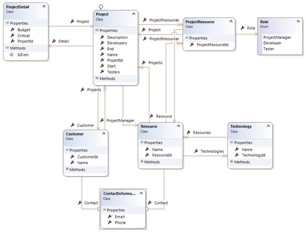

图 1:领域模型

您将在附带的源代码中找到所有这些类。让我们试着解释一下:

*   客户有多个项目。
*   每个项目都有一个项目资源集合，属于一个客户，并且有一个包含附加信息的项目详细信息。
*   项目详细信息是指单个项目。
*   项目资源始终指向现有资源，并被分配给具有给定角色的项目。
*   一个资源知道一些技术，可以参与几个项目。
*   一项技术可以由几个资源共同分享。
*   客户和资源都有联系信息。

|  | 注意:你可以在下面的 Git 资源库中找到完整的源代码:[https://bitbucket . org/syncfusiontech/entity-framework-code-first-简洁地/overview](https://bitbucket.org/syncfusiontech/entity-framework-code-first-succinctly/overview) 。 |

## 核心概念

在使用类模型查询数据库或向其中插入值之前，Entity Framework 需要知道它应该如何将代码(类、属性和实例)来回翻译到数据库中(特别是表、列和记录)。为此，它使用了一个映射，该映射有两个 API。稍后将详细介绍，但首先是一些基本概念。

### 上下文

上下文是一个继承自 [DbContext](http://msdn.microsoft.com/en-us/library/system.data.entity.dbcontext.aspx) 的类，它以 [DbSet < T >](http://msdn.microsoft.com/en-us/library/gg696460.aspx) 属性的形式公开了许多实体集合。没有什么可以阻止您公开所有实体类型，但是通常您只公开聚合根，因为这些根本身就是有意义的查询。

一个示例上下文可能如下。

```cs
public class ProjectsContext : DbContext
{
  public DbSet<Tool> Tools { get; set; }
  public DbSet<Resource> Resources { get; set; }
  public DbSet<Project> Projects { get; set; }
  public DbSet<Customer> Customers { get; set; }
  public DbSet<Technology> Technologies { get; set; }
}

```

|  | 提示:请注意，实体集合的 setters 和 getters 都是公共的。 |

|  | 注意:请随意将您自己的方法、业务或其他方法添加到上下文类中。 |

[DbContext](http://msdn.microsoft.com/en-us/library/system.data.entity.dbcontext.aspx) 类提供了许多构造函数，主要用于配置连接字符串:

*   如果调用无参数构造函数， [DbContext](http://msdn.microsoft.com/en-us/library/system.data.entity.dbcontext.aspx) 将假设配置文件中存在与上下文类同名的连接字符串。
*   还有一个接受单个字符串参数的构造函数。此参数可以是特定于当前数据库提供程序的完整连接字符串，也可以是配置文件中必须存在的连接字符串的名称。
*   为了完整起见，存在另一个构造函数，它采用一个现有的[DbConnection](http://msdn.microsoft.com/en-us/library/system.data.common.dbconnection.aspx)；实体框架可能无法完全控制这个连接，例如，当不再需要时，它不会尝试处理它。

```cs
public class ProjectsContext : DbContext
{
  public ProjectsContext() { }
  public ProjectsContext(String nameOrConnectionString): base(nameOrConnectionString)
  { }
  public ProjectsContext(DbConnection existingConnection, Boolean contextOwnsConnection): base(existingConnection, contextOwnsConnection)
  { }
}

```

如果我们使用通过名称获取连接字符串的构造函数重载，我们必须使用“名称=某些名称”的格式。

```cs
public class ProjectsContext : DbContext
{
  public ProjectsContext(String name) : base("Name=AnotherName") { }
}

```

### 实体

映射的核心是实体的概念。实体只是一个映射到实体框架上下文的类，它有一个唯一标识其实例的标识或属性。按照 DDD 的说法，如果要直接查询它，则称它为聚合根，可以考虑项目或客户，或者如果它与聚合根一起加载，并且通常本身并不重要，例如项目详细信息或客户地址，则称它为实体。一个实体被保存在它自己的表上，并且可以有任意数量的业务或验证方法。

```cs
public class Project
{
  public Project()
  {
    this.ProjectResources = new HashSet<ProjectResource>();
  }

  public Int32 ProjectId { get; set; }

  public String Name { get; set; }

  public DateTime Start { get; set; }

  public DateTime? End { get; set; }

  public virtual ProjectDetail Detail { get; set; }

  public virtual Customer Customer { get; set; }

  public void AddResource(Resource resource, Role role)
  {
    resource.ProjectResources.Add(new ProjectResource() 
    { Project = this, Resource = resource, Role = role });
  }

  public Resource ProjectManager
  {
    get
    {
      return (this.ProjectResources.ToList()
      .Where(x => x.Role == Role.ProjectManager)
      .Select(x => x.Resource).SingleOrDefault());
    }
  }

  public IEnumerable<Resource> Developers
  {
    get
    {
      return (this.ProjectResources.Where(x => x.Role == Role.Developer)
      .Select(x => x.Resource).ToList());
    }
  }

  public IEnumerable<Resource> Testers
  {
    get
    {
      return (this.ProjectResources.Where(x => x.Role == Role.Tester)
      .Select(x => x.Resource)).ToList();
    }
  }

  public virtual ICollection<ProjectResource> ProjectResources { get; protected set;
  }

  public override String ToString()
  {
    return (this.Name);
  }
}

```

在这里，您可以看到我们将在整本书中使用的一些模式:

*   实体需要至少有一个公共的无参数构造函数。
*   一个实体总是有一个标识符属性，该属性具有相同的名称并且以 **Id** 结束。
*   集合总是通用的，具有受保护的设置器，并且在构造函数中以实际集合的形式被赋予一个值(像 [HashSet < T >](http://msdn.microsoft.com/en-us/library/bb359438.aspx) )。
*   计算属性用于公开实际持久属性的过滤集。
*   业务方法用于实施业务规则。
*   通过覆盖[到字符串](http://msdn.microsoft.com/en-us/library/system.object.tostring.aspx)来提供实体的文本表示。

其中实体只有属性(数据)而没有方法(行为)的领域模型有时被称为贫血领域模型。你可以在马丁·福勒的网站上找到这个反模式的一个很好的描述:[http://www.martinfowler.com/bliki/AnemicDomainModel.html](http://www.martinfowler.com/bliki/AnemicDomainModel.html)。

### 复杂类型

复杂类型也是一个具有一些属性和可能的方法的类，但与实体不同，它没有标识属性，也没有自己的持久性表。相反，它的属性被保存到与其声明类型相同的表中。复杂类型有助于对概念上应该总是一起出现的属性进行分组，例如地址中的城市、国家、街道和邮政编码。通过重用复杂类型，我们可以在不同的实体中重复相同的逻辑。客户和人力资源可能具有相同结构的联系信息:

```cs
public class ContactInformation
{
  public String Email { get; set; }

  public String Phone { get; set; }
}

public class Resource
{
  public ContactInformation Contact { get; set; }
}

public class Customer
{
  public ContactInformation Contact  { get; set; }
}

```

复杂类型有以下限制:

*   它们不能有导航属性(引用或集合，请参见下一主题)。
*   它们不能为空，或者它们的包含实体必须初始化它们。
*   它们不能指向包含它们的实体。

### 标量属性

标量是简单的值，像字符串、日期和数字。它们是存储实际实体数据的地方，并且可以是这些类型中的任何一种。

表 1:标量属性

| 。网络类型 | SQL 服务器类型 | 描述 |
| --- | --- | --- |
| 布尔代数学体系的 | [BIT](http://technet.microsoft.com/en-us/library/ms177603.aspx) | 一位。 |
| 字节 | [TINYINT](http://technet.microsoft.com/en-us/library/ms187745.aspx) | 单字节(8 位)。 |
| 茶 | [CHAR](http://technet.microsoft.com/en-us/library/ms176089.aspx) ，[NCHAR](http://technet.microsoft.com/en-us/library/ms186939.aspx) | ASCII 或 UNICODE 字符(8 或 16 位)。 |
| Int16 | [模型化](http://technet.microsoft.com/en-us/library/ms187745.aspx) | 短整数(16 位)。 |
| 芬 32 | [INT](http://technet.microsoft.com/en-us/library/ms187745.aspx) | 整数(32 位)。 |
| Int64 | [重印](http://technet.microsoft.com/en-us/library/ms187745.aspx) | 长(64 位)。 |
| 单一的 | [真实](http://technet.microsoft.com/en-us/library/ms173773.aspx) | 浮点数(32 位)。 |
| 两倍 | [浮动](http://technet.microsoft.com/en-us/library/ms173773.aspx) | 双精度浮点数(64 位)。 |
| 小数 | [金钱，](http://technet.microsoft.com/en-us/library/ms179882.aspx)[SMALLMONEY](http://technet.microsoft.com/en-us/library/ms179882.aspx) | 货币(64 位)或小货币(32 位)。 |
| 全局唯一标识符 | 唯一标识符 | 全球唯一标识符(GUID)。 |
| 日期时间 | [DATE](http://technet.microsoft.com/en-us/library/bb630352.aspx) ，[日期时间](http://technet.microsoft.com/en-us/library/ms187819.aspx) ，[小型日期时间](http://technet.microsoft.com/en-us/library/ms182418.aspx)，[日期时间 2](http://technet.microsoft.com/en-us/library/bb677335.aspx) | 有时间或没有时间的日期。 |
| 日期时间偏移量 | [日期时间关闭](http://technet.microsoft.com/en-us/library/bb630289.aspx) | 包含时区信息的日期和时间。 |
| 时间间隔 | [时间](http://technet.microsoft.com/en-us/library/bb677243.aspx) | 时间到了。 |
| 线 | varchar，[NVARCHAR](http://technet.microsoft.com/en-us/library/ms186939.aspx) ，[XML](http://technet.microsoft.com/en-us/library/ms187339.aspx) | ASCII(每个字符 8 位)、UNICODE (16 位)或 XML 字符串。也可以表示字符长对象(CLOB)。 |
| 字节[] | [BINARY，](http://technet.microsoft.com/en-us/library/ms188362.aspx)[VARBINARY](http://technet.microsoft.com/en-us/library/ms188362.aspx) ，[ROWVERSION](http://technet.microsoft.com/en-us/library/ms182776.aspx) | 二进制大对象。 |
| 列举型别 | [INT](http://technet.microsoft.com/en-us/library/ms187745.aspx) | 枚举值。 |
| 数据库地理 | [地理](http://technet.microsoft.com/en-us/library/cc280766.aspx) | 地理空间类型。 |
| 数据库几何 | [几何图形](http://technet.microsoft.com/en-us/library/cc280487.aspx) | 平面空间型。 |

字节、字符和字符串类型可以指定最大长度。 **-1** 的值转换为最大值。

所有标量类型都可以为空，这意味着它们可能没有值集。在数据库中，这由空列表示。

标量属性需要有一个 getter 和一个 setter，但是 setter 的可见性比 getter 更受限制:内部、受保护的内部或受保护的。

标量属性的一些示例如下。

```cs
public class Project
{
  public Int32 ProjectId { get; set; }

  public String Name { get; set; }

  public DateTime Start { get; set; }

  public DateTime? End { get; set; }
}

```

### 身份属性

实体的一个或多个标量属性必须表示基础表的主键，主键可以是单一的，也可以是复合的。

主键属性只能是任何基本类型，即上面列表中除数组和枚举之外的任何类型，但不能是复杂类型或其他实体的类型。

### 参考文献

从一个实体到另一个实体的引用定义了双向关系。有两种类型的引用关系:

*   多对一:一个实体的几个实例可以与另一个类型的同一个实例相关联(例如客户拥有的项目)。

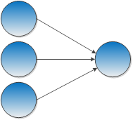

图 2:多对一关系

*   一对一:一个实体的实例与另一个实体的另一个实例相关联；另一个实例只与第一个实例相关联(例如项目及其细节)。


图 3:一对一的关系

在 EFCF，我们通过使用另一个实体类型的属性来表示一个关联。

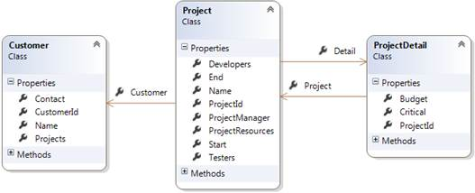

图 4:参考:一对一、多对一

我们称一个实体的属性引用另一个实体作为两个实体之间关系的端点。

```cs
public class Project
{
  //one endpoint of a many-to-one relation
  public virtual Customer Customer { get; set; }

  //one endpoint of a one-to-one relation
  public virtual ProjectDetail Detail { get; set; }
}

public class ProjectDetail
{
  //the other endpoint of a one-to-one relation
  public Project Project { get; set; }
}

public class Customer
{
  //the other endpoint of a many-to-one relation
  public virtual ICollection<Project> Projects { get; protected set; }
}

```

|  | 注意:仅仅通过观察一个端点，我们不能立即判断它的类型(一对一或多对一)，我们需要观察两个端点。 |

### 收藏

实体集合代表两种可能的双向关系类型之一:

*   一对多:一个实体的单个实例与其他实体类型(如项目及其资源)的多个实例相关联。


图 5:一对多关系

*   多对多:一种类型的许多实例可能与另一种类型的任何数目的实例相关(例如资源和它们所知道的技术)。

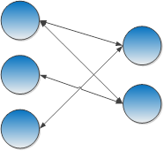

图 6:多对多关系


图 7:集合:一对多，多对多

实体框架只支持将集合声明为 [ICollection < T >](http://msdn.microsoft.com/en-us/library/92t2ye13.aspx) (或一些派生类或接口)属性。在实体中，我们应该总是在构造函数中初始化集合属性。

```cs
public class Project
{
  public Project()
  {
    this.ProjectResources = new HashSet<ProjectResource>();
  }

  public virtual ICollection<ProjectResource> ProjectResources
  { get; protected set; }
}

```

|  | 注意:引用和集合统称为导航属性，而不是标量属性。 |

## 按属性映射

### 概述

表达映射意图最常用的方法可能是将属性应用于属性和类。这样做的好处是，只需查看一个类，就可以立即推断出它的数据库结构。

### 图式

除非明确设置，否则存储实体类型的表是由约定决定的(稍后将详细说明)，但是可以通过将 [TableAttribute](http://msdn.microsoft.com/en-us/library/system.componentmodel.dataannotations.schema.tableattribute.aspx) 应用于实体的类来明确设置类型。

```cs
[Table("MY_SILLY_TABLE", Schema = "dbo")]
public class MySillyType { }

```

[模式](http://msdn.microsoft.com/en-us/library/system.componentmodel.dataannotations.schema.tableattribute.schema.aspx)属性是可选的，应该用于指定默认模式以外的模式名称。模式是数据库对象(表、视图、存储过程、函数等)的集合。)在同一个数据库中。在 SQL Server 中，默认模式是 dbo **。**

为了控制属性的存储方式(列名、物理顺序和数据库类型)，我们应用了[列属性](http://msdn.microsoft.com/en-us/library/system.componentmodel.dataannotations.schema.columnattribute.aspx)。

```cs
[Column(Order = 2, TypeName = "VARCHAR")]
public String Surname { get; set; }
[Column(Name = "FIRST_NAME", Order = 1, TypeName = "VARCHAR")]
public String FirstName { get; set; }

```

如果未指定[类型名称](http://msdn.microsoft.com/en-us/library/system.componentmodel.dataannotations.schema.columnattribute.typename.aspx)，实体框架将使用引擎的默认属性类型。SQL Server 将使用 NVARCHAR 表示字符串属性，INT 表示 Int32，BIT 表示布尔值等。我们可以用它来覆盖这个缺省值。

[顺序](http://msdn.microsoft.com/en-us/library/system.componentmodel.dataannotations.schema.columnattribute.order.aspx)对生成的列应用物理顺序，该顺序可能不同于属性在类中出现的顺序。使用[命令](http://msdn.microsoft.com/en-us/library/system.componentmodel.dataannotations.schema.columnattribute.order.aspx)属性时，同一类中不应有两个值相同的属性。

根据需要标记标量属性需要使用 [RequiredAttribute](http://msdn.microsoft.com/en-us/library/system.componentmodel.dataannotations.requiredattribute.aspx) 。

```cs
[Required]
public String Name { get; set; }

```

|  | 提示:当此属性应用于字符串属性时，它不仅可以防止属性为空，还可以防止接受空字符串。 |

|  | 提示:对于值类型，应该适当选择实际的属性类型。如果列不可为空，则不应选择可为空的属性类型，如 Int32？。 |

对于必需的关联实体，它是完全相同的。

```cs
[Required]
public Customer Customer { get; set; }

```

通过 [MaxLengthAttribute](http://msdn.microsoft.com/en-us/library/system.componentmodel.dataannotations.maxlengthattribute.aspx) 设置字符串列的最大允许长度。

```cs
[MaxLength(50)]
public String Name { get; set; }

```

[maxlengtheattribute](http://msdn.microsoft.com/en-us/library/system.componentmodel.dataannotations.maxlengthattribute.aspx)也可以用来将一列设置为 CLOB，一个包含大量文本的列。SQL Server 使用类型 NVARCHAR(最大值)和 VARCHAR(最大值)。为此，我们传递-1 的长度。

```cs
[MaxLength(-1)]
public String LargeText { get; set; }

```

它也可以用来设置一个 BLOB(在 SQL Server，VARBINARY)列的大小。

```cs
[MaxLength(-1)]
public Byte[] Picture { get; set; }

```

和前面的例子一样， **-1** 的大小将有效地转换为 MAX。

忽略一个属性，让实体框架从不考虑它进行任何操作，就像在属性上设置一个 [NotMappedAttribute](http://msdn.microsoft.com/en-us/library/system.componentmodel.dataannotations.schema.notmappedattribute.aspx) 一样简单。

```cs
[NotMapped]
public String MySillyProperty { get; set; }

```

完全忽略一个类型，包括任何可能引用它的属性，也可以通过将 [NotMappedAttribute](http://msdn.microsoft.com/en-us/library/system.componentmodel.dataannotations.schema.notmappedattribute.aspx) 应用于它的类来实现。

```cs
[NotMapped]
public class MySillyType { }

```

### 主键

虽然数据库表严格来说不需要主键，但是实体框架需要它。支持单列和多列(复合)主键。将一个或多个属性标记为主键是通过应用[关键点属性](http://msdn.microsoft.com/en-us/library/system.componentmodel.dataannotations.keyattribute.aspx)实现的。

```cs
[Key]
public Int32 ProductId { get; set; }

```

如果我们有一个复合主键，我们还需要应用一个[列属性](http://msdn.microsoft.com/en-us/library/system.componentmodel.dataannotations.schema.columnattribute.aspx)。在其中，我们需要通过 [Order](http://msdn.microsoft.com/en-us/library/system.componentmodel.dataannotations.schema.columnattribute.order.aspx) 属性给出一个明确的顺序，这样英孚就知道当一个实体被 [Find](http://msdn.microsoft.com/en-us/library/gg696418.aspx) 方法加载时，哪个参数引用哪个属性。

```cs
[Key]
[Column(Order = 1)]
public Int32 ColumnAId { get; set; }

[Key]
[Column(Order = 2)]
public Int32 ColumnBId { get; set; }

```

主键也可以用一个属性来修饰，该属性告诉实体框架如何生成键(由数据库或手动生成)。该属性为[数据库生成属性](http://msdn.microsoft.com/en-us/library/system.componentmodel.dataannotations.schema.databasegeneratedattribute.aspx)，其值将在 *[标识符策略](#IdentifierStrategies)* 一节中详细说明。

### 导航属性

我们通常不需要在实体中包含外键；相反，我们使用对另一个实体的引用，但是我们也可以拥有它们。这就是 [ForeignKeyAttribute](http://msdn.microsoft.com/en-us/library/system.componentmodel.dataannotations.schema.foreignkeyattribute.aspx) 的作用。

```cs
public virtual Customer Customer { get; set; }

[ForeignKey("Customer")]
public Int32 CustomerId { get; set; }

```

[ForeignKeyAttribute](http://msdn.microsoft.com/en-us/library/system.componentmodel.dataannotations.schema.foreignkeyattribute.aspx) 的参数是外键所涉及的导航属性的名称。

现在假设我们有几个从一个实体到另一个实体的关系。例如，客户可能有两个项目集合:一个用于当前项目，另一个用于过去项目。它可以用代码表示如下。

```cs
public partial class Customer
{
  //the other endpoint will be the CurrentCustomer
  [InverseProperty("CurrentCustomer")]
  public virtual ICollection<Project> CurrentProjects { get; protected set; }

  //the other endpoint will be the PastCustomer
  [InverseProperty("PastCustomer")]
  public virtual ICollection<Project> PastProjects { get; protected set; }
}

public partial class Project
{
  public virtual Customer CurrentCustomer { get; set; }

  public virtual Customer PastCustomer { get; set; }
}

```

在这种情况下，EF 不可能计算出哪个属性应该是每个集合的端点，因此需要 [InversePropertyAttribute](http://msdn.microsoft.com/en-us/library/system.componentmodel.dataannotations.schema.inversepropertyattribute.aspx) 。当应用于集合导航属性时，它告诉实体框架将指向它的另一个端点的引用属性的名称是什么。

|  | 注意:配置关系时，您只需要配置一个端点。 |

### 计算列

实体框架代码优先不支持自动生成计算列，计算列的值不是物理存储在表中，而是来自于 SQL 公式，但是您可以手动生成，并将其映射到您的实体。一个典型的情况是将名字和姓氏组合成一个全名，这可以在 SQL Server 上非常容易地实现。

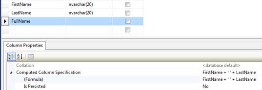

图 8:计算列

数据库中生成的列的另一个例子是当我们使用触发器来生成它的值时。您可以将服务器生成的列映射到实体，但是您必须告诉实体框架永远不要插入该属性。为此，我们使用[数据库生成属性](http://msdn.microsoft.com/en-us/library/system.componentmodel.dataannotations.schema.databasegeneratedattribute.aspx)和选项[数据库生成选项。计算出](http://msdn.microsoft.com/en-us/library/system.componentmodel.dataannotations.schema.databasegeneratedoption.aspx)。

```cs
public virtual String FirstName { get; set; }

public virtual String LastName { get; set; }

[DatabaseGenerated(DatabaseGeneratedOption.Computed)]
public virtual String FullName { get;  protected set; }

```

由于属性永远不会被设置，所以我们可以将 setter 作为一个受保护的方法，我们将其标记为`DatabaseGeneratedOption.Computed`，让 Entity Framework 知道它永远不应该尝试插入或更新这个列。

使用这种方法，您可以使用“LINQ 到对象”和“LINQ 到实体”来查询全名计算属性。

```cs
//this is executed by the database
var me = ctx.Resources.SingleOrDefault(x => x.FullName == "Ricardo Peres");

//this is executed by the process 
var me = ctx.Resources.ToList().SingleOrDefault(x => x.FullName == "Ricardo Peres");

```

### 复杂类型

复杂类型应该用[complexstypedattribute](http://msdn.microsoft.com/en-us/library/system.componentmodel.dataannotations.schema.complextypeattribute.aspx)修饰，如下图。

```cs
[ComplexType]
public class ContactInformation
{
  public String Email { get; set; }

  public String Phone { get; set; }
}

```

### 外部元数据

如果您遇到无法更改实体代码的情况，该实体可能是由工具自动生成的。参见 *[【自动生成代码】](#GeneratingCodeAutomatically)* 了解相关示例。如果实体是以分部类的形式生成的，那么您仍然可以做一些事情。[元数据类型属性](http://msdn.microsoft.com/en-us/library/system.componentmodel.dataannotations.metadatatypeattribute.aspx)允许我们拥有一个包含另一个类的元数据的类，在这种情况下，包括映射属性。这里有一个简单的例子。

```cs
//the original Project class
public partial class Project
{
  //the following attributes will come from the ProjectMetadata class
  /*[Required]
  [MaxLength(50)]*/
  public String Name { get; set; }
}

//the new declaration
[MetadataType(typeof(ProjectMetadata))]
public partial class Project
{
  sealed class ProjectMetadata
  {
    [Required]
    [MaxLength(50)]
    public String Name { get; set; }
  }
}

```

第二个类声明是在一个新文件中创建的，并且必须位于与原始文件相同的命名空间中。我们不需要——事实上，我们不能——添加它的任何属性或方法；它将只是作为 [MetadataTypeAttribute](http://msdn.microsoft.com/en-us/library/system.componentmodel.dataannotations.metadatatypeattribute.aspx) 声明的占位符。在内部类 ProjectMetadata 中，我们将声明我们想要应用属性的任何属性。

|  | 注意:对于自动生成代码的情况，这是一个很好的解决方法，前提是所有类都是部分生成的。 |

### 限制

从 EFCF 的当前版本开始，有些映射概念无法通过属性实现:

*   配置级联(参见 *[级联删除](05.html#CascadingDeletes)* )。
*   应用具体的表继承模式(参见继承策略)。

对于这些，我们需要求助于代码配置，这将在下面解释。

## 通过代码映射

### 概述

尽管属性映射可能很方便，但它也有一些缺点:

*   我们需要在我们的域模型中添加对定义属性的命名空间和程序集的引用(例如“域污染”)。
*   我们不能动态地改变事物；属性是静态定义的，不能被覆盖。
*   我们没有一个集中的地方来执行我们自己的约定。

为了帮助克服这些限制，实体框架代码优先提供了一个额外的映射应用编程接口:代码或流畅映射。基于属性的映射的所有功能都存在，甚至更多。让我们看看如何实现最常见的场景。

流畅或代码映射是在[数据库模型构建器](http://msdn.microsoft.com/en-us/library/system.data.entity.dbmodelbuilder.aspx)的实例上配置的，通常我们可以访问的地方是在[数据库上下文](http://msdn.microsoft.com/en-us/library/system.data.entity.dbcontext.aspx)的[模型创建](http://msdn.microsoft.com/en-us/library/system.data.entity.dbcontext.onmodelcreating.aspx)方法中。

```cs
public class ProjectsContext : DbContext
{
  protected override void OnModelCreating(DbModelBuilder modelBuilder)
  {
    //configuration goes here

    base.OnModelCreating(modelBuilder);
  }
}

```

实体框架在初始化一个上下文时调用这个基础结构方法，在它已经自动映射了被引用为 [DbSet < T >](http://msdn.microsoft.com/en-us/library/gg696460.aspx) 集合或通过它们引用的任何实体类之后。

### 图式

下面是如何通过代码配置实体映射。

```cs
//set the table and schema
modelBuilder.Entity<Project>().ToTable("project", "dbo");

//ignoring an entity and all properties of its type
modelBuilder.Ignore<Project>();

```

这是映射单个属性的示例。注意 API 如何允许通过同时设置列名、类型、最大长度和必需标志将多个调用链接在一起。这非常有用，并且以更易读的方式呈现代码。

```cs
//ignore a property
modelBuilder.Entity<Project>().Ignore(x => x.SomeProperty);

//set a property’s values (column name, type, length, nullability)
modelBuilder.Entity<Project>().Property(x => x.Name).HasColumnName("NAME")
.HasColumnType("VARCHAR").HasMaxLength(50).IsRequired();

```

### 主键

主键和相关的生成策略如下。

```cs
//setting a property as the key 
modelBuilder.Entity<Project>().HasKey(x => x.ProjectId);

//and the generation strategy
modelBuilder.Entity<Project>().Property(x => x.ProjectId)
.HasDatabaseGeneratedOption(DatabaseGeneratedOption.Identity);

//composite keys
modelBuilder.Entity<CompositeEntity>().HasKey(x => new { x.KeyColumnAId, x.KeyColumnBId });

```

### 导航属性

导航属性(引用和集合)如下。

```cs
//a bidirectional many-to-one and its inverse with cascade
modelBuilder.Entity<Project>().HasRequired(x => x.Customer).WithMany(x => x.Projects).WillCascadeOnDelete(true);

//a bidirectional one-to-many
modelBuilder.Entity<Customer>().HasMany(x => x.Projects)
.WithRequired(x => x.Customer);

//a bidirectional many-to-many
modelBuilder.Entity<Technology>().HasMany(x => x.Resources)
.WithMany(x => x.Technologies);

//a bidirectional one-to-one-or-zero with cascade
modelBuilder.Entity<Project>().HasOptional(x => x.Detail)
.WithRequired(x => x.Project).WillCascadeOnDelete(true);
//a bidirectional one-to-one (both sides required) with cascade
modelBuilder.Entity<Project>().HasRequired(x => x.Detail)
.WithRequiredPrincipal(x => x.Project).WillCascadeOnDelete(true);

//a bidirectional one-to-many with a foreign key property (CustomerId)
modelBuilder.Entity<Project>().HasRequired(x => x.Customer).WithMany(x => x.Projects)
.HasForeignKey(x => x.CustomerId);

//a bidirectional one-to-many with a non-conventional foreign key column
modelBuilder.Entity<Project>().HasRequired(x => x.Customer).WithMany(x => x.Projects)
.Map(x => x.MapKey("FK_Customer_Id"));

```

|  | 注意:配置关系时，您只需要配置一个端点。 |

### 计算列

一个由公式在数据库中生成的简单列，而不是物理存储的，可以通过以下方式完成。

```cs
modelBuilder.Entity<Resource>().Property(x => x.FullName)
.HasDatabaseGeneratedOption(DatabaseGeneratedOption.Computed);

```

### 复杂类型

将类声明为复杂类型，不需要对单个属性进行声明，可以通过以下方式完成。

```cs
modelBuilder.ComplexType<ContactInformation>();

//a property in a complex type
modelBuilder.ComplexType<ContactInformation>().Property(x => x.Email).IsRequired()
.HasMaxLength(50);

```

可以想象，如果我们大量使用流畅的映射， [OnModelCreating](http://msdn.microsoft.com/en-us/library/system.data.entity.dbcontext.onmodelcreating.aspx) 方法会变得相当复杂。意识到这一点，EFCF 提供了在自己的类中分组实体配置的可能性；这个类必须派生自[EntityTypeConfiguration<T>](http://msdn.microsoft.com/en-us/library/gg696117.aspx)，这里有一个例子。

```cs
modelBuilder.Configurations.Add(new CustomerConfiguration());

public class CustomerConfiguration : EntityTypeConfiguration<Customer>
{
  public CustomerConfiguration()
  {
    this.Table("FK_Customer_Id", "dbo");
    this.Property(x => x.Name).HasMaxLength(50).IsRequired();
  }
}

```

|  | 注意:您可以在 OnModelCreating 方法和配置类中自由混合映射，但是您应该遵循一致的方法。 |

## 标识符策略

### 概述

实体框架要求所有实体都有一个标识符属性，该属性将映射到表的主键。如果这个主键是复合的，则多个属性可以共同指定为标识符。

### 身份

虽然实体框架并不依赖于任何特定的数据库引擎，但是它确实可以与 SQL Server 一起更好地工作。具体来说，它知道如何处理 [IDENTITY](http://technet.microsoft.com/en-us/library/ms186775.aspx) 列，这可以说是 SQL Server 世界中生成主键的最常见方式。直到最近，它还没有得到一些主要数据库引擎的支持，如甲骨文。

按照惯例，每当 Entity Framework 遇到整数类型的主键(Int32 或 Int64)时，它将假设它是一个 [IDENTITY](http://technet.microsoft.com/en-us/library/ms186775.aspx) 列。生成数据库时，它将以值 1 开始，并使用 1 的递增步长。不可能改变这些参数。

|  | 提示:虽然其他数据库引擎中也存在类似的概念，但是实体框架只能在 SQL Server 中使用 IDENTITY。 |

### 手册

如果标识符值不是由数据库自动生成的，则必须为要保存的每个实体手动设置。如果它是 Int32 或 Int64，并且您想要使用属性进行映射，那么用[数据库生成属性](http://msdn.microsoft.com/en-us/library/system.componentmodel.dataannotations.schema.databasegeneratedattribute.aspx)标记标识符属性，并将其传递给[数据库生成选项。无](http://msdn.microsoft.com/en-us/library/system.componentmodel.dataannotations.schema.databasegeneratedoption.aspx)。这将避免假定[身份](http://technet.microsoft.com/en-us/library/ms186775.aspx)的内置惯例。

```cs
[Key]
[DatabaseGenerated(DatabaseGeneratedOption.None)]
public Int32 ProjectId { get; set; }

```

如果您喜欢流畅的映射，请使用以下内容。

```cs
protected override void OnModelCreating(DbModelBuilder modelBuilder)
{
  modelBuilder.Entity<Project>().HasKey(x => x.ProjectId).Property(x => x.ProjectId)
  .HasDatabaseGeneratedOption(DatabaseGeneratedOption.None);

  base.OnModelCreating(modelBuilder);
}

```

在这种情况下，您有责任分配一个数据库中尚不存在的有效标识符。这相当复杂，主要是因为并发访问和事务；一个流行的替代方法是为主键列使用 Guid。您仍然需要自己初始化它的值，但是生成算法确保永远不会有两个相同的值。

```cs
public Project()
{
  //always set the id for every new instance of a Project
  this.ProjectId = Guid.NewGuid();
}

[Key]
[DatabaseGenerated(DatabaseGeneratedOption.None)]
public Guid ProjectId { get; set; }

```

|  | 注意:使用非整数标识符属性时，默认情况下数据库不会生成这些属性，因此您可以安全地跳过 DatabaseGeneratedAttribute。 |

|  | 注意:将 Guids 用于主键还有一个好处，就是可以将不同数据库中的记录合并到同一个表中；记录永远不会有冲突的关键字。 |

## 传承策略

考虑下面的类层次结构。


图 9:继承模型

在这个例子中，我们有一个抽象的概念，一个工具，以及它的三个具体表示:一个开发工具，一个测试工具和一个管理工具。每个工具必须是这些类型之一。

在面向对象的语言中，我们有类继承，这是关系数据库所没有的。我们如何将它存储在关系数据库中？

马丁·福勒在他的开创性著作《企业应用架构的模式》中描述了在关系数据库中保持类层次结构的三种模式:

1.  单表继承或每个类层次结构的表:单个表用于表示整个层次结构；它包含所有类的所有映射属性的列。其中许多将为空，因为它们将只存在于一个特定的类中；一个区别列将存储一个值，该值将告诉实体框架特定记录将映射到哪个类。

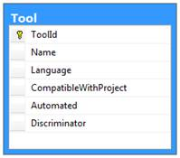

图 10:单表继承数据模型

2.  类表继承或每类表:所有映射基类属性的列将使用一个表，所有具体类将存在附加表；附加表将通过外键链接到基表。

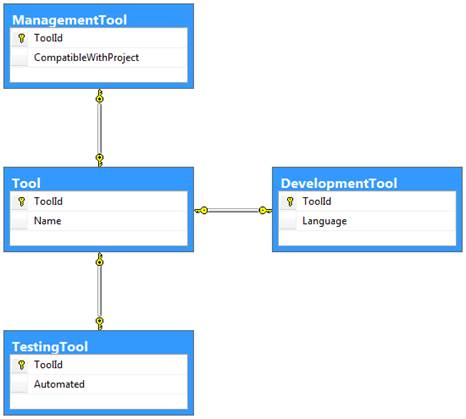

图 11:类表继承数据模型

3.  具体表继承或每个具体类一个表:每个具体类一个表，每个表包含所有映射属性的列，这些属性可以是特定的，也可以是每个类继承的。


图 12:具体的表继承数据模型

你可以在马丁的网站[http://martinfowler.com/eaaCatalog/index.html](http://martinfowler.com/eaaCatalog/index.html)上看到这些模式的更详细的解释。现在，我给你们留下一些想法:

*   单表继承，当从基类进行查询时，提供最快的性能，因为所有信息都包含在单个表中。然而，如果你在所有的类中都有很多属性，这将是一个很难阅读的问题，并且你将会有很多可空的列。在所有的具体类中，所有的属性都必须是可选的，因为它们必须允许空值。这是因为不同的实体将存储在同一个类中，并且不是所有的实体都共享相同的列。
*   类表继承在表的整洁和性能之间提供了很好的平衡。查询基类时，将需要一个 LEFT JOIN 来将每个表从派生类连接到基类表。记录将存在于基类表中，并且恰好存在于一个派生类表中。
*   基类查询的具体表继承需要几个 UNIONs，每个派生类的每个表一个 UNIONs，因为 Entity Framework 事先不知道在哪个表中查找。这导致您不能使用 IDENTITY 作为标识符生成模式，也不能使用任何可能为任何两个表生成相同值的人。如果实体框架发现两个记录具有相同的标识，它会感到困惑。此外，您将拥有相同的列，这些列来自基类，在所有表上重复。

至于实体框架是什么，真的没有什么区别；类自然是多态的。参见[第 4 章“从数据库获取数据”，](04.html#_Chapter_4_)了解如何对类层次结构执行查询。

下面是我们如何应用这些模式。首先，这里有一个单表继承的例子。

```cs
public abstract class Tool
{
  public String Name { get; set; }

  public Int32 ToolId { get; set; } 
}

public class DevelopmentTool : Tool
{
  //String is inherently nullable
  public String Language { get; set; }
}

public class ManagementTool : Tool
{
  //nullable Boolean
  public Boolean ? CompatibleWithProject { get; set; }
}

public class TestingTool : Tool
{
  //nullable Boolean
  public Boolean ? Automated { get; set; }
}

```

如你所见，你没什么特别需要做的。这是默认的继承策略。不过，有一点很重要:因为每个派生类的所有属性都将存储在同一个表中，所以它们都需要是可空的。很容易理解为什么。表中的每条记录都可能对应于任何一个派生类，它们的特定属性只对它们有意义，对其他的没有意义，所以它们可能是未定义的(空)。在这个例子中，我已经将派生类中的所有属性声明为可空。

让我们继续下一个模式，类表继承。

```cs
public abstract class Tool
{
  public String Name { get; set; }

  public Int32 ToolId { get; set; } 
}

[Table("DevelopmentTool")]
public class DevelopmentTool : Tool
{
  public String Language { get; set; }
}

[Table("ManagementTool")]
public class ManagementTool : Tool
{
  public Boolean CompatibleWithProject { get; set; }
}

[Table("TestingTool")]
public class TestingTool : Tool
{
  public Boolean Automated { get; set; }
}

```

这里的区别在于，我们为所有派生实体指定了一个表名。没有必要为基类这样做，我们将只使用默认值。派生类的属性可以是不可空的，因为它们存储在自己的表中。

最后，具体的表继承需要更多的工作。

```cs
public abstract class Tool
{
  protected Tool()
  {
    //create a unique id for each instance
    this.ToolId = Guid.NewGuid();
  }

  public String Name { get; set; }

  //Guid instead of Int32
  public Guid ToolId { get; set; } 
}

[Table("DevelopmentTool")]
public class DevelopmentTool : Tool
{
  public String Language { get; set; }
}

[Table("ManagementTool")]
public class ManagementTool : Tool
{
  public Boolean CompatibleWithProject { get; set; }
}

[Table("TestingTool")]
public class TestingTool : Tool
{
  public Boolean Automated { get; set; }
}

public class ProjectsContext : DbContext
{
  protected override void OnModelCreating(DbModelBuilder modelBuilder)
  {
    //map the inherited properties for each derived class
    modelBuilder.Entity<ManagementTool>().Map(m => m.MapInheritedProperties());
    modelBuilder.Entity<TestingTool>().Map(m => m.MapInheritedProperties());
    modelBuilder.Entity<DevelopmentTool>().Map(m => m.MapInheritedProperties());

    base.OnModelCreating(modelBuilder);
  }
}

```

一些注意事项:

*   我们不能对主键使用默认的、常规的、 [IDENTITY](http://technet.microsoft.com/en-us/library/ms186775.aspx) 生成模式，因为每个表都有自己的 [IDENTITY](http://technet.microsoft.com/en-us/library/ms186775.aspx) ，因此在每个派生的实体表中都有具有相同主键的记录。如果我们要从基类进行查询，例如`ctx.Tools.Find(1)`，EF 会选择哪条记录？我选择使用 Guid 作为主键，这是一个常见的决定，因此有了构造函数。
*   我们需要覆盖 [OnModelCreating](https://msdn.microsoft.com/en-us/library/system.data.entity.dbcontext.onmodelcreating.aspx) 方法来完成映射。

## 惯例

实体框架代码的当前版本在本书编写时(5.0)，首先伴随着许多约定。当模型的某些方面没有明确定义时，约定规定了 EFCF 将如何配置它们。

包含的约定的完整列表由实现[系统中的](http://msdn.microsoft.com/en-us/library/system.data.entity.modelconfiguration.conventions.aspx)[约定](http://msdn.microsoft.com/en-us/library/system.data.entity.modelconfiguration.conventions.iconvention.aspx)的类组成。EntityFramework 程序集的 data . entity . model configuration . convents命名空间。你通常可以通过查看每个班级的描述来知道他们应该做什么。

最常见的惯例是:

*   EF 将寻找与上下文同名的连接字符串(内置)。
*   从带有公共设置器和获取器的 [DbContext](http://msdn.microsoft.com/en-us/library/system.data.entity.dbcontext.aspx) 派生类中的 [DbSet < T >](http://msdn.microsoft.com/en-us/library/gg696460.aspx) 集合中暴露的所有类型都被自动映射(内置)。
*   除非明确排除(内置)，否则带有 getter 和 setter(任何可见性)的所有映射类型的所有属性都会自动映射。
*   不需要可空类型的所有属性；那些来自不可空类型(中的值类型。NET)是必需的。
*   所有虚拟属性(引用和集合)都应该延迟加载(内置)。
*   整数类型的单个主键将使用 IDENTITY 作为生成策略(内置)。
*   如果一个实体用单数名词命名，其对应的表将有一个复数名称([复数表名约定](http://msdn.microsoft.com/en-us/library/system.data.entity.modelconfiguration.conventions.pluralizingtablenameconvention(v=vs.103).aspx))。
*   未显式设置的主键属性将被自动找到( [IdKeyDiscoveryConvention](http://msdn.microsoft.com/en-us/library/system.data.entity.modelconfiguration.conventions.idkeydiscoveryconvention(v=vs.103).aspx) )。
*   自动发现与其他实体的关联，外键列是通过组合外部实体名称及其主键来构建的([association inversevdiscovery conventi on](http://msdn.microsoft.com/en-us/library/system.data.entity.modelconfiguration.conventions.associationinversediscoveryconvention(v=vs.103).aspx)、[navigationpropertyname foreignkediscovery conventi on](http://msdn.microsoft.com/en-us/library/system.data.entity.modelconfiguration.conventions.navigationpropertynameforeignkeydiscoveryconvention(v=vs.103).aspx)、[primarykeynameforeignkediscovery conventi on](http://msdn.microsoft.com/en-us/library/system.data.entity.modelconfiguration.conventions.primarykeynameforeignkeydiscoveryconvention(v=vs.103).aspx)和[typenameforeignkediscovery conventi on](http://msdn.microsoft.com/en-us/library/system.data.entity.modelconfiguration.conventions.typenameforeignkeydiscoveryconvention(v=vs.103).aspx))。
*   如果关系设置为必需([one omanycamcadelevention](http://msdn.microsoft.com/en-us/library/system.data.entity.modelconfiguration.conventions.onetomanycascadedeleteconvention(v=vs.103).aspx)和[many tomaniscacadelevention](http://msdn.microsoft.com/en-us/library/system.data.entity.modelconfiguration.conventions.manytomanycascadedeleteconvention(v=vs.103).aspx))，则只要子实体的父实体为，就会从数据库中删除子实体。

目前，没有办法添加我们自己的自定义约定。如果我们想禁用一个约定，只需从[的](http://msdn.microsoft.com/en-us/library/system.data.entity.dbcontext.onmodelcreating.aspx)[数据库模型构建器](http://msdn.microsoft.com/en-us/library/system.data.entity.dbmodelbuilder.aspx)实例中移除它的类，然后在覆盖中创建它。

```cs
protected override void OnModelCreating(DbModelBuilder modelBuilder)
{
  //create tables with the same names as the entities, do not pluralize them
  modelBuilder.Conventions.Remove<PluralizingTableNameConvention>();

  base.OnModelCreating(modelBuilder);
}

```

我们已经看到了如何覆盖传统的表和列名。

```cs
//change the physical table name
[Table("MY_PROJECT")]
public class Project
{
  //change the physical column name
  [Column("ID")]
  public Int32 ProjectId { get; set; }
}

```

对于要使用的连接字符串，EF 让我们调用一个接收连接字符串的基本构造函数。

```cs
public class ProjectsContext : DbContext
{
  //use a different connection string
  public ProjectsContext(): base("Name=SomeConnectionString") { }
}

```

|  | 注意:实体框架的下一个版本 6.0 将支持自定义约定。 |

## 获取模型定义

如果您需要将使用代码优先生成的模型导入“经典”实体框架，只需导出一个 EDMX 文件并将其导入另一个项目即可。

```cs
var ctx = new  ProjectsContext(); 
XmlWriterSettings settings = new XmlWriterSettings { Indent = true };

using (XmlWriter writer = XmlWriter.Create("ProjectsContext.edmx", settings))  
{  
  EdmxWriter.WriteEdmx(ctx, writer);  
}  

```

如果用 Visual Studio 打开生成的文件，就会得到这样的结果。

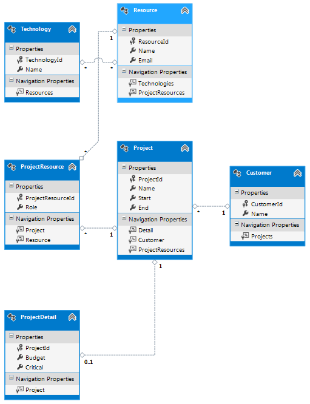

图 13:实体数据模型定义(EDMX)

这是一个完全有效的实体数据模型定义，您可以将其导入到使用“经典”实体框架的项目中，并从中生成一个类模型。

## 自动生成代码

经常被要求的一件事是生成实体框架代码优先可以直接使用的实体类型的能力。当我们有一个包含大量表的大型数据库时，通常会出现这种情况，因为很难手动调用这些表的类。这不完全是代码优先的目的，但是我们有一些选择。

第一种选择是从“经典”的实体框架开始。首先，我们添加一个类型为**ADO.NET 实体数据模型**的项目。


图 14:添加实体数据模型

我们希望从现有的数据库中生成实体。

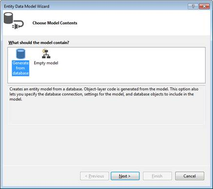

图 15:从数据库生成模型

接下来，我们必须创建或选择一个现有的连接字符串。

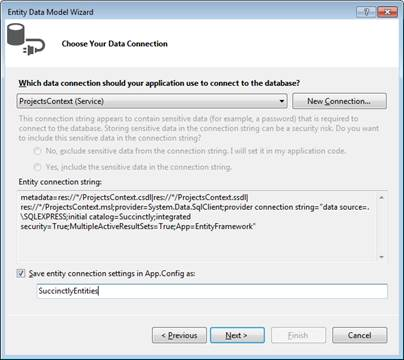

图 16:设置用于从数据库生成实体的连接字符串

并选择我们想要映射的数据库对象(表、视图、存储过程)。


图 17:选择要映射的数据库对象

最后，生成模型。

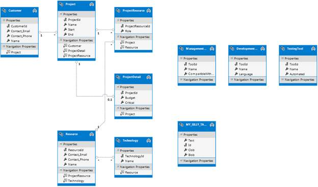

图 18:生成的实体数据模型

|  | 提示:遗产丢失是因为英孚没有办法知道我们想要如何拥有它。 |

现在，它不会产生代码优先上下文和实体，而是常规的“经典”实体框架上下文和实体。为了做到这一点，我们需要添加一个代码生成项，我们可以通过右键单击设计图面并选择该选项来实现。


图 19:添加一个数据库上下文生成器

然后我们选择[**EF 5 . x DbContext Generator**](http://visualstudiogallery.msdn.microsoft.com/da740968-02f9-42a9-9ee4-1a9a06d896a2)项，就这样。一旦您构建了您的项目，您将同时拥有上下文和实体。请记住一件事:如果您更新模型或让它重新生成代码，您对代码所做的更改将会丢失！

你的另一个选择是使用 [**实体框架电动工具**](http://visualstudiogallery.msdn.microsoft.com/72a60b14-1581-4b9b-89f2-846072eff19d) 。该扩展可从 Visual Studio 的**扩展管理器**获取；在撰写本书时(2013 年 8 月至 9 月)，它仍处于测试阶段。

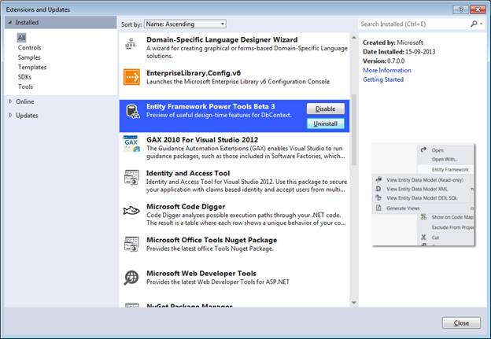

图 20:实体框架电动工具扩展

该扩展为名为**实体框架**的 Visual Studio 项目添加了上下文菜单。里面有一个**逆向工程代码优先**选项。


图 21:逆向工程代码优先模型

一旦您接受连接字符串属性，Visual Studio 将转到数据库，并为所选数据库中的所有表生成上下文、其实体和关联，以及其流畅映射。

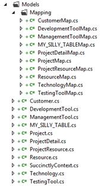

图 22:生成的代码优先模型

如您所见，这比“经典”方法要快得多。关于流程的一些意见:

*   这是一次性生成:您不能从数据库中刷新生成的实体，只需完全替换它们，这意味着您将丢失对代码所做的任何更改。
*   该工具将为所有表生成映射，没有选择其中一部分的选项。
*   继承会丢失，这是可以理解的，因为它们不存在于数据库级别，只存在于类级别。

|  | 提示:电动工具扩展还在测试阶段，所以你可以预期一些 bug 会存在。 |