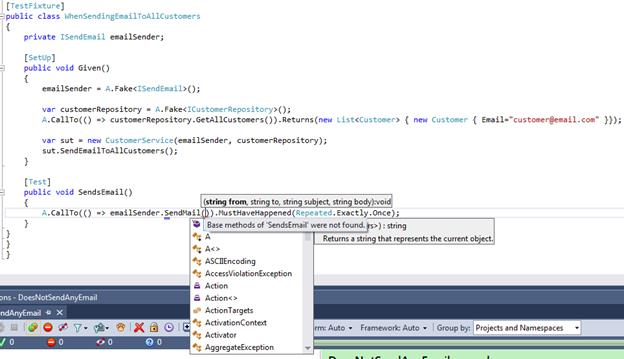
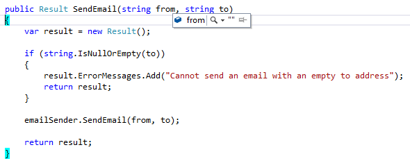
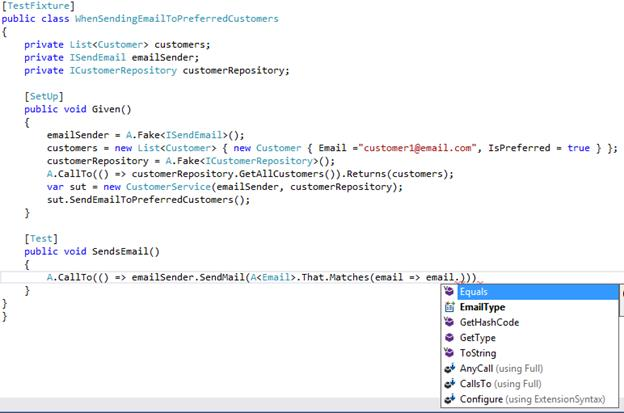
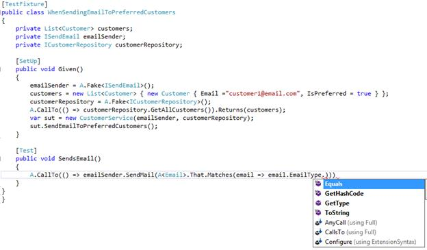

# 第八章争论

到目前为止，我们已经看到了如何创建一个赝品，如何配置它，如何指定行为，以及如何使用 FakeItEasy 进行断言。通过到目前为止的所有示例，我们一直在使用一个`ISendEmail`接口，该接口公开没有参数的成员。

```cs
    public interface ISendEmail
    {
        void SendMail();
    }

```

代码清单 ISendEmail 接口

在现实世界中，调用一个不需要参数的`SendMail`方法真的没那么有用。我们知道我们想要发送电子邮件，但是要发送电子邮件，您至少需要“发件人”地址、“收件人”地址以及主题和正文等信息。

在这一章中，我们将探索如何将参数传递和约束到伪造的成员，以及如何在我们对伪造的断言中使用这些约束。

## 将参数传递给方法

让我们从在我们的`ISendEmail`界面上为我们的`SendMail`成员添加一些参数开始:

```cs
    public interface ISendEmail
    {
        void SendMail(string from, string to, string subject, string body);
    }

```

代码清单 80:接受参数的新 ISendEmail 接口

让我们也给我们的`Customer`类添加一个`Email`成员:

```cs
    public class Customer
    {
        public string Email { get; set; }
    }

```

代码清单 81:带有电子邮件属性的客户类

回到我们之前的一个`CustomerService`类的例子，让我们看看当在代码中使用时，改变后的`ISendEmail`接口和`Customer`类是什么样子的:

```cs
    public class CustomerService
    {
        private readonly ISendEmail emailSender;
        private readonly ICustomerRepository customerRepository;

        public CustomerService(ISendEmail emailSender,
            ICustomerRepository customerRepository)
        {
            this.emailSender = emailSender;
            this.customerRepository = customerRepository;
        }

        public void SendEmailToAllCustomers()
        {
            var customers = customerRepository.GetAllCustomers();
            foreach (var customer in customers)
            {
                emailSender.SendMail("acompany@somewhere.com", customer.Email,
                     "subject", "body");
            }
        }
    }

```

代码清单 82:客户服务类

当我们开始遍历返回的客户时，对于每个客户，我们将参数传递给`SendMail`。三个参数是硬编码的，一个是使用`Customer`类中的`Email`成员。

让我们编写一个单元测试，断言为从`ICustomerRepository`返回的每个客户调用`SendMail`。



图 27:声明对 SendMail 的调用发生在使用带有参数的 SendMail 时

从图 27 中可以看到，当我们写下反对`SendMail`的断言时，我们会被提示`SendMail`需要的参数。我们在这里放什么？现在，由于我们只是试图断言调用发生了指定的次数，让我们为每个参数加上`string.Empty`。

```cs
    [TestFixture]
    public class WhenSendingEmailToAllCustomers
    {
        private ISendEmail emailSender;

        [SetUp]
        public void Given()
        {
            emailSender = A.Fake<ISendEmail>();

            var customerRepository = A.Fake<ICustomerRepository>();
            A.CallTo(() => customerRepository.GetAllCustomers()).Returns(
                new List<Customer> { new Customer { Email="customer@email.com" }});

            var sut = new CustomerService(emailSender, customerRepository);
            sut.SendEmailToAllCustomers();
        }

        [Test]
        public void SendsEmail()
        {
            A.CallTo(() => emailSender
                .SendMail(string.Empty, string.Empty, string.Empty, string.Empty))
                    .MustHaveHappened(Repeated.Exactly.Once);
        }
    }

```

代码清单 83:传递字符串。SendMail 的每个参数都为空

现在我们有一个编译测试。但是当我们运行这个测试时，它失败了:


图 28: SendsEmail 失败

为什么呢？FakeItEasy 现在希望每次调用`SendMail`都有特定的值。在我们的断言中，我们通过了所有`string.Empty`值，这允许测试编译，但是当我们运行它时失败了，因为`SendMail`被调用了不等于所有`string.Empty`值的参数。

了解了这些信息，让我们重新编写测试方法来传递正确的参数:

```cs
    [TestFixture]
    public class WhenSendingEmailToAllCustomers
    {
        private ISendEmail emailSender;
        private Customer customer;

        [SetUp]
        public void Given()
        {
            emailSender = A.Fake<ISendEmail>();
            customer = new Customer { Email = "customer@email.com" };

            var customerRepository = A.Fake<ICustomerRepository>();
            A.CallTo(() => customerRepository.GetAllCustomers())
                .Returns(new List<Customer> { customer });

            var sut = new CustomerService(emailSender, customerRepository);
            sut.SendEmailToAllCustomers();
        }

        [Test]
        public void SendsEmail()
        {
            A.CallTo(() => emailSender
                .SendMail("acompany@somewhere.com", customer.Email, "subject", "body"))
                    .MustHaveHappened(Repeated.Exactly.Once);
        }
    }

```

代码清单 84:更正发送邮件调用的参数

当我们运行这个测试时，它通过了。请注意，我们是如何从`CustomerService`类中获取三个硬编码值，并结合客户的电子邮件地址，在`SendsEmail`测试方法的断言中使用这些值的。现在我们反对正确的参数值以及对`SendMail`方法的调用次数。

### A < T >。忽略

在代码清单 83 中，我们最初试图在断言代码中将四个`string.Empty`值传递给我们的`SendMail`方法，并很快了解到我们不能这样做。我们需要通过正确的值才能通过测试。

但有时候，你不在乎传递给假的论点的价值。这方面的一个很好的例子是我们在本书前面关于断言的第 7 章中已经讨论过的场景，我们断言对`SendMail`的调用不是使用`MustNotHaveHappened`发生的。这就是`A<T>.Ignored`派上用场的地方。

让我们回到那个例子，断言`SendMail`没有被调用是为了演示如何使用`A<T>.Ignored`。在这种情况下，我们的`CustomerService`类不会从代码清单 78 中改变，但是我们的单元测试会改变。

这里是单元测试，用于测试使用`A<T>.Ignored`调用`SendEmail`没有发生:

```cs
    [TestFixture]
    public class WhenSendingEmailToCustomersAndNoCustomersExist
    {
        private ISendEmail emailSender;

        [SetUp]
        public void Given()
        {
            emailSender = A.Fake<ISendEmail>();
            var sut = new CustomerService(emailSender, A.Fake<ICustomerRepository>());
            sut.SendEmailToAllCustomers();
        }

        [Test]
        public void DoesNotSendEmail()
        {
            A.CallTo(() => emailSender.SendMail(A<string>.Ignored, A<string>.Ignored,
                A<string>.Ignored, A<string>.Ignored)).MustNotHaveHappened();
        }
    }

```

代码清单 85:使用 A <t>。忽略以断言没有调用 SendMail</t>

由于编译器强制我们向`SendMail`提供值，但是我们并不真正关心测试的值，因为`SendMail`在这个单元测试中没有被调用，我们使用`A<T>.Ignored`为每个参数传递一个字符串类型`T`。`A<T>.Ignored`适用于所有类型，而不仅仅是原始类型。

|  | 注意:虽然我们仍然可以传入字符串。在这个测试用例中，SendMail 的每个参数都是空的，通过使用 A <t>，我们的测试仍然会通过。忽略，你是在明确单元测试的意图。我们在这里的意图是向阅读代码的人表明，我们真的不关心这个测试传递给 SendMail 的值。如果我们使用字符串。代替 A <t>清空。忽略，我们是期待空字符串通过单元测试，还是我们不关心参数的值？这是一个重要的区别。一<t>。忽略为我们澄清了这个问题。</t></t></t> |

|  | 提示:可以使用 A <t>。_ 作为 A <t>的简写。忽略</t></t> |

### 一个假人< T >

`A.Dummy<T>`与`A<T>.Ignored`非常相似。那有什么区别呢？`A<T>.Ignored`应该用于配置，而对伪方法的断言`. A.Dummy<T>`可以用于将`T`的默认值传递给已经使用 new 关键字实例化的类上的方法。`A.Dummy<T>`不能用于配置通话。让我们看一个简单的例子。

我们将再次以发送电子邮件为例。以下是本例的`ISendEmail`界面:

```cs
    public interface ISendEmail
    {
        Result SendEmail(string from, string to);
    }

```

代码清单 ISendEmail 接口

您可以看到我们正在从`SendEmail`方法调用中返回一个`Result`对象。这个`Result`对象将包含一系列潜在的错误信息。这就是`Result`班的样子:

```cs
    public class Result
    {
        public Result()
        {
            this.ErrorMessages = new List<string>();
        }

        public List<string> ErrorMessages;
    }

```

代码清单 87:结果类

在构造函数中，我们更新了列表，这样消费代码就不必在没有错误时处理空引用异常。

接下来，我们的 SUT`CustomerService`班:

```cs
    public class CustomerService
    {
        private readonly ISendEmail emailSender;

        public CustomerService(ISendEmail emailSender)
        {
            this.emailSender = emailSender;
        }

        public Result SendEmail(string from, string to)
        {
            var result = new Result();

            if (string.IsNullOrEmpty(to))
            {
                result.ErrorMessages.Add("Cannot send an email with an empty to address");
                return result;
            }

            emailSender.SendEmail(from, to);

            return result;
        }
    }

```

代码清单 88:客户服务类

在`SendEmail`方法中，您可以看到我们正在对传递到方法中的`to`参数进行`string.IsNullOrEmpty`检查。如果为空，我们会在`Result`的`ErrorMessages`列表中添加一条消息，并返回结果而不调用`emailSender.SendMail`。如果`to`参数通过了`string.IsNullOrEmpty`检查，那么我们调用 emailSender 的`SendMail`方法并返回一个空列表的结果。

我们将编写一个单元测试，当`to`参数为`NullOrEmpty`时测试一个场景。以下是`A.Dummy<T>`的`CustomerServiceTests`用法。

```cs
    [TestFixture]
    public class  WhenSendingAnEmailWithAnEmptyToAddress
    {
        private Result result;

        [SetUp]
        public void Given()
        {
            var sut = new CustomerService(A.Fake<ISendEmail>());
            result = sut.SendEmail(A.Dummy<string>(), "");
        }

        [Test]
        public void ReturnsErrorMessage()
        {
            Assert.That(result.ErrorMessages.Single(),
                Is.EqualTo("Cannot send an email with an empty to address"));
        }
    }

```

代码清单 89:使用虚拟工具的客户服务测试

在这个测试中，你会看到我们正在传递`from`参数的`A.Dummy<string>`。因为这个测试的执行路径根本不依赖于这个`from`参数值，所以我们使用`A.Dummy<string>`来表示`from`参数。

如果您在`result = sut.SendEmail(A.Dummy<string>(), "");`上设置断点，调试这个单元测试并进入`SendEmail`，您将看到`A.Dummy<T>`将字符串默认值传递给`from`参数的`SendEmail`:



图 29:使用伪<t>导致缺省的 T 被传递到方法中。在这种情况下，它是一个空字符串</t>

在这个单元测试中使用`A.Dummy<T>`而不是传入`string.Empty`值的决定类似于在代码清单 85 的断言中使用`A<string>.Ignored`的决定；使用`A.Dummy<T>`更好地传达意图。

当你看到`A.Dummy<T>`被使用时，这表明给定参数的值对于你正在编写的特定测试并不重要。这很可能意味着该值将不会在 SUT 方法的执行路径中使用，就像我们在`CustomerService`上看到的`SendEmail`方法一样。

同样，你可以通过`from`参数的*和*通过`string.Empty`，测试仍然会通过。但这是否意味着测试需要一个“T2”值来支持“T3”参数，测试才能通过？这是否意味着`from`参数的值将用于测试的执行路径？不看 SUT 的代码，使用 FakeItEasy 的测试设置不容易回答这个问题。使用`A.Dummy<T>`明确对查看您代码的人说，“这个值没有在执行路径中使用，所以我们不关心它。”

不要让其他程序员猜测你的意图。用`A.Dummy<T>`说清楚

## 约束参数

在前面关于将参数传递给方法的部分中，我们已经约束了参数。这本身就是一种约束参数，然后断言用正确的值调用了伪成员的方法。

我们将通过检查非常强大的`That.Matches`运算符来进行约束参数的下一步。

### 那个。比赛

当断言一定发生了什么事情时，测试一个采用基元类型的方法是相当简单的——但是当我们在假货上处理方法时，我们并不总是那么幸运地处理基元类型。

FakeItEasy 提供了一种方法来约束传递给伪方法的参数。为了演示这个功能，是时候再次更改`ISendEmail`了。`SendMail`现在将取一个`Email`对象，而不是取四根弦。

```cs
    public interface ISendEmail
    {
        void SendMail(Email email);
    }

```

代码清单 90:新的 ISendMail 方法签名，电子邮件类的介绍

```cs
    public class Email
    {
        public string From { get; set; }
        public string To { get; set; }
        public string Subject { get; set; }
        public string Body { get; set; }
    }

```

代码清单 91:电子邮件类

我们在这里真正做的是将过去传递给`SendMail`的四个字符串值封装到一个`Email`类中。

以下是变化如何影响我们的`CustomerService`课:

```cs
    public class CustomerService
    {
        private readonly ISendEmail emailSender;
        private readonly ICustomerRepository customerRepository;

        public CustomerService(ISendEmail emailSender,
            ICustomerRepository customerRepository)
        {
            this.emailSender = emailSender;
            this.customerRepository = customerRepository;
        }

        public void SendEmailToAllCustomers()
        {
            var customers = customerRepository.GetAllCustomers();
            foreach (var customer in customers)
            {
                emailSender.SendMail(
                    new Email { From = "acompany@somewhere.com", To = customer.Email,
                        Subject = "subject", Body = "body" });
            }
        }
    }

```

代码清单 92:创建一个新的电子邮件对象，并将四个值作为参数传入

注意我们是如何“更新”一个`Email`对象，并用以前传递给`SendMail`方法的相同值填充这些值的，当时该方法需要四个字符串。

我们想断言`SendMail`是用正确的客户电子邮件地址拨打的。这就是我们如何使用`That.Matches`为该场景编写单元测试:

```cs
    [TestFixture]
    public class WhenSendingEmailToAllCustomers
    {
        private ISendEmail emailSender;
        private const string customersEmail = "somecustomer@somewhere.com";

        [SetUp]
        public void Given()
        {
            emailSender = A.Fake<ISendEmail>();

            var customerRepository = A.Fake<ICustomerRepository>();
            A.CallTo(() => customerRepository.GetAllCustomers())
                .Returns(new List<Customer> { new Customer { Email = customersEmail }});

            var sut = new CustomerService(emailSender, customerRepository);
            sut.SendEmailToAllCustomers();
        }

        [Test]
        public void SendsEmail()
        {
            A.CallTo(() => emailSender.SendMail(
                A<Email>.That.Matches(email => email.To == customersEmail)))
                    .MustHaveHappened(Repeated.Exactly.Once);
        }
    }

```

代码清单 93:使用. That.Matches 测试客户服务类

在我们前面的例子中，我们用实弦测试`SendMail`的快乐路径，用`A<string>.Ignored`测试非快乐路径。现在`SendMail`拿了一个`Email`对象，你可以看到我们是如何使用`That.Matches`来测试在`Email`上进行`SendMail`调用时使用的正确值的。

`A<Email>.That.Matches(email => email.To == customersEmail)`

`That.Matches`取`Func<T, bool>`谓词，其中`T`是`A<T>` **中指定的类型。**在本例中，`T`为`Email`。

|  | 注意:在前面的单元测试中，我没有断言 Email 的其他属性是正确的，就像我之前的单元测试一样。我将它们省略是为了让代码示例更容易阅读，而不是因为它们不重要。 |

在 FakeItEasy 调用中使用`That.Matches`被称为*自定义匹配*。这意味着我们需要编写自己的匹配器。让我们探索一些其他的预写匹配器，它们可以提供一些常见的匹配场景，而不是必须使用`That.Matches`。

### 那个。实例数(吨)

`That.IsInstanceOf`可用于测试特定类型被传递给 SUT 的方法。当你使用一个 SUT 的方法，把一个对象或者一个接口作为它的类型时，这就非常方便了。在 SUT 方法的单个测试的上下文中，这个方法可能被赋予多个对象类型。

让我们探索两个例子中更简单的一个:一个 SUT 的方法，它把一个对象作为一个参数。由于我每天都在使用名为 NServiceBus 的消息传递总线，因此在本例中，我们将引入一个名为`IBus`的新抽象:

```cs
    public interface IBus
    {
        void Send(object message);
    }

```

代码清单 IBus 接口

把`IBus`接口想象成一个服务总线上的抽象，负责在系统内发送“消息”。这个`IBus`界面允许我们发送任何类型的对象。

现在我们已经建立了抽象，下面是我们将要发送的“消息”:

```cs
    public class CreateCustomer
    {
        public string FirstName { get; set; }
        public string LastName { get; set; }
        public string Email { get; set; }
    }

```

代码清单 95:创建客户消息

把这条信息想象成一条简单的 [DTO](http://martinfowler.com/eaaCatalog/dataTransferObject.html) ，它包含了我们想要创建的客户的相关数据。

下面是一个名为`CustomerService`的类中使用`IBus`和`CreateCustomer`的实现:

```cs
    public class CustomerService
    {
        private readonly IBus bus;

        public CustomerService(IBus bus)
        {
            this.bus = bus;
        }

        public void CreateCustomer(string firstName, string lastName, string email)
        {
            bus.Send(new CreateCustomer { FirstName = firstName, LastName = lastName,
                Email = email });
        }
    }

```

代码清单 96:客户服务类

`CreateCustomer`方法采用三个关于我们想要创建的客户的字符串，并使用这些信息来填充`CreateCustomer`消息。该信息随后被传递到`IBus`上的`Send`方法。在基于服务总线的体系结构中，这个“消息”在某个地方会有一个相应的处理程序来处理`CreateCustomer`消息，并对其做一些事情(例如，向数据库写入一个新客户)。

下面是单元测试:

```cs
    [TestFixture]
    public class WhenCreatingACustomer
    {
        private IBus bus;

        [SetUp]
        public void Given()
        {
            bus = A.Fake<IBus>();
            var sut = new CustomerService(bus);
            sut.CreateCustomer("FirstName", "LastName", "Email");
        }

        [Test]
        public void SendsCreateCustomer()
        {
            A.CallTo(() => bus.Send(
                A<object>.That.IsInstanceOf(typeof(CreateCustomer))))
                    .MustHaveHappened(Repeated.Exactly.Once);
        }
    }

```

代码清单 CreateCustomer 类的单元测试

我们这里需要测试的是传递给`bus.Send`的类型是`CreateCustomer`的类型，并且调用发生了。我们在断言中使用`IsInstanceOf`来做到这一点。

虽然我们在单元测试中已经成功测试了正确的消息类型，但是这个测试还没有完成。我们仍然需要测试我们传递给 SUT`CreateCustomer`方法的值最终是否出现在`CreateCustomer`消息中。

有关如何断言对象实例的每个单独属性等于测试设置中提供的输入的更多信息，请参见本章中的“处理对象”一节。

### 那个。伊萨序列< T >

有时，当将集合传递给伪方法时，我们希望断言序列是相同的。当使用中的常见集合类型时，这尤其有用。NET 像`IEnumerable<T>`和`List<T>`。这就是`IsSameSequenceAs<T>`派上用场的地方。

我将重新介绍第 6 章中使用`IBuildCsv`界面展示`Invokes`的示例代码。

提醒一下，这里是我们之前讨论过的类和接口:

```cs
    public interface IBuildCsv
    {
        void SetHeader(IEnumerable<string> fields);
        void AddRow(IEnumerable<string> fields);
        string Build();
    }

```

代码清单 IBuildCsv 抽象

```cs
    public class Customer
    {
        public string LastName { get; set; }
        public string FirstName { get; set; }
    }

```

代码清单 99:客户类

```cs
    public class CustomerService
    {
        private readonly IBuildCsv buildCsv;

        public CustomerService(IBuildCsv buildCsv)
        {
            this.buildCsv = buildCsv;
        }

        public string GetLastAndFirstNamesAsCsv(List<Customer> customers)
        {
            buildCsv.SetHeader(new[] { "Last Name", "First Name" });
            customers.ForEach(customer => buildCsv.AddRow(new [] { customer.LastName,
                customer.FirstName }));
            return buildCsv.Build();
        }
    }

```

代码清单 100:客户服务类

我们在这里的目标和我们一起工作的时候是一样的。我们希望确保构建正确的标题，然后根据传递到 SUT 方法中的客户列表，将正确的值添加到 CSV 中的每个“行”中。

让我们首先看一下客户服务的测试设置:

```cs
    [TestFixture]
    public class WhenGettingCustomersLastAndFirstNamesAsCsv
    {
        private IBuildCsv buildCsv;
        private List<Customer> customers;

        [SetUp]
        public void Given()
        {
            buildCsv = A.Fake<IBuildCsv>();
            var sut = new CustomerService(buildCsv);
            customers = new List<Customer>
            {
                new Customer { LastName = "Doe", FirstName = "Jon"},
                new Customer { LastName = "McCarthy", FirstName = "Michael" }
            };

            sut.GetLastAndFirstNamesAsCsv(customers);
        }
    }

```

代码清单 101:测试客户服务类的单元测试设置

在这里，我们创建了我们的赝品，创建了我们的 SUT，然后设置了一个要使用的客户列表。然后，我们将客户列表传递给 SUT 上的`GetLastAndFirstNamesAsCsv`。请注意，我们没有在测试设置中定义我们的假货行为。我们只是创建它并将它传递给 SUT 的构造函数。

接下来，让我们根据到目前为止所做的设置，探索测试类中的四个测试。

```cs
    [Test]
    public void SetsCorrectHeader()
    {
        A.CallTo(() => buildCsv.SetHeader(A<IEnumerable<string>>
            .That.IsSameSequenceAs(new[] { "Last Name", "First Name"})))
                .MustHaveHappened(Repeated.Exactly.Once);
    }

    [Test]
    public void AddsCorrectRows()
    {
        A.CallTo(() => buildCsv.AddRow(A<IEnumerable<string>>.That.IsSameSequenceAs
            (new[] { customers[0].LastName, customers[0].FirstName })))
                .MustHaveHappened(Repeated.Exactly.Once);
        A.CallTo(() => buildCsv.AddRow(A<IEnumerable<string>>.That.IsSameSequenceAs(
            new[] { customers[1].LastName, customers[1].FirstName})))
                .MustHaveHappened(Repeated.Exactly.Once);  
    }

    [Test]
    public void AddRowsIsCalledForEachCustomer()
    {
        A.CallTo(() => buildCsv.AddRow(A<IEnumerable<string>>.Ignored))
            .MustHaveHappened(Repeated.Exactly.Times(customers.Count));
    }

    [Test]
    public void CsvIsBuilt()
    {
        A.CallTo(() => buildCsv.Build()).MustHaveHappened(Repeated.Exactly.Once);
    }

```

代码清单 102:客户服务的测试方法

*   `SetsCorrectHeader`:在这个测试中，我们使用`That.IsSameSequenceAs`根据硬编码`IEnumerable<string>`来建立断言，这也存在于 SUT 的`GetLastAndFirstNamesAsCsv`方法中。在这种情况下，在我们的单元测试中使用硬编码值是可以接受的，因为我们在 SUT 测试的方法也使用硬编码`IEnumerable<string>`。
*   `AddsCorrectRows`:我们使用与用于`SetsCorrectHeader`相同的方法，除了在这种情况下，我们必须断言`AddRow`方法是通过使用`That.IsSameSequenceAs`为列表中的每个客户调用适当的客户姓氏和名字值。为此，我们使用在`customers`变量中设置的数据，然后在测试中通过索引访问该数据。有一种更好的方法来编写这个特定的单元测试，我们将在剩下的测试方法概述之后再看。
*   `AddRowsIsCalledForEachCustomer`:这个测试方法没有使用`That.IsSameSequenceAs`，但是我想把它包括进去，因为我们没有任何地方断言我们的假货上的`AddRow`方法是为了我们传递给`GetLastAndFirstNamesAsCsv`的客户数量而调用的。这个测试负责覆盖那个断言。
*   `CsvIsBuilt`:为了拿回 CSV 字符串，我们需要断言调用了这个方法。如果没有，我们将从`GetLastAndFirstNamesAsCsv`返回的只是一个空字符串。

如前所述，让我们重温`AddsCorrectRows`单元测试。我提到过，有更好的方法写这个。基于测试设置和需要做出的断言，有一种方法可以让 SUT 的测试设置(输入)驱动断言。花一点时间看看测试设置和单元测试，看看你是否能搞清楚。

由于我们目前使用`customers.Count`作为我们在`AddRowsIsCalledForEachCustomer`测试方法中断言的一部分，我们可以使用这个相同的客户列表来断言为该列表中的每个客户调用了`AddRow`。以下是更新后的`AddsCorrectRows`单元测试:

```cs
    [Test]
    public void AddsCorrectRows()
    {
        foreach (var customer in customers)
        {
            A.CallTo(() => buildCsv.AddRow(A<IEnumerable<string>>.That.IsSameSequenceAs
                (new[] { customer.LastName, customer.FirstName })))
                    .MustHaveHappened(Repeated.Exactly.Once);
        }
    }

```

代码清单 103:改进的 AddsCorrectRows 单元测试

在这里，我们让客户列表驱动针对每个`AddRow`呼叫的断言。这消除了我们之前的多线路呼叫，在这种呼叫中，我们对客户列表使用了硬编码索引。通过进行这一更改，我们已经允许我们的测试输入 100%地驱动断言，并且提高了测试的准确性和可维护性。

### 处理对象

到目前为止，我们一直在约束所有被定义为自定义类型或原语的参数。我们已经检查了通过`That`关键字提供给我们的不同方法。但是，当我们处理一个类的约束参数，并且该类的一个成员是类型`object`时，会发生什么呢？

继续我们的客户示例，我们将稍微改变一下，引入向“首选”客户而不是所有客户发送电子邮件的概念。我们将添加一个代表首选客户电子邮件的类，并将其分配给一个属于`Email`类的`object`类型的属性。

|  | 注意:我将要介绍的代码只是为了这个例子。有更好的方法来实现我将要写的东西，但是如果你像大多数程序员一样，你在一个代码库中工作，在那里改变可能非常困难，或者在某些情况下是不可能的，这意味着你可能不得不针对你几乎无法控制的现有代码库编写单元测试。因此，请记住，接下来出现的代码不是实现这一特定功能的推荐方式。 |

`PreferredCustomerEmail`类:

```cs
    public class PreferredCustomerEmail
    {
        public string Email { get; set; }
    }

```

代码清单 104:PreferredCustomerEmail 类

`Email`类:

```cs
    public class Email
    {
        public object EmailType { get; set; }
    }

```

代码清单 105:电子邮件类

注意`Email`类上的`EmailType`属性。

`Email`类的目的是将一个`PreferredCustomerEmail`类实例分配给`EmailType`属性。例如，可能有一个常规的`CustomerEmail`类也可以分配给这个属性。显然，所有这些都可以通过使用继承来更好地完成，但是为了示例，让我们继续进行这段代码。

让我们把它和`CustomerService`课联系在一起:

```cs
    public class CustomerService
    {
        private readonly ISendEmail emailSender;
        private readonly ICustomerRepository customerRepository;

        public CustomerService(ISendEmail emailSender,
            ICustomerRepository customerRepository)
        {
            this.emailSender = emailSender;
            this.customerRepository = customerRepository;
        }

        public void SendEmailToPreferredCustomers()
        {
            var customers = customerRepository.GetAllCustomers();
            foreach (var customer in customers)
                if (customer.IsPreferred)
                    emailSender.SendMail(new Email {
                        EmailType = new PreferredCustomerEmail { Email = customer.Email }});
        }
    }

```

代码清单 106:客户服务类

首先，您可以看到我们通过以下条件语句过滤客户: `if (customer.IsPreferred)`。我们只是为那些顾客打电话`SendMail`。

接下来，您可以看到我们正在`SendEmailToPreferredCustomers`方法中新建一个`PreferredCustomerEmail`，然后将该实例分配到新建的`Email`实例的`EmailType`属性中。

到目前为止，这看起来和我们在书中写的其他测试没有太大的不同，但是让我们为这个方法写一个单元测试。我试图断言的是，电子邮件被发送到了正确的电子邮件地址。

这是我的集成开发环境中智能感知的屏幕截图:



图 30:试图在单元测试中获取要断言的电子邮件地址

在前面的例子中，当我们试图断言电子邮件被发送到正确的电子邮件地址时，我们的`Email`类包含一个名为`Email`的字符串属性，我们可以很容易地断言该值。但是现在我们的`Email`类接受了一个名为`EmailType`的对象属性，我们如何获得我们想要声明反对的实际电子邮件地址呢？

让我们选择`EmailType`，看看 IntelliSense 给了我们什么:



图 31:我们仍然不能得到我们想要断言的电子邮件值

在这里，您将看到我们仍然无法得到我们想要断言的电子邮件值。我们唯一可以选择的是对象类型提供给我们的智能感知项目。

我们将如何测试这个类？我们需要一种方法将`EmailType`转换为正确的类，以便访问该类的`Email`属性。

下面是单元测试，它可以:

```cs
    [TestFixture]
    public class WhenSendingEmailToPreferredCustomers
    {
        private List<Customer> customers;
        private ISendEmail emailSender;
        private ICustomerRepository customerRepository;

        [SetUp]
        public void Given()
        {
            emailSender = A.Fake<ISendEmail>();
            customers = new List<Customer> { new Customer { Email ="customer1@email.com",
                IsPreferred = true } };

            customerRepository = A.Fake<ICustomerRepository>();
            A.CallTo(() => customerRepository.GetAllCustomers()).Returns(customers);

            var sut = new CustomerService(emailSender, customerRepository);
            sut.SendEmailToPreferredCustomers();
        }

        [Test]
        public void SendsEmail()
        {
            A.CallTo(() => emailSender.SendMail(A<Email>.That.Matches(
                x => (x.EmailType as PreferredCustomerEmail).Email == customers[0].Email)))
                    .MustHaveHappened(Repeated.Exactly.Once);
        }
    }

```

代码清单 107:将对象属性类型转换为正确的类以获得电子邮件值

这里你可以看到我们仍然在使用`A<Email>.That.Matches`，但是在我们的 lambda 中，我们使用的是`x => (x.EmailType as PreferredCustomerEmail)`，而不是`x => x.Email`。

通过将对象转换为我们在`Matches`中需要的类型，我们可以最终访问`Email`属性，该属性包含我们想要断言的电子邮件地址。

**额外加分**:写一个单元测试，测试一下`CustomerService`类当前实现的不愉快路径。您可以在那里看到条件检查，这几乎总是一个应该编写多个测试的信号。

### 其他可用匹配器

FakeItEasy 通过`That`为我们提供了除了本章所探讨的匹配器之外的其他内置匹配器。在我们的 IDE 中，如果我们点击 **F12** ，并在`Matches`函数上进行归档，我们将被带到`ArgumentConstraintManagerExtensions`静态类:


图 32:argumentconstraintmanagerestreams 类

鼓励您探索和实验这个静态类提供的所有匹配器。可用匹配器的完整列表可以在[这里](https://github.com/FakeItEasy/FakeItEasy/wiki/Argument-Constraints)找到。

## 总结

参数匹配器非常强大，无论是使用 FakeItEasy 提供的，还是编写自己的自定义匹配器。我建议你花一些时间与所有 FakeItEasy 提供的匹配器一起工作，并尝试构建自己的匹配器。在本章中，我们学习了如何将参数传递给方法，如何使用 FakeItEasy 提供的匹配器，如何编写自定义匹配器，以及如何处理`object`。

至此，我们已经介绍了在单元测试中使用 FakeItEasy 启动和运行所需的所有基础知识。这应该能够满足 75%或更多的伪造和单元测试需求。到目前为止，我们一直在使用和探索的所有例子都集中在伪造注入到类中的接口(我们的 SUT)，然后为这些伪造的接口指定设置和行为。

我们还没有看到的是，我们是否需要伪造 SUT 本身。在下一章中，我们将通过一个完整的例子来解释为什么我们想要伪造 SUT，如何伪造 SUT，并探索它与使用 FakeItEasy 来配置注入的依赖项有何不同。