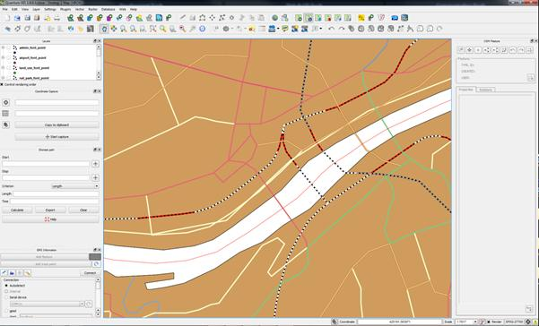
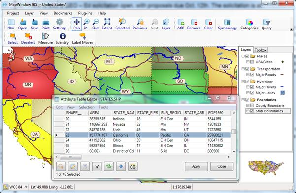

# 第二章软件

拥有一个设计良好的地理信息系统数据库很好，但是除此之外，你还需要什么软件呢？

除非您从头开始做所有事情，否则您将需要某种编辑应用、某种加载数据的方式，并且很可能还需要某种实时数据。

主要问题是费用。你会很快发现，地理信息系统软件可能是地球上最昂贵的软件市场之一。物超所值，大多数这些应用的总体成本远远超过小型办公室典型的年度操作系统站点许可成本—通常一个应用中只有一个用户需要使用 6 个月。

对我们来说幸运的是，围绕地理信息系统也有一场巨大的开源和自由软件运动，大部分由开源地理空间基金会(OSGeo)运营和管理。

位于[www.osgeo.org](http://www.osgeo.org)的 OSGeo 网站是目前市场上所有开源和空间工具的主要链接中心，也是许多教程、新闻和付费提供商的链接中心。他们是一个赞助商资助的组织，依靠使用该软件的团体来改进它，并将它反馈到系统中。

对于那些不喜欢开源并需要服务和支持合同的公司来说，许多可用的开源产品确实以很低的成本提供了这样的包。

让我们看看一些可用的选择。

## 数据库软件

### Postgres 和 PostGIS

这种组合对于开源 GIS 场景就像教父对于黑手党一样。它是所有地理信息系统数据库的鼻祖。它完全符合 OGC 标准，绝对坚如磐石，经过时间的考验，并得到地球上每一个地理信息系统软件的支持。

了解他们数据库的人会知道 Postgres 已经存在了很长时间。它最初是加州大学伯克利分校的产品，由一位名叫迈克尔·斯通布雷克的计算机科学教授于 1986 年创立。1995 年，Stonebraker 的两名学生将 Postgres 扩展到了 SQL，1996 年，他们的创新离开了课堂，进入了开源世界。

折射研究公司意识到 Postgres 具有巨大的潜力，并于 2001 年着手为服务器制作开源插件，以赋予它们全面的地理和空间能力，最终生产出 PostGIS。从那时起，它已经发展成为顶级的企业数据库系统，并且没有放缓的迹象。

### MySQL

MySQL 最初是作为一个简单易用的开源数据库开发的，至少从 v3.23 开始就包含了基本的几何类型。它们可能在更早的时候就已经存在了，但是在 3.23 之前没有关于它们的文档，在数据库的历史中也没有提到它们。

3.23 版文档明确指出，该数据库不完全符合 OGC 标准。特别是不支持 **geometry_columns** 元数据表，很多标准函数都被重命名为前缀为 G—**glenth**，例如，以免引起标准 **Length** 函数的问题。不同版本的 MySQL 对地理信息系统的支持程度值得怀疑。

在更近的版本中——我在输入时正在阅读 5.6 版本的文档——核心引擎似乎更符合 OGC，我当然知道有人将它用作一些复杂地理信息系统的核心组件。考虑到这是少数几个支持地理信息系统操作的系统之一，没有必要安装第三方组件来在空间上支持它。

MySQL 是一个非常有能力和快速的系统。它还非常易于管理，并且在社区中拥有巨大的支持，尽管最近作为收购太阳微系统公司的一部分被甲骨文收购。它的未来仍有一点不确定，但有一点是肯定的:在未来一段时间内，它仍将是大多数 LAMP 和 WAMP 开源网络堆栈安装的中心。你可以在[www.mysql.com](http://www.mysql.com/)了解更多关于 MySQL 的信息。

### SQL Server

因为这本书是给。NET 和微软开发人员，我不打算过多地研究 SQL Server，因为大多数读者已经了解了系统的许多功能。

核心产品中的地理信息系统功能是一个相对较新的东西，直到 2008 年才完全引入。在此之前，有一些非官方的第三方插件在空间上支持 SQL Server 2003 和 SQL Server 2005，但这些插件从未真正交付。我记得尝试了一个 SQL Server 2005 的附加组件，它只在调用某些函数时才反复崩溃服务器！

尽管 SQL Server 2008 内置了地理信息系统功能，但它可能是我见过的所有产品中最不符合 OGC 标准的 OGC 合规性。

我来解释一下:SQL Server 2008 实现了 OGC 规范中要求的所有功能，比如 **ST_GeomFromText** 或者 **ST_Polygonize** 等等功能。但是因为 SQL Server 是一个基于 CLR 的程序集，所以它不允许以相同的方式访问函数。稍后我将更深入地讨论 SQL 现在，考虑以下内容:

**符合 OGC 标准的 SQL**

```sql
    SELECT id,name,ST_AsText(geometry) FROM myspatialtable

```

**符合 OGC 标准的 SQL Server 2008**

```sql
    SELECT id,name,geometry.astext() FROM myspatialtable

```

这种微小的差异导致了各种各样的问题。特别是，这意味着任何使用 SQL Server 2008 作为后端的软件都需要专门的数据适配器(通常基于 ODBC)以符合 OGC 的方式将调用转换到服务器。事实上，大多数地理信息系统软件只是最近才开始通过 ODBC 提供内置支持。

一个积极的方面是。NET 开发人员使用 SQL Server 是直接支持的。NET 通过实体框架及其`Geometry`和`Spatial`类。如果你只负责。NET 平台，有一个很强的理由不需要使用除了 SQL Server 之外的任何东西。但是，如果您需要访问一般的地理信息系统和底层的 SQL 来操作它，SQL Server 不是最佳选择。

SQL Server 官方网站是[www.microsoft.com/sqlserver/en/us/default.aspx](http://www.microsoft.com/sqlserver/en/us/default.aspx)。

### SQLite 和 SpatiaLite

SQLite 严格来说不是数据库服务器，而是新一代单文件数据库引擎之一，旨在直接嵌入到您的应用中。SQLite 在大量平台上都有惊人的支持，可能是我有幸使用过的最跨平台的工具包之一。

与已经提到的三大巨头相比，SQLite 相对来说是一个新手，但它运行得非常好，效率非常高，尤其是在移动平台上。事实上，它在移动平台上表现如此出色，以至于被选为安卓设备和苹果 iOS 上的首选数据库引擎，并通过使用完全托管的。NET 接口。

SQLite 引擎的空间扩展 SpatiaLite 就没那么幸运了。它的源代码是可用的，但是构建的二进制文件只为 Windows 平台提供。对于任何其他平台，您都需要下载源代码，然后将其移植到您选择的平台。虽然这并不困难，但源代码都是标准的 ANSI C 语言，要开始工作可能有点棘手，尤其是如果您几乎没有本机 C 或 C++经验的话。

除了 Windows 之外，还有其他平台可用的二进制构建，但是这些构建非常分散，并且经常已经过时。还要记住，空间网站，就像许多基于地理信息系统的开源软件一样，依赖于项目 4、全球测地系统和其他库来提供它的许多高级功能。如果您必须为您的平台定制构建空间网站，那么您很可能也必须定制构建相关的库。

这是不是把 SQLite 和 SpatiaLite 排除在外了？不完全是。我还没有找到任何其他东西可以在如此多不同的移动平台上使用如此一致的应用编程接口。虽然需要做一些工作，但在大多数情况下，为您的平台构建相当简单，当然也不比安装 Postgres/PostGIS、MySQL 或 SQL Server 时需要执行的工作更复杂。然而，除非您需要普遍移动的空间功能，否则 SQLite 和 SpatiaLite 可能不值得您付出努力。

SQLite 网站是[sqlite.org](http://sqlite.org/)。它的。NET 接口可在[http://system . data . SQLite . org/index . html/doc/trunk/www/index . wiki](http://system.data.sqlite.org/index.html/doc/trunk/www/index.wiki)获得。

空间网站可以在[www.gaia-gis.it/gaia-sins/index.html](http://www.gaia-gis.it/gaia-sins/index.html)找到。

### 甲骨文空间

除非你是一家价值数百万美元的企业，否则你不太可能访问甲骨文空间数据库。甲骨文空间对商业世界的意义就像波斯特格雷对开源世界的意义一样。

它很大，很饿，需要花费一只胳膊和一条腿才能获得许可，而且学习曲线可能比攀登珠穆朗玛峰还要陡峭。

英国的许多政府机构将它用于制图和规划工作，石油和天然气巨头等大型公司部署了数十亿美元的基础设施来支持他们的调查工作。如果你处于使用这个的位置，那么你很可能不会直接和系统对话；您已经有了管理数据库所有功能的软件。围绕甲骨文构建的系统通常是由甲骨文的顾问为特定目的专门设计的，同时围绕它们构建了整个工具包。据我所知，我在本书中提到的大多数软件都没有连接到 Oracle Spatial 的能力；或者如果是这样的话，这样做的设置和操作非常复杂。

甲骨文空间官方网站可在[www . Oracle . com/us/products/database/options/Spatial/overview/index . html](http://www.oracle.com/us/products/database/options/spatial/overview/index.html)找到。

### 剩下的呢？

还有更多可用的数据库包。有些支持即时地理信息系统，有些则不支持。其中一些需要第三方插件或涉及复杂的设置。

之所以把其他人排除在外，是因为这本书根本没有足够的篇幅。如果您决定探索其他数据库，您可能需要检查以下内容:

*   www.mongodb.org 的蒙古银行
*   paralleluniverse.co 的太空基地
*   couchdb.apache.org[的 couch db](http://couchdb.apache.org/)
*   cartodb.com 的卡通数据库

尤其是太空基地，看起来会很有趣。它的主要目标是在一个近乎实时的多人游戏三维世界中跟踪和存储在线的 MMO 游戏角色和资产。

## 地理信息系统桌面软件

为了操作您的地理信息系统资产，您需要一个好的桌面应用——最好是一个不仅允许您查看和操作数据，而且允许您相对容易地导入和导出数据的应用。

后一点也很重要，因为有些应用的唯一目的是将数据移入和移出系统，而其他应用仅用于查看数据。移动数据的应用通常被称为 ETL(提取、转换和加载)包。ETL 包通常可用于许多数据库引擎，而不仅仅是那些用于操作地理空间数据的引擎。

幸运的是，大多数软件都允许你两者兼得。从这些包开始，下面是一些比较著名的包:

### ESRI ArcGIS

市场上的大玩家之一，ESRI，已经提供地理信息系统和地图软件超过 20 年了。该软件就像许多地理信息系统软件包一样:相当昂贵，当然超出了大多数业余爱好者和中小企业的价格范围。然而，ESRI 确实提供了一款名为 ArcGIS Explorer Desktop 的免费产品，可用于制作基本地图和生成您自己的地图数据。

关于 ArcGIS Explorer Desktop 需要注意的一点是，它可以用来查看必应和谷歌地图服务的图像。正如你在下面的截图中看到的，我已经标记了英格兰泰恩河畔纽卡斯尔市中心的一些特征:


图 ArcGIS Explorer 桌面中修改后的现有地图

您可以在[www.esri.com/software/arcgis/explorer](http://www.esri.com/software/arcgis/explorer)找到更多关于 ArcGIS Desktop Explorer 和其他 ESRI 软件的信息。

### Pitney Bowes MapInfo

与 ESRI 套件一样，MapInfo 是一个大型商业软件包，设计时考虑到了企业。我从自己的经验中知道，它被很多公用事业公司使用，比如手机运营商，用于管理他们的网络地图资产。像 Oracle Spatial 一样，除非您有一个非常专门的地理空间数据管理系统，否则您很少会遇到这个包。

虽然它可以加载和使用所有常见的地图格式和服务，如必应、谷歌等，但 MapInfo 的主要设计是在大型、高度定制的地理信息系统数据库中处理非标准数据。它的优势在于它能够使用自己的编程语言 MapBasic 进行扩展，这种语言通常部署在许多自定义配置中。例如，它可以部署在无线服务的操作员控制台中，用于显示网络故障所在的位置，或者部署在交付服务中，用于跟踪其车辆。

你可以在[www.pbsoftware.eu/uk/products/location-intelligence/](http://www.pbsoftware.eu/uk/products/location-intelligence/)找到更多关于皮特尼·鲍斯的信息。

### 开跳

现在我们来看第一个开源桌面产品，OpenJUMP。从一开始就被设计为开源的，它是使用 Java 平台构建的，正如预期的那样，可以与当今使用的大多数地理信息系统数据库进行对话。

它允许您加载和查看自己的空间数据，处理形状文件和 GML 文件，以及将地图导出为 SVG 以在网络上显示。

其主要目的是编辑地图数据，为创建网络使用的矢量地图做准备。我个人从未使用过 OpenJUMP，但它似乎是一个非常有能力从头开始创建网络地图的包。


图 6:使用 OpenJUMP

你可以在[www.openjump.org](http://www.openjump.org/index.html)找到更多关于 OpenJUMP 的信息。

### 量子地理信息系统

我不能说量子地理信息系统(QGIS)公正。这个包可以做任何事情。它与 ESRI 和 MapInfo 等应用不相上下，完全开源，并得到了 OSGeo 基金会的官方支持。

主应用是使用 Python 编写的，因此将在 Linux、Mac OS、Windows 以及桌面环境中支持 Python 的任何其他设备上运行。

现在在 1.8.0 版本上，量子地理信息系统的发展在它可用的相对短的时间内建立了强大的基础。系统公开的扩展 API 简直令人惊叹，可以在每个级别进行定制——从重新设计主 UI，到公开实时 GPS 跟踪等内容的插件，再到通过将算法应用到包中的不同层来创建全新的矢量层。

它与 Grass、MSYS、OpenEV 和许多其他软件一起，成为 Windows 开源地理空间软件 OSGeo4W 的标准配置。在 GDAL、pg2mysql 和许多其他工具的支持下，我发现这个包的唯一限制是你的想象力。

在处理所有不同类型的可用数据时，Quantum 是我首选的桌面工具。它可以像导入和导出地球上几乎所有已知的地理信息系统文件格式一样轻松地处理 Postgres 和所有其他主要数据库。

它也是少数几个可以导入和导出谷歌地球(KML)文件的包之一，直接用于使用谷歌地图应用编程接口的项目。当前版本还包括一个方便的地理空间文件资源管理器，这意味着您可以浏览和查看您的本地文件系统资源，而无需启动完整的图形用户界面。

在下面的截图中，您可以看到 QGIS 加载了一个多层矢量地图(英国的军械测量战略地图)，放大了泰恩市中心的纽卡斯尔:



图 QGIS 中的多层矢量地图

在这张图中，你可以清楚地看到泰恩河的路径，当地的道路和铁路连接，甚至电力电缆等公用设施。加载的地图集，即使放大，也包括整个英国的数据。

我可以单独写一整本关于 QGIS 的书，但是现在如果你想了解更多，你可以在 www.qgis.org 官方 QGIS 网站上找到。

### MapWindow

MapWindow 的设计与 QGIS 非常相似。它的主要目的是做桌面地理信息系统应用可以做的一切，具有各种功能。

这也是唯一一个专门为视窗平台编写的，旨在通过其丰富的开发人员应用编程接口和工具集涵盖视窗开发人员社区。

MapWindow 有两个版本:MapWindow 4 和 MapWindow 6。MapWindow 4 是最初的第一代 C++版本，MapWindow 6 是最新的、最先进的重写，完全使用 C#和标准编写。NET 运行时。

根据应用的 Codeplex 页面，目前这两个版本是同步更新和发布的。这是因为地图窗口 6 还没有达到与地图窗口 4 相同的功能级别。正如您在下面的截图中看到的，它与 QGIS 非常相似:



图 8:地图窗口地理信息系统界面

要了解更多信息，请访问位于[mapwindow4.codeplex.com](http://mapwindow4.codeplex.com/)或[mapwindow6.codeplex.com](http://mapwindow6.codeplex.com/)的项目主页。

### 地理水壶

另一个值得一提的应用是 GeoKettle。虽然这不是一个桌面地理信息系统应用，但它同样重要。

GeoKettle 是一个 ETL 工具。它的主要目的是在多种格式和多种类型的数据库之间转换和加载数据。源自一个名为 Pentaho 数据套件的包，GeoKettle 得到了增强，以支持行业标准的 shapefiles、KML 文件以及前面提到的所有数据库的空间特征。

一个简单易用的开源应用可以做得多好的鲜明例子是，我看到许多人用基于 GeoKettle 的解决方案取代了高价应用，如安全 FME。

用 Java 编写，它有一个非常容易扩展的插件架构，使得它很容易处理未来的文件格式和数据库。它还可以处理数据库和文件中的正常数据，而不仅仅是地理空间数据。如果您曾经使用过微软商业智能开发工作室，那么使用 GeoKettle 就像在家里一样，您会在下面的截图中注意到这一点:


图 9:地理水壶界面

如果你想了解更多，可以访问地理水壶网站[www.spatialytics.org/projects/geokettle](http://www.spatialytics.org/projects/geokettle)。

### 剩余包装

和数据库引擎一样，地理信息系统桌面软件包太多了，我无法一一列举。维基百科有一个地理空间和地理信息系统软件的很好的列表，从昂贵的到免费的，在[en.wikipedia.org/wiki/List_of_GIS_software](http://en.wikipedia.org/wiki/List_of_GIS_software)，包括我在这里介绍的那些。

我个人最喜欢的两个是 QGIS 和 GeoKettle，但是我鼓励你尽你所能去尝试。这些年，我用了很多桌面 GIS 包；有些学习曲线非常陡峭，有些你不到五分钟就能学会。和任何事情一样，你应该选择一个工具，尽可能以最好和最简单的方式完成你需要完成的工作。

请注意，我列出的应用主要在英国和欧洲使用。应用的受欢迎程度在世界各地各不相同。例如，我认为 IDRISI 是加拿大流行的软件包。本节列出的应用是我在日常地理信息系统工作中使用的应用。

正如我已经提到的，除了你选择的软件，你还有很多其他的事情要处理。

## 开发套件

因为这本书是针对。NET 开发人员，这是唯一的权利，我们包括一个部分的套件可用的地理空间数据在您自己的。NET 应用。

稍后我们将介绍一些实际的例子，但现在我将列出我使用过或看到过的工具包。然而，请注意，这不是一个详尽的清单。我描述的工具包都是为在下使用而设计的。NET 在 Windows 平台上实现。正如我所提到的，像 QGIS 这样的应用可以被极大地扩展，在 Linux 和 Mac 系统下有许多工具包是我还没有也可能不会涉及的。如果你正在开始一个项目，你知道你将要写定制的用户界面，提前做你的研究。您可以修改现有的应用来满足您的需求，而不是从头开始编写它们。

### 地图赢取

MapWinGis 是 MapWindow 4 和 MapWindow 6 背后的中央 GUI 组件。这是一个用 C++编写的 OCX 控件，可以用任何支持 Windows 平台上的 OCX 的语言来使用。

过去，我使用这个组件的原始版本。我已经有一段时间没有使用它进行任何开发了。与许多这些组件一样，它在 mapwingis.codeplex.com 的 Codeplex 上有一个永久的家。

它旨在为您完成大部分繁重的工作，让您可以自由地专注于应用的图形用户界面方面。请注意，它是为桌面应用设计的，而不是基于网络的应用，据我所知，不能在 WPF 或 Silverlight 中使用。

### 点空间

DotSpatial 是 MapWindow stable 的姊妹项目，实际上构成了新 MapWindow 6 的大部分核心。NET 重写。DotSpatial 旗下还整合了其他几个 Codeplex 项目，最著名的是 GPS.Net 和 GeoFramework。两者仍可单独获得。

关于 DotSpatial 值得注意的一点是，像 QGIS 一样，这个工具包有 OSGeo 基金会的支持。作为其工具包的一部分，它还将整个开源地理信息系统开发人员库(包括 GEOS、Proj.4、GDAL 等)打包为现成的窗口动态链接库，以便直接包含在您的项目中。

项目主页可在 Codeplex 上的[dotspatial.codeplex.com/](http://dotspatial.codeplex.com/)找到。

### SharpMap

夏普地图是. NET 的老工具包之一。它比 DotSpatial 存在的时间要长一点。

它可以处理大多数类型的矢量和光栅数据，包括美国宇航局为整个地球设置的蓝色大理石瓷砖。

根据其文档，夏普地图库支持桌面和基于网络的项目(后者通过使用 AJAX 地图控件)。它还可以通过组合许多不同类型的叠加来创建自定义专题地图样式。

项目主页可在[sharpmap.codeplex.com](http://sharpmap.codeplex.com/)找到。

### 野蛮

虽然不是完全意义上的地理信息系统库，但 BruTile 做了一件事，而且做得很好:它提供动态分割和重组的栅格切片，允许平滑滚动和缩放库处理的任何输入。

实际上，锐图和点空间都使用 BruTile 来提供对其栅格切片组件的输出支持。它还用于显示在 brutiledemo.appspot.com 的 Silverlight 地图中运行的开放街道地图数据。

BruTile 可以用于任何类型的项目，从 web 和 Silverlight，到高端桌面应用。它还有一个适配器，允许在自定义 ArcGIS 部署中使用。

项目主页位于[brutile.codeplex.com](http://brutile.codeplex.com/)。

### 还有更多...

和前面提到的其他软件一样，还有很多很多可用的软件。我在这里还没有开始介绍的是，所有的主要玩家，如 ESRI 和皮特尼·鲍尔斯，也提供了他们自己的 SDK。事实上，ESRI 很大一部分利润来自提供图形用户界面工具包，这些工具包的使用方式与地图窗口非常相似。不幸的是，尽管我很想这么做，但这本小书的内容实在太多了。

### 德莫斯

所以现在我们进入最重要的问题:我将在本书的演示中使用什么？

我已经用 PostGIS 设置了 PostgreSQL，我的大部分空间 SQL 示例都将使用它。任何可以连接到 Postgres 的数据库管理工具都可以工作。然而，我将使用服务器附带的一个:pgAdmin。

除此之外，我将使用量子地理信息系统来管理和显示数据，并演示如何使用地理釜来加载一些数据。

对于编程示例，我将在 Visual Studio 2010 Professional 中使用 C#语言的夏普映射。样品可从[bitbucket.org/syncfusion/gis-succinctly](https://bitbucket.org/syncfusion/gis-succinctly)下载。

请注意，我不会介绍如何安装和初始设置这些应用。在大多数情况下，这是一个相当简单的操作，我假设这本书的读者都很熟悉。如果您对安装软件有任何问题，本书中提到的所有应用都有非常活跃的社区和帮助论坛。

对于熟悉堆栈溢出的人来说，可以在[gis.stackexchange.com](http://gis.stackexchange.com/)找到它的地理信息系统专用站点。

那里的许多常客都是地理信息系统专家用户，他们有着非常深刻的理解。如果没有提供的帮助和对我在那里提出的问题的回答，这本书的某些部分是不可能的。我强烈建议任何在中玩 GIS 的人。NET 将书签添加到站点的主堆栈溢出页面的书签旁边。