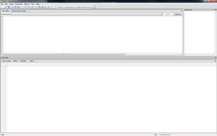
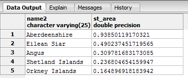
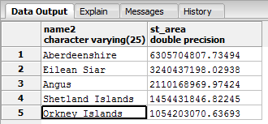
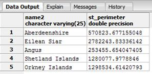
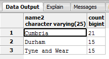
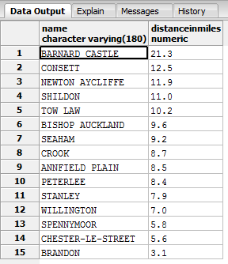
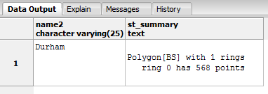

# 第四章空间 SQL

我在本书中多次提到过这种类型的 SQL，在某种程度上，我也对它进行了简短的描述。

空间 SQL 没什么特别的；如果把“Spatial”从名字中去掉，那只是普通的 SQL。无论哪种方式，你都是在处理二进制大对象，或者斑点。

就像处理嵌入在数据库中的图像一样，当这些 blobs 被能够理解它们包含的内容的代码处理时，它们就有了特殊的意义。正是添加了这些代码以及使用这些代码所需的额外的 SQL 函数，才使得数据库具有了空间功能。

在下一节中，我不打算涵盖所有可能的排列和函数调用。根据最新统计，OGC 规范中有 300 多个独立函数，涵盖了从空间距离关系到复杂几何结构的构建，再到为预定义矢量路径裁剪栅格的几乎所有可能情况。

相反，使用我们放在数据库中的数据，我将指导您完成一些简单但常见的操作——任何编写支持地理信息系统的应用程序的人都可能使用的类型。

在讨论这些操作之前，让我们先快速了解一下第一章中描述的输入和输出阶段。

## 创建和检索几何图形

即使我们已经将一些数据导入到我们的数据库中，任何编写地理信息系统应用程序的人也需要能够在数据库中创建几何图形，尤其是如果应用程序允许编辑的话。

大多数几何图形创建是以三种格式之一执行的:

*   著名的文本(WKT)
*   扩展的知名文本(EWKT)
*   知名二进制(WKB)

在接下来的示例中，我们将使用 WKT，并且我们将只在 SQL 中执行操作，而不在数据库中插入任何数据。EWKT 略有不同，主要是因为在几何图形的文本表示中，SRID 用分号与其余数据分开。

我更喜欢使用 WKT 标准和空间函数`ST_SetSrid`为我的几何图形设置 SRID。

如果你用的是 MS SQL，可能就要用 EWKT 了，因为它没有`ST_SetSrid`功能。但是，`Geometry` SQL 类型上有一个可写的`SRID`属性。

那么我们如何利用 WKT 创造一个几何图形呢？请尝试以下 SQL:

```sql
    SELECT ST_GeomFromText('LINESTRING(1 1,2 2,3 3,4 4)')

```

这将创建一个四段线串，从 1，1 开始，到 4，4 结束，经过 2，2 和 3，3。以下是使用 SQL 创建几何图形的另一个示例:

```sql
    SELECT ST_GeomFromText('POINT(5 6)')

```

这将在当前坐标系中创建一个 5，6 点。

可以包含可选的第二个参数，该参数指定几何图形的 SRID。因此，如果我们想在 OSGB36 (SRID 27700)坐标中创建我们的点，我们将使用以下内容:

```sql
    SELECT ST_GeomFromText('POINT(5 6)',27700)

```

如果您使用 pgAdmin 中的 SQL 编辑器尝试这样做，您会发现数据库不会抱怨坐标对于正在使用的坐标系无效。这是因为第二个参数只设置几何斑点中的字段来表示几何的坐标系；它不会在元数据表或系统中的任何其他地方设置任何内容来标记该 SRID。

请注意，如果您试图将这些几何图形插入到您创建的表中，这些表的触发器和约束将由表创建函数设置，只允许插入某些几何图形类型和 SRIDs。这可能会扰乱许多新的地理信息系统开发人员。如果未指定第二个参数，数据库会将其设置为表默认值。如果你不指定 SRID，插入一个无效的坐标就太容易了。

如果指定了 SRID，但它与要插入几何图形的表的 SRID 不匹配，则插入将被拒绝，并且不会提交到表中。手工创建新几何图形时，务必确保您的数据具有正确的 SRID，并且它与您可能已创建的任何表的约束相匹配。

我们在[第 1 章](1.html#_Database_Geometry_Types)中讨论的任何几何类型都可以在`GeomFromText`函数中使用，但是要小心，因为有时候事情并不像你想象的那么简单，尤其是当涉及到 MULT 几何的时候。

下面是一个简单的点类型。

```sql
    SELECT ST_GeomFromText('POINT(5 6)')

```

另一方面，多点看起来像这样:

```sql
    SELECT ST_GeomFromText('POINT((5 6)(6 7))')

```

如你所见，简单的括号嵌套很快就会变成一场噩梦。我在地理信息系统中追踪到的一些最奇怪的错误是缺少括号的直接结果。

所有其他几何类型也使用相同的格式。

```sql
    SELECT ST_GeomFromText('MULTILINE((1 1,2 2)(1 2,2 1))')
    SELECT ST_GeomFromText('MULTILINESTRING((1 1,2 2,3 3,4 4)(5 5,6 6,7 7,8 8))')

```

规则的例外是多边形。因为多边形可以包括内环，所以一个标准的多边形从一开始看起来就像一个多多边形。这意味着多多边形周围有三组圆括号。

```sql
    SELECT ST_GeomFromText('POLYGON((x y,x y,x y,x y..)(x y,x y,x y,x y..))
    SELECT ST_GeomFromText('MULTIPOLYGON(((x y,x y,x y,x y..) (x y,x y,x y,x y..))((x y,x y,x y,x y..) (x y,x y,x y,x y..)))')

```

这不太好调试。使用像 DotSpatial 或 SharpMap 这样的库有很大的帮助，因为它内置了一些功能，允许您使用熟悉的 C#或 VB 对象，并动态生成这些文本，甚至直接 WKB 表示，这样您就不必手动构建这些几何图形。

除了`GeomFromText`还有其他输入功能。其中大多数反映了下一节中列出的等效输出函数。作为参考，我列出了 Postgres 最新版本中可用的一些输入功能:

```sql
    ST_GeomFromEWKB()
    ST_GeomFromEWKT()
    ST_GeomFromGML()
    ST_GeomFromKML()

```

Postgres 最新版本中提供的其他几何功能包括:

```sql
    ST_Point()
    ST_LineFromMultiPoint()
    ST_Polygon()

```

所有这些都在在线 PostGIS 手册的几何构造器部分详细介绍，网址为[。大多数几何构造函数也在 OGC 规范中定义。](http://postgis.refractions.net/docs/reference.html#Geometry_Constructors)

### 输出功能

既然我们已经了解了如何生成几何对象，那么能够从数据库中获取数据就太好了。

如果你只想要二进制斑点表示，一个简单的`Select`就可以了。在前一节的创建示例中，因为我们没有插入数据，所以输出是表示几何图形的实际二进制 blob。

有一点你必须小心:当直接转储 blob 时，它可能是一个 WKB 格式的对象。一些数据库服务以内部格式存储数据，这使得它们能够比 WKB 更快、更容易地管理数据。如果您想确保始终收到 WKB 输出，请确保使用正确的输出函数，如以下代码所示:

```sql
    SELECT ST_AsBinary(geometry)

```

也有相当多的文本输出功能可用，例如:

```sql
    SELECT ST_AsText(geometry)

```

这将以 WKT 格式输出您的几何图形。

如果希望几何输出为 EWKT 格式，请使用以下命令:

```sql
    SELECT ST_AsEWKT(geometry)

```

如果您使用 SVG 在 HTML 5 页面中显示几何图形，那么您将使用以下内容:

```sql
    SELECT ST_AsSVG(geometry)

```

这将返回一个可直接插入输出或 SVG 文件的 SVG 标记。

如果您正在创建用于谷歌地球或任何其他支持锁眼标记语言的应用程序的输出，请使用以下功能:

```sql
    SELECT ST_AsKML(geometry)

```

如果您正在输出行业标准的地理标记语言(GML)或地理 JSON(专为地理数据设计的一种特殊格式的 JSON)，

```sql
    SELECT ST_AsGML(geometry)

```

和

```sql
    SELECT ST_AsGeoJSON(geometry)

```

将是你的职责。

一些服务器还在此基础上提供其他输出功能，例如以下 Postgres 函数:

```sql
    SELECT ST_AsLatLonText(geometry)

```

这将输出 NMEA 秒、分和度格式的坐标，但这种格式的使用被认为是非标准的，可能会使您的应用程序很难在数据库平台之间移植。

让我们使用添加到数据库中的城市点数据来快速查看其中的一两个函数。为此，我们将使用 pgAdmin 中的 SQL 编辑器。要打开 SQL 编辑器，请选择您希望使用的数据库，在我们的例子中是**注册表**如果您一直在关注的话，请选择它，然后单击工具栏上的 SQL 放大镜图标。


图 47: SQL 编辑器图标

这将打开 **SQL 编辑器**窗格。



图 48: SQL 编辑器

在顶部窗格中键入您的 SQL 语句，然后按 **F5** 或单击绿色箭头运行您的 SQL。结果和消息将出现在下窗格中。

#### 关于在 Postgres 中使用 SQL 的补充说明

在 Postgres 中使用 SQL 很可能会给一些用户带来问题:默认情况下，Postgres 区分大小写。如果您创建了一个具有特定大小写的名称的表或其他对象，它将完全创建该名称。但是，当试图访问对象时，Postgres 将使用所有小写字母查找对象名称，除非该名称用引号括起来。

举个例子，如果我`CREATE TABLE Shawty`，那么这个表将被命名为`Shawty`，并带有一个大写的 s。但是如果我运行`SELECT * FROM Shawty`，Postgres 将找不到这个表。而是需要输入`SELECT * FROM "Shawty"`让 Postgres 注意名字的大小写。

这也扩展到. NET 的 Postgres 数据适配器。如果您无法访问 Postgres 数据适配器中的表，请尝试将表名放在引号中，您很可能会发现它解决了这个问题。

请注意，常规字符串用单引号括起来，而不是双引号。如果您将文字字符串括在双引号中，Postgres 会将您的文本解释为对象名，而不是数据。

在 Postgres 中创建对象的最佳实践是给它们取所有小写的名称。我已经为将要用来演示 SQL 函数的数据库完成了这一步，并且在导入数据后，我已经将所有表和列的名称都改为小写，如前所示。我还从数据集中删除了在示例中或一般情况下未使用的列。

如果您在尝试示例时收到错误，请确保您正在进行与我相同的更改，正确使用单引号和双引号，并根据需要正确区分名称的大小写。

### 测试输出功能

让我们尝试以下方法:

```sql
    SELECT * FROM ukcitys LIMIT 5

```

您应该会收到如下输出:


图 49:二进制几何的数据输出

如您所见，**几何图形**列以二进制形式显示，可以是 WKB 格式，也可以不是 WKB 格式。

现在让我们试试这个:

```sql
    SELECT gid,number,name,admin_name,AsText(geometry) FROM ukcitys LIMIT 5

```

您应该会收到以下信息:


图 50:带有文本几何的数据输出

如上图所示，输出是 WKT 格式，坐标以米为单位，因为我们使用 OSGB36 作为 SRID。

让我们把`AsText`换成`AsEWKT`。我们应该得到以下信息:


图 EWKT 几何图形的数据输出

你可能已经注意到，在这些例子中，我一直在调用前面没有`ST_`的函数。`ST_`是系统被称为空间和时间系统时的遗留标签。在大多数现代地理信息系统数据库中，您可以在使用前缀和不使用前缀之间自由切换，因为大多数系统都使用和不使用“ **ST_** ”前缀来定义功能。只有一两个函数是用`ST_`前缀定义的，所以如果你的数据中似乎缺少了什么，在你放弃之前尝试两种拼写。

如您所见，`AsText`和`AsEWKT`的主要区别在于输出中增加了 SRID。

让我们再试一次，这次是以 GeoJSON 格式输出数据:

```sql
    SELECT gid,number,name,admin_name,ST_AsGeoJSON(geometry) FROM ukcitys LIMIT 5

```


图 52:使用 GeoJSON 几何的数据输出

### 我们还能用空间 SQL 做什么？

我们可以用空间 SQL 做很多事情。更好的问题是我们不能做什么？然而，作为一名开发人员，您很可能只对简单的任务感兴趣，所以我们将继续关注一些真实的场景以及我们的数据库可以为我们做些什么。

#### 场景 1:最大的陆地

让我们假设你有许多待售的土地，你把它们都放在一个漂亮的地图系统中，潜在的买家可以通过一个支持地图的网站浏览。你可能想知道的一件事是哪个地块的面积最大，这样你就可以适当地给它们定价。

这可以通过使用数据库提供的区域功能非常简单地实现。

```sql
    SELECT name2,ST_Area(the_geom) FROM ukcountys LIMIT 5

```



图 53:计算的土地面积

你会注意到我们所有的结果都是平方度或分数。这是因为我们的几何图形是以 WGS84 (SRID 4326)坐标添加到数据库中的。大多数计算函数将以源几何体使用的相同单位返回它们的答案。将我们的面积结果转换为米并不难。

如果你记得的话，SRID 27700 是以米为单位测量的，所以我们需要做的就是把我们的几何从 SRID 4326 转换成 SRID 27700。我们可以使用`ST_Transform`来做到这一点。

变换函数将待变换的几何图形作为第一个参数，将 SRID 变换为第二个参数。在我们的数据上使用该函数可以得到以下 SQL:

```sql
    SELECT name2,ST_Area(ST_Transform(the_geom,27700)) FROM ukcountys LIMIT 5

```



图 54:从平方度转换为米的几何图形

一旦将数据从平方度转换为米，就可以使用普通的 SQL `order by`子句和其他聚合函数将面积从大到小排列，或者添加价格列。例如，以下代码以平方米为单位输出英国五个最大的县及其面积。

```sql
    SELECT name2,ST_Area(ST_Transform(the_geom,27700)) FROM ukcountys order by ST_Area(ST_Transform(the_geom,27700)) desc LIMIT 5

```


图 55:按降序排列的英国五个最大的郡

另一个有用的信息是地块的周长有多长。找到这一点同样容易，如下面的代码示例和数据输出所示:

```sql
    SELECT name2,ST_Perimeter(ST_Transform(the_geom,27700)) FROM ukcountys LIMIT 5

```



图 56:英国各郡的周边

#### 场景 2:有多少什么在哪里？

地理信息系统的另一个典型用途是收集一个对象的位置与另一个对象的位置之间的关系的信息。例如，给定三个英国县——达勒姆、泰恩和威尔以及坎布里亚——我们可以很容易地找出每个县有多少个主要城镇。

```sql
    SELECT ukcountys.name2,count(uktowns.*)
    FROM ukcountys,uktowns
    WHERE ST_Within(uktowns.geometry,ST_Transform(ukcountys.the_geom,27700)) AND ukcountys.name2 IN ('Durham','Tyne and Wear','Cumbria')
    GROUP BY ukcountys.name2

```

这段代码为我们提供了以下信息:



图 57:坎布里亚、达勒姆、泰恩和威尔县的城镇数量

这里的 SQL 引入了空间函数`ST_Within`，它测试一个几何图形是否完全在另一个几何图形中。

从这个例子中有两个重要的概念需要记住:

*   要使一个对象位于另一个对象内，内部对象必须完全位于外部对象的边界线内。在县域示例中，如果您的几何图形小于任何县域边界线的厚度，并且直接位于一条边界线上，`ST_Within`就不会拾取它。相反，它会被认为是与几何图形相交的，而不是在几何图形内。
*   一些空间 SQL 函数的参数顺序很重要。在郡示例中，如果您切换郡和镇参数的顺序，您会发现您没有收到任何结果，因为一个点不能完全包含比它本身大得多的多边形。

因为空间 SQL 在执行基于关系的测量时考虑了边界多边形，所以有许多不同的函数执行非常相似的任务，但略有不同。

在`ST_Within`的情况下，我们有以下类似的功能:

*   `ST_Contains`
*   `ST_Covers`
*   `ST_CoveredBy`
*   `ST_Intersects`

Postgres 和 OGC 的规范在细节上比我在这里所能描述的更好地记录了差异，但是本质上一个只在多边形的内部起作用，而其他的在内部封闭环和各种相交层次的组合上起作用。

作为一名开发人员，除了`ST_Within`之外，你很可能永远不会使用任何东西，在极少数情况下`ST_Contains`，对于大多数地理信息系统工作来说，你将会这样做。

在我们县的例子中，你也可以看到我们不得不再次使用`ST_Transform`将我们的县转变为正确的 SRID。如果您在加载数据库时将所有几何图形都保存在同一个 SRID 中，您就会开始看到 SQL 可以变得多么简单。

#### 场景 3:这个离那个有多近？

知道事物有多远在地理信息系统中总是有一席之地的。无论你需要知道最近的麦当劳有多近，或者朋友家有多近，这都是地理信息系统中最常用的操作之一，因为手机开始从内置的全球定位系统单元中抽取位置。

我们不仅可以测量某样东西离用户的距离，而且地理信息系统数据库还可以根据用户在边界框和半径内的距离来选择对象。

我们来举个例子。首先找出达勒姆郡所有城镇与主要城市达勒姆的距离。

```sql
    SELECT t.name,round((ST_Distance(c.geometry,t.geometry) / 1609.344)::numeric,1) as distanceinmiles FROM ukcitys as c
    JOIN uktowns t ON c.admin_name = t.admin_name
    WHERE c.name = 'DURHAM'
    ORDER BY ST_Distance(c.geometry,t.geometry) desc

```

这段代码为我们提供了以下信息:



图 58:杜伦县城镇与杜伦的距离

我们使用的 SQL 很简单，只要你把它分解一下。我们在城镇和城市的管理名称上执行了一个自然连接——两者都有完全相同的列，使用主城市中的管理名称作为主名称。我们对城市进行了筛选，只选择了**达勒姆**，然后用`ST_Distance(a,b)`得到几何图形`a`到几何图形`b`的直线距离。

然后，我们将该距离除以 1609.344(一英里中的米数)，将结果转换回一个数字(从`ST`输出)函数是特定于距离的，例如米、度等。)，并将其四舍五入到小数点后一位，然后从最远到最近对城镇进行排序。

布兰登离达勒姆最近；巴纳德城堡是最远的。

现在让我们看一下在给定半径内捕获项目。同样，我们将使用杜伦市作为我们的中心点，并在该点周围投出 10 英里的半径。然后我们会列出任何落在这个半径内的城镇，不管它的县。

```sql
    SELECT t.name,t.admin_name,round((ST_Distance(c.geometry,t.geometry) / 1609.344)::numeric, 1) as distanceinmiles
    FROM ukcitys AS c, uktowns as t
    WHERE c.name = 'DURHAM' AND ST_Distance(c.geometry,t.geometry) <= 16093.44

```


图 59:达勒姆 10 英里范围内的城镇

在达勒姆市 10 英里范围内有 14 个城镇，正如你所看到的，并不是所有的城镇都在达勒姆县。

也可以用`ST_Dwithin(a,b,distance)`函数重写 SQL，如下所示:

```sql
    SELECT t.name,t.admin_name,round((ST_Distance(c.geometry,t.geometry) / 1609.344)::numeric, 1) as distanceinmiles
    FROM ukcitys AS c, uktowns as t
    WHERE c.name = 'DURHAM' AND ST_Dwithin(c.geometry,t.geometry, 16093.44)

```

唯一不同的是`WHERE`语句最后部分的`<=`子句，那么有什么变化呢？不多，真的。然而，如果你使用的是边界框和缓冲区，你通常会用`ST_Distance`和`<=`操作符得到更好的结果。

同样，我们使用 cast 运算符来确保我们的数据输出一个正常的数字类型，并将其四舍五入到一个小数位，除以 1609.344 将其转换为英里，最后过滤一些东西，以便只包括杜伦周围的城镇。

例如，从全球定位系统设备中用达勒姆城市几何图形交换一个全球定位系统点，并列出该点周围的城镇就足够容易了。

```sql
    SELECT t.name,t.admin_name,round((ST_Distance(ST_Point(428110 542709),t.geometry) / 1609.344)::numeric, 1) as distanceinmiles
    FROM ukcitys AS c, uktowns as t
    WHERE c.name = 'DURHAM' AND ST_Dwithin(ST_Point(428110 542709),t.geometry, 16093.44)

```

或者如果你的 GPS 是 WGS84 (SRID 4326)，你需要把它转换成米和 OSGB36 (SRID 27700)。

```sql
    SELECT t.name,t.admin_name,round((ST_Distance(ST_Transform(ST_Point(-1.56450 54.77851),27700),t.geometry) / 1609.344)::numeric, 1) as distanceinmiles
    FROM ukcitys AS c, uktowns as t
    WHERE c.name = 'DURHAM' AND ST_Dwithin(ST_Transform(ST_Point(-1.56450 54.77851),27700),t.geometry, 16093.44)

```

#### 场景 4:我的几何是由什么组成的？

在某些情况下，您可能需要将几何图形拆开，并以不同的方式重新组装，或者在原始几何图形的基础上制作新的几何图形。

首先，让我们看看有多少点组成了杜伦县的边界。

```sql
    SELECT name2,ST_NPoints(the_geom) FROM ukcountys WHERE name2 = 'Durham'

```


图 60:边界点的数量

或者我们可以在与实际几何相同的坐标中找到该县的地理中心点。

```sql
    SELECT name2,AsText(ST_Centroid(the_geom)) FROM ukcountys WHERE name2 = 'Durham'

```


图 61:达勒姆县的地理中心

或者我们可以输出对象是什么的摘要。

```sql
    SELECT name2,ST_Summary(the_geom) FROM ukcountys WHERE name2 = 'Durham'

```



图 62:杜伦县对象摘要

我们也可以分解底层的几何图形。有一些函数可以转储构成边界的整组点。

```sql
    SELECT name2,ST_DumpPoints(the_geom) FROM ukcountys WHERE name2 = 'Durham' LIMIT 5

```


图 63:杜伦县边界点

或者如果输入是`LINESTRING`或者`MULTILINESTRING`，我们可以得到一个具体的点。

```sql
    SELECT AsText(ST_PointN(GeomFromText('LINESTRING(1 1,2 2,3 3,4 4)'),2))

```


图 64:找到特定点

上图所示的点输出是我们的线串中的第二个点。

如果你需要知道一个对象的边界框，你可以使用下面的代码很容易地得到最大和最小范围的 *x* 、 *y* 对:

```sql
    SELECT name2,ST_Xmax(the_geom),ST_Ymax(the_geom),ST_Xmin(the_geom),ST_Ymin(the_geom) FROM ukcountys WHERE name2 = 'Durham'

```


图 65:最大和最小范围

或者，如果我们需要对我们的范围执行测量和其他功能，我们可以将它们作为一个实际的几何矩形。

```sql
    SELECT name2,AsText(GeomFromText(box2d(the_geom)::geometry)) FROM ukcountys WHERE name2 = 'Durham'

```


图 66:作为几何矩形输出的范围

最后，让我们假设我们有一段路径，由下面的线表示:

```sql
    LINE(1 1,10 10)

```

现在让我们试着根据 5 个单位外的那条线的边界来制作一个新的多边形。

```sql
    SELECT AsText(ST_Buffer(GeomFromText('LINESTRING(1 1,10 10)'),5))

```

这段代码给出了以下结果:


图 67:基于线段边界的新多边形

输出是一个多边形，它的中心线与我们的线完全一致，但是在所有边上都有 5 个单位。

不可能给出每个可能的场景和组合的例子，在这些场景和组合中，你可以使用这些空间功能。主要的邮政地理信息系统参考可以在[http://postgis.org/docs/reference.html](http://postgis.org/docs/reference.html)找到。我鼓励您花时间探索它们，并尝试文档中给出的许多示例，所有这些都应该只使用 pgAdmin 的 SQL 编辑器就可以实现。