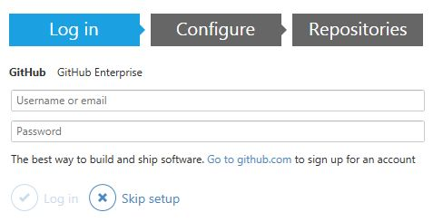
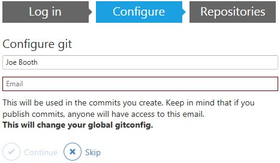
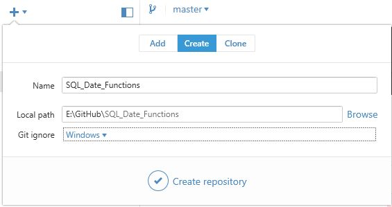
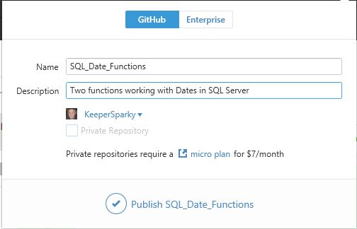
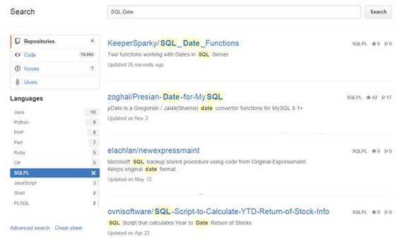

为了将您自己的项目添加到 GitHub，您需要在您的计算机上创建一个本地存储库(只是一个文件夹)。然后，您将使用 Git 软件将该文件夹的内容复制到 GitHub 服务器。虽然这本书侧重于 GitHub，但是对 Git 的一些简单理解对于使用 GitHub 存储库是必要的。

|  | 提示:如果你有兴趣了解更多关于 Git 的知识，一定要下载 Ryan Hodson 的电子书《Git 简洁》。 |

在本地计算机上安装 Git 的第一步是访问 [GitHub Desktop](https://desktop.github.com/ "蘞뉘뿰ṝĽ纀篓") 网站并下载桌面应用。

图 6: GitHub 桌面网站

完成安装后，您需要使用**登录**选项卡将桌面版本链接到您的 GitHub 帐户。

图 7:桌面配置

登录后，您将转到“配置”选项卡。

“配置”选项卡用于将您的帐户与您所做的任何提交(写入存储库)相关联。

图 8: Git 配置

Git 将您的用户标识和电子邮件地址链接到您的提交，因此任何查看您的存储库的人都会看到您的电子邮件地址。如果你想保持你的电子邮件地址的私密性，你可以去 GitHub 编辑你的个人资料。在**个人设置**下，导航至电子邮件菜单项。

图 9:电子邮件配置文件配置

如果选中此框，任何 Git 操作将被发送到一个特殊的 GitHub 帐户(*用户名* @users.noreply.github.com)。您还需要在配置 Git 屏幕中设置该电子邮件地址。

如果这是您第一次使用 Git，您将没有设置存储库，因此您需要创建一个。GitHub Desktop 将检测到这一点，并跳转到存储库页面。

图 10:存储库页面

点击 **+** (加号)添加一个库。默认情况下，GitHub 会在您的文档文件夹中添加一个名为 GitHub 的文件夹，这是存储库的地方。首次设置存储库时，可以通过更改本地路径将存储库放置在任何位置。在下面的屏幕上，我正在将我的 SQL 日期函数库添加到一个名为 E:\GitHub 的本地文件夹中。

图 11:创建存储库

设置好存储库后，您可以将所需的文件移动到此本地文件夹。这将是将它们发布到 GitHub 的第一步。当第一次设置存储库时，将添加两个文件，它们基本上向 Git 提供配置指令。

图 12:初始存储库

#### Gitattributes

默认值。 **gitattributes** 文件提供了一组控制 GitHub 操作的选项，尤其是在比较文件时。该列表由文件扩展名(*)组成。doc)和当检测到文件时要执行命令。例如，下面一行指示 GitHub 在运行比较时将扩展名为. PDF 的任何文件转换为纯文本:

*.pdf diff=astextplain

您也可以向文件扩展名添加其他属性。例如:

*.jpg 二进制

这一行告诉 Git，任何扩展名为. JPG 的文件都是二进制文件。虽然 Git 非常擅长理解文件类型，但您的项目中可能有一些文件应该被视为二进制文件(从不进行比较或合并)。

那个。gitattributes 文件是可选的；如果不需要对存储库中的文件进行任何特殊处理(例如，只添加源代码文件)，则可以删除它。

#### 吉蒂尔

那个。 **gitignore** 文件告诉 GitHub，出于跟踪目的，它可能找到的某些文件应该被忽略。对于 Windows 系统，您可能希望忽略诸如 MSI 安装程序之类的文件。数据库图像缓存等。例如，下面一行指示 Git 不要跟踪存储库中的任何 MSI 安装程序文件:

*.中规模集成电路（medium-scale integration 的缩写）

有许多匹配规则、否定规则等。您可以添加到 GitIgnore 文件中，以获得对 Git 的指令。

#### 创建 readme.md 文件

一旦创建了存储库，就应该创建一个 **readme.md** 文本文件。(The。md 扩展名代表标记文档)。当你的存储库在 GitHub 上打开时，这个文件就会显示出来，人们可以使用 GitHub 进行搜索。虽然它是一个简单的文本文件，但是您可以使用一些格式选项。GitHub 使用 Markdown 语法让您创建纯文本文件，这些文件将显示为 HTML。如果你想了解更多关于 Markdown 的信息，请点击[这个链接](http://daringfireball.net/projects/markdown/)，或者使用 GitHub 帮助系统查看文本中支持哪些代码。

对于我们关于 SQL 日期函数的简单自述文件，我们将使用## <*文本* > ##来创建 H2 级标题，使用###来创建 H3 级标题。

##SQL 日期函数##

为 SQL-Server 编写的几个日期函数(尽管可以很容易地移植到其他平台)。

###假日 _ 列表()# # #

一个好的 readme.md 文件应该会吸引用户去探索你的存储库。您也可以使用以下语法向自己的网站添加链接:

【乔布斯咨询】( [`http://www.joebooth-consulting.com`](http://www.joebooth-consulting.com) )

创建文件后，将其保存在 GitHub 本地存储库文件夹中。

#### 正在加载文件

如果点击**修改**，应该会看到刚刚添加的**自述. md** 文件。如果没有文件，您将被告知没有本地更改，并且您将有机会在 Windows 资源管理器中打开文件夹(存储库)。将您想要添加的文件复制到文件夹中。Git 现在将向您展示文件夹中所做的更改(新文件)。例如，我创建了一个存储库来保存我的假日列表 SQL 代码和一个 readme.md 文件:

图 13:初始变更集

为了将这些文件提交给本地分支，您应该输入摘要和描述。向主分支提交更改需要摘要。然而，提供总结和描述是个好主意。完成该操作后，请单击“提交给主服务器”按钮。

|  | 注意:摘要和描述适用于所有已更改的文件，因此您可能希望单独提交文件，以便为每个文件提供更好的描述。 |

现在，您可以回到**历史**选项卡，查看所做的一组更改(Git 文件和您添加的文件)。

图 14:对存储库所做的更改

#### 发布存储库

最后一步，点击**发布**按钮，将存储库发布到 GitHub 服务器。

图 15:发布您的存储库

恭喜——您刚刚向 GitHub 发布了第一个存储库。

发布后，搜索 GitHub 会找到我的存储库。

图 16:找到您的存储库

本章简要介绍了如何安装 GitHub Desktop 并将您的第一个存储库发布到 GitHub。在本书的后面，我们将介绍与存储库的交互以及与其他人在代码上的协作。