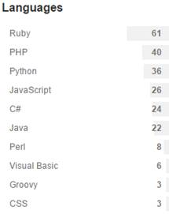

搜索 GitHub 非常简单；很像谷歌搜索，你只需在屏幕顶部的搜索栏中键入你想要的内容。

图 17-搜索 GitHub

点击**进入**调出搜索结果。在这个例子中，我已经搜索了所有关于自然语言处理的存储库。对于这个特殊的搜索，GitHub 找到了 4800 多个匹配的存储库——可能比我希望的要多一些。

图 18: GitHub 搜索结果

幸运的是，GitHub 提供了排序和过滤选项，使搜索所有这些存储库变得更加容易。

默认情况下，GitHub 会返回与您的搜索查询最可能匹配的内容。搜索栏下方的排序下拉控件显示结果的当前排序顺序:

图 19:排序顺序

如果单击向下箭头键，您可以看到其他排序选项。这将帮助您快速浏览搜索结果。

正如我们前面提到的，GitHub 除了简单地作为一个存储库之外，还提供了类似社交媒体的功能。如果用户发现某个特定的存储库有用，或者如果他们积极参与其中，他们可以给这个项目一颗星。例如，流行的 JavaScript Bootstrap 框架有超过 90，000 颗星，jQuery 接近 40，000 颗星。

|  | 注意:您必须有一个帐户并登录才能“启动”存储库。 |

如果你是一个新开发人员，想知道最流行的 JavaScript 框架是什么，通过“大多数明星”进行搜索和排序，你会知道哪个框架可能是学习的好起点。

图 20:星级评定

您可以看到存储库名称旁边的星星数量，如图 20 所示。如您所见，blueimp 的文件上传 jQuery 模块有超过 22，000 颗星。这可能是一个安全的赌注，它已经被大量开发人员测试和使用。

你也可以按照最少的星星来排序，但是你不应该认为星星少的项目是一个必要的坏项目。事实上，它拥有较少的恒星也可能证明这是一个未知的项目或新的贡献。这可能是一个伟大的项目，但很少有人需要它或已经发现它。在这些类型的项目中可能有一些隐藏的宝石，特别是如果你正在处理一个不常见的应用程序。

虽然我们将在后面的章节中讨论 GitHub 分叉，但这里的简单描述应该会有所帮助。fork 是某人下载的存储库的副本，很可能是为了建议变更或者作为他们自己项目的起点。

|  | 注意:分叉不仅仅是文件的下载；你可以很容易地做到。分叉通常是为了添加到现有的项目中。 |

分叉的数量让你知道有多少开发人员对这个项目感兴趣并做出贡献。例如，有一个 LINQ 对 CSV 项目，允许。NET 开发人员对 CSV(逗号分隔值)文件使用 LINQ 查询。这个项目有 64 颗星(截至本书)和 51 个叉。这将表明该项目有很多工作要做，并表明许多开发人员正在使用该库。

有时，需要一些代码的开发人员可能会在 GitHub 上安装第一个版本，并找到其他感兴趣的开发人员来从事这个项目。协作是开源社区的一个标志，所以一个有趣的项目可能会从世界各地的用户社区获得帮助来改进现有的代码。

一个没有几个分叉，但是有很多星星的项目，可以暗示一个非常稳定和完整的项目。一个有很多分支，但很少明星的项目，可能是一个小众的话题，有一小部分非常活跃的开发人员正在使用。

另一个排序选项是最近更新的排序，它将列表从最近更新的更新排序到最旧的更新。将首先展示新项目或最近正在进行的项目。项目的简单下载不算活动，只算更新存储库的操作。有些项目不一定需要最近的更新。例如，有一个. NET 组件可以从邮政编码中检索地理坐标(纬度和经度)。它已经有一年多没有活动了，但是数据内容是基于最近(2010 年)的人口普查数据，所以一旦代码稳定下来，就没有必要更新它，直到另一次人口普查或更多最新的邮政编码数据可用。

最近更新最少的首先显示最早的(就活动而言)。同样，项目更新日期仅提供项目活跃程度的概念。Scriptaculous(一个 JavaScript 框架)已经六个月没有更新了，但是已经有将近 2400 颗星了。这表明一个框架仍在使用，并且相当成熟。它实际上是在 2005 年写的(在互联网时代是古老的)，在 2010 年被功能冻结，然而仍然在使用，并且仍然有贡献者被列在项目上，即使它被冻结了。

随着新浏览器和新技术的频繁出现，旧的网络项目可能无法与新技术兼容。请记住，E. 9 直到 2011 年才发布，所以这个特殊的框架(Scriptaculous)在 E. 8 版本中运行良好。这可能是一个很好的网络应用程序框架，其中的计算机较旧，并且没有运行最新的浏览器。

在排序选项、星星(使用项目后有多少开发人员喜欢它)、分叉(有多少开发人员对增强项目足够感兴趣)和活动(项目最近是如何工作的)之间，您应该能够为您的应用程序选择一个好的项目。

除了对结果进行排序，GitHub 搜索结果还提供了一些基本的过滤选项，主要是让您专注于特定的编程语言。例如，假设我们正在进行一个项目，将 QuickBooks 与您正在开发的某个应用程序集成在一起。在 GitHub 中搜索“QuickBooks”会得到 300 多个结果。如果我按照大多数星星对它们进行排序，我发现 PHP 和 Ruby 实现占据了前 10 名的结果。

然而，在搜索结果的左侧，GitHub 显示了所有找到的存储库的语言组的分类。

图 21:语言

通过点击语言名称，我们可以过滤结果，只显示 24 个关于 QuickBooks 的项目，并使用 C#作为基础语言。

|  | 注意:请记住，用 C#编写的库可以从任何。NET 语言，如 Visual Basic。 |

GitHub 中的基本搜索以及排序和过滤选项应该允许您在存储库中移动并找到库、应用程序等。你需要开始你的发展努力。