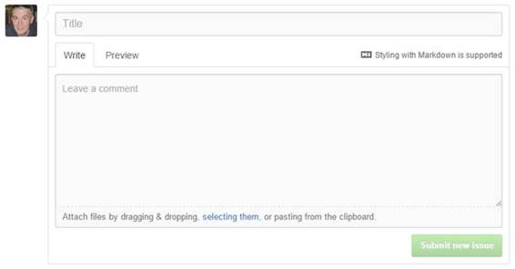
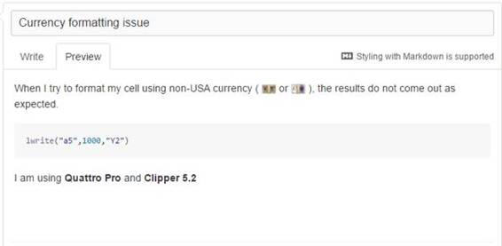
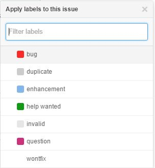
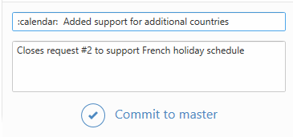

问题是 GitHub 的协作部分，人们在这里交流项目活动。虽然 Git 和 GitHub 是强大的版本控制工具，但是通过问题和拉取请求提供的协作支持鼓励人们一起工作来产生伟大的软件项目。

在项目详细信息页面，您可以点击**问题**选项卡，并点击**新问题**按钮。

图 34:问题选项卡

当您单击“新建问题”按钮时，将出现以下屏幕，让您输入问题详细信息。您可以使用标记语法(参见附录 1)来设置文本的样式。

图 35:写一个问题

您可以在正文中同时使用 Markdown 和[表情符号](http://www.emoji-cheat-sheet.com/)来格式化问题描述。“预览”选项卡向您显示问题的样子。

图 36:问题预览

您还可以将文件附加到问题上，以帮助存储库作者清楚地理解问题。任何查看存储库的人现在都会收到一封包含问题内容的电子邮件。

|  | 提示:请记住 GitHub 是国际性的——一定要尽可能清楚地表达你的问题，因为来自世界各地的人可能正在审查这个问题。 |

除了标记之外，您还可以使用@userName 语法来引用 GitHub 用户，使用#Issue 语法来引用另一个问题或拉请求。这允许问题被交叉引用并与其他用户和问题链接。

当您键入问题时，GitHub 会识别@、#、和:字符，并搜索匹配项以使其更容易。例如，键入#会在存储库中调出其他问题的列表:

图 37:编辑窗口中的问题列表

:(冒号)将显示一个支持表情符号的列表，而@符号将显示一个与存储库和问题相关的用户列表。

当存储库所有者看到问题时，他们将能够开始处理该问题。这允许他们对问题进行分类，将其分配给某个人，将其标记为已关闭，并对问题进行评论。

图 38:所有者视图

通常，审查问题的人会首先给它分配一个标签，例如 bug 或增强。

图 39:标记问题

图 39 中显示的七个项目是 GitHub 提供的默认标签。点击**标签**按钮，可以从问题列表中添加新标签。

图 40:问题列表

这将显示一个屏幕，允许您编辑标签，删除您不想要的标签，并添加任何新标签。当您添加新标签时，GitHub 会询问标签名称，并有一个颜色选择器让您选择用于此问题的颜色。

图 41:新问题

添加新标签后，您可以将该标签用于所有新问题和现有问题。

如果您有许多问题，您可能希望将它们分组为里程碑。里程碑可以是您想要的任何东西，例如:

*   冲刺——未来两周要解决的问题
*   测试版–为下一个主要版本而努力
*   特定客户–特定客户的问题

您可以像创建标签一样创建里程碑。里程碑还将允许您选择一个到期日来帮助跟踪。

图 42:里程碑屏幕

“受理人”按钮允许您指定一个人来处理此问题。它应该是所有者或任何合作者。当您(所有者)查看存储库时，可以从“设置”菜单添加合作者。

图 43:合作者

合作者可以分配任务给他们。您可以查看协作者列表，并通过查找用户名、电子邮件地址或全名来添加新的协作者。您可以使用 X 按钮从项目中移除合作者。合作者也可以对你的项目进行推送。

当您处理问题时，添加标签、受托人等。，GitHub 将显示问题列表中的所有信息

图 44:问题列表

您可以使用顶部的各种选项(作者、标签、里程碑和受理人)来过滤问题列表。您也可以使用搜索时使用的相同选项对列表进行排序。GitHub 使跟踪问题变得既简单又强大。

当您向存储库提交时，您可以通过提交消息关闭问题。GitHub 认为以下单词表示问题正在解决。您应该在关键字后加上#问题编号。

*   关闭
*   关
*   关闭的
*   固定
*   修理
*   固定的；不变的
*   解决
*   解决
*   断然的

当 GitHub 看到提交消息中的模式时，它将自动关闭该问题。您也可以在一条提交消息中关闭多个问题。例如，以下提交消息将自动关闭问题#2。

图 45:在提交消息中关闭一个问题

GitHub 的问题跟踪和协作特性使其作为跟踪开发进度和工作的工具非常有用。这是一个简单而强大的学习系统，对于多人、多里程碑的项目管理非常有用。