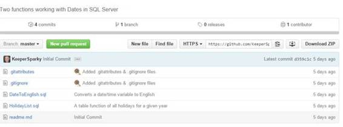
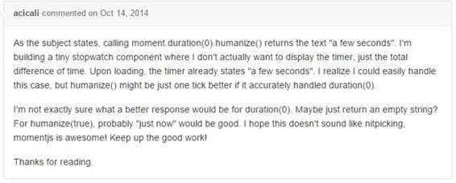
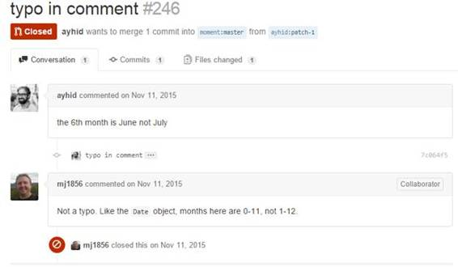
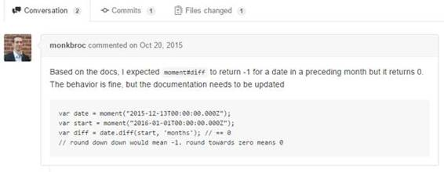
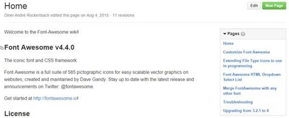
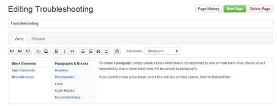
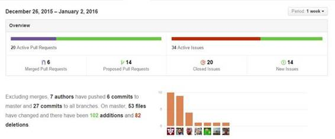
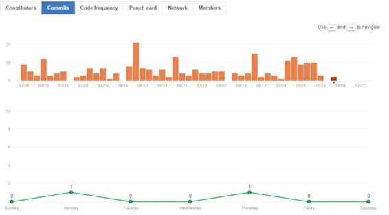

当显示搜索结果时，存储库列表中包含了大量信息。这些信息可以让你了解这个项目有多受欢迎，工作有多积极。

以下示例来自对使用 HTML 画布的 JavaScript 代码的搜索。three.js 是一个 JavaScript 库，可以让你在 HTML 5 Canvas 上做 3D 绘图和动画。它被设计成使用简单，但却是一个非常强大的三维工作库。

图 46:搜索结果

查看搜索结果会显示一些可能有助于了解项目的信息。

在图 46 中，mrdoob/three.js 是存储库的所有者和名称。如果您打开存储库窗口，您将能够点击所有者的姓名来了解更多关于他或她的信息，以及他们可能拥有的其他存储库的信息。例如，打开我的一个项目(KeeperSparky)将向您展示我在编写本书时上传的两个项目。

图 47:所有者简介

如果你想知道，它是“KeeperSparky”，因为我玩足球守门员，在我的大学时代有一个昵称 Sparky(雷达的朋友，来自麻省理工学院)。

在右上角，您可以看到三条信息:项目所用的语言、星级数量(GitHub 用户的正面评价)和分叉数量(增强或参与项目的人员)。

|  | 注意:forks 是一个历史数字，它跟踪自存储库首次添加以来的所有 forks(而不是 7，000 个活动的 Forks)。 |

在存储库名称和描述下是存储库上次更新时间的指示；在我们的例子中，它是在 7 小时前更新的。这通常是一个很好的迹象，表明该项目相当活跃。

描述和最近更新的信息下面是参与图。该图显示了所有者和贡献者提交给存储库的活动。

图 48:参与图

提交的所有者和贡献者是不同的，所以像上面这样的项目显示了很多活动，都来自杜博先生和 519 个贡献者…

一旦你点击了一个存储库，就会出现很多信息，你(作为注册用户)可以和存储库进行很多交互。我们将在本节中介绍各种屏幕，以帮助您找到可能感兴趣的选项。

页面顶部的栏在左侧显示了存储库所有者和名称，在右侧显示了三个按钮。

图 49:存储库的顶部栏

#### 看

您可以观看它(被通知所有活动)，也可以忽略它(永远看不到任何通知)，或者您可以“不观看”(只看到特别提到您的用户标识或您明确参与的通知)。

#### 星星

星星类似于脸书的“喜欢”按钮；这通常意味着你已经使用了这个项目并喜欢它。您可以通过切换“开始”按钮随时开始或停止。右边的数字显示有多少用户“主演”或“喜欢”这个项目。

#### 叉

fork 选项为您的用户 ID 创建一个存储库副本(它将与显示 Fork 图标的其他存储库一起出现)。分叉通常是一个副本，你希望贡献或开始你自己的项目。如果您只想使用代码，则可以下载项目，而无需创建分叉。

在存储库名称的正下方是一组选项卡，显示项目的各种视图。此外，您可以看到提交(项目生命周期内的更新)、分支、发布和贡献者的数量。

图 50:存储库操作

#### 代码选项卡

当您找到存储库时，<>代码选项卡是默认选择的视图。您可以看到存储库中存在的实际文件和任何子文件夹。

图 51:代码选项卡

最上面一行显示了首次创建存储库时添加的摘要行。如果您是存储库的所有者，您将能够在 GitHub 中编辑这一行。

下一行显示了存储库中代码的活动(提交、分支、发布和贡献者的数量)。你可以点击每一项查看更多细节。例如，如果我们查看 momentjs(一个 JavaScript 时间库)，我们会发现 90 个贡献者。

图 52:贡献者

图 52 中的屏幕截图只显示了前两个贡献者(基于提交数量)，但是 GitHub 将显示所有贡献者(在合理范围内；如果一个项目有上百个，GitHub 会警告你，不会全部显示出来)。每个人的名字旁边是提交的次数，后面是添加的行数(**绿色**)和删除的行数(**红色**)。GitHub 提供了大量的数字处理和图表来探索。

#### 问题选项卡

单击“问题”选项卡会显示与存储库相关的可搜索问题列表。您也可以通过单击绿色的“新问题”按钮来创建新问题。

图 53:问题

在该屏幕中，您可以通过点击**作者**(问题的创建者)**标签**(如 bug、增强、新图标等)旁边的下拉箭头来过滤问题列表。)、**里程碑**和**受让人**。您还可以按日期和添加到问题中的注释数量对列表进行排序。

左侧允许您在打开和关闭的问题之间切换。

通过**过滤器**下拉菜单，您可以在问题列表中搜索已创建的问题、已分配给您的问题、提及您的问题等。

当你写一个问题时，一定要提供足够的细节，让它清楚你在报告什么。如果这是一个 bug，包括重现它的步骤。如果是功能要求，一定要明确你想要增加或增强什么。以下示例显示了写入 momentjs 库的明确问题。

图 54:示例问题

#### 拉取请求

拉取请求意味着已经针对某个问题进行了修复，合作者请求将修复合并回其中一个分支。图 55 显示了一个示例拉取请求列表。

图 55:提取请求列表

请求与问题选项卡(如作者、标签和里程碑)具有相似的过滤和排序选项。

当您打开一个请求时，第一行将请求显示为注释。

图 56:拉取请求描述

在这个例子中，用户 monkbroc 已经更新了他的分叉版本(monkbroc:patch-2)，并请求将他对分叉的提交合并到项目的主分支中。

您可能还会在拉取请求中看到其他类型的描述。例如，图 57 显示了一个被合并回主分支的关闭的拉请求。

图 57:合并的拉取请求

然而，并不是所有的拉取请求都被合并到主分支中；在图 58 中，拉取请求没有被合并就被关闭了。接受和应用任何拉取请求取决于存储库所有者。

图 58:关闭拉取请求的例子

在请求列表中，不同的图标表示请求的状态。

在下一行，您将看到三个选项卡。第一个选项卡“对话”显示了与请求相关的各种问题和评论。

图 59:拉取请求对话

此选项卡允许您查看原始问题和后续评论。

下一个选项卡“提交”显示了协作者对其分叉分支的任何提交。这显示了来自分叉的日期和提交消息。

图 60:提交消息

彩色编码的数字显示了在提交过程中添加和删除的行数。

最后一个选项卡“文件已更改”显示了提交后文件中发生了哪些更改的详细信息。这允许所有者查看她是否想要接受拉取请求。

图 61:变更细节

默认情况下，GitHub 显示变更的统一视图，但您可以单击**分割**按钮并排显示两个文件，以另一种方式查看变更。

GitHub 向存储库所有者报告的一个很好的特性是拉请求是否与基本分支冲突的状态。

图 62:冲突报告

拉取请求中的所有信息都有助于存储库所有者决定是否将请求合并回主分支。

## 维基

GitHub 允许您创建和维护一个关于您的存储库的 Wiki，尽管这是一个可选的特性。如果您有一个维基，将会出现一个选项卡，让存储库查看器看到维基。维基是关于存储库的持续文档的良好来源。 **readme.md** 文件提供了很好的介绍，而 Wiki 可以更详细地详细说明如何使用代码。

图 awesome wiki 字体

维基内容会被跟踪，因此您可以查看修订，以了解维基中随着时间的推移发生了哪些变化。维基内容和更新就像任何其他存储库一样，通过拉请求将更改合并回维基。

维基编辑提供了许多不同的格式选项，默认为 Markdown，但也支持许多其他维基编辑器。下面的屏幕显示了维基的基本编辑器。

图 64:维基编辑

维基内容是协作性的，允许多个用户增强维基并改进存储库中的文档。

#### 脉搏

“脉冲”选项卡显示一段时间内(默认为最后一周)存储库中活动的概述。

图 65:脉冲

顶部显示了合并和建议的请求，以及已关闭和新的活动问题。你可以点击任何一个区域来获得组成活动的所有项目的列表。

下面是该活动期间涉及的合作者的信息。您可以单击图形栏下方的图片来查看该用户的帐户页面。

最后，在顶部的摘要信息下方是此活动期间所有请求和问题的列表。

Pulse 选项卡让您了解存储库的活跃程度；这个例子代表了 Bootstrap 中一周的活动。

#### 图形

“图表”选项卡显示了关于存储库、其贡献者、活动等的各种数据。顶部的菜单显示了可以显示的各种图形:

图 66: GitHub 图表菜单

贡献者图显示了项目中最活跃的贡献者以及他们在项目生命周期中所做的提交(当您在查看代码时单击贡献者链接时，会看到相同的页面)。

图 67:贡献者图

提交图显示了两个图；最上面的是过去一年项目所有活动的条形图。下图显示了每天的平均提交次数。

图 68:提交图

顶部的图表让你感觉到项目有多活跃，而底部的图表显示一周中哪几天完成的工作最多。

成员图显示了这个存储库的所有分叉。；它显示了用户和他们的叉子。您可以单击用户名查看该用户的帐户详细信息。您还可以单击分叉名称来访问存储库中该用户的分叉。

图 69:成员图

有时候，如果叉/贡献者列表太大，GitHub 会表现出它口语化的幽默感，只显示部分叉。

图 70:有点太大

还有其他图表可以显示关于存储库及其活动的统计信息。你可以访问[这个链接](https://help.github.com/articles/about-repository-graphs/)来阅读所有的图表。

存储库中文件列表的下方是 **readme.md** 文件的内容。这个文件应该很好地概述了存储库是关于什么的，如何安装和使用它，等等。你会在 GitHub 上找到各种自述文件；一些是完整的用户手册，而另一些是告诉你如何安装软件的几行。

至少，我会提供一个简短(一段)的代码摘要，以及如何安装它(最低要求)。这至少可以刺激用户的食欲。然后，您可以提供更多的详细信息(在自述文件的剩余部分)，或者在您的存储库中作为一个单独的文档文件。

本章详细介绍了 GitHub 提供的关于存储库的信息。您应该知道如何使用这些信息来帮助决定特定的存储库是否可以帮助您的应用，以及您是否可以为代码库做出贡献。

在下一章中，我们将讨论如何获取代码供您个人使用或参与项目。