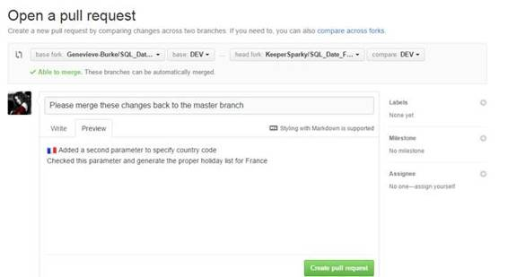

在协作过程中的某个时候，一个贡献者可能已经很好地完成并测试了代码，她觉得代码可以添加到主分支中。吉纳维芙决定通过点击**拉取请求**按钮来创建拉取请求。

图 83:拉取请求

Genevieve 提交了请求，并添加了对她所做工作的描述。

图 84:拉取请求详细信息

存储库所有者现在将在打开存储库时看到拉取请求。所有者还会收到一封电子邮件，告知已发出拉取请求。

所有者在打开存储库时会看到请求。

图 85:请求视图

通过单击请求本身，将显示请求的详细信息。

图 86:拉取请求详细信息

所有者现在可以查看提交和实际的文件更改，以决定是否合并代码。查看并接受更改后，所有者单击“合并请求”按钮。GitHub 将要求确认，一旦确认，将执行合并。

成功合并

当合并成功时，GitHub 将报告它并更新存储库:

图 87:成功的提取请求

由于拉取请求已完成，因此在查看存储库时，它现在将显示为关闭的拉取请求。

一旦协作者完成了请求，并且他们请求将代码合并回来，所有者就可以检查变更并接受它们(执行合并)，或者可能向协作者提问，或者确定在接受变更之前需要完成的额外工作。GitHub 提供了所有工具和比较，所有者需要这些工具和比较来决定是否包含新代码。