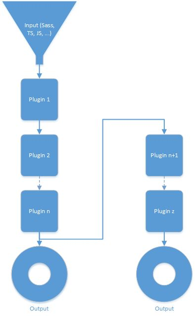

# 一、走向 Gulp

grave 是一个易于学习、易于使用的 JavaScript 任务运行程序。它更喜欢代码而不是配置，并且在执行任务时速度很快。它获得了全球前端工程师和微软的大量关注，因为它已成为 Visual Studio 2015 中 ASP.NET 模板的默认使用方式。

读入文件，处理它们，然后写出结果，这是任务执行人的谋生之道。与其他程序不同，grave 在内存中处理任务的这个*流*，而不是将每一步的结果写入磁盘。这使得它更有效率和性能。处理本身是由*插件*完成的，这些小的专用任务对它们接收到的信息执行它们的专用逻辑，然后传递下去。它们已经有一堆了，如果你愿意，你可以创建新的。在撰写本文时，已经有[1533 个插件](http://gulpjs.com/plugins/)可用。

让我们用一个易于理解的流程图来形象化这一点:


图 1:大口流

大口让你很容易上手，因为它只提供了四个应用编程接口函数，你可以用它们来执行很多魔法。

那么，让我们来看看这四个应用编程接口函数以及它们能提供什么。

用。函数，您可以用直接路径或使用 node-glob 语法加载一个或多个文件。后者超出了本书的范围，但你可以在这里阅读所有关于它的内容。

在完成了插件流并完成了它们各自的任务之后，你很可能希望通过努力工作得到一些输出。使用 dest()函数，您可以做到这一点，并将输出写入磁盘。

dest()函数发出传递给它的所有数据。这意味着它可以在需要时写入多个文件夹。甚至有可能写出一个流程的结果，然后继续处理这个结果，并在上面应用其他插件。

代码清单 1

```js
  gulp.src('./client/templates/*.jade')

  .pipe(jade())

  .pipe(gulp.dest('./build/templates'))

  .pipe(minify())

  .pipe(gulp.dest('./build/minified_templates'));

```

在示例代码中，您可以通过。函数，文件被加载，然后通过管道传输到现有的插件和目标流中。文件正在被处理和写入。/build/templates，然后它们被另一个插件缩小，结果被写入。/build/minified_templates。

下图显示了这一点:



图 2:具有多个目的地的大口流

这形成了一个逻辑包装。src()，。dest()，和 stream。当您编写大口文件时，您可以定义多个任务，甚至可以在某个任务运行之前定义依赖关系。从一个文件夹中取出文件并将其复制到另一个文件夹中的一个非常简单的任务可能如下:

代码清单 2

```js
  gulp.task('copyScripts', function () {

  // copy any javascript
  files in source/ to public/

  gulp.src('source/*.js').pipe(gulp.dest('public'));
  });

```

运行时，代码的功能如下:源文件文件夹中的文件扩展名。 **js** 将被复制到文件夹**公共**中。我们将在下一章中看到如何运行它。

这个函数关注文件的变化并采取相应的行动。[第三章](3.html#_Chapter_3_Watching)将完全致力于此。

正如我们之前看到的，大口利用插件。这些通过 [npm](https://www.npmjs.com/) 以简单的方式分发。你可以在那个特定的网站上搜索大口插件。好消息是它们通常以大口开始。例如，如果您打开 npm 网页并在搜索框中键入“[大口-清洁-css](https://www.npmjs.com/search?q=gulp-clean-css) ”，您将看到如何安装插件和 API，以及一些如何使用它的示例。

从这些示例中，您可以看到语法感觉像 Node.js 语法。没错；grave 建立在这个框架之上。如果你不知道 Node.js，那很好——你仍然可以继续阅读这本书。