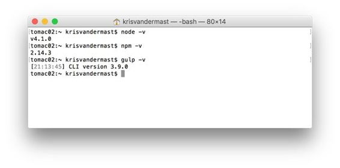
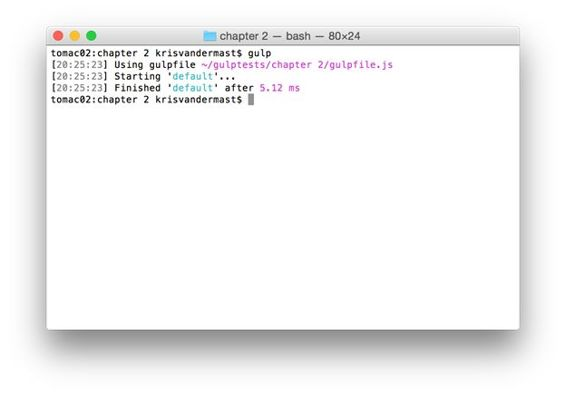
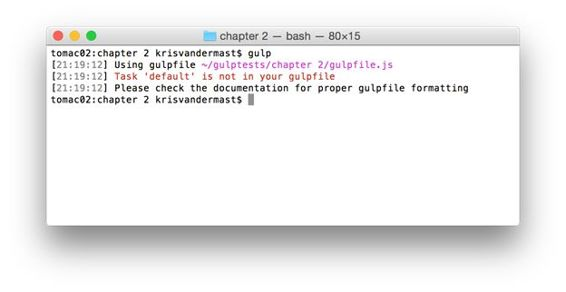
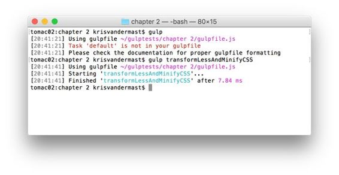
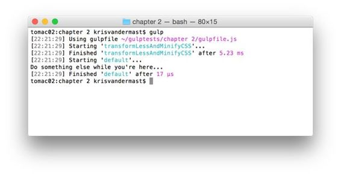
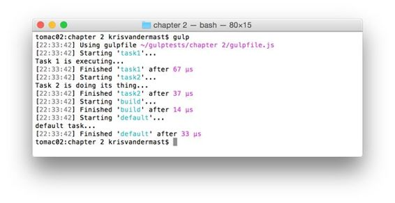
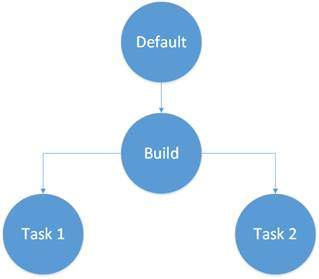
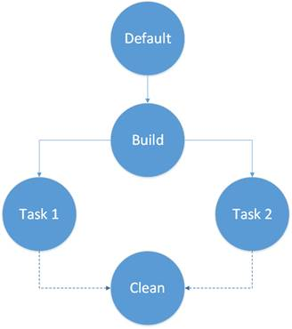

# 二、构建一些东西

正如第 1 章中提到的，have 是一个运行在 node.js 之上的任务运行器，所以要让 have 运行，我们需要安装 node.js，你可以在这里为你的系统[下载。随之而来的是节点包管理器，或 npm。在本书的剩余部分中，你将会大量使用 npm 来安装所需的 lot 插件。稍后会有更多。](https://nodejs.org/en/)

安装 node.js 后，您需要打开一个控制台窗口或终端窗口，并键入以下内容:

npm 安装-全局吞咽

这将在全局范围内安装大口，并将大口添加到您机器的路径中。

|  | 提示:当您没有在 Mac 上以管理员权限运行时，您需要在此命令前加上 sudo。所以它成为 sudo npm 安装-全球大口。 |

前面的步骤只需要在每台要使用大口的机器上执行一次。

完成这些步骤后，您可以键入下面的命令来检查是否都设置好了，可以开始了。

节点–v
NPM–v
吞咽–v

这将为您提供每个组件的版本。当我写这一段的时候，你在下图中看到的版本在我的机器上是可用的。当你读到这个的时候，版本号可能已经改变了。



图 3:展示了 node.js、npm 和 Gulp CLI 的版本

前一段中您必须采取的步骤只需在每台机器上执行一次。然而，插件，你需要为你正在做的每个项目安装。

根据您使用的工具，事情可能会自动进行。在这种情况下，请检查您正在使用的工具的文档。

如果您只是使用文本编辑器和终端窗口，就像本书的前几章一样，您可以按照以下步骤操作:

1.  创建一个用于制作应用的文件夹
2.  打开该文件夹并键入 npm init。这将在您完成所有设置步骤后创建一个 **package.json** 文件。在设置过程中，您可以填写每一行，也可以通过按下**进入**键回答每一个问题并在最后回答**是**来快速浏览。
3.  You can now install Gulp and Gulp plugins via the command:

    a.npm 安装大口-保存-开发

    npm 安装无吞咽保存开发(例如，安装无吞咽的吞咽插件)

|  | 提示:当你提前知道插件的时候，你也可以做这样一个声明，像 npm 安装大口-无大口-咖啡脚本-保存-开发一次安装所有三个模块。 |

|  | 提示:如果您找到了示例代码并注意到 package.json 文件中有很多条目，您可以通过键入 npm install - save-dev 来检索它们，NPM install-save-dev 将依次查找包并在本地恢复它们。 |

在 gulpfile.js 中，您将花时间根据每个项目编写任务。这是标准的文件为大口看做什么。您可以用自己喜欢的文本编辑器创建它。

对于这本书，你可以从 [GitHub](http://github.com/) 获取代码，或者更好的是，在自己喜欢的编辑器中自己键入代码，边做边学。

创建一个您想要保存代码的文件夹，并在其中创建一个名为**第 2 章**的子文件夹。创建一个名为**的新文件，并在您选择的文本编辑器中打开。**

gulpfile.js 总是放在项目的根文件夹中。因此，为终端窗口或 DOS 框提到的命令意味着从同一个项目根文件夹的根运行。在书中，我还有幸将开始文件(如 less、sass 和 coffeescript)放在了 **Assets** 子文件夹下。我还将说明将当前子文件夹中的列表放在哪里。由您决定将它放在本地硬盘的什么位置(可能是临时文件夹或代码文件夹)。代码列表的位置会写得像 **/Assets/colors.less** 或**/gulf file . js**一样，例如 **/** 代表您开始测试代码的子文件夹。例如:**c:\ code \ chapter 2 \ default task \**。

好了，你准备好第一个任务了。或者更好，默认任务。这是当您在没有指定应该运行哪个任务的情况下执行大口命令时将运行的任务。请务必将您的环境设置为能够使用大口。请参考[附录 A](7.html#_Appendix_A_Installing) 。

在**资产**子文件夹中，创建两个新文件，其中包含以下内容:

代码清单 3:代码文件夹/资产/颜色

```js
  @color:#b6ff00;
  @backcolor:#808080;

```

代码清单 4:资产/样式

```js
  @import "Colors.less";

  body {

  background-color: @backcolor;
  }

  a {

  color: @color;

  &:hover {

  color: @color + @backcolor;

  }
  }

```

现在直接在**第二章**文件夹下，打开**文件**并添加以下代码:

代码清单 5:/gulf file . js

```js
  "use
  strict";

  var gulp = require('gulp');
  var less = require('gulp-less');
  var minifyCSS = require('gulp-clean-css');

  gulp.task('default', function () {

  gulp.src('Assets/Styles.less')

  .pipe(less())

  .pipe(gulp.dest('wwwroot/css'));
  });

```

在代码清单 5 中，我们看到需要一些插件，所以让我们通过命令来安装它们。请务必将终端窗口或控制台窗口的路径设置为第 2 章:

1.  npm 安装-保存-开发
2.  npm 安装-保存-开发-无吞咽
3.  npm 安装-保存-开发大口-清洁-css

|  | 提示:当你没有在 Mac 上以管理员权限运行时，你可以在这些命令前加上`sudo`，这样就变成了 sudo npm install - save-dev 大口。这将要求输入密码，之后安装将继续，而无需以管理权限运行。 |

从您现在所在的终端窗口或 DOS 窗口，确保您在第 2 章的文件夹中，即 gulpfile.js 文件所在的位置。键入大口并按下**进入**键。稍等一会儿，看看新创建的 wwwroot\css 子文件夹下的结果。根据您的机器，这可能很快，也可能非常快—出色的性能是大口的优点之一。



图 4:在大口中运行默认任务

目前只有一个 styles.css 文件，预期输出如下:

代码清单 6:/wwwroot/CSS/style . CSS

```js
  body {
    background-color: #808080;
  }
  a {
    color: #b6ff00;
  }
  a:hover {
    color: #ffff80;
  }

```

很高兴看到我们较少的文件被编译并写成了我们可以使用的. T0 CSS 文件。但我们也想缩小。css 文件，所以重新打开**gulf file . js**文件并使用缩小插件，如下所示:

代码清单 7

```js
  "use
  strict";

  var gulp = require('gulp');
  var less = require('gulp-less');
  var minifyCSS = require('gulp-clean-css');

  gulp.task('default', function () {

  gulp.src('Assets/Styles.less')

  .pipe(less())

  .pipe(minifyCSS({ keepBreaks: false }))

  .pipe(gulp.dest('wwwroot/css'));
  });

```

再次运行大口，现在结果变成:

代码清单 8:迷你化的 css 文件:/wwwroot/CSS/style . CSS

```js
   body{background-color:grey}a{color:#b6ff00}a:hover{color:#ffff80}

```

在代码清单 6 中，我们不仅使用了对 minifyCSS 的调用，还传入了一个参数{keepBreaks:false}。一些插件提供了传递选项的能力。根据您使用的文本编辑器，您可能会得到代码完成，但通常最简单的方法是查看文档。例如，对于 grave-clean-CSS，我们可以看一下[这个文档](https://www.npmjs.com/package/gulp-clean-css)。

然而，我们没有看到提到选项。怎么会这样在那个页面上，我们可以看到这个插件是一个相当简单的干净 css Node.js 库的包装器。进一步点击特定库的文档，我们可以看到[概述](https://github.com/jakubpawlowicz/clean-css)。如你所见，有很多。

作为练习，您可以使用不同的选项，看看输出会发生什么。您可以从大口文件中最简单的更改开始，并设置{keepBreaks:true}。

上一段介绍了如何运行任务。向流中添加额外的插件也很简单，这样就改变了我们任务的行为。这很好，但是你可能会想把所有的事情都放在一个大任务中。然而，这将导致繁琐的代码，并且在开发周期的后期和之后会变得难以维护。

这就是为什么在大口中也可能有多个任务的原因。就像大多数其他编程语言一样，您可以将代码编写或重构为更小的片段。这样可以更容易地找到要更改或复制到另一个项目中的代码。另一个优点是，也许你不想同时执行所有的任务。很可能只有一小部分需要再次运行，而不是整体运行。

让我们再次使用代码清单 6 中的代码，并将默认任务更改为它真正要做的事情:转换更少的文件并缩小该过程产生的 CSS。代码现在变成:

代码清单 9

```js
  "use
  strict";

  var gulp = require('gulp');
  var less = require('gulp-less');
  var minifyCSS = require('gulp-clean-css');

  gulp.task('transformLessAndMinifyCSS', function () {

  gulp.src('Assets/Styles.less')

  .pipe(less())

  .pipe(minifyCSS({ keepBreaks: false }))

  .pipe(gulp.dest('wwwroot/css'));
  });

```

现在回到你的终端，运行吞咽命令。从图 5 中可以看出，没有什么会运行，因为我们不再有默认任务了。



图 5:试图运行一个默认任务，但是什么也没找到

但是，如果我们尝试运行带有任务特定名称的大口命令，它就会运行。所以在终端中，输入大口 transformless 和 MinifyCSS。参见图 6 中的输出。如果要验证输出，我建议删除 **/wwwroot/css** 下生成的文件。稍后我们会看到，我们也可以利用大口为我们做到这一点。这将使我们更加确信产出确实是我们所期望的。



图 6:指定您想要显式运行的任务

不过，如果我们可以有一个入口点，即默认任务，并从那里运行另一个任务，那就太好了。如果我们对我们的 gulpfile.js 文件进行一些调整，我们也可以达到这个目标。

代码清单 10:默认任务调用 transformless 和 MinifyCSS 任务

```js
  "use
  strict";

  var gulp = require('gulp');
  var less = require('gulp-less');
  var minifyCSS = require('gulp-clean-css');

  gulp.task('default', ['transformLessAndMinifyCSS'], function () {

  console.log('Do
  something else while you\'re here...');
  });

  gulp.task('transformLessAndMinifyCSS', function () {

  gulp.src('Assets/Styles.less')

  .pipe(less())
          .pipe(minifyCSS({
  keepBreaks: true }))

  .pipe(gulp.dest('wwwroot/css'));
  });

```



图 7:运行依赖任务

在图 6 中，我们可以看到任务 transformless 和 inifyCSS 在转到默认任务的函数体之前运行，在函数体中放置了一个 console.log 语句来显示执行顺序。

代码清单 8 显示了任务函数调用中的一个额外参数:

gought . task(' default '，[' transformlesandminifycss ']，function()

这是大口在它所依赖的其他功能中传递的方式。让我们简短地讨论一下。

到目前为止，我们只看到了一个简单的任务，直到最后一个示例，代码清单 8。默认情况下，大口试图尽可能地提高性能，并以最大的并发性运行任务。

代码清单 11:以最大并发运行

```js
  "use
  strict";

  var gulp = require('gulp');
  var less = require('gulp-less');
  var minifyCSS = require('gulp-clean-css');

  gulp.task('task1', function () {

  console.log('Task 1
  is executing...');
  });

  gulp.task('task2', function () {

  console.log('Task 2
  is doing its thing...');
  });

  gulp.task('build', ['task1', 'task2']);

  gulp.task('default', ['build'], function () {

  console.log('default
  task...');
  });

```

其输出如下:



图 8:运行相关任务

我们可以看到，我们从代码中的默认任务开始，它调用构建任务，构建任务本身同时调用 task1 和 task2。我们看到任务 1 和任务 2 首先运行，因为构建任务依赖于这两个任务，并且在两个任务都完成之前不会运行。一旦发生这种情况，构建函数就可以完成它的任务，然后就由默认任务来运行了。下图显示了此代码中使用的树:



图 9:相关任务

坦率地说，这是一棵很小很容易的树。正如您在现实项目中所能想象的那样，在一个 gulpfile.js 中会有更多的任务，这些任务要么是独立的任务，要么是独立任务和依赖任务的混合。如果几个任务依赖于同一个任务呢？接下来会发生什么？我们来看看。为了更容易理解，下面是将要发生的事情的树:



图 10:运行相同子任务的相关任务

我们的代码:

代码清单 12:从不同的地方运行任务

```js
  "use
  strict";

  var gulp = require('gulp');

  gulp.task('clean', function () {

  console.log('Cleaning
  up...');
  });

  gulp.task('task1', ['clean'], function () {

  console.log('Task 1
  is executing...');
  });

  gulp.task('task2', ['clean'], function () {

  console.log('Task 2
  is doing its thing...');
  });

  gulp.task('build', ['task1', 'task2']);

  gulp.task('default', ['build'], function () {

  console.log('default
  task...');
  });

```

您可以看到任务 1 和任务 2 都依赖于清理任务。例如，某些输出文件夹需要在其他任务完成其预期任务之前清理，并且您不想留下先前运行的内容。

你猜对了:清理任务只会运行一次。grave 很聪明，知道可能会有更多的任务进行调用，但是运行同一个任务两次会增加开销。

在 gulpfile.js 文件中运行代码后，输出如下图所示:


图 11:运行依赖于同一任务的多个任务

在本章中，我们看到了大口任务的基础。我们看到了单个任务、默认任务、多个任务，甚至依赖于其他任务。在后面的章节中，我们会看到更多的例子，但是现在，你知道了基础知识和不同的组合。