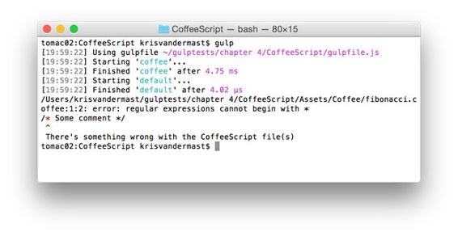
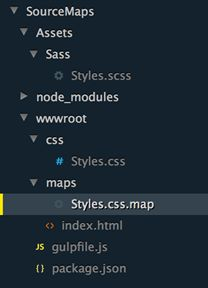
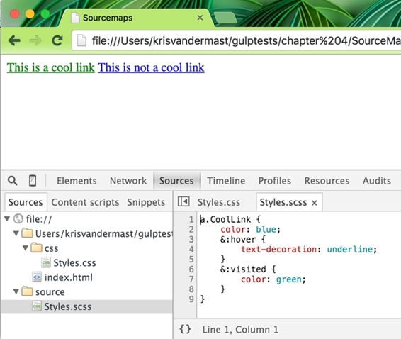
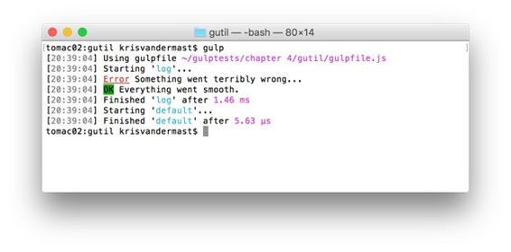
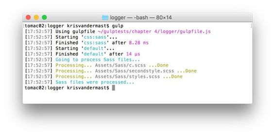
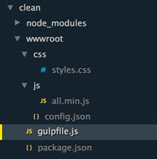
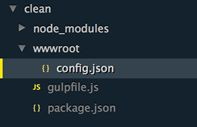

# 四、处理小任务

这一章的目的是让读者进一步了解大口。我们将通过展示开发人员可能需要的小代码片段和日常任务的用法来做到这一点。

在过去的几年里，网络上 JavaScript 的使用有了惊人的增长。最初，它只是用来响应某个点击事件，以切换某个 HTML 元素(如图片)的可见性。如今，看到 web 应用使用数千行 JavaScript 代码，在浏览器中执行一堆任务，而不是将所有内容都回发到服务器并等待答案，这种情况也不例外。所谓的单页应用已经越来越受欢迎。但是它也有一个缺点:复杂性会变得非常棘手，而且很容易犯小错误。因此，我们也看到越来越多的工具和语言将你用它们写的代码转换成 JavaScript。通常，这是一项手动任务，过一段时间后可能会变得乏味。幸运的是，我们正在使用 glaugh . js，它通过自动化让生活变得更容易。

|  | 注意:Transpiling 是一个特定的术语，用来表示在保持相同抽象级别的同时将一种语言转换成另一种语言的过程——基本上是从 CoffeeScript、TypeScript…到 JavaScript。编译是从一种语言转换成另一种语言，就像将 C#编译成二进制代码(在这种情况下是 IL)。 |

CoffeeScript 可能是我遇到的第一种在翻译后生成 JavaScript 的语言。但是，如果您有一堆文件，并且有几个文件被更改，这意味着要逐个翻译它们。不再与大口。有一个简单的插件可供使用，我们可以在我们的吞咽任务或观察者中使用。

代码清单 23:咖啡中的斐波那契

```js
  fib
  = (x) ->

  if x < 2

  x

  else

  fib(x-1) + fib(x-2)

  solutions
  = []
  for number in [0..10]

  solutions.push ( fib number )

  console.log
  solutions

```

示例是众所周知的[斐波那契序列](https://en.wikipedia.org/wiki/Fibonacci)，我们希望将其翻译成 JavaScript。

在**斐波那契**文件夹下直接创建一个新的**gulf file . js**，并运行以下命令:

1.  npm init(这将在您完成向导后生成 package.json 文件。)
2.  npm 安装大口-保存-开发
3.  npm 安装大口-咖啡-保存-开发

在**gulf file . js**文件中，输入以下内容:

代码清单 24:咖啡脚本演示的 gulf file . js-/gulf file . js

```js
  "use
  strict";

  var gulp = require('gulp'),
        coffee
  = require('gulp-coffee');

  gulp.task('coffee', function () {

  gulp.src('./Assets/Coffee/**/*.coffee')
              .pipe(coffee())
              .pipe(gulp.dest('./wwwroot/scripts'));
  });

  gulp.task('default', ['coffee']);

```

在终端窗口或 DOS 框中，运行默认的大口任务，该任务将按照预期在 wwwroot/scripts 文件夹下输出以下 JavaScript 文件(指定为大口. dest 的参数):

代码清单 25:Fibonacci . js-/wwwroot/scripts/Fibonacci . js

```js
  (function () {

  var fib, i, number, solutions;

  fib = function (x) {

  if (x < 2) {

  return x;

  } else {

  return fib(x - 1) + fib(x - 2);

  }

  };

  solutions = [];

  for (number = i = 0; i <= 10; number
  = ++i) {

  solutions.push(fib(number));

  }

  console.log(solutions);

  }).call(this);

```

如果您不喜欢这种输出方式，那么您可以像。烟斗(咖啡({ bare:true}))。

这将把斐波那契. coffee 文件编译成以下 JavaScript 代码:

代码清单 26: fibonacci.js，裸:true-/wwwroot/scripts/Fibonacci . js

```js
  var fib, i, number, solutions;

  fib
  = function (x) {

  if (x < 2) {

  return x;

  } else {

  return fib(x - 1) + fib(x - 2);

  }
  };

  solutions
  = [];

  for (number = i = 0; i <= 10; number
  = ++i) {

  solutions.push(fib(number));
  }

  console.log(solutions);

```

#### 发生错误时的一些处理

例外确实会发生，所以最好记住它们，并在需要时采取适当的行动。毕竟，一个异常可能会破坏你的整个大口脚本，大口插件可能会响应错误的事件。

例如，假设您想在 CoffeeScript 文件中放一些注释，作为代码应该做什么的一个小注释。你可以在文件中写一些注释。这在 JavaScript 中非常好，但是咖啡脚本编译器在执行其魔法时会返回一个错误。

为了使代码清单 24 中的代码更加健壮，我们可以将其更改为:

代码清单 27:带有错误事件侦听器的 gulf file . js-/gulf file . js

```js
  "use
  strict";

  var gulp = require('gulp'),
        coffee
  = require('gulp-coffee');

  gulp.task('coffee', function () {

  gulp.src('./Assets/Coffee/**/*.coffee')
              .pipe(coffee({
  bare: true }).on('error', function (e) {

  console.log(e + '\r\n
  There\'s something wrong with the CoffeeScript file(s)');
              }))
              .pipe(gulp.dest('./wwwroot/scripts'));
  });

  gulp.task('default', ['coffee']);

```

现在打开**斐波那契. coffee** 文件。在顶部，编写/*斐波那契序列*/并再次运行默认的大口任务。我们将看到以下输出:



图 23:当出现问题时，我们希望得到通知

大口喝咖啡插件的输出现在很好地显示出哪里出错了，所以你可以很快发现并解决问题。

### 打字稿

TypeScript 是微软开发的语言，就像 CoffeeScript 一样，编译成 JavaScript。自从谷歌的 Angular.js 团队宣布密切合作以来，它现在获得了很多兴趣和动力。TypeScript 被选为编写即将到来的基于 Angular.js 的应用的首选语言。正如你已经感觉到的，这将是未来几年的大事。

如果你想了解更多关于 TypeScript 的知识，我建议你看看[这个网站](http://www.typescriptlang.org/)，尤其是操场版块在工作的时候看看。这里使用的例子就是其中之一。

代码清单 28:继承

```js
  class
  Animal {

  constructor(public name: string) { }

  move(meters: number) {

  alert(this.name + " moved " + meters + "m.");

  }
  }

  class
  Snake extends Animal {

  constructor(name: string) { super(name); }

  move() {

  alert("Slithering...");

  super.move(5);

  }
  }

  class
  Horse extends Animal {

  constructor(name: string) { super(name); }

  move() {

  alert("Galloping...");

  super.move(45);

  }
  }

  var
  sam = new Snake("Sammy the Python");
  var
  tom: Animal = new Horse("Tommy the Palomino");

  sam.move();
  tom.move(34);

```

有几个插件可以将 TypeScript 编译成 JavaScript。我选择了大口型脚本编译器，但是你可以尝试任何其他的。

代码清单 29:用于编译 TypeScript-/gulf file . js 的 gulf file . js

```js
  var gulp = require('gulp'),
        ts
  = require('gulp-typescript-compiler');

  gulp.task('ts', function () {

  return gulp.src('./Assets/TypeScript/**/*.ts')
                          .pipe(ts())
                          .pipe(gulp.dest('./wwwroot/js'));
  });

  gulp.task('default', ['ts']);

```

这将产生以下 EcmaScript 5 代码:

代码清单 30:编译后的 JavaScript-/wwwroot/js/继承. js

```js
  var __extends = this.__extends || function
  (d, b) {

  for (var
  p in b) if
  (b.hasOwnProperty(p)) d[p] = b[p];

  function __() { this.constructor = d; }

  __.prototype = b.prototype;

  d.prototype = new __();
  };
  var Animal = (function () {

  function Animal(name) {

  this.name = name;

  }

  Animal.prototype.move = function (meters) {

  alert(this.name + " moved " + meters + "m.");

  };

  return Animal;
  })();

  var Snake = (function (_super) {

   __extends(Snake, _super);

  function Snake(name) {

  _super.call(this, name);

  }

  Snake.prototype.move = function () {

  alert("Slithering...");

  _super.prototype.move.call(this, 5);

  };

  return Snake;
  })(Animal);

  var Horse = (function (_super) {

  __extends(Horse, _super);

  function Horse(name) {

  _super.call(this, name);

  }

  Horse.prototype.move = function () {

  alert("Galloping...");

  _super.prototype.move.call(this, 45);

  };

  return Horse;
  })(Animal);

  var sam = new Snake("Sammy the Python");
  var tom = new Horse("Tommy the Palomino");

  sam.move();
  tom.move(34);

```

哇，我打赌你不想自己写。您也可以在 ts 呼叫中传递选项。请务必查看它们，并与它们一起玩，看看哪些对您有用，例如 sourcemap 生成:

代码清单 31:使用 options-/gulf file . js 编译 TypeScript 的 gulf file . js

```js
  var
  gulp = require('gulp'),
        ts
  = require('gulp-typescript-compiler');

  gulp.task('ts',
  function() {
        return
  gulp.src('./Assets/TypeScript/**/*.ts')
                          .pipe(ts({
                                sourcemap:true,
                                target:'ES3'
                          }))
                          .pipe(gulp.dest('./wwwroot/js'));
  });

  gulp.task('default',
  ['ts']);

```

这将在输出文件夹 wwwroot/js 中生成一个名为 inheritation . js . map 的 sourcemap 文件。它还将在生成的继承. js 文件的底部添加以下一行，以指示两者之间的关系://# sourcemappingURl = inheritation . js . map。

EcmaScript 6 (ES6)是新的、即将推出的 JavaScript 版本。由于它是如此新，大多数浏览器还不支持它(或者至少不完全支持)。这很遗憾，因为你可以用它开始做的事情非常棒。对开发人员来说幸运的是，已经有一种方法可以利用它，然后将它传输到 EcmaScript 5，目前的浏览器对此非常了解。一个例子是利用类和继承——这是我们知道的 JavaScript 不太擅长的。取以下 ES6 示例:

代码清单 32: ES6 文件继承

```js
  class Shape {

  constructor(id, x, y) {

  this.id = id

  this.move(x, y)

  }

  move(x, y) {

  this.x = x

  this.y = y

  }
  }

  class Rectangle extends Shape {

  constructor(id, x, y, width, height) {

  super(id, x, y)

  this.width = width

  this.height = height

  }
  }

  class Circle extends Shape {

  constructor(id, x, y, radius) {

  super(id, x, y)

  this.radius = radius

  }
  }

  var c = new
  Circle('firstCircle', 3, 4, 5);
  console.log(c);
  c.move(10,
  20);
  console.log(c);

```

它有一个类 Shape，它有一个移动功能。另外两个类，圆形和矩形，继承自它。在类声明之后，还有四行，它们实例化一个新的 Circle 对象，并将一些参数传递给它的构造函数，该构造函数又通过 super()调用调用基类构造函数。为了看到对象本身，我们将其写入控制台。然后，我们将圆对象移动到一些新的 x:y 坐标，并将其再次写入控制台。嘿，这可能是一个有趣的新游戏的开始！

然而，要将其传输到 ES5，我们需要一些帮助。在编写大口插件的时候有，一旦 ES6 起飞，可能会有更多的插件紧随其后。我们的大口文件如下所示:

代码清单 33:gulpfii . js/gulpfii . js

```js
  var gulp = require('gulp'),
        es6
  = require('gulp-es6-transpiler');

  gulp.task('js:es6', function () {

  return gulp.src('./Assets/ES6/inheritance.js')
                          .pipe(es6({
  'disallowUnknownReferences': true
  }))
                          .pipe(gulp.dest('./wwwroot/js'));
  });

  gulp.task('default', ['js:es6']);

```

|  | 注意:在运行大口任务之前，请确保您已经安装了大口和大口-es6-transpiler 软件包。 |

等效的 ES5 将生成以下代码。对于有心无力的人来说，或许可以看看下一段，因为它并不好看。

代码清单 34:传送我们的 ES6 继承的 ES5 文件继承. js 文件-/wwwroot/js/inheritation . js

```js
  var PRS$0 = (function (o, t) { o["__proto__"] = { "a": t }; return o["a"] === t })({}, {}); var DP$0 =
  Object.defineProperty; var GOPD$0 =
  Object.getOwnPropertyDescriptor; var MIXIN$0
  = function (t, s) { for (var p in
  s) { if (s.hasOwnProperty(p)) { DP$0(t, p,
  GOPD$0(s, p)); } } return t }; var
  SP$0 = Object.setPrototypeOf || function
  (o, p) { if (PRS$0) { o["__proto__"] = p; } else { DP$0(o, "__proto__", { "value": p, "configurable": true,
  "enumerable": false, "writable": true
  }); } return o }; var
  OC$0 = Object.create; var Shape = (function () {

  "use
  strict"; var proto$0 = {};

  function Shape(id, x, y) {

  this.id = id

  this.move(x, y)

  } DP$0(Shape, "prototype", { "configurable": false, "enumerable": false, "writable": false });

  proto$0.move = function (x, y) {

  this.x = x

  this.y = y

  };

  MIXIN$0(Shape.prototype, proto$0); proto$0 = void
  0; return Shape;
  })();

  var Rectangle = (function (super$0) {

  "use
  strict"; if (!PRS$0) MIXIN$0(Rectangle, super$0);

  function Rectangle(id, x, y, width, height)
  {

  super$0.call(this, id, x, y)

  this.width = width

  this.height = height

  } if (super$0 !== null) SP$0(Rectangle, super$0); Rectangle.prototype =
  OC$0(super$0 !== null ? super$0.prototype : null, { "constructor": { "value": Rectangle, "configurable": true,
  "writable": true
  } }); DP$0(Rectangle, "prototype", { "configurable": false, "enumerable": false, "writable": false });

  ; return Rectangle;
  })(Shape);

  var Circle = (function (super$0) {

  "use strict"; if
  (!PRS$0) MIXIN$0(Circle, super$0);

  function Circle(id, x, y, radius) {

  super$0.call(this, id, x, y)

  this.radius = radius

  } if (super$0 !== null) SP$0(Circle, super$0); Circle.prototype =
  OC$0(super$0 !== null ? super$0.prototype : null, { "constructor": { "value": Circle, "configurable": true,
  "writable": true
  } }); DP$0(Circle, "prototype", { "configurable": false, "enumerable": false, "writable": false });

  ; return Circle;
  })(Shape);

  var c = new
  Circle('firstCircle', 3, 4, 5);
  console.log(c);
  c.move(10,
  20);
  console.log(c);

```

的确，ES6 的写作风格看起来容易多了。

要在浏览器中快速测试这个透明文件，您可以打开[jsfiddle.net](http://www.jsfiddle.net/)，将代码粘贴到 JavaScript 窗格中，然后运行它。打开你最喜欢的浏览器的 F12 工具，看看控制台。下面的截图显示了代码的结果:


图 24:移动函数调用前后的两个圆形对象

源映射是一种方便的方法，可以让浏览器知道某个资源(如 JavaScript 或 CSS 文件)的原始文件在哪里。我们已经在本章前面的[类型脚本段落](#_TypeScript)中看到了它的使用。在那里，这是一个可选的设置。然而，并不是每个大口插件都有这个现成的。幸运的是，有一个专用的大口插件可以注入到流中。实际上，正如我们稍后将看到的，它需要两点进入流:一点进行初始化，另一点进行写入。

对于这个例子，我们将使用 Sass 请务必使用 npm install 来获取 glaw-sass 包。就像 Less 一样，这是一种流行的 CSS 预编译器语法，正在变得越来越流行。例如，著名的 Bootstrap 库的下一个版本将使用 Sass 编写，而当前版本使用 Less。注意，Sass 文件的扩展名为. SCS，为了让自己熟悉 Sass 的语法，我鼓励大家看一下[本指南](http://sass-lang.com/guide)。

代码清单 35

```js
  a.CoolLink {

  color: blue;

  &:hover {

  text-decoration: underline;

  }

  &:visited {

  color: green;

  }
  }

```

代码清单 36:gulpfii . js/gulpfii . js

```js
  var gulp = require('gulp'),
        sass
  = require('gulp-sass'),
        sourcemaps
  = require('gulp-sourcemaps');

  gulp.task('css', function () {

  return gulp.src('./Assets/Sass/**/*.scss')
                          .pipe(sourcemaps.init())
                                .pipe(sass({

  outputStyle: 'compressed'
                                }))
                          .pipe(sourcemaps.write())
                          .pipe(gulp.dest('./wwwroot/css'));
  });

  gulp.task('default', ['css']);

```

这个代码清单做了很多工作，所以让我们更仔细地检查一下 css 任务。首先，所有的 Sass 文件都放入流中。然后初始化 sourcemap。可以把这个放在萨斯管后面，但是建议放在前面。然后，将 Sass 编译成 CSS 就发挥了它的魔力，源图就写好了。在当前调用中，映射将被写入结果 CSS 文件，如下所示:

代码清单 37:文件本身包含源映射的样式

```js
  a.CoolLink{color:blue}a.CoolLink:hover{text-decoration:underline}a.CoolLink:visited{color:green}

  /*#
  sourceMappingURL= */

```

这是可行的，但就我个人而言，我喜欢将映射保存在单独的文件中。只需像下面这样更改对 write 函数的调用，就可以非常容易地做到这一点:

代码清单 38:调整了将源映射写入另一个文件的方法

```js
  var gulp = require('gulp'),
        sass
  = require('gulp-sass'),
        sourcemaps
  = require('gulp-sourcemaps');

  gulp.task('css', function () {

  return gulp.src('./Assets/Sass/**/*.scss')
                          .pipe(sourcemaps.init())
                                .pipe(sass({

  outputStyle: 'compressed'
                                }))
                          .pipe(sourcemaps.write('../maps'))
                          .pipe(gulp.dest('./wwwroot/css'));
  });

  gulp.task('default', ['css']);

```

运行默认的大口任务后，这一次将创建另一个子文件夹“地图”，它将保存生成的源地图文件，如下所示:



图 25:样式. css 及其对应的样式. css.map 文件

与之前的内联映射不同，在 Styles.css 中，单独的 style . CSS . map 文件看起来有些不同。此外，Styles.css 现在只保留浏览器在哪里可以找到映射文件的简短指示。

代码清单 39

```js
  {"version":3,"sources":["Styles.scss"],"names":[],"mappings":"AAAC,CAAC,SAAS,CACP,KAAK,CAAE,IAAK,CADJ,AAEP,CAAC,SAAS,MAAH,AAAS,CACb,eAAe,CAAE,SAAU,CADtB,AAGR,CAAC,SAAS,QAAD,AAAS,CACf,KAAK,CAAE,KAAM,CADN","file":"Styles.css","sourcesContent":["a.CoolLink
  {\n    color: blue;\n    &:hover {\n        text-decoration:
  underline;\n    }\n    &:visited {\n        color: green;\n    }\n}"],"sourceRoot":"/source/"}

```

|  | 注意:源映射文件在您的机器上看起来可能有点不同。在这里您可以看到\n，它在 Mac OS X 上是返回和换行符，而在 Windows 上它将显示\r\n。此外，json 文件的属性顺序可能不同，但本质上相同的信息会在其中。 |

代码清单 40

```js
  a.CoolLink{color:blue}a.CoolLink:hover{text-decoration:underline}a.CoolLink:visited{color:green}

  /*#
  sourceMappingURL=../maps/Styles.css.map */

```

要在浏览器中进行测试，请在 **wwwroot** 文件夹下添加一个 HTML 文件，内容如下:

代码清单 41:index.html

```js
  <!DOCTYPE html>
  <html lang="en">
  <head>

  <meta charset="UTF-8">

  <title>Sourcemaps</title>

  <link rel="stylesheet" href="css/Styles.css">
  </head>
  <body>

  <a href="http://www.krisvandermast.com" class="CoolLink">This is a cool link</a>

  <a href="#">This is not a cool link</a>
  </body>
  </html>

```

屏幕上的输出不会令人惊讶。有趣的部分发生在你打开浏览器所谓的 F12 工具的时候。打开**资源**面板，查看正在进行的映射。但是，请注意，每个浏览器在显示它时都有所不同。

Safari:


图 26:Safari 中的源地图

镀铬:



图 27:Chrome 中的源地图

请注意，源映射不仅适用于 CSS，还可以用于从另一个源文件编译或传输的 JavaScript 文件。浏览器可以利用这一点来显示一些代码最初来自哪里。我们已经在[类型脚本](#_TypeScript_1)部分看到了一个 JavaScript 源图的例子。

载入特定任务要处理的文件，这是一个很好的工具。这些文件的加载顺序与文件夹中的顺序相同。这意味着如果你有文件需要在结果文件中以特定的顺序输出，你将不得不做一些操作。可能出现这种情况的情况是一堆 CSS 文件的串联。在这样的文件中，顺序非常重要，因为它可能会使您的应用看起来与您想要的不同。

拿下面三个小的来说。css 文件和大口文件:

代码清单 42:/Assets/CSS/另一个应该比 end.css 更好的样式

```js
  div {
        border:4px solid red;
  }

```

代码清单 43

```js
  body {
        background-color: blue;
  }

```

代码清单 44:/Assets/CSS/style . CSS

```js
  div {
        border:1px dashed green;
        background-color: green;
  }

```

代码清单 45

```js
  var gulp = require('gulp'),

  concat = require('gulp-concat');

  gulp.task('css', function () {

  return gulp.src('./Assets/css/**/*.css')
                          .pipe(concat('all.css'))
                          .pipe(gulp.dest('./wwwroot/css'));
  });

  gulp.task('default', ['css']);

```

我们在这里介绍了另一个大口插件:大口-串联。在运行大口命令之前，一定要安装好它。它所做的是将流连接成一个文件，在这个特殊的例子中是 all.css 文件。这使得将脚本捆绑在一起变得非常容易，并减少了浏览器需要获取的文件数量。

运行默认的大口任务的输出将产生以下 all.css 文件:

代码清单 46: /wwwroot/css/all.css

```js
  div{
        border:4px solid red;
  }
  body {
        background-color: blue;
  }
  div {
        border:1px dashed green;
        background-color: green;
  }

```

这并不是我们想要的，因为使 div 边框变红的样式应该成为文件中的最后一个。我们可以用不同的方式做到这一点；让我们调查一下到底是怎么回事。

这是一个非常简单的方法，因为你不需要得到另一个大口插件。实际上，它已经在您的代码中以 grave . src 的形式出现了，而不是像。/资产/减/**/*。less 要抓取 Assets/less 及其子文件夹下的所有 Less 文件，可以按照您想要的文件顺序制作一个数组。让我们举以下例子:

代码清单 47

```js
  var gulp = require('gulp'),
        concat
  = require('gulp-concat');

  gulp.task('css', function () {

  return gulp.src(['./Assets/css/styles.css', './Assets/css/**/*.css'])
                          .pipe(concat('all.css'))
                          .pipe(gulp.dest('./wwwroot/css'));
  });

  gulp.task('default', ['css']);

```

确保安装了大口、大口连接和大口订购的包装。

运行默认的大口任务后，输出将变为以下内容:

代码清单 48: /wwwroot/css/all.css

```js
  div {
        border:1px dashed green;
        background-color: green;
  }
  div{
        border:4px solid red;
  }
  body {
        background-color: blue;
  }

```

styles.css 文件在排序中被放在第一位，同时保持文件夹中其余文件的文件名顺序，生成 all.css 文件。

尽管通过 graw . src 进行订购是可行的，但它容易改变，实际上做了两件事:获取文件和订购文件。从关注点分离的角度来看，这并不总是可取的。因此，最好使用一个专用的大口插件:大口订单，，它将在下面更改的大口文件中引入。

代码清单 49:通过大口订单插件进行订购的 gulpfile.js

```js
  var gulp = require('gulp'),
        order
  = require('gulp-order'),
        concat
  = require('gulp-concat');

  gulp.task('css', function () {

  return gulp.src('./Assets/css/**/*.css')
                          .pipe(order(['styles.css', '*.css']))
                          .pipe(concat('all.css'))
                          .pipe(gulp.dest('./wwwroot/css'));
  });

  gulp.task('default', ['css']);

```

输出是相同的，如代码清单 48 所示。

glow . js 是一个任务运行器，这意味着它在闭门造车的情况下施展了所有的魔法。您没有像打开浏览器并导航到某个页面时那样的真实视觉反馈。最好的情况是，您可以在控制台窗口中获得一些关于正在发生的事情的默认输出。如果你想要更多的信息，那么你必须把它放进你自己。我们将看看实现这一点的几种不同方法。

这是“穷人的”日志记录方式，它的工作不需要安装一些花哨的插件。在前面的章节中，我们已经看到了它的用法，例如，在代码清单 10 中。

这个方便的小插件不仅仅是记录日志，所以一定要查看[文档](https://www.npmjs.com/package/gulp-util)了解所有选项的概述。它能够发出很好的老式“哔”声，并且便于在屏幕上显示彩色信息。例如，看一下下面的代码:

代码清单 50

```js
  var gulp = require('gulp'),
        gutil
  = require('gulp-util');

  gulp.task('log', function () {

  gutil.beep();

  gutil.log(gutil.colors.red.underline('Error'),
  'Something went
  terribly wrong...');

  gutil.log(gutil.colors.bgGreen('OK'), 'Everything went smooth.');
  });

  gulp.task('default', ['log']);

```

我无法在本书中提供“哔”声，但彩色输出如下所示:



图 28:带吞咽的彩色输出

|  | 注意:可用的颜色不多。大口-util 利用了粉笔 npm 模块。颜色见下表。 |

| 鲜艳的颜色 |
| 大胆的 | 暗淡的 | 斜体的 | 强调 |
| 相反的 | 黑色 | 删除线 | 红色 |
| 绿色的 | 黄色 | 蓝色 | 品红 |
| 蓝绿色 | 白色 | 灰色 | 大黑 |
| bgRed | 贝格林 | 大黄色 | 蓝色巨人 |
| BG 洋红色 | bigyan | bg 怀特 |  |

有可能将这些颜色链接在一起，以获得另一种效果。正如我们在演示 gulpfile 中看到的，下划线被连接到红色，导致红色文本带有下划线。请注意，下划线可能在您的计算机上不起作用，例如，在 Windows 中，因为不是 Windows 中的每个终端都允许下划线文本。

这是第三个日志帮助组件。它的目的是为我们提供给它的流中的每个项目记录当前任务的进度。看看下面的大口文件:

代码清单 51

```js
  var gulp = require('gulp'),
        sass
  = require('gulp-sass'),
        logger
  = require('gulp-logger');

  gulp.task('css:sass', function () {

  gulp.src('./Assets/Sass/**/*.scss')
              .pipe(logger({

  before: 'Going to
  process Sass files...',

  after: 'Sass files
  were processed...',

  beforeEach: 'Processing...
  ',

  afterEach: ' ...Done'
              }))
              .pipe(sass())
              .pipe(gulp.dest('./wwwroot/css'));
  });

  gulp.task('default', ['css:sass']);

```

通过选项的方式，我们可以控制大口记录器模块的行为。在这个例子中，我们只使用了四个，但是还有更多可以派上用场的。请务必查看该组件的[文档](https://www.npmjs.com/package/gulp-logger)，了解这些额外的选项设置。

输出可以在下图中看到。注意彩色信息。默认情况下，颜色选项设置为 true。如果你想的话，你可以把它设置为假。



图 29:带有额外选项集的吞咽记录器模块的输出

great 非常擅长生成输出，并覆盖之前的输出。当在应用中设置一个*大口架构*时，你可能会在每一步都测试它。这最终可能会给出输出文件，而你可能不再需要这些文件，或者这些文件只是成为了一堆垃圾。潜在地，您可能会将剩余部分集成到您的实际解决方案中，降低性能，或者更糟，导致 bug。

因此，在执行“吞咽魔法”之前，最好从头开始，清除输出文件夹及其子文件夹。通常这是作为默认任务的从属任务来完成的，例如:

grave . task(' default '，['clean '，' build '，' watch '，' connect '])；

正如我们将会发现的，有可用的吞咽插件来清理。然而，这是一个很好的例子，表明它并不总是你想要使用的琐碎插件。在这种情况下，微不足道的一个将是一饮而尽。当我们查看其[文档](https://www.npmjs.com/package/gulp-clean)时，我们会看到以下消息:

*不推荐使用* [*一饮而尽——改为*](https://github.com/robrich/gulp-rimraf) *！*

好的，在那个链接之后，我们打开大口-rimraf 的[文档](https://www.npmjs.com/package/gulp-rimraf)页面。在这里，我们看到以下消息:

*弃用取而代之的是*[](https://github.com/gulpjs/gulp/blob/master/docs/recipes/delete-files-folder.md)

 *所以我们最终直接从 node.js 得到了 del 模块。这方面的展示是，即使每天都有新的插件被制作出来，也有现有的插件被删除，取而代之的是更好的插件。找到这些在一开始可能有点挑战，但你很快就会找到适合你的好方法。

在您的 Gulp 文件中使用 del 模块很容易，正如您在下面的演示中所看到的，我们有一个 wwwroot 文件夹，其中包含 css 和 js 子文件夹，其中包含文件。



图 30:清洁前的项目概述

我们只想删除 css 和 js 下的文件及其文件夹，而不是 config.json 文件，因为它可能包含重要信息。我们可以在删除所有内容时破例放一个！在要排除文件的路径前面。

代码清单 52:gulf file . js 清理-/gulf file . js

```js
  "use
  strict";

  var gulp = require('gulp'),
        del
  = require('del');

  gulp.task('clean', function () {

  return del(['./wwwroot/css', './wwwroot/js', '!./wwwroot/config.json']);
  });

  gulp.task('build', function () {

  console.log('Building
  stuff - using less and coffeescript');
  });

  gulp.task('default', ['clean', 'build']);

```

请注意，从这个示例中，我们没有像以前多次看到的那样使用大口。src。我们直接调用 del 模块，并传入要删除的路径数组:除了 config.json 文件之外的所有路径。运行默认任务后，我们在项目中保留以下结构:



图 31:清理 wwwroot 文件夹后的项目

到目前为止，我们一直在我们的每一个大口文件的顶部写 require 语句。当你添加很多插件时，这个列表可能会变得很长。例如，以下情况也不例外:

代码清单 53:许多 require 语句

```js
  var gulp = require('gulp'),

  del = require('del'),

  less = require('gulp-less'),

  path = require('path'),

  autoprefixer = require('gulp-autoprefixer'),

  sourcemaps = require('gulp-sourcemaps'),

  concat = require('gulp-concat'),

  order = require('gulp-order'),

  filesize = require('gulp-filesize'),

  uglify = require('gulp-uglify'),

  rename = require('gulp-rename'),

  minify = require('gulp-minify'),

  connect = require('gulp-connect'),

  jshint = require('gulp-jshint'),

  jade = require('gulp-jade'),

  minifyCss = require('gulp-clean-css'),

  coffee = require('gulp-coffee');

```

当你开始添加额外的插件时，这可能会变得更加麻烦。然而，还有一种替代的方法，通过使用一个大口插件极大地减少了这个列表。下面的清单显示了大量加载插件的用法。

代码清单 54:将它简化为延迟加载插件

```js
  var gulp = require('gulp'),

  gulpLoadPlugins = require('gulp-load-plugins'),

  plugins = gulpLoadPlugins();

```

秘密在于插件在 package.json 文件中是已知的，并且是通过 npm 安装的。因此，当我们有以下包时，json:

代码清单 55: /package.json

```js
  {
    "name": "d",
    "version": "1.0.0",
    "description": "",
    "main": "index.js",
    "scripts": {

  "test": "echo \"Error: no test specified\"
  && exit 1"

  },
    "author": "",
    "license": "ISC",
    "devDependencies": {

  "gulp": "^3.9.0",

  "gulp-less": "^3.0.3",

  "gulp-load-plugins": "^0.10.0",

  "gulp-sass": "^2.0.4",

  "gulp-util": "^3.0.6"

  }
  }

```

然后，我们可以重构一个 gulpfile.js 文件来利用 plugins 变量:

代码清单 56:以惰性方式加载插件

```js
  var gulp = require('gulp'),

  gulpLoadPlugins = require('gulp-load-plugins'),

  plugins = gulpLoadPlugins();

  gulp.task('css:less', function () {

  return gulp.src('./b.less')
                          .pipe(plugins.less())
                          .pipe(gulp.dest('./'));
  });

  gulp.task('css:sass', function () {

  return gulp.src('./c.scss')
                          .pipe(plugins.sass())
                          .pipe(gulp.dest('./'));
  });

  gulp.task('default', function () {

  return plugins.util.log('Gulp is running!')
  });

```

我们不再编写 less()，而是编写 plugins.less()来使它工作。

本章介绍了几个小而方便的示例，您可以在自己的项目中重用它们。一定要玩转每个插件的选项，并实验看看什么最适合你的项目。*