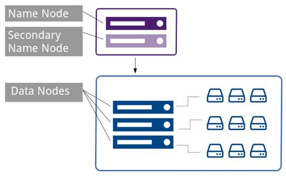
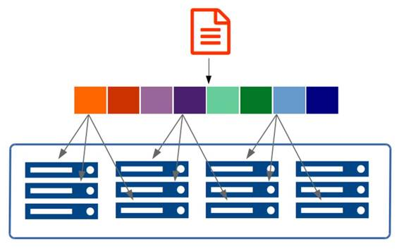
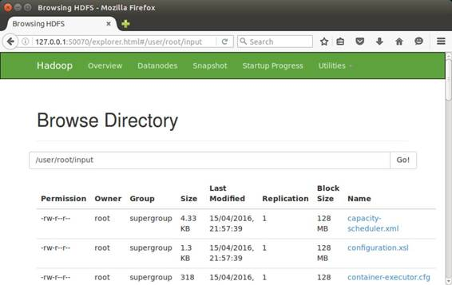

# 三、HDFS——Hadoop 分布式文件系统

HDFS 是 Hadoop 平台的存储部分，通过 HDFS，您可以获得商用硬件的可靠性和可扩展性。

商品很重要，这意味着您的 Hadoop 集群中不需要专业硬件，节点也不需要具有相同甚至相似的规格。许多 Hadoop 安装都是从一个由乞讨或借用服务器构建的集群开始，并在项目启动时用自己的高规格机器进行扩展。您可以向正在运行的集群添加新节点，同时提高存储和计算能力，而不会出现任何停机。

HDFS 内置的弹性意味着服务器可以离线，或者磁盘可以在不丢失数据的情况下发生故障，因此您甚至不需要在机器上使用 RAID 存储。因为 Hadoop 比其他计算平台更了解基础架构，所以您可以配置 Hadoop 来了解每个服务器节点位于哪个机架上。它利用这些知识来增加冗余度——默认情况下，存储在 Hadoop 中的数据在集群中复制三次。在具有足够容量的大型集群上，Hadoop 将确保其中一个副本与其他副本位于不同的机架上。

就存储而言，HDFS 是封闭系统。当您在 Hadoop 中读取或写入数据时，您必须通过 HDFS 接口来完成—由于其独特的体系结构，不支持直接连接到数据节点和从其磁盘读取文件。数据分布在许多数据节点中，但是指定哪个文件在哪个节点上的索引被集中存储。在本章中，我们将更好地了解该体系结构，并了解如何使用命令行在 HDFS 处理文件。

HDFS 采用主/从架构，其中主节点称为“名称节点”，从节点称为“数据节点”每当您在 HDFS 访问数据时，您都是通过名称节点来访问的，该节点拥有一个文件分配表的 HDFS 等价物，称为文件系统命名空间。

为了在 HDFS 写一个文件，您对名称节点进行一个 PUT 调用，它将决定数据如何存储以及存储在哪里。要读取数据，您需要对名称节点进行 GET 调用，它将确定哪些数据节点获得数据的副本，并指导您从这些节点读取数据。

名称节点是 Hadoop 的逻辑单点故障。如果名称节点不可用，您将无法访问 HDFS 的任何数据。如果名称节点不可挽回地丢失，您的 Hadoop 之旅可能就要结束了——您将拥有一组包含大量数据的数据节点，但没有名称节点能够映射数据的位置，这意味着可能无法让集群再次运行并恢复数据访问。

为了防止这种情况，Hadoop 集群有一个辅助名称节点，该节点有一个来自主名称节点的复制文件索引。辅助节点是被动节点，如果主节点出现故障，您需要手动切换到辅助节点，这可能需要几十分钟。对于停机时间不可接受的大量使用的集群，您也可以在高可用性设置中配置命名节点。

图 6 显示了一个典型的小集群配置。



 6: HDFS 建筑

对于消费者来说，Hadoop 集群是一个单一的大文件存储，文件如何物理存储在数据节点上的细节是抽象的。每个文件都有一个唯一的地址，具有 HDFS 方案和嵌套的文件夹布局，例如`hdfs://[namenode]/logs/2016/04/19/20/web-app-log-201604192049.gz`。

`hadoop`命令提供对存储和计算的访问。存储操作以`fs`(代表“文件系统”)开始，然后通常是 Linux 文件操作名称。您可以使用`hadoop fs –ls` 列出 HDFS 的所有对象。要读取一个或多个文件的内容(我们已经看到)，请使用`hadoop fs -cat`。

HDFS 是一个可以存储目录和文件的分层文件系统，它的安全模型类似于 Linux 对象有一个所有者和一个组，您可以设置对象的读、写和执行权限。

|  | 注意:Hadoop 在计算和存储的单一命令和独立命令之间摇摆不定。hdfs 命令也支持存储访问，但它提供了与 hadoop 命令相同的操作。在 Hadoop 文献中，无论你在哪里看到 hdfs dfs，你都可以用 hadoop fs 来替代它，得到同样的结果。 |

HDFS 的用户有自己的主目录，当您访问对象时，您可以指定从文件系统根目录开始的完整路径，也可以指定从主目录开始的部分路径。在代码清单 17 中，我们在根用户的主目录中创建了一个名为“ch03”的目录，并检查该文件夹是否在我们期望的位置。

 17:在 HDFS 创建目录

```java
  # hadoop fs -mkdir -p
  /user/root/ch03
  # hadoop fs -ls
  Found 1 items
  drwxr-xr-x   - root supergroup  0
  2016-04-15 16:44 ch03
  # hadoop fs -ls /user/root
  Found 1 items
  drwxr-xr-x   - root supergroup  0
  2016-04-15 16:44 /user/root/ch03

```

为了在 HDFS 存储文件，我们可以使用`put`操作，将文件从本地文件系统复制到 HDFS。如果我们使用的是`hadoop-succinctly` Docker 容器，代码清单 18 中的命令会将一些设置文件从容器的文件系统复制到 HDFS。

 18:将文件放入 HDFS

```java
  # hadoop fs -put /hadoop-setup/
  ch03
  # hadoop fs -ls ch03/hadoop-setup
  Found 3 items
  -rw-r--r--   1 root
  supergroup        294 2016-04-15 16:49 ch03/hadoop-setup/install-hadoop.sh
  -rw-r--r--   1 root
  supergroup        350 2016-04-15 16:49 ch03/hadoop-setup/setup-hdfs.sh
  -rw-r--r--   1 root
  supergroup        184 2016-04-15 16:49 ch03/hadoop-setup/setup-ssh.sh

```

使用`put`命令，我们可以复制单个文件或整个目录层次结构，这有助于快速将数据导入 Hadoop。

|  | 提示:当您在单个节点上工作时，将数据复制到 HDFS 实际上意味着将其从本地驱动器复制到同一本地驱动器上的不同位置。如果您想知道为什么必须这样做，请记住 Hadoop 天生就是分布式的。当您在单个节点上运行 hadoop fs -put 时，hadoop 只需复制文件，但对多节点集群运行相同的命令，源文件将在多个数据节点之间被分割、分发和复制。对于在 Docker 上运行的开发节点，可以使用与具有 100 个节点的生产集群完全相同的语法。 |

要将文件从 HDFS 提取到本地文件系统，请使用`get`操作。许多 HDFS 命令支持源路径的模式匹配，这意味着您可以使用通配符来匹配文件名的任何部分，并使用双星号来匹配文件夹层次结构中任何深度的文件。

代码清单 19 显示了如何在“ch03”文件夹下的任何文件夹中本地复制任何以“setup”开头且扩展名为“sh”的文件。

 19:从 HDFS 获取文件

```java
  # mkdir ~/setup
  root@21243ee85227:/hadoop-setup#
  hadoop fs -get ch03/**/setup*.sh ~/setup
  root@21243ee85227:/hadoop-setup# ls
  ~/setup/
  setup-hdfs.sh  setup-ssh.sh

```

命令行中还有很多操作可用，`hadoop fs -help`将它们全部列出。其中最有用的三个是`tail`(读取文件中最后 1KB 的数据)、`stat`(查看文件的有用统计数据，包括复制程度)和`count`(告知层次结构中有多少文件和文件夹)。

HDFS 旨在作为一次写入多次读取的文件系统，显著简化平台其余部分的数据访问。正如我们所看到的，在一个 MapReduce 作业中，Hadoop 流过输入文件，将每一行传递给一个映射器。如果文件是可编辑的，在任务执行过程中，内容可能会发生变化。已经处理的内容可能会更改或完全删除，从而使作业结果无效。

从命令行在 Hadoop 中存储数据需要三个操作:`put`操作，我们已经看到了；`moveFromLocal` `,`复制后删除本地源文件；`appendFromLocal` `,`将本地文件的内容添加到 HDFS 的现有文件中。

追加是一个有趣的操作，因为我们实际上不能在 Hadoop 中编辑数据。在早期版本的 Hadoop 中，不支持追加——我们只能在文件句柄打开时创建新文件和添加数据。一旦我们关闭了文件，它就变成了不可变的，我们不得不创建一个新的文件，并写入原始文件的内容以及我们想要添加的新数据，然后用不同的名称保存它。

HDFS 支持附加功能的能力大大扩展了它的潜力——这意味着 Apache 的实时大数据平台 HBase 可以使用 HDFS 进行可靠的存储。请注意，如果您来自关系数据库背景，仅追加似乎不是限制。通常，Hadoop 用于对记录某些东西(事件或事实)的数据进行批处理，这些数据是静态的。

您可能在 Hadoop 中有一个文件，记录了一天的金融交易——这些是一系列永远不会改变的事实，因此没有必要编辑该文件。如果交易被错误地登记，它将被重新预约，这是一个单独的事件，将被记录在另一天的文件中。

第二个事件可能会逆转第一个事件的影响，但并不意味着这个事件从未发生过。事实上，永久存储这两个事件可以实现更丰富的分析。如果您允许更新并可以编辑原始交易，您将丢失原始状态的任何记录以及它已更改的信息。

为了在不改变原始文件的情况下追加数据，HDFS 将新数据分割成块，并将它们添加到文件被分割成的原始块中。

我们在第 1 章中看到，HDFS 在存储大文件时会将它们分成块。Hadoop 发行版之间的默认数据块大小可能不同(我们可以自己为整个集群和单个文件进行配置)，但通常为 128 MB。所有 HDFS 读写操作都在块级别工作，最佳的块大小可以提供有用的性能提升。

然而，正确的数据块大小是一种折衷，它必须平衡一些相互冲突的目标:

*   名称节点存储内存中每个文件块的元数据项；更小的块大小导致明显更多的块和更高的元数据存储。
*   作业任务在块级别运行，因此具有非常大的块意味着系统会被长时间运行的任务阻塞。拥有更小的块可能意味着加速和管理任务的成本超过了拥有更大并行性的好处。
*   数据块也是复制级别，因此数据块越小，意味着集群中要分布的数据块越多。更大程度的分布会降低调度任务在本地保存数据的节点上运行的机会。

块大小是 Hadoop 配置的一部分，您可以根据自己的需求进行调整。如果您通常运行输入非常大的作业(运行超过万亿字节的数据)，设置更大的块大小可以提高性能。256 兆字节甚至 512 兆字节的块大小对于较大的工作负载来说并不罕见。

我们可以为集群或单个文件更改的另一个参数是复制程度。图 7 显示了 1 GB 文件中的一些拆分如何分布在具有 12 个数据节点的集群中。



 7: HDFS 文件拆分和复制

默认数据块大小为 128 MB，默认复制因子为 3，HDFS 会将文件拆分为八个数据块，每个数据块将被复制到三个服务器:两个在一个机架上，第三个在不同的机架上。如果您提交一个查询整个文件的作业，它将被分成八个任务，每个任务处理文件的一个块。

在本例中，数据节点比作业中的任务多。如果集群处于空闲状态，Hadoop 可以调度每个任务，使其在本地拥有数据块的服务器上运行。然而，这是最好的情况。

如果群集没有空闲，或者您有少量数据块的文件，或者如果服务器中断，则很有可能必须在不将数据保存在本地的节点上安排任务。从同一个机架中的另一个节点读取数据，或者更糟糕的是，从不同机架中的节点读取数据，可能比从本地磁盘读取慢几个数量级，这意味着任务将需要更长的时间来运行。

HDFS 允许您更改复制因子，但最佳值也是冲突目标之间的折衷:

*   更高的复制系数意味着数据块被复制到更多的数据节点，增加了在本地拥有数据的节点上调度任务的机会。
*   对于相同数量的原始数据，更多的复制意味着更高的磁盘消耗。在 HDFS，10 GB 文件将占用 30 GB 磁盘空间，复制因子为 3，但 50 GB 文件的复制因子为 5。

在针对您自己的数据环境调整 Hadoop 时，块大小和复制因子是需要考虑的有用参数。

在 HDFS，Hadoop FS shell 是开始数据访问的最简单方法，但是对于严重的工作负载，您通常会以编程方式写入数据。HDFS 支持用于编程访问的 Java 应用编程接口和 REST 应用编程接口。HDFS 内置了网络用户界面，你可以用它来探索文件系统。

网络用户界面运行在端口 50070 的名称节点上(默认情况下)。该端口由`hadoop-succinctly` Docker 容器公开，这意味着您可以浏览到`http://127.0.0.1:50070/explorer.html`(如果您使用的是 Mac 或 Windows，请用 Docker VM 的 IP 地址替换 127.0.0.1)。图 8 显示了存储浏览器的外观。



8:HDFS 探险家

从浏览器中，您可以浏览 HDFS 的目录，查看文件的块信息，并下载整个文件。这是一个导航 HDFS 的有用工具，特别是因为它是只读的，所以网络用户界面可以给那些没有其他途径访问 Hadoop 的用户。

在这一章中，我们详细了解了 Hadoop 分布式文件系统 HDFS。我们了解了 HDFS 的体系结构，它有一个保存集群中所有文件元数据的活动名称节点，以及多个实际存储数据的数据节点。

我们开始使用`hadoop fs`命令行从 HDFS 读取和写入数据，我们了解了 HDFS 如何将大文件分割成块，并跨多个数据节点复制这些块，以便为 MapReduce 任务提供弹性并实现高水平的并行性。我们还了解到，数据块大小和复制因子是可配置的参数，您可能需要调整这些参数才能获得最佳性能。

最后，我们简单地看了一下 Hadoop 管理网络用户界面中的 HDFS 浏览器。Hadoop 中还有其他由嵌入式 HTTP 服务器提供的用户界面，我们将在后面的章节中看到。

接下来，我们将研究 Hadoop 的另一部分——资源协商器和计算引擎。