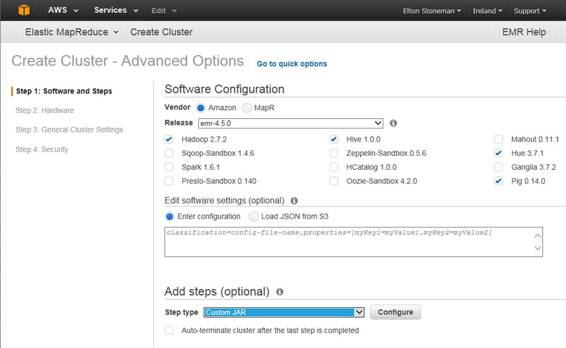

# 七、Hadoop 发行版

随着 Hadoop 在企业中变得越来越普遍，围绕 Hadoop 的商业生态系统也在持续增长。Hadoop 的商业发行版通常将核心平台与其他大数据技术捆绑在一起，旨在为整个数据分析环境提供一个单一、易于使用的平台。

商业上可获得的发行版分为两种选择——我们在内部部署并按支持订阅或产品成本付费的打包解决方案，以及在云中运行并按我们使用的集群和存储的每小时(或每分钟)计算成本付费的托管解决方案。

在本章中，我们将看看主要的 Hadoop 发行版，看看它们与核心 Apache 产品相比提供了什么，以及它们如何在市场中脱颖而出。

Cloudera 是 Hadoop 的第一个商业提供商，其首席执行官 Doug Cutting 是 Hadoop 最初项目的创始人。包括 Apache Hadoop (CDH)在内的 Cloudera 发行版是基于核心的 HDFS 和纱框架的打包 Hadoop 安装，它还包括 Hadoop 生态系统中的广泛工具选择，包括 HBase 和 Hive。

与其他发行版相比，Cloudera 的主要区别在于它采用 Hadoop 领域新开发的速度。Cloudera 工程师积极参与 Apache 大数据项目，公司很乐意将早期技术推广到其平台中。

作为历史最悠久的商业 Hadoop 提供商，拥有数百个大规模客户部署，Cloudera 在配置 Hadoop 方面拥有丰富的经验，Cloudera Enterprise 附带的默认配置更适合大型部署，并且比标准 Hadoop 安装需要更少的调整。

CDH 是免费的，但商业产品 Cloudera Enterprise 增加了支持和附加功能，例如主动监控您的 Hadoop 集群，并将其与其他客户的集群进行比较。Cloudera 利用这种洞察力来支持其预测性维护组件，该组件可以在节点出现严重问题之前提醒您。

MapR 对其 Hadoop 安装采取了非常不同的方法，使用自己的组件来提供优化的分发，而不是打包纯 Apache 组件。核心是，他们的产品使用与 HDFS 二进制兼容的定制存储层，但实现方式不同。

文件系统 MapR-FS 公开了一个网络文件系统(NFS)接口，因此客户端可以作为映射驱动器连接到存储层，但它与 HDFS 兼容。文件系统使用分布式主存储作为元数据存储，这意味着它可以扩展到比 HDFS 更大的大小，并且没有相同的单点故障。

MapR 发行版捆绑了生态系统中的其他关键工具，但通常会对它们进行返工和重塑，因此大数据规模的队列技术 MapR Streams 与 Apache Kafka 兼容，对于实时访问，MapR-DB 与 HBase 兼容。

所有的 MapR 定制组件都与它们的 Apache 版本兼容，但是它们是针对企业级的性能和规模进行调整的。MapR 有自己的管理门户，即 MapR 控制系统，它允许您配置系统以及监控节点和获取警告警报。

Hortonworks 提供了最忠实于 Hadoop 的商业发行版。所有包含的组件都是官方的 Apache 版本，这意味着 Hortonworks 数据平台(HDP)产品主要是打包、配置和支持开源组件。

开源社区从 Hortonworks 的方法中受益匪浅。当其产品出现缺口时，Hortonworks 没有构建专有组件，而是加大了对 Apache 项目的支持，甚至收购了其他公司，并将该技术捐赠给 Apache。围绕 Hadoop 的两个关键开源工具是通过 Hortonworks——用于集群管理的 Ambari 和用于保护 Hadoop 的 Ranger。

Hortonworks 数据平台使用 Apache Ambari 来配置和监控集群(我们将在第 8 章中看到)，打包的产品包括 HBase、Spark、Hive 等。通常情况下，Hortonworks 在采用新版本方面比 Cloudera 稍微保守一些，因此 HDP 的组件版本可能落后于 Cloudera(在撰写本文时，Cloudera 的 CDH 5.7 捆绑了 HBase 1 . 2 . 0 版本，而 HDP 2.4.0 有 HBase 1.1.2 版本)。

HDP 不同于其他领先的发行版，因为它提供了一个运行在微软视窗系统上的变体。尽管 Hadoop 是基于 Java 的，并且在技术上独立于平台，但目前绝大多数部署都运行在 Linux 平台上。与 HDP 一起，霍顿工程公司提供了一个版本的 Hadoop，将吸引现在考虑 Hadoop 的许多微软客户。

Syncfusion 的大数据平台对市场来说是一个相对较新的平台，但它有一些关键的独特之处，使其成为一个有吸引力的选择。首先，它是 Windows 原生的，这意味着它是专门为支持微软技术而构建的 Hadoop 版本。

大数据平台允许您作为单个节点运行，或者连接到本地或云中运行的集群。该平台附带了一个定制的管理门户，可以让您向 Hadoop 提交不同类型的作业，并且分发包括用 C#编写的示例作业，以便微软。NET 成为一等公民。

Syncfusion 平台的一部分是大数据工作室，它为您导航 Hadoop 和生态系统的其他部分提供了一个很好的前端——我们在图 19 中看到了在工作室中运行字数查询的结果。

 19: Syncfusion 的大数据工作室

同样值得一提的是 Pivotal 和 IBM，Pivotal 的高清发行版随着 HBD 的扩展而扩展，旨在使 SQL 成为 Hadoop 体验的本地部分，IBM 具有深度集成，从其大洞察 Hadoop 平台到其“大”堆栈的其余部分。

亚马逊提供了一个在云中运行的打包的 Hadoop 发行版——亚马逊弹性地图缩减(EMR)。EMR 将亚马逊的 S3 用于存储层(而不是 Hadoop)，并使用弹性计算云(EC2)进行供应计算。这与微软在 Azure 云中使用的方法相同。基于云的 Hadoop 部署的主要考虑因素是，您失去了数据局部性的优势，尽管您可以通过扩展获得优势，因为您能够轻松添加或删除计算节点，并且拥有几乎无限的存储容量。

使用 EMR，您可以从一些预配置的选项(包括 Hive 或 Spark)中调配集群，并且您可以指定将自定义组件作为部署的一部分进行安装。亚马逊还提供托管的 MapR 发行版以及自己的 Hadoop 捆绑包。图 20 显示了通过 AWS 管理控制台创建新的 EMR 集群。

 20:创建弹性地图缩减集群

运行构成群集计算部分的虚拟机将按小时收费，而存储在 S3 的所有数据将按千兆字节收费。

这是基于云的大数据平台的主要优势之一。如果不需要全天候运行作业，可以在需要时调配集群，运行批处理作业，然后删除集群。您的所有数据都保存在廉价的对象存储中，但昂贵的计算能力仅在您需要时使用。当您需要时，也可以很容易地进行扩展—如果您需要添加更多作业而不延长整体运行时间，您可以简单地更改您的资源调配脚本来创建一个更大的集群。

基于云的 Hadoop 发行版也很容易与提供商堆栈的其他部分集成，这是另一个优点。AWS 和 Azure 都提供了托管云规模的队列技术，适合从不同的来源接收大量数据，以及可扩展的计算框架，您可以使用这些框架从队列中提取数据并存储在对象存储中，以便以后在 Hadoop 中查询。

微软 Azure Cloud 上被称为 HDInsight 的托管大数据堆栈实际上是由 Hortonworks 数据平台提供支持的，您可以基于 Windows 或 Linux 虚拟机加速集群。HDInsight 群集使用 Azure Storage 而不是 HDFS，计算节点在 Azure 虚拟机上运行，其中群集是虚拟网络的一部分。

您可以使用 PowerShell 或跨平台命令行界面或 Azure 门户管理 HDInsight 集群。图 21 显示了调整集群大小的门户屏幕。

 21:扩展 HDInsight 集群

HDInsight 对 EMR 采取了类似的方法，但它不配置要添加到集群中的组件，而是只允许您从预配置的集群设置中进行选择。在当前平台中，您可以从运行 Storm(用于流处理)、HBase(用于实时数据访问)或 Spark(用于快速内存分析)的集群中部署普通 Hadoop 集群。因为存储层和计算层是断开的，所以您可以运行多个群集，这些群集都可以访问同一个共享存储。

虽然 HDInsight 基于开源的 HDP 平台，但微软在客户端提供定制。Azure SDK 与 Visual Studio 集成，可以在集成开发环境中进行监控和部署。NET 和 PowerShell 包来支持开发。

与 AWS 一样，您可以利用 Azure 的其他部分将数据馈送到对象存储中，并使用集群进行查询。此外，Azure 还提供了数据工厂服务，让您可以编排整个运行手册，包括启动 Hadoop 集群、提交作业、等待作业完成以及删除集群。但是，对于任何云服务，您都需要知道 PaaS 组件通常是专有的，因此如果您依赖它们，您会发现很难迁移到不同的平台。

Hadoop 的采用可以是业务驱动的，来自希望从其数据中获取更多价值的利益相关者，也可以是技术驱动的，来自希望利用其已知数据的工程师。通常，有一个原型阶段，您将在本地安装中使用 Hadoop，在纯 Hadoop 上运行该阶段是一个好主意，这样您就可以开始了解运行自己的集群的能力和缺点。该阶段的输出应该帮助业务用户决定潜在的回报是否证明支出是合理的。

接下来，您需要在内部安装或在云中运行之间做出选择。云提供了一个廉价起步的好方法。您不会产生前期成本和构建时间来调配您自己的群集—您可以在 30 分钟内启动云群集。如果您的数据来源于云(来自您自己网络之外的全球客户端)，那么在云中捕获和存储这些数据是很有意义的。最初，当您需要运行批处理作业时，您可以兼职运行集群，并且您的运营成本将最小。

然而，云计算有一个关键点，当经济逆转时，内部运行集群会变得更便宜。如果您在云中全天候运行一个相对较大的 Hadoop 集群，并将大量数据存储在对象存储中，您的云成本很容易达到每月 5000 美元。虽然 5K 美元可以为您购买一个非常明确的计算节点，但是一年之后，您可能会发现您的云成本相当于拥有自己的小型集群，尽管请记住，您的内部部署集群会有自己的运行和管理成本。

如果您计划在本地运行，并考虑最小 Hadoop 集群之上的任何东西，那么商业发行版值得投资。所有平台都有强大的产品，并且很可能为您提供一个更可靠、更高效、更易于管理的集群，这是您花同样的钱从纯 Apache 平台建立自己的集群所无法实现的。

最终，平台的选择通常是由成本驱动的，但是当您做出决定时，您应该深入研究所有潜在的成本。购买自己的套件似乎比支付云平台的持续价格更便宜，但是如果您需要每六个月升级一次集群，增加 100 TB 的存储和另外五个计算节点，成本节约可能是虚幻的。

在这一章中，我们看了运行 Hadoop 的商业选择。尽管 Hadoop 是一个完全开源的平台，但它是一个具有多个活动部分的复杂产品，许多企业不喜欢在没有商业支持的情况下依赖它。打包的 Hadoop 发行版和托管的 Hadoop 平台抓住了这个商业机会。

在打包领域，主要参与者是 Cloudera、MapR 和 Hortonworks。每个平台都采用不同的方法，但是它们的产品有很多共性，所以如果您打算在内部运行，那么了解这些平台是值得的。商业市场也在扩大，Pivotal、Syncfusion 和 IBM 等进入者的更新产品提供了自己的优势。

如果您没有基于 Hadoop 的明确的长期数据路线图，那么基于云的平台可能是更好的选择，尤其是在您刚起步的时候。亚马逊和微软都提供功能丰富、定价高效的大数据平台。数据和计算是分开计费的，因此如果您可以将所有批处理作业分组到一次运行中，您可以启动一个集群来完成所有作业，然后关闭它，这意味着您只需在集群实际运行时支付昂贵的计算成本。

无论您选择哪个选项，都要注意产品偏离标准 Hadoop 堆栈的地方。如果您将自己的投资集中在核心 Hadoop 功能(或与 Hadoop 100%兼容的功能)上，并且不依赖任何专有技术，那么如果您以后选择这样做，您将很有可能转向不同的发行版。