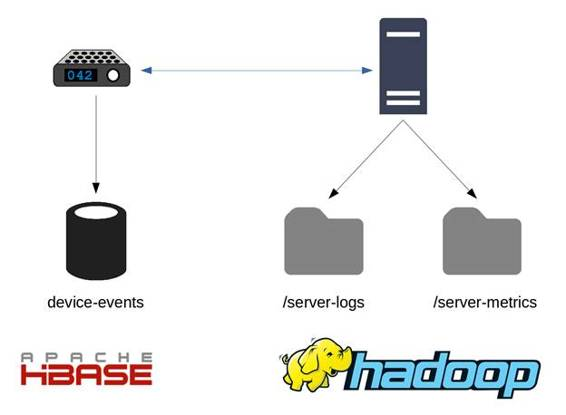
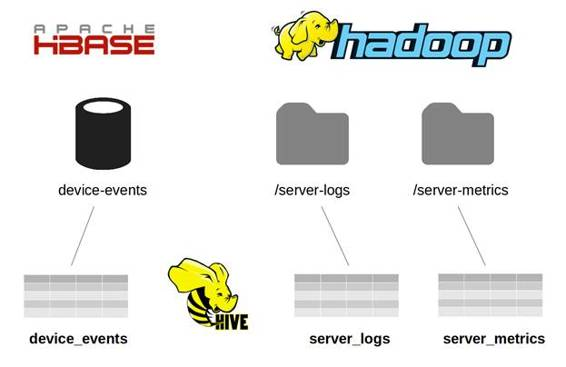

Hive 是大数据的数据仓库。它允许您在 Hadoop 中获取非结构化的可变数据，应用固定的外部模式，并使用类似于 SQL 的语言查询数据。Hive 抽象了 Hadoop 中编写和运行 map/reduce 作业的复杂性，为大数据提供了一个熟悉且可访问的界面。

Hadoop 是最流行的存储和处理大量数据的框架。它运行在一个机器集群上，规模最大的是运行在数千台服务器上的 Hadoop 部署，存储了数千兆字节的数据。使用 Hadoop，您可以使用作业查询数据，这些作业可以分解成任务并分布在集群中。这些映射/缩减任务很强大，但是它们很复杂，即使对于简单的查询也是如此。

Hive 是源自脸书的 Apache 开源项目。它的建立是为了解决让来自各种技术背景的数据科学家能够获得千兆字节数据的问题。脸书团队没有用 map/reduce 和 Java、Scala 或 Python 来培训每个人，而是认识到 SQL 已经是一种常见的技能，因此他们设计了 Hive 来提供一个超越 Hadoop 的 SQL 门面。

Hive 本质上是 HiveQL 之间的适配器，Hive 查询语言基于 SQL 和 Hadoop 数据源。您可以向 Hive 提交一个查询，如 SELECT * FROM people，它将生成一个批处理作业来处理该查询。根据来源的不同，Hive 生成的作业可以是在 Hadoop 中运行许多文件的映射/缩减，也可以是在 HBase 表中运行的 Java 查询。

Hive 允许您跨多个数据源进行连接，这样您既可以写入数据，也可以读取数据。这意味着您可以运行复杂的查询，并以简化的格式保存结果，以便可视化。可以使用各种客户端访问 Hive，这使得它很容易集成到您现有的技术环境中，Hive 与其他大数据技术(如 HBase 和 Spark)配合良好。

在本书中，我们将学习 Hive 如何工作，如何在 Hive 中映射 Hadoop 和 HBase 数据，以及如何在 HiveQL 中编写复杂的查询。我们还将研究使用多种语言在 Hive 查询中运行自定义代码。

Hive 是大数据之上的 SQL 门面，它适合一系列用例，从映射需要特定查询功能的数据的特定部分到映射整个数据空间进行分析。图 1 显示了数据如何存储在物联网解决方案中，其中来自设备的数据记录在 HBase 中，服务器端的指标和日志存储在 Hadoop 中。



图 1:具有多个存储源的大数据解决方案

如图 2 所示，这个空间可以映射为 Hive 中的三个表:device_metrics、server_metrics 和 server _ logs。请注意，虽然源文件夹和表名有连字符，但在 Hive 中不支持，这意味着设备事件变成了 device_events。



图 2:用 Hive 映射多个源

您可以通过查询 device_metrics 表来运行组，从而找到一段时间内最活跃的设备。在这种情况下，Hive 将使用提供实时数据访问的 HBase 驱动程序，您可以期待快速响应。

如果您想将服务器错误与 CPU 使用相关联，您可以在 server_metrics 和 server_logs 表中加入。日志条目可以以制表符分隔的变量(TSV)格式存储，度量可能在 JSON 中，但是 Hive 将抽象这些格式，使您能够以相同的方式查询它们。这些文件存储在 Hadoop 分布式文件系统(HDFS)中，这意味着 Hive 将以映射/缩减作业的形式运行它们。

Hive 不仅抽象了数据的格式，还抽象了存储引擎，这意味着您可以跨多个数据存储进行查询。如果 CSV 文件中有所有已知设备标识的列表，您可以将其上传到 HDFS，并在 device_metrics HBase 表和 device_ids CSV 文件上编写外部连接查询，以便查找在一段时间内没有发送任何度量的设备。

我们将在第 9 章使用 HiveQL 查询中更仔细地研究这些类型的查询。

Hive 通常运行在现有的 Hadoop、HBase 或 Spark 集群上，这意味着您不需要额外的基础架构来支持它。相反，它提供了在现有计算机上运行作业的另一种方式。

Hive 的 metastore 是 Hive 用来将表定义与它映射的数据源分开存储的数据库，它是 Hive 唯一的重要开销。然而，metastore 可以是一个嵌入式数据库，这意味着运行 Hive 来公开一小部分表的成本是合理的。您将会注意到，一旦引入 Hive，它将显著简化大数据访问，并且其使用将会增长。

我使用了很多来自 SQL 的术语，比如表和查询、连接和分组。HiveQL 大多符合 SQL-92，因此大多数 Hive 概念都是基于用表和视图建模数据的 SQL 概念。

然而，Hive 并不支持 SQL 数据库中所有可用的构造。没有主键或外键，这意味着您不能在 Hive 中显式映射数据关系。Hive 确实支持表、索引和视图，其中表是对源数据的抽象，索引是对查询的性能提升，视图是对表的抽象。

SQL 和 Hive 中表的主要区别在于数据的存储和访问方式。SQL 数据库使用自己的存储引擎，并在内部存储数据。例如，MySQL 数据库中的一个表存储在该 MySQL 实例使用的物理文件中，而 Hive 可以使用多个数据源。

Hive 可以使用内部表来管理存储，但是它也可以使用表来映射外部数据源。您为外部表创建的定义告诉 Hive 在哪里找到数据以及如何读取数据，但是数据本身是由另一个系统存储和管理的。

内部表在 Hive 中定义，并由 Hive 进行物理管理。当查询内部表时，Hive 通过从自己的托管存储中读取来执行查询。我们将在第 3 章内部配置单元表中看到配置单元如何以及在哪里存储内部表的数据。

为了在 Hive 中定义一个内部表，我们使用标准的从 SQL 创建表语法，指定列详细信息——名称、数据类型和任何其他相关属性。代码清单 1 显示了一个有效的语句，它将创建一个名为 server _ log _ summaries 的表。

代码清单 1:创建内部表

```
  CREATE TABLE IF NOT EXISTS
  server_log_summaries
  ( 
        period STRING,
        host STRING,
        logLevel STRING,
        count INT
  )

```

该语句创建了一个内部 Hive 表，我们可以用它来记录服务器日志的摘要。这样，原始数据将保存在外部 HDFS 文件中，概要表保存在 Hive 中。因为代码清单 1 的语句是标准的 SQL，所以我们可以在 Hive 或 MySQL 上运行它。

外部表是在 Hive 中定义的，但是它们是在 Hive 之外进行物理管理的。将外部表视为另一个数据源的逻辑视图——当我们定义外部表时，Hive 会记录映射，但不会复制任何源数据。

当我们查询外部表时，Hive 会将查询转换为数据源的相关 API 调用(映射/减少作业或 HBase 调用)，并将查询安排为 Hadoop 作业。作业完成后，输出以配置单元表定义中指定的格式呈现。

外部表是用 create external table 语句定义的，该语句的语法与内部表相似。但是，Hive 还必须知道数据位于何处，数据是如何存储的，以及行和列是如何分隔的。代码清单 2 显示了一个在 HDFS 文件上创建外部表的语句。

 2:创建外部表

```
  CREATE EXTERNAL TABLE server_logs 
  (
        serverId STRING, 
        loggedAt BIGINT,
        logLevel STRING,
        message STRING
  )
  STORED AS TEXTFILE 
  LOCATION '/server-logs';

```

此语句在标准的 SQL 数据库中会失败，因为我们给 Hive 提供了额外的属性来设置映射:

*   外部表—指定数据存储在配置单元之外。
*   存储为文本文件—指示外部数据的格式。
*   位置—显示数据实际存储在 HDFS 的文件夹位置。

默认情况下，Hive 将假设文本文件是分隔格式，使用 ASCII 字符\001 (ctrl-A)作为字段分隔符，新的行字符作为行分隔符。正如我们将在第 3 章“内部配置单元表”中看到的，我们可以明确指定要使用的分隔符(例如，CSV 和 TSV 格式)

当我们查询数据时，Hive 会将文件中的每一行映射为表中的一行，对于每一行，它会按顺序映射字段。在第一个字段中，它将期待一个字符串作为服务器标识值，在下一个字段中，它将期待一个长时间戳值。

Hive 中的映射是健壮的，这意味着源中的任何空白字段都将在行中显示为空。映射字段后的任何附加数据都将被忽略。当您查询表时，将返回包含无效数据(字段数量不完整或字段格式无效)的行，但仅填充可映射的字段。

Hive 中的视图的工作方式与 SQL 数据库中的视图完全相同——它们提供了对表的投影，以便给出常用字段的子集或使用更友好的映射公开原始数据。

在 Hive 中，视图对于将客户端从底层数据存储中抽象出来特别有用。例如，一个 Hive 表可以映射一个 CSV 文件的 HDFS 文件夹，并且它可以提供一个提供对该表的访问的视图。如果所有客户端都使用视图来访问数据，我们可以在不影响客户端的情况下更改底层存储引擎和数据结构(前提是我们可以更改视图并从新结构中映射它)。

因为视图是对表的抽象，并且因为表定义是使用 Hive 的自定义属性的地方，所以 Hive 中的 create view 语句与 SQL 数据库中的相同。我们为视图和 select 语句指定一个名称，以便提供数据，这些数据可以包含用于更改格式的函数，并且可以跨表连接。

与 SQL 数据库不同的是，Hive 中的视图永远不会具体化。底层数据始终保留在原始数据源中，不导入 Hive，视图在 Hive 中保持静态。如果创建视图后基础表结构发生变化，视图不会自动刷新。

代码清单 3 在 server_logs 表上创建了一个视图，其中 UNIX 时间戳(代表自 1970 年 1 月 1 日以来的秒数的长值)被公开为一个日期，可以使用内置的 HiveQL 函数 FROM_UNIXTIME 读取该日期。日志级别用 CASE 语句映射。

 3:创建视图

```
  CREATE VIEW server_logs_formatted 
  AS
  SELECT 
   serverId, 
   FROM_UNIXTIME(loggedat,
  'yyyy-MM-dd'),
   CASE logLevel 
    WHEN 'F' THEN 'FATAL' 
    WHEN 'E' THEN 'ERROR' 
    WHEN 'W' THEN 'WARN'
    WHEN 'I' THEN 'INFO'
   END,
   message
  FROM server_logs

```

Hive 为使用数据库提供了各种客户端选项，包括用于提交查询的 REST API 和用于连接 SQL IDEs 或电子表格的 ODBC 驱动程序。我们将在本书中使用的最简单的选项是命令行——称为 Beeline。

代码清单 4 使用了 Beeline，显示了从 server_logs 表和 server_logs 格式的视图中提取的同一行，视图应用了使数据更友好的函数。

 4:使用直线从表和视图中读取

```
  > select * from server_logs
  limit 1;
  +-----------------------+-----------------------+-----------------------+--
  | server_logs.serverid  | server_logs.loggedat 
  | server_logs.loglevel  | server_logs.message  |
  +-----------------------+-----------------------+-----------------------+--
  | SCSVR1                | 1453562878           
  | W                     | edbeuydbyuwfu        |
  +-----------------------+-----------------------+-----------------------+--
  1 row selected (0.063 seconds)

  > select * from server_logs_formatted
  limit 1;
  +---------------------------------+----------------------------+-----------
  | server_logs_formatted.serverid  |
  server_logs_formatted._c1  | server_logs_formatted._c2  |
  server_logs_formatted.message  |
  +---------------------------------+----------------------------+-----------
  | SCSVR1                          |
  2016-01-23                 | WARN                       |
  edbeuydbyuwfu                  |
  +---------------------------------+----------------------------+-----------

```

从概念上讲，Hive 索引与 SQL 索引相同。它们提供了对现有表中数据的快速查找，这可以显著提高查询性能，并且它们可以在内部或外部表上创建，为我们提供了一种对 HDFS 或 HBase 数据中的键列进行索引的简单方法。

Hive 中的索引是作为一个单独的内部表创建的，并从我们重建索引时 Hive 运行的映射/缩减作业中填充。没有自动后台索引重建，这意味着当数据发生变化时，必须手动重建索引。

将索引显示为普通表允许我们直接查询它们，或者我们可以查询基表并让 Hive 编译器找到索引并优化查询。

代码清单 5 显示了一个正在创建的索引，然后填充到 system_logs 表的 serverId 列中(显示了一些直线输出)。

 5:创建和填充索引

```
   > create index
   ix_server_logs_serverid on table server_logs (serverid) as 'COMPACT' with
   deferred rebuild;
   No rows affected (0.138
   seconds)
  > alter index
   ix_server_logs_serverid on server_logs rebuild;
   …
  INFO  : The
   url to track the job: http://localhost:8080/
  INFO  : Job
   running in-process (local Hadoop)
  INFO  :
   2016-01-25 07:30:48,507 Stage-1 map = 100%,  reduce = 100%
  INFO  :
   Ended Job = job_local1186116405_0001
  INFO  :
   Loading data to table default.default__server_logs_ix_server_logs_serverid__
   from file:/user/hive/warehouse/default__server_logs_ix_server_logs_serverid__/.hive-staging_hive_2016-01-25_07-30-46_971_7660660875879129827-1/-ext-10000
  INFO  :
   Table default.default__server_logs_ix_server_logs_serverid__ stats:
   [numFiles=1, numRows=3, totalSize=142, rawDataSize=139]
  No rows
   affected (1.936 seconds)

```

虽然 CREATE INDEX 语句与 SQL 大体相同，指定了要索引的表和列名，但它包含两个附加子句:

*   ‘COMPACT’—Hive 支持插件索引引擎，这意味着我们可以使用 COMPACT 索引，适用于索引具有许多值的列，或者使用 BITMAP 索引，这对于具有较小重复值集的列更有效。
*   延迟重建—如果不这样做，将在运行 CREATE INDEX 语句时填充索引。推迟重建意味着我们可以稍后使用 ALTER INDEX … REBUILD 语句填充索引。

与在 SQL 数据库中一样，索引可以极大地提高性能，但是它们确实会增加用于索引表的存储开销以及重建索引所需的时间和计算。

本章对 Hive 的概述阐述了如何从标准 SQL 中借用关键概念，并展示了 Hive 如何通过将不同的数据源映射为可以进一步抽象为视图的表来提供对 Hadoop 数据的抽象。

我们已经看到了一些用于定义表、视图和索引的简单 HiveQL 语句，并且注意到查询语言是基于 SQL 的。只有当 Hive 需要支持附加功能时，例如为外部表指定数据位置时，HiveQL 才偏离标准 SQL。

在下一章中，我们将开始运行 Hive 并使用 HiveQL 和命令行执行查询。