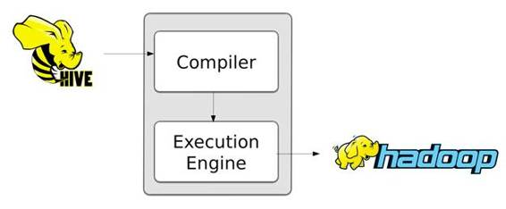

因为 Hive 自然位于 Hadoop 的其他部分旁边，所以它通常与现有集群一起运行。对于非生产环境，Hadoop 可以在本地或伪分布式模式下运行，Hive 可以向 Hadoop 提交作业，这意味着它将使用任何配置的运行时。

Hive 通常通过向 Hadoop 发送作业来执行查询，或者使用原始的映射/缩减引擎，或者现在更常见的是使用 Hadoop 2 中的作业管理框架“另一个资源协商器”。Hive 可以使用自己的 Java 虚拟机(JVM)在本地运行较小的查询，而不是向集群提交作业。这在开发查询时非常有用，因为我们可以在数据子集上快速运行查询，然后将整个作业提交给 Hadoop。

建立一个生产性的 Hadoop 集群不是一件小事，但是在云中，我们可以很容易地配置来自主要提供商的 Hadoop 集群来包含 Hive。默认情况下，微软 Azure 中的所有 HDInsight 集群类型都安装了 Hive，这意味着它可以作为 Hadoop、HBase 或 Storm 集群的一部分运行，无需额外配置。当使用亚马逊的弹性地图缩减时，您需要在创建集群时将 Hive 指定为一个选项。

Hive 是一个 Java 系统，安装起来并不复杂，但是 Hadoop 必须已经在你的机器上设置好了。运行 Hive 进行开发和测试的最简单方法是使用 Docker，在本章中，我们将使用我在 Docker Hub 上发布的一个图像来帮助您开始使用 Hive。

Hive 是 Hadoop 堆栈中相对容易安装的部分。它是一个只有几个选项的 Java 组件，安装在现有的 Hadoop 节点上。

对于单节点开发或测试环境，您应该先安装 HDFS，然后再安装 Hive。在这两种情况下，您只需下载最新的 tarball 并提取它。Hive 的运行时行为可以从 hive-site.xml config 文件中指定的各种设置中进行更改，但这些更改大多是可选的。

因为 Hive 在 HDFS 存储自己的数据，所以您需要使用 hdfs dfs 设置它预期使用的文件夹和必要的权限，如代码清单 6 所示。

 6:在 HDFS 创建配置单元文件夹

```
   hdfs dfs -mkdir -p /tmp
   hdfs dfs -mkdir -p
   /user/hive/warehouse
   hdfs dfs -chmod g+w
   /tmp
   hdfs dfs -chmod g+w
   /user/hive/warehouse

```

|  | 注意:完整的安装步骤在这里的 Apache Hive Wiki 中提供:[https://cwiki . Apache . org/converge/display/Hive/AdminManual+Installation](https://cwiki.apache.org/confluence/display/Hive/AdminManual+Installation)。或者你可以在 GitHub 上看到简洁配置单元图像的 Dockerfile 中捕获的步骤:[https://GitHub . com/six eyes/hive-简洁/tree/master/docker](https://github.com/sixeyed/hive-succinctly/tree/master/docker) 。 |

## 在码头集装箱中运行蜂巢

Docker 容器非常适合在您学习新技术时进行实验。您可以用很少的开销加速和终止实例，并且您不需要担心任何软件或服务与您的开发机器冲突。

Docker 是一个跨平台的工具，这意味着你可以在 Windows、OS/X 或 Linux 上运行，安装也相对简单。您可以按照[http://docker.com](http://docker.com/)的说明进行操作。除了运行时之外，Docker 还有一个公共的图像注册中心，Docker Hub，在这里您可以发布和共享自己的图像，或者拉取其他人共享的图像。

Docker Hub 上简洁的图像配置单元是我特意为这本书准备的。它附带了已经安装和配置好的 Hive，并且该映像还预载了您可以用来尝试查询的示例数据。要运行该映像，请安装 Docker 并执行代码清单 7 中的命令。

 7:在 Docker 中运行 Hive

```
  docker run -d --name hive -h hive \
   –p 8080:8080 –p 8088:8088 –p
  8042:8042 –p 19888:19888 \
   sixeyed/hive-succinctly

```

docker run 命令中的一些设置是可选的，但是如果您想按照本书中的示例进行编码，您需要运行完整的命令。如果您不熟悉 Docker，下面是命令功能的简短列表:

*   从公共 [Docker Hub](https://hub.docker.com/r/sixeyed/hive-succinctly) 中的六眼存储库中提取名为 hive-简洁的图像。
*   在本地容器中运行图像，并为配置单元网络用户界面公开所有关键端口。
*   命名图像配置单元，允许您用其他 Docker 命令控制它，而不知道 Docker 将分配的容器 ID。
*   为映像提供主机名配置单元，允许您使用该名称访问它。

第一次运行该命令时，将映像从注册表中提取到本地计算机需要一点时间，但是在以后的运行中，容器将在几秒钟内启动，您将在一个容器中运行 Hive，所有服务器端口都暴露在外。

|  | 注意:Hive-简洁的图像使用 Hive 1.2.1 和 Hadoop 2.7.2。它将保持这些版本，这意味着您可以使用精确的版本运行本书中的代码示例。该映像以伪分布式模式运行 Hadoop 尽管启动很快，但服务器可能需要几分钟时间才能联机并使 Hive 可用。 |

Hive 有两个命令行界面——原始的 Hive 命令行界面和更新的替代界面 Beeline。Hive CLI 是一个特定于 Hive 的工具，不支持远程连接，这意味着它必须从 Hive 主节点运行。这一限制，以及与长时间运行的查询相关的问题，意味着最初的命令行界面已经被 Beeline 取代。尽管使用 Hive CLI 有一些好处，但我们将在本书中重点介绍 Beeline。

Beeline 是开源的 [SQLLine](http://sqlline.sourceforge.net/) JDBC 命令行客户端的扩展，这意味着您可以远程运行它并连接到 Hive，就像连接到任何其他符合 JDBC 标准的服务器一样。

如果您运行的是 hive-简洁地说是 Docker 容器，代码清单 8 中的命令会将您连接到 Hive 容器并启动 Beeline 客户端。

 8:在 Docker 中开始直线

```
  docker exec -it hive beeline

```

使用 Beeline，标准的 HiveQL 查询被发送到服务器，但是对于内部命令(例如连接到服务器)，您将使用不同的语法，并以感叹号作为前缀。代码清单 9 显示了如何作为用户根连接到运行在本地机器上端口 10000 的 Hive 服务器。

 9:从直线连接到蜂箱

```
  !connect
  jdbc:hive2://127.0.0.1:10000 -n root

```

连接后，您可以发送 HiveQL 语句并从服务器上查看结果。在代码清单 10 中，我从 server_logs 表中选择了第一行，该表已经在 Docker 映像中创建和填充。

 10:直线运行查询

```
  > select * from server_logs
  limit 1;
  +-----------------------+-----------------------+-----------------------+--
  |
  server_logs.serverid  | server_logs.loggedat  | server_logs.loglevel 
  |                            server_logs.message                            |
  +-----------------------+-----------------------+-----------------------+--
  |
  SCSVR1                | 1439546226            | W                     |
  9c1224a9-294b-40a3-afbb-d7ef99c9b1f49c1224a9-294b-40a3-afbb-d7ef99c9b1f4  |
  +-----------------------+-----------------------+-----------------------+--
  1 row selected
  (1.458 seconds)

```

图像中的数据集很小，只有几十兆字节，但是如果它们具有大数据量级，您可能需要等待几分钟或几小时才能获得查询结果。但是，不管你的数据有多大，不管你的查询有多复杂，你最终都会得到一个结果，因为 Hive 使用核心的 Hadoop 框架执行作业。

当您在 Hive 中有长时间运行的作业时，您可以使用 Hadoop 中的标准用户界面来监控它们——纱线监控用户界面可从 8080 端口获得，该端口在 Docker 容器中公开，因此您可以从主机浏览到它。图 3 显示了在 [http://localhost:8080](http://localhost:8080) 上运行的作业的用户界面。从这里，您可以深入到单个地图/减少任务。


 3:监控纱用户界面中的蜂巢作业

Hive 的关键元素是编译器，它接受与存储无关的 HiveQL 查询，并将其转换为要在存储层上执行的作业。对于映射在 HDFS 文件上的 Hive 表，编译器将生成一个 Java 映射/reduce 查询；对于通过 HBase 映射的表，它将使用 HBase Java API 生成查询。

Hive 将编译后的作业发送到执行引擎，这通常意味着在纱中创建多个作业——一个用于协调的主作业，它生成多个映射并减少作业。图 4 显示了从 HiveQL 查询到 SHARE 作业的步骤。



 4:蜂巢-Hadoop 架构

因为 Hive 编译器有一个可插入的转换架构，所以当 HBase 支持被添加到 Hive 时，新的查询功能由 HBase 存储处理程序提供。随着 Hive 扩展以添加其他存储技术，它将只需要插入新的处理程序来提供查询层。

Hive 本质上是一个带有一组内置适配器的外观。当 HiveQL 查询运行时，编译器使用相关的存储处理程序将其转换为映射/缩减作业，执行引擎将该作业发送给 Hadoop 进行处理。

通常，Hive 作业将在集群上运行，并由纱管理，但是对于较小的查询和非生产环境，Hive 可以使用自己的 JVM 进程在本地运行查询。