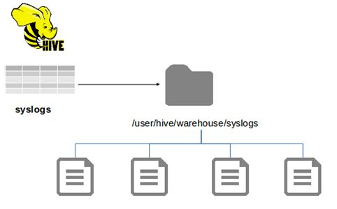
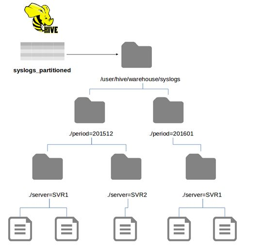
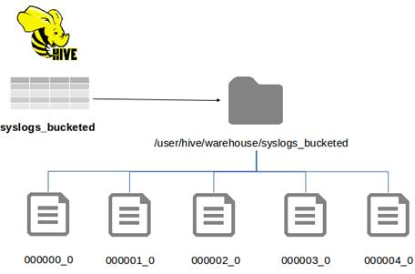

跨多个物理存储位置拆分逻辑数据库对象是实现高性能和可扩展性的关键。存储位置越多，可以并发访问文件的计算节点就越多。密集作业可以以高度并行的方式运行，这意味着它们将运行得更高效，完成得更快。

一些数据库称之为分片，而性能提高的代价通常是访问数据更加复杂。在某些实现中，您必须指定插入或读取哪个碎片，并且管理(例如，如果一些碎片过载，重新分发数据)并不简单。

Hive 支持两种不同类型的分片来存储内部表——分区和桶。分片方法是在创建表时指定的，Hive 使用列值来决定哪些行进入哪个分片。这个动作为用户抽象了一些复杂性。

分割数据是一项关键的性能技术，除了最小的表之外，它通常用在 Hive 中。我们将在本书的后面讨论它，因为我们现在已经很好地理解了 Hive 是如何在逻辑上和物理上存储和访问数据的。在这一点上，了解分片是很简单的。

在 HDFS，将一个表分割成多个分区会将存储物理地分割成许多文件夹。如果您创建一个没有分区的内部 Hive 表，数据文件将(默认情况下)存储在 HDFS 的/用户/Hive/仓库/[table_name]中。您如何填充该表决定了创建多少个文件，但是它们都在同一个文件夹中。

图 6 显示了 syslogs 表在被填充后如何被物理存储。



图 6:未分区表的文件夹结构

当我们创建一个分区内部表时，Hive 为分区的每个分支创建子文件夹，数据文件驻留在最底层的子文件夹中。我们指定如何对数据进行分区，最有效的分区方案将反映数据的访问模式。

如果我们通常为特定的日期和服务器成批加载和查询日志，我们可以按期间和服务器名称对表进行分区。随着表的填充，Hive 将使用/user/Hive/warehouse/[table _ name]作为根和创建嵌套的文件夹结构。/[句点]/[服务器]用于子文件夹，如图 7 所示。

 

 7:分区表的文件夹结构

create table 语句支持分区依据子句，在该子句中，您可以指定用于对数据文件进行分区的列。您可以指定多个列，每个列都将向文件夹结构添加另一个嵌套级别。

作为比较，代码清单 73 显示了未分区的表的结构，以及 HDFS 文件夹的结构。

 73:未分区表的文件列表

```
  > describe syslogs_no_partitions;
  +-----------+------------+----------+--+
  | col_name  | data_type  | comment  |
  +-----------+------------+----------+--+
  | period    | string     |          |
  | host      | string     |          |
  | loggedat  | timestamp  |          |
  | process   | string     |          |
  | pid       | int        |          |
  | message   | string     |          |
  +-----------+------------+----------+--+
  …
  root@28b0162f637b:/hive-setup# hdfs dfs -ls
  /user/hive/warehouse/syslogs_no_partitions
  Found 2 items
  -rwxrwxr-x   1 root supergroup        692 2016-02-04 17:52
  /user/hive/warehouse/syslogs_no_partitions/000000_0
  -rwxrwxr-x   1 root supergroup        697 2016-02-04 17:53
  /user/hive/warehouse/syslogs_no_partitions/000000_0_copy_1

```

此列表中的两个文件包含句点和主机的不同组合，但是因为表没有分区，所以文件位于表的根文件夹中，并且任何文件都可以包含任何句点和主机名的行。

代码清单 74 显示了如何创建 syslogs 表的分区版本。

 74:创建分区表

```
  > create table syslogs_with_partitions(loggedat timestamp,
  process string, pid int, message string) partitioned by (period string, host
  string) stored as ORC;
  No rows affected (0.222 seconds)

```

|  | 注意:用于对表进行分区的列不属于列列表，这意味着在定义表时，要为不属于分区方案的所有数据字段指定列，并且要单独指定分区列。 |

当数据被插入到表中时，Hive 将创建嵌套的文件夹结构。代码清单 75 显示了插入一些内容后文件夹的外观。

 75:分区表的文件列表

```
  root@28b0162f637b:/hive-setup# hdfs dfs -ls
  /user/hive/warehouse/syslogs_with_partitions/*/*
  Found 1 items
  -rwxrwxr-x   1 root supergroup        502 2016-02-04 17:58
  /user/hive/warehouse/syslogs_with_partitions/period=201601/host=sc-ub-xps/000000_0
  Found 1 items
  -rwxrwxr-x   1 root supergroup        502 2016-02-04 17:58
  /user/hive/warehouse/syslogs_with_partitions/period=201601/host=sc-win-xps/000000_0
  Found 1 items
  -rwxrwxr-x   1 root supergroup        502 2016-02-04 17:56
  /user/hive/warehouse/syslogs_with_partitions/period=201602/host=sc-ub-xps/000000_0

```

这里我们在根文件夹下有两个文件夹，名称指定了分区列名和值(period=201601 和 period = 201602)；在这些文件夹下面，我们有另一个文件夹级别，它指定下一个分区列(host=sc-ub-xps 和 host=sc-win-xps)。

在分区表中，数据文件位于 period/host 文件夹下，每个文件只包含 period 和 host 特定组合的行。

因为分区表中的行需要位于特定的位置，所以所有的数据填充语句都必须告诉 Hive 目标。这是通过 partition 子句完成的，该子句为所有正在加载的行指定列名和值。

正在加载的数据不能包含分区列的值，这意味着 Hive 将它们视为不同类型的列。代码清单 76 显示了分区系统日志表的描述，其中分区列显示为不同于数据列。

代码清单 76:描述一个分区表

```
  > describe
  syslogs_with_partitions;
  +--------------------------+-----------------------+-----------------------
  |         col_name         |      
  data_type       |        comment        |
  +--------------------------+-----------------------+-----------------------
  | loggedat                 | timestamp             |                      

  | process                  | string                |                      

  | pid                      | int                   |                      

  | message                  | string                |                      

  | period                   | string                |                      

  | host                     |
  string                |                       |
  | # Partition Information  |
  NULL                  | NULL                  
  | # col_name               | data_type             |
  comment               
  | period                   | string                |                      

  | host                     | string                |                      

  +--------------------------+-----------------------+-----------------------

```

分区列的数据仍然可以以正常方式读取，但是必须与其他列分开写入。代码清单 77 显示了如何在分区的 syslogs 表中插入一行。

 77:插入分区表

```
  > insert into syslogs_with_partitions
  partition(period='201601', host='sc-win-xps') values('2016-01-04 17:52:01',
  'manual', 123, 'msg2');
  No rows affected (11.726 seconds)

```

要插入的数据在子句之间拆分:

*   PARTITION—包含分区列的列名和值。
*   值—包含数据列的值(可以省略名称，如本例中使用的位置排序)。

如果您试图在没有指定正确的分区列的情况下填充分区表，Hive 将引发错误。

|  | 提示:分区列和数据列之间的这种分割会增加数据加载的复杂性，但它可以确保每一行都进入正确文件夹中的文件。如果这在一开始看起来很奇怪，这只是一个简单的例子，记住 create 语句的 partition 子句中的列需要进入 partition 子句进行插入，并且它们不包括在正常的列列表中。 |

对于从查询结果中插入多行，分区语法是相同的，但是这里需要确保只为目标分区选择合适的行，不能在一次加载中插入许多不同的分区。

代码清单 78 通过从 syslogs 表中进行选择来填充 syslogs_partitioned。

 78:选择并插入分区表

```
  > insert into syslogs_partitioned partition(period='201601',
  host='sc-ub-xps') select loggedat, process, pid, message from syslogs where
  year(date(loggedat)) = 2016 and month(date(loggedat)) = 01 and host =
  'sc-ub-xps';
  …
  INFO  : Partition default.syslogs_partitioned{period=201601,
  host=sc-ub-xps} stats: [numFiles=2, numRows=3942, totalSize=58111,
  rawDataSize=1143012]
  No rows affected (13.106 seconds)

```

同样，如果目标表被分区，load 语句需要 partition 子句。除了分区列之外，load 的工作方式与我们在第 6 章 Hive ETL 中提到的方式相同——本质上，它将源文件复制到 HDFS，使用分区规范来决定目标文件夹。

只有 ACID 表才支持关键的 DML 语句，但是在支持它们的地方，语法仍然与标准 SQL 相同。从 1.2.1 版本开始，Hive 支持一些不被识别为 ACID 的表的 DML 语句，如表 3 所示。

表 3: DML 语句支持

| 表格存储 | 插入 | 更新 | 删除 |
| 内酸 | 是 | 是 | 是 |
| 内部–不是酸性 | 是 | 不 | 不 |
| 对外- HDFS | 是 | 不 | 不 |
| 外部- HBase | 是 | 不 | 不 |

代码清单 79 创建了一个支持 Hive 事务的表，并指定了 ORC 格式、分时段分区和一个自定义表属性，以便将其标识为事务性的。

 79:创建 ACID 表

```
  create table
  syslogs_acid 
  (host string,
  loggedat timestamp, process string, pid int, 
   message
  string, hotspot boolean) 
  clustered
  by(host) into 4 buckets 
  stored as ORC

  tblproperties
  ("transactional" = "true");

```

为了使用事务表，我们需要设置一系列配置值。我们可以通过广泛使用事务表在 hive-site.xml 中实现这一点，或者如果我们只有事务表，我们可以在每个会话中实现这一点。

为了支持事务管理器，已经在 hive-site.xml 中配置了**hive-简洁地说** Docker 映像，它使用了以下设置:

*   " hive . support . concurrency " = " true "。
*   " hive.enforce.bucketing" = "true "。
*   " hive . exec . dynamic . partition . mode " = " non strict "。
*   " hive . txn . manager " = " org . Apache . Hadoop . hive . QL . lock mgr . dbtxnmanager "。
*   " hive . compressor . initiator . on " = " true "。
*   " hive . compressor . worker . threads " = " 1 "。

配置好事务设置后，当我们对 ACID 表使用 DML 语句时，它们将在事务管理器下运行，我们将能够插入、更新和删除数据。代码清单 80 显示了将现有非 ACID 表中的所有系统日志数据插入到新的 ACID 表中。

 80:插入到 ACID 表

```
  > insert into syslogs_acid select host, loggedat, process,
  pid, message, false from syslogs;
  ...
  INFO  : Table default.syslogs_acid stats: [numFiles=4,
  numRows=15695, totalSize=82283, rawDataSize=0]

```

如果我们想修改这些数据，我们可以在表上使用更新和删除。与 SQL 一样，Hive 接受 where 子句来指定要处理的数据。在 Hive 中，更新将在 map/reduce 作业中进行，因此我们可以使用复杂的查询并对大型结果集采取行动。

在代码清单 81 中，我们使用计数查询填充热点列来识别进行大量日志记录的进程。

 81:更新 ACID 表

```
  > update syslogs_acid set hotspot = true where process in
  (select process from syslogs_acid group by process having count(process) >
  1000);
  > select * from syslogs_acid where hotspot = true limit 1;
  +--------------------+--------------------------+-----------------------+--
  | syslogs_acid.host  |  syslogs_acid.loggedat  
  | syslogs_acid.process  | syslogs_acid.pid  |   syslogs_acid.message   |
  syslogs_acid.hotspot  |
  +--------------------+--------------------------+-----------------------+--
  | sc-ub-xps          | 1970-01-17 19:52:02.838 
  | systemd               | 1                 | Started CUPS Scheduler.  |
  true                  |
  +--------------------+--------------------------+-----------------------+--

```

现在，我们可以删除非热点进程的系统日志条目，如代码清单 82 所示。

 82:从 ACID 表中删除

```
  > delete from syslogs_acid where hotspot = false;
  > select count(distinct(process)), count(*) from
  syslogs_acid;
  ...
  +-----+--------+--+
  | c0  |   c1   |
  +-----+--------+--+
  | 4   | 13463  |
  +-----+--------+--+

```

这提供了一种简单的方法来识别少数进程生成大多数日志，并为我们留下一个包含主要进程子集原始数据的表。

从分区表中读取比填充它们更简单，因为分区列被视为读取的数据列，这意味着您可以在查询中使用分区值以及数据值。

代码清单 83 显示了 syslogs _ 分区表中所有列的基本选择，它将返回所有分区列和所有数据列，而不区分它们。

 83:从分区表中选择

```
  > select
  * from syslogs_partitioned limit 2;
  +-------------------------------+------------------------------+-----------
  |
  syslogs_partitioned.loggedat  | syslogs_partitioned.process  |
  syslogs_partitioned.pid  |  syslogs_partitioned.message  |
  syslogs_partitioned.period  | syslogs_partitioned.host  |
  +-------------------------------+------------------------------+-----------
  | 2016-01-17
  19:53:33.3         | thermald                     | 785                     
  | Dropped below poll threshold  | 201601                      |
  sc-ub-xps                 |
  | 2016-01-17
  19:53:33.3         | thermald                     | 785                     
  | thd_trip_cdev_state_reset     | 201601                      |
  sc-ub-xps                 |
  +-------------------------------+------------------------------+-----------

```

您还可以在选择标准中使用分区和数据列的组合，如代码清单 84 所示。

 84:基于分区列的过滤

```
  > select
  host, pid, message from syslogs_partitioned where period = '201601' and host
  like 'sc-ub%' and process = 'anacron' limit 2;
  +------------+------+------------------------------+--+
  |    host   
  | pid  |           message            |
  +------------+------+------------------------------+--+
  | sc-ub-xps 
  | 781  | Job `cron.daily' terminated  |
  | sc-ub-xps 
  | 781  | Job `cron.weekly' started    |
  +------------+------+------------------------------+--+

```

这个查询有效地利用了分区来帮助分配工作负载。where 子句为将源文件限制在表根下的文件夹 period=201601 的时间段指定一个值。**主机**有一个通配符选择，这样所有主机=sc-ub*文件夹中的所有文件都会包含在搜索中。

Hive 可以将这个作业分成多个映射步骤，每个文件一个。鉴于 Hadoop 的集群能力，它将尽可能多地并行运行这些映射步骤。当映射步骤完成时，一个或多个缩减步骤整理中期结果，然后查询完成。

正确使用分区表将在您读取或写入表时为您带来很好的性能提升，但是您应该仔细考虑分区方案。如果使用大量分区列或具有广泛值的分区列，最终可能会得到包含大量小文件的高度嵌套的文件夹结构。

因为运行大量小地图作业的额外开销超过了并行处理的好处，所以有可能达到拥有更多文件会降低性能的程度。如果需要支持多级分片，可以使用分区和桶的组合。

Bucketing 是 Hive 提供的一种可选的数据分片方案。表可以分区或分时段，也可以分区和分时段。这与分区不同，存储结构非常适合对数据进行采样，这意味着您可以使用大数据集的小子集。

对于分区，分区列定义了文件夹方案，在 Hive 中填充数据将根据需要创建新文件夹。使用桶，您可以在创建表时指定固定数量的桶，并且在填充数据时，Hive 会将其分配给现有的桶之一。

桶在文件级别而不是文件夹级别分割数据，因此如果您创建一个包含五个桶的 syslogs _ bucketed 表，文件夹结构将如图 8 所示。



 8:桶形表格的文件夹结构

在这里，我们仍然有分割数据的好处，但是我们没有严重嵌套文件夹的问题，并且我们可以更好地控制数据被分割到多少个文件中。桶表也更容易处理，因为桶列是普通的数据列，这意味着我们在加载数据时不必指定分区。

create table 语句提供了 clustered by…into bucket 子句，用于将数据分割到存储桶中。用于标识正确存储桶的列是表中的数据列，这意味着需要以通常的方式指定它们。

代码清单 85 使用时段的句点和主机列创建了 syslogs 表的时段版本。在这个例子中，文件是 ORC 格式的，但这不是必需的。

 85:创建分桶表

```
  > create table syslogs_bucketed(period string, host string,
  loggedat timestamp, process string, pid int, message string) clustered
  by(period, host) into 12 buckets stored as orc;
  No rows affected (0.226 seconds)

```

|  | 注意:这里的桶数设置为 12，这意味着 Hive 将在 12 个存储位置之间分配数据。具有相同期间和主机的行将始终位于同一位置，但是具有不同期间和主机组合的行可以位于不同的存储桶中。 |

在我们开始填充表之前，Hive 不会创建任何文件夹或文件，但是在插入一行之后，将创建所有桶的文件结构，如代码清单 87 所示。

代码清单 86:分桶表的文件夹清单

```
  root@hive:/hive-setup#
  hdfs dfs -ls /user/hive/warehouse/*bucket*/*
  -rwxrwxr-x   1 root supergroup         49
  2016-02-05 18:07 /user/hive/warehouse/syslogs_bucketed/000000_0
  -rwxrwxr-x   1 root supergroup         49
  2016-02-05 18:07 /user/hive/warehouse/syslogs_bucketed/000001_0
  -rwxrwxr-x   1 root supergroup         49
  2016-02-05 18:07 /user/hive/warehouse/syslogs_bucketed/000002_0
  -rwxrwxr-x   1 root supergroup         49
  2016-02-05 18:07 /user/hive/warehouse/syslogs_bucketed/000003_0
  -rwxrwxr-x   1 root supergroup         49
  2016-02-05 18:07 /user/hive/warehouse/syslogs_bucketed/000004_0
  -rwxrwxr-x   1 root supergroup        646
  2016-02-05 18:07 /user/hive/warehouse/syslogs_bucketed/000005_0
  -rwxrwxr-x   1 root supergroup         49
  2016-02-05 18:07 /user/hive/warehouse/syslogs_bucketed/000006_0
  -rwxrwxr-x   1 root supergroup         49
  2016-02-05 18:07 /user/hive/warehouse/syslogs_bucketed/000007_0
  -rwxrwxr-x   1 root supergroup         49
  2016-02-05 18:07 /user/hive/warehouse/syslogs_bucketed/000008_0
  -rwxrwxr-x   1 root supergroup         49
  2016-02-05 18:07 /user/hive/warehouse/syslogs_bucketed/000009_0
  -rwxrwxr-x   1 root supergroup         49
  2016-02-05 18:07 /user/hive/warehouse/syslogs_bucketed/000010_0
  -rwxrwxr-x   1 root supergroup         49
  2016-02-05 18:07 /user/hive/warehouse/syslogs_bucketed/000011_0

```

|  | 提示:您可以使用带有 clustered by 子句的 alter table 语句来更改现有表的存储桶数，但是 Hive 不会重新组织现有文件中的数据来匹配新的存储桶规范。如果要修改存储桶计数，最好创建一个新表，并从现有表中填充它。 |

clustered by 的一个子子句指示 Hive 创建一个已排序的分桶表。对于已排序的表，使用相同的物理存储桶结构，但文件中的数据按指定的列值排序。在代码清单 87 中，创建了 syslogs 表的一个变体，它按周期和主机进行分时段，并按进程名进行排序。

 87:创建排序的分桶表

```
  > create
  table syslogs_bucketed_sorted
  (period
  string, host string, loggedat timestamp, process string, pid int, message
  string) 
   clustered
  by(period, host) sorted by(process) into 12 buckets 
   stored as
  orc;

```

对存储桶中的数据进行排序可以在读取时进一步优化。在写的时候，我们可以利用 Hive 的强制桶来确保数据进入正确的桶。

填充桶表时，就插入而言，存储结构是透明的。标准列用于确定存储桶，这意味着标准 insert 语句在没有任何附加子句的情况下工作。

load 语句不能与分桶表一起使用，因为 load 只是从源复制到 HDFS，而不修改文件内容。为了支持分桶表的负载，Hive 需要读取源文件并将数据分发到正确的桶中，这在任何情况下都会失去负载的性能优势。

为了填充桶表，我们需要使用一个插入。代码清单 88 显示了一个简单的插入到带有特定值的桶表中的操作。还显示了 Hive 输出日志中的一些关键行。

 88:插入到桶形表中

```
  > insert
  into syslogs_bucketed select '2015', 's2', unix_timestamp(), 'kernel', 1,
  'message' from dual;
  ...
  INFO  :
  Hadoop job information for Stage-1: number of mappers: 1; number of reducers:
  12
  ...
  INFO  : Table
  default.syslogs_bucketed stats: [numFiles=12, numRows=1, totalSize=1185,
  rawDataSize=396]
  No rows
  affected (29.69 seconds)

```

来自 Beeline 的日志条目告诉我们，Hive 使用了单个地图任务和 12 个简化任务——表中每个桶一个，这确保了数据最终会出现在正确的位置。(Hive 使用分时段列值的散列来决定目标时段。)最后一行的表统计告诉我们有 12 个文件，但表中只有一行。

如果插入作业的缩减器数量与存储桶数量不匹配，则存储桶表中的数据可能会不同步，从而导致行位于错误的存储桶中。如果在 hive 会话中(或者在 hive-site.xml 中，如 Hive-简洁的 Docker 图像中的情况)，设置 Hive . enforce . bucket 为 true，Hive 将解决这个问题。

使用 Hive 强制的桶，我们不必指定要填充哪个桶，因此我们可以从单个语句向多个桶中插入数据。在代码清单 89 中，我们使用 Hive 从第 6 章 ETL 的前一个 ELT 过程中获取格式化的 syslog 行，并将它们插入到分桶表中。

 89:将 ELT 放入一个桶表中

```
  > insert
  into table syslogs_bucketed select date_format(loggedat, 'yyyyMM'), host,
  loggedat, process, pid, message from syslogs;
  …
  INFO  : Table
  default.syslogs_bucketed stats: [numFiles=12, numRows=3942, totalSize=58903,
  rawDataSize=1864398]

```

桶式表的查询方式与任何其他表一样，但是如果 where 子句中包含桶式列，则查询执行会得到优化。在这种情况下，Hive 会将地图输入文件限制在它知道将包含数据的文件中，因此初始搜索空间受到限制。

对分时段(或分时段排序)表和非分时段表的查询在语法上没有区别——代码清单 90 显示了使用表中所有列的查询。

 90:查询桶表

```
  > select
  period, process, pid from syslogs_bucketed where host = 'sc-ub-xps' limit 2;
  +---------+----------------+-------+--+
  | period 
  |    process     |  pid  |
  +---------+----------------+-------+--+
  | 201601  | gnome-session 
  | 1544  |
  | 201601  |
  gnome-session  | 1544  |
  +---------+----------------+-------+--+

```

列可以用在 select 语句的任何部分，而不管它们是纯数据列还是分时段(或排序)规范的一部分。

如果要查询数据的子集，分时段表特别有用。我们已经在以前的 HiveQL 查询中看到了 limit 子句，但是它只限制了返回的数据量——通常查询会在整个表中运行，并且只返回一小部分。

对于分时段表，我们可以使用 tablesample 子句指定对数据样本的查询。因为 Hive 提供了多种方法来对数据进行采样，所以我们可以从一个或多个桶中或者从一定百分比的数据中进行选择。在代码清单 91 中，我们从分桶 syslogs 表的第五个桶中获取数据。

 91:从表桶中取样

```
  0> select
  count(*) from syslogs_bucketed;
  INFO  :
  MapReduce Total cumulative CPU time: 20 seconds 880 msec
  +-----------+--+
  |    c0     |
  +-----------+--+
  | 42553050  |
  +-----------+--+
  > select
  count(*) from syslogs_bucketed tablesample(bucket 5 out of 12);
  INFO  :
  MapReduce Total cumulative CPU time: 2 seconds 930 msec
  +--------+--+
  |  _c0   |
  +--------+--+
  | 40695  |
  +--------+--+

```

整个表计数在 21 秒内返回了 4200 万行，然而单个桶计数只花了三秒钟就返回了 40，000 行，这要快得多，并且告诉我我的数据没有在桶之间平均分配(如果是这样的话，我每个桶大约有 350 万行)。

为了从多个存储桶中对数据子集进行采样，您可以指定数据大小的百分比或采样所需的大小。Hive 在文件块级别从 HDFS 读取，这意味着您可能会获得比您指定的更大的样本——如果 Hive 获取的块超过了请求的大小，它仍然会使用整个块。代码清单 92 获取至少 3%的数据。

 92:对一部分数据进行采样

```
  > select
  count(*) from syslogs_bucketed tablesample(3 percent);
  INFO  :
  MapReduce Total cumulative CPU time: 4 seconds 740 msec
  +-----------+--+
  |    _c0    |
  +-----------+--+
  | 10525740  |
  +-----------+--+

```

构建复杂查询时，使用分桶表返回的高效采样可以大大节省时间。您可以使用快速返回的数据子集迭代查询，当您对查询满意时，您可以将其提交给集群来运行整个数据集。

分割数据是高性能的关键，而且，由于 Hive 基于 Hadoop，其核心基础支持非常高的并行度。使用正确的分片策略，您可以最大限度地利用您的集群，即使您有数百个节点，它们也可以同时运行查询的各个部分，前提是可以剥离数据来支持这一点。

Hive 提供了两种分割方法，可以单独使用，也可以组合使用。您选择哪种方法取决于数据的逻辑分组方式和访问方式。通常，您最常查询但具有相对较少数量的不同值的子句是分割的良好候选项，这些可能是时间段或源数据的标识符或数据类型的分类。

分区表通过使用嵌套文件夹结构对数据进行物理分割，每个分区列都有一个嵌套级别。分区的数量不是固定的，当您将数据插入到新的分区列值中时，Hive 将为您创建分区。分区列是普通表结构的一个独立部分，这意味着数据加载变得更加复杂，因为它们需要分区感知。

分区表的替代方案是分时段表，它将数据拆分到许多文件中，而不是嵌套文件夹中。创建表时，存储桶的数量实际上是固定的，标准数据列用于决定新行的目标存储桶。

分桶表更容易使用，因为数据列和桶列之间没有区别，并且当 Hive 使用哈希将数据分配给桶时，如果您的列值均匀分布，将会有一个没有热点的均匀分布。使用桶式列，您还可以获得高效采样的额外好处，在这种情况下，Hive 可以从一个或多个桶中提取数据子集。

在一个分区的、分时段的表中结合这两种方法可以提供最佳解决方案，但是您必须仔细选择您的分段列。

在最后一章中，我们将更仔细地研究查询 Hive，并介绍 HiveQL 为大数据分析提供的更高价值的功能。