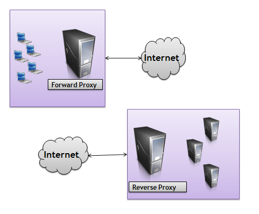

# 四、网络架构

在第一章中，我们讨论了资源，但主要集中在网址和如何解释网址上。然而，资源是 HTTP 的核心。既然我们已经理解了 HTTP 消息、方法和连接，我们就可以重新审视资源了。在本章中，我们将讨论在设计 web 应用程序和 web 服务时使用资源的真正本质。

## 资源还原

尽管很容易将 web 资源想象成 web 服务器文件系统上的一个文件，但按照这些思路思考并不尊重资源抽象的真正能力。许多网页确实需要文件系统上的物理资源——JavaScript 文件、图像和样式表。然而，消费者和网络用户并不太关心这些背景资源。相反，他们关心可以与之交互的资源，更重要的是他们可以命名的资源。资源包括:

*   西兰花沙拉的食谱
*   “芝加哥披萨”的搜索结果
*   患者 123 的病史

所有这些资源都是我们构建应用程序所围绕的资源类型，列表中的共同主题是每个项目如何重要到足以识别和命名。如果我们可以识别一个资源，我们也可以给这个资源一个网址，让某人找到这个资源。有一个网址是一件很方便的事情。当然，给定一个网址，你就可以找到一个资源，但是你也可以通过在超链接中嵌入网址或者在电子邮件中发送它，把这个网址交给其他人。

但是，有很多事情你不能用网址来做。相反，有很多事情是一个网址做不到的。例如，URL 不能将客户端或服务器限制在特定类型的技术上。大家都说 HTTP。如果您的客户端是 C++并且您的 web 应用程序是在 Ruby 中，这并不重要。

此外，URL 不能强制服务器使用任何特定技术来存储资源。资源可以是文件系统上的文档，但是 web 框架也可以响应对资源的请求，并使用存储在文件中、存储在数据库中、从 web 服务中检索的信息来构建资源，或者从一天中的当前时间获取资源。

一个 URL 甚至不能指定特定资源的表示，一个资源可以有多个表示。正如我们之前了解到的，客户端可以使用 HTTP 请求消息中的头来请求特定的表示。客户端可以请求特定的语言或特定的内容类型。如果您曾经使用过允许内容协商的 web 应用程序，那么您已经看到了资源的灵活性。JavaScript 可以以 JSON 格式请求患者 123 的数据，C#可以以 XML 格式请求相同的资源，浏览器可以以 HTML 格式请求数据。它们都使用相同的资源，但是使用三种不同的表示。

还有一件事是网址不能做的——它不能说用户想用资源做什么*。网址没有说我是要检索资源还是编辑资源。HTTP 请求消息的工作是使用 HTTP 标准方法之一来描述这个意图。正如我们在[第 2 章](2.html#heading_id_23)中所谈到的，标准 HTTP 方法数量有限，包括`GET`、`POST`、`PUT`和`DELETE`。*

 *当你开始考虑资源和网址时，就像我们在本章中所做的那样，你开始把网络看作是你的应用程序的一部分，一个你可以构建的灵活的架构层。要深入了解这一思路，请参阅罗伊·菲尔丁的著名论文《建筑风格和基于网络的软件架构设计》。本文介绍了体系结构的表示状态转移(REST)风格，并对本节和下一节中的思想和概念进行了更详细的描述。文章位于[http://www.ics.uci.edu/~fielding/pubs/dissertation/top.htm](http://www.ics.uci.edu/~fielding/pubs/dissertation/top.htm)。

## 可见协议——HTTP

到目前为止，我们一直在关注一个网址*不能做什么*，而我们应该关注一个网址*能做什么*。或者更确切地说，专注于一个网址和 HTTP 能做什么，因为它们在一起工作得很好。在他的论文中，菲尔丁描述了接受 HTTP 的好处。这些优势包括可扩展性、简单性、可靠性和松散耦合。HTTP 提供这些好处的部分原因是，您可以将 URL 视为客户端和服务器应用程序之间的指针或间接单元。同样，URL 本身并不决定特定的资源表示、技术实现或客户端的意图。相反，客户端可以在 HTTP 消息中表达所需的意图和表示。

HTTP 消息是简单的纯文本消息。HTTP 消息的美妙之处在于请求和响应都是完全自描述的。请求包括 HTTP 方法(客户端想要做什么)、资源路径以及提供所需表示信息的附加头。响应包括指示事务结果的状态代码，但也包括带有缓存指令的头、资源的内容类型、资源的长度以及可能的其他有价值的元数据。

因为事务所需的所有信息都包含在消息中，并且因为信息可见且易于解析，所以当消息在客户端应用程序和服务器应用程序之间移动时，HTTP 应用程序可以依赖许多提供价值的服务。

## 增值

当一个 HTTP 消息从一台机器上的一个进程的内存空间移动到另一台机器上的一个进程的内存空间时，它可以通过几个检查和可能修改消息的软件和硬件。一个很好的例子是 web 服务器应用程序本身。像 Apache 或 IIS 这样的网络服务器将是服务器上传入的 HTTP 请求的第一批接收者之一，作为网络服务器，它可以将消息路由到适当的应用程序。

网络服务器可以在决定向何处发送消息时使用消息中的信息，如网址或主机头。服务器还可以对消息执行其他操作，例如将消息记录到本地文件中。服务器上的应用程序不需要担心日志记录，因为服务器被配置为记录所有消息。

同样，当应用程序创建一个 HTTP 响应消息时，服务器有机会在离开时与消息进行交互。同样，这可能是一个简单的日志记录操作，但也可能是对消息本身的直接修改。例如，服务器可以知道客户端是否支持 gzip 压缩，因为客户端可以通过 HTTP 请求中的`Accept-Encoding`头来通告这一事实。压缩允许服务器获取 100 千字节的资源，并将其转换为 25 千字节的资源，以实现更快的传输。您可以将许多 web 服务器配置为对某些内容类型(通常是文本类型)自动使用压缩，这种情况的发生无需应用程序本身担心压缩。压缩是 web 服务器软件本身提供的附加价值。

应用程序不必担心记录 HTTP 事务或压缩，这都归功于自我描述的 HTTP 消息，它允许基础设施的其他部分处理和转换消息。当消息在网络中移动时，这种类型的处理也会发生。

## 代理

**代理服务器**是位于客户端和服务器之间的计算机。代理对最终用户来说基本上是透明的。您认为您正在将 HTTP 请求消息直接发送到服务器，但这些消息实际上是发送到代理。代理接受来自客户端的 HTTP 请求消息，并将消息转发到所需的服务器。然后，代理接收服务器响应，并将响应转发回客户端。在转发这些消息之前，代理可以检查这些消息，并可能采取一些额外的操作。

我工作的一个客户端使用代理服务器来捕获离开办公室的所有 HTTP 流量。他们不希望员工和承包商把所有的时间都花在推特和脸书上，所以对这些服务器的 HTTP 请求永远不会到达他们的目的地，办公室里也没有推特或 Farmville。这是代理服务器的一个流行角色的例子，它的功能是访问控制设备。

然而，代理服务器可以比仅仅向特定主机发送消息复杂得多——简单的防火墙就可以完成这一任务。代理服务器还可以检查消息以删除机密数据，如指向公司网络内部资源的`Referer`报头。访问控制代理还可以记录 HTTP 消息，以便对所有流量创建审计跟踪。许多访问控制代理需要用户身份验证，这是我们将在下一篇文章中讨论的主题。

我在上一段描述的代理就是我们所说的**转发代理**。转发代理通常比服务器更靠近客户端，并且转发代理通常需要客户端软件或网络浏览器中的一些配置才能工作。

A **反向代理**是比客户端更靠近服务器的代理服务器，对客户端完全透明。



图 6:正向和反向代理

这两种类型的代理都可以提供广泛的服务。如果我们回到前面讨论的 gzip 压缩场景，代理服务器有能力压缩响应消息体。公司可能会使用反向代理服务器进行压缩，以减轻应用程序所在的网络服务器的计算负荷。现在，应用程序和 web 服务器都不必担心压缩。相反，压缩是一种通过代理分层的功能。这就是 HTTP 的妙处。

其他一些流行的代理服务包括。

**负载平衡**代理可以接收一条消息，并将其循环转发到几个网络服务器之一，或者知道哪个服务器当前处理的请求数量最少。

**SSL 加速**代理可以加密和解密 HTTP 消息，减轻网络服务器的加密负担。我们将在下一章中更多地讨论 SSL。

通过过滤掉潜在危险的 HTTP 消息，代理可以提供额外的安全层。具体来说，看起来像是试图发现跨站点脚本(XSS)漏洞或发起 SQL 注入攻击的消息。

**缓存代理**可以存储频繁访问的资源的副本，并直接响应请求这些资源的消息。我们将在下一节中详细讨论缓存。

最后，值得指出的是，代理不一定是物理服务器。Fiddler 是上一章提到的一个工具，它是一个 HTTP 调试器，允许您捕获和检查 HTTP 消息。Fiddler 的工作原理是告诉 Windows 将所有传出的 HTTP 流量转发到 IP 地址 127.0.0.1 上的端口 8888。这个 IP 地址是环回地址，这意味着流量直接进入本地机器，Fiddler 现在正在端口 8888 上监听。Fiddler 接收 HTTP 请求消息，记录它，将其转发到目的地，并在将响应转发到本地应用程序之前捕获响应。您可以通过转到**工具**、**互联网选项**，点击**连接**选项卡，然后点击**局域网设置**按钮，在互联网浏览器(IE)中查看代理设置。在**代理服务器**区域，点击**高级**按钮查看代理服务器详细信息。


图 7:互联网浏览器中的代理设置

代理是 HTTP 如何影响网络应用程序或网站架构的一个完美例子。您可以在不影响应用程序的情况下将许多服务分层到网络中。我们想要更详细研究的一个服务是缓存。

## 缓存

缓存是为了提高性能和可伸缩性而进行的优化。当对同一资源表示有多个请求时，服务器可以通过网络一次又一次地为每个请求发送相同的字节。或者，代理服务器或客户端可以在本地缓存表示，并减少完全检索所需的时间和带宽。缓存可以减少延迟，帮助防止瓶颈，并允许网络应用程序在每个用户同时出现购买最新产品或查看最新新闻稿时存活下来。缓存也是一个很好的例子，说明了 HTTP 消息头中的元数据如何促进额外的层和服务。

首先要知道的是有两种类型的缓存。

一个**公共缓存**是多个用户共享的缓存。公共缓存通常位于代理服务器上。转发代理上的公共缓存通常缓存用户社区中流行的资源，如特定公司的用户或特定互联网服务提供商的用户。反向代理上的公共缓存通常缓存特定网站上流行的资源，例如来自 Amazon.com 的流行产品图片。

一个专用于单个用户的**私有缓存**。网络浏览器总是在你的磁盘上保留一个私有的资源缓存(这些是 IE 中的“临时互联网文件”，或者在谷歌 Chrome 的地址栏中键入`about:cache`来查看 Chrome 私有缓存中的文件)。浏览器缓存在文件系统中的任何内容几乎都能立即出现在屏幕上。

不幸的是，关于缓存什么、何时缓存以及何时使缓存项无效(即将其踢出缓存)的规则很复杂，并且被一些遗留行为和不兼容的实现所困扰。尽管如此，我还是要努力指出一些关于缓存应该知道的事情。

在 HTTP 1.1 中，HTTP `GET`请求的状态代码为 200(正常)的响应消息在默认情况下是可缓存的(这意味着代理和客户端缓存响应是合法的)。应用程序可以通过在 HTTP 响应中使用正确的标头来影响此默认值。在 HTTP 1.1 中，这个头是`**Cache-Control**`头，虽然你也可以在很多消息中看到`**Expires**`头。`Expires`头仍然存在，尽管在 HTTP 1.1 中被否决了，但它得到了广泛的支持。`**Pragma**`是用于控制缓存行为的头的另一个例子，但它也只是为了向后兼容。在本书中，我将重点介绍`Cache-Control`。

HTTP 响应的值可以是`**public**`、`**private**`或`**no-cache**`。`public`值意味着公共代理服务器可以缓存响应。`private`值表示只有浏览器可以缓存响应。`no-cache`的值意味着没有人应该缓存响应。还有一个`**no-store**`值，意味着消息可能包含敏感信息，不应该被持久化，而应该尽快从内存中删除。

你如何使用这些信息？对于流行的共享资源(如主页徽标图像)，您可能希望使用`public`缓存控制指令，并允许每个人缓存该图像，甚至代理服务器。

对于对特定用户的响应(如包含用户名的主页的 HTML)，您可能希望使用私有缓存指令。

**注意:**在 ASP.NET 你可以通过`Response.Cache`控制这些设置。

服务器也可以在`Cache-Control`中指定`**max-age**`值。`max-age`值是缓存响应的秒数。一旦这几秒钟到期，请求应该总是返回到服务器以检索更新的响应。让我们看一些示例响应。

这是 Flickr.com 对其中一个 Flickr CSS 文件的部分回应。

```cs
  HTTP/1.1 200 OK
  Last-Modified: Wed, 25 Jan 2012 17:55:15 GMT
  Expires: Sat, 22 Jan 2022 17:55:15 GMT
  Cache-Control: max-age=315360000,public

```

请注意`Cache-Control`允许公共和私有缓存来缓存文件，并且它们可以将文件保存超过 3.15 亿秒(10 年)。他们还使用`Expires`标题给出具体的到期日期。如果客户端符合 HTTP 1.1 并理解`Cache-Control`，则应该使用`max-age`中的值，而不是`Expires`。请注意，这并不意味着 Flickr 计划在 10 年内使用相同的 CSS 文件。当 Flickr 改变它的设计时，它可能会为它更新的 CSS 文件使用不同的网址。

该响应还包括一个`Last-Modified`头，用于指示表示上次被更改的时间(可能只是请求的时间)。缓存逻辑可以将该值用作**验证器**，或者客户端可以用来查看缓存表示是否仍然有效的值。例如，如果代理决定需要检查资源，它可以发出以下请求。

```cs
  GET … HTTP/1.1
  If-Modified-Since: Wed, 25 Jan 2012 17:55:15 GMT

```

`If-Modified-Since`头告诉服务器，如果资源发生了变化，客户端只需要完整的响应。如果资源没有改变，服务器可以用`304 Not Modified`消息来响应。

```cs
  HTTP/1.1 304 Not Modified
  Expires: Sat, 22 Jan 2022 17:16:19 GMT
  Cache-Control: max-age=315360000,public

```

服务器告诉客户端:继续使用您已经缓存的字节。

你通常会看到的另一个验证器是`ETag`。

```cs
  HTTP/1.1 200 OK
  Server: Apache
  Last-Modified: Fri, 06 Jan 2012 18:08:20 GMT
  ETag: "8e5bcd-59f-4b5dfef104d00"
  Content-Type: text/xml
  Vary: Accept-Encoding
  Content-Encoding: gzip
  Content-Length: 437

```

`ETag`是一个不透明的标识符，意味着它没有任何固有的含义。`ETag`通常使用针对资源的哈希算法来创建。如果资源发生变化，服务器将计算一个新的`ETag`。可以通过比较两个`ETag`来验证缓存条目。如果`ETag`相同，则没有任何变化。如果`ETag`不同，是时候使缓存无效了。

## 我们在哪里？

在本章中，我们介绍了一些架构理论以及 HTTP 架构的实际好处。在服务器和客户端之间分层缓存和其他服务的能力是 HTTP 和 web 成功的驱动力。自我描述的 HTTP 消息的可见性和 URL 提供的间接性使得这一切成为可能。在下一章中，我们将讨论一些我们绕过的主题，例如身份验证和加密。*