# 第一章你好，iOS！

在本章中，我们将介绍所有 iOS 应用程序开发的三种主要设计模式:模型-视图-控制器、委托对象和目标-动作。模型-视图-控制器模式用于将用户界面与其底层数据和逻辑分开。委托对象模式通过将处理代码抽象成一个单独的对象，使得对重要事件做出反应变得容易。最后，目标动作模式封装了一个行为，它提供了一种非常灵活的方式来执行基于用户输入的动作。

当我们构建一个简单的示例应用程序时，我们将更详细地讨论所有这些模式。这也将给我们一些基本用户界面组件的经验，如按钮、标签和文本字段。到本章结束时，您应该能够自行配置基本布局和捕获用户输入。

## 创建新项目

首先，我们需要创建一个新的 Xcode 项目。打开 Xcode，导航至**文件** > **新建** > **项目**，或按 Cmd+Shift+N 打开模板选择画面。在本章中，我们将创建最简单的程序:一个*单视图应用程序*。选择模板，然后点击**下一步**。

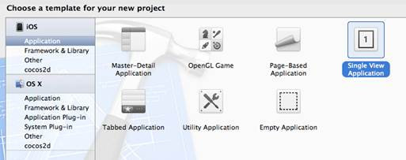

图 2:选择单视图应用程序模板

**产品名称**使用 *HelloWorld* ，组织名称使用您喜欢的任何名称， *edu.self* 为**公司标识符**。确保**设备**设置为 **iPhone** ，并且选择了**使用故事板**和**使用自动参考计数**选项:

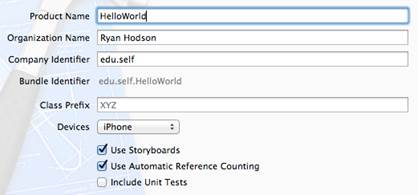

图 3:我们的 HelloWorld 应用的配置

然后，选择一个保存文件的位置，你就有了第一个可以尝试的 iOS 应用。

## 编译应用程序

与从 *Objective-C 简洁地说*开始的命令行应用程序一样，您可以通过单击 Xcode 左上角的 **Run** 按钮或使用 Cmd+R 键盘快捷键来编译项目。但是，不像*客观-简洁地说*，我们的应用程序是一个图形程序，是为 iPhone 设计的。Xcode 不是简单地编译代码并执行它，而是使用 **iOS 模拟器**应用程序启动它。这让我们可以看到我们的应用在 iPhone 上的样子，而不必每次做一点点改变就上传到实际的设备上。我们使用的模板是一个空白项目，所以当您运行它时，您只会看到一个白屏:

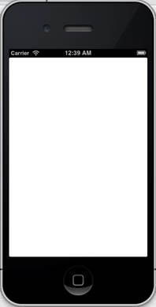

图 4:在 iOS 模拟器中运行 HelloWorld 项目

虽然我们无法用目前的应用程序真正判断，但模拟器是实际 iPhone 环境的相当详细的复制品。您可以点按主页按钮，它将显示我们在模拟器中启动的所有应用程序，以及一些内置应用程序。正如我们稍后将看到的，这让我们可以测试应用程序的各种状态。

## 应用结构概述

在开始编写任何代码之前，让我们简单浏览一下模板提供的文件。本节介绍了我们的 HelloWorld 项目最重要的方面。

### 主上午

与任何 Objective-C 程序一样，应用程序在 **main.m** 的`main()`功能中启动。我们的 HelloWorld 项目的 **main.m** 文件可以在 Xcode 的**项目导航器**面板中的**支持文件**文件夹中找到。模板提供的默认代码应该如下所示:

```objc
    #import <UIKit/UIKit.h>

    #import "AppDelegate.h"

    int main(int argc, char *argv[]) {
        @autoreleasepool {
            return UIApplicationMain(argc,
                                     argv,
                                     nil,
                                     NSStringFromClass([AppDelegate class]));
        }
    }

```

这将通过调用`UIApplicationMain()`函数来启动您的应用程序，并将`[AppDelegate class]`作为最后一个参数传递，告诉应用程序将控制权转移到我们的自定义`AppDelegate`类。我们将在下一节中对此进行更多讨论。

对于大多数应用程序，您永远不必更改默认的**main . m**—任何自定义设置都可以推迟到`AppDelegate`或`ViewController`类。

### AppDelegate.h 和 AppDelegate.m

iOS 架构在很大程度上依赖于**委托设计模式**。这种模式允许一个对象将对其某些任务的控制权转移给另一个对象。例如，每个 iOS 应用程序在内部都表示为一个 [UIApplication](http://developer.apple.com/library/ios/#DOCUMENTATION/UIKit/Reference/UIApplication_Class/Reference/Reference.html) 对象，但是开发人员很少直接创建一个`UIApplication`实例。相反， **main.m** 中的`UIApplicationMain()`函数为您创建了一个，并将其指向一个委托对象，然后该委托对象作为应用程序的根。在我们的 HelloWorld 项目中，自定义`AppDelegate`类的一个实例充当委托对象。

这创建了一个方便的关注点分离:`UIApplication`对象处理发生在幕后的细节，当重要的事情发生时，它简单地通知我们的自定义`AppDelegate`类。这让作为开发人员的您有机会对应用程序生命周期中的重要事件做出反应，而不用担心这些事件是如何被检测或处理的。内置的`UIApplication`实例和我们的`AppDelegate`类之间的关系可以可视化如下:

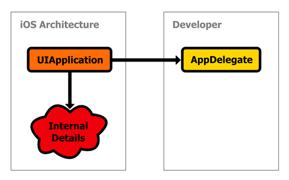

图 5:使用 AppDelegate 作为 UIApplication 的委托对象

回想一下*的目标——简洁地说*协议声明了一组任意类都可以实现的任意方法或属性。由于委托是为了控制任意一组任务而设计的，这使得协议成为代表委托的合理选择。 [UIApplicationDelegate](http://developer.apple.com/library/ios/#documentation/uikit/reference/UIApplicationDelegate_Protocol/Reference/Reference.html) 协议声明了`UIApplication`的委托应该定义的方法，我们可以看到我们的`AppDelegate`类在 **AppDelegate.h** 中采用了它:

```objc
    @interface AppDelegate : UIResponder <UIApplicationDelegate>

```

这就是正式将我们的`AppDelegate`类转变为主`UIApplication`实例的委托的原因。如果您打开 **AppDelegate.m** ，您还会看到以下方法的实现存根:

```objc
    - (BOOL)application:(UIApplication *)application
            didFinishLaunchingWithOptions:(NSDictionary *)launchOptions;
    - (void)applicationWillResignActive:(UIApplication *)application;
    - (void)applicationDidEnterBackground:(UIApplication *)application;
    - (void)applicationWillEnterForeground:(UIApplication *)application;
    - (void)applicationDidBecomeActive:(UIApplication *)application;
    - (void)applicationWillTerminate:(UIApplication *)application;

```

当某些事件在内部发生时，这些方法被`UIApplication`调用。例如，在应用程序启动后立即调用`application:didFinishLaunchingWithOptions:`方法。让我们通过向其中一些方法添加一个`NSLog()`调用来看看这是如何工作的:

```objc
    - (BOOL)application:(UIApplication *)application
            didFinishLaunchingWithOptions:(NSDictionary *)launchOptions {
        NSLog(@"Application has been launched");
        return YES;
    }
    - (void)applicationDidEnterBackground:(UIApplication *)application {
        NSLog(@"Entering background");
    }
    - (void)applicationWillEnterForeground:(UIApplication *)application {
        NSLog(@"Entering foreground");
    }

```

现在，当您编译项目并在 iOS 模拟器中运行它时，它一打开，您就应该看到`Application has been launched`消息。您可以单击模拟器的主页按钮将应用程序移至后台，然后单击主屏幕上的应用程序图标将其移回前台。在内部，点击主页按钮使`UIApplication`实例调用`applicationDidEnterBackground:`:

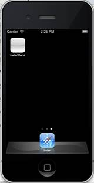

图 6:将 HelloWorld 应用程序移到后台

这将在 Xcode 的输出面板中显示以下消息:


图 7:在 iOS 模拟器中点击主页按钮后的 Xcode 输出

这些`NSLog()`消息向我们展示了应用程序委托背后的基本机制，但是在现实世界中，您会为这些方法编写自定义设置和清理代码。例如，如果您正在使用 OpenGL 创建一个三维应用程序，您将需要停止渲染内容并释放`applicationDidEnterBackground:`方法中的任何相关资源。这确保了您的应用程序在用户关闭后不会占用内存。

总而言之，我们的`AppDelegate`类是我们应用程序的实际入口点。它的工作是定义当应用程序打开、关闭或进入许多其他状态时会发生什么。它通过充当`UIApplication`实例的委托来实现这一点，该实例是整个应用程序的内部表示。

### ViewController.h 和 ViewController.m

在应用程序委托之外，iOS 应用程序遵循模型-视图-控制器(MVC)设计模式。模型封装了应用程序数据，视图是该数据的图形表示，控制器管理模型/视图组件并处理用户输入。

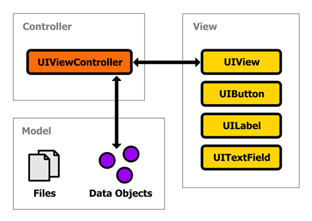

图 iOS 应用程序使用的模型-视图-控制器模式

模型数据通常表示为文件、来自[核心数据](https://developer.apple.com/library/mac/#documentation/Cocoa/Reference/CoreData_ObjC/_index.html)框架的对象或自定义对象。我们在本章中构建的应用程序不需要专用的模型组件；在下一章之前，我们将专注于 MVC 模式的视图和控制器方面。

视图组件由 [UIView](http://developer.apple.com/library/ios/documentation/uikit/reference/uiview_class/uiview/uiview.html) 类表示。它的`UIButton`、`UILabel`、`UITextField`等子类代表特定类型的用户界面组件，`UIView`本身可以作为所有这些对象的通用容器。这意味着组装用户界面实际上只是配置`UIView`实例的问题。对于我们的例子来说，`ViewController`会自动创建一个根`UIView`实例，所以我们不需要手动实例化一个。

而且，你可能已经猜到了，`ViewController`类是我们项目的定制控制器。它的工作是布局所有的用户界面组件，处理用户输入，如按钮点击、文本字段输入等。，并在必要时更新模型数据。你可以把它想象成一个场景经理。

控制器通常继承自 [UIViewController](http://developer.apple.com/library/ios/#documentation/uikit/reference/UIViewController_Class/Reference/Reference.html) 类，该类提供任何视图控制器所需的基本功能。在我们的 HelloWorld 程序中，故事板(在下一节中讨论)会自动为我们实例化根`ViewController`类。

虽然`AppDelegate`是应用程序的*编程*入口点，但是我们的`ViewController`是项目的*图形*根。加载根`UIView`实例后，调用**视图控制器. m** 中的`viewDidLoad`方法。这是我们可以创建新的用户界面组件并将它们添加到场景中的地方(我们稍后会这样做)。

### 主版故事板

我们需要看的最后一个文件是**maintoryboard .故事板**。这是一种特殊类型的文件，它存储应用程序的整个流程，并允许您以可视化方式而不是编程方式编辑它。在 Xcode 的**项目导航器**中选择它，将打开**界面构建器**，而不是普通的源代码编辑器，它应该如下所示:


图 9:我们的 HelloWorld 项目的界面构建器

大片的白色区域被称为**场景**，它代表了 iPhone 上一个屏幕价值的内容。这是您在编译和运行空模板时看到的内容，在这里我们可以通过拖放用户界面组件来直观地创建布局。指向场景左侧的箭头告诉我们，这是我们应用的*根*场景。在它的下面是**码头**，包含代表相关类和其他实体的图标。一旦我们开始在图形组件和我们的定制类之间建立联系，我们就会明白为什么这很重要。

在我们开始添加按钮和文本字段之前，让我们花点时间检查一下 dock 中最左边的黄色图标。首先，通过切换**视图**选择选项卡中的最右侧按钮，确保**实用程序**面板打开:


图 10:显示实用程序面板(以橙色突出显示)

然后，点按 dock 中的黄色图标以选择它:


图 11:选择视图控制器图标

此图标代表场景的控制器。对于我们的项目，这是自定义`ViewController`类的一个实例。我们可以通过选择**实用程序**面板中的**身份**检查器来验证这一点，该面板将显示与控制器相关的类别:


图 12:实用程序面板中的身份检查器

那个**类**字段在故事板的图形界面和我们的源代码之间创建了一个连接。当我们开始从类中访问用户界面组件时，记住这一点很重要。

还值得看一下**属性** **检查器**，这是**实用程序**面板中的下一个选项卡:

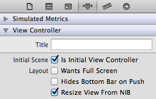

图 13:控制器的属性检查器

**是初始视图控制器**复选框是使这成为*根*场景的原因。每个应用程序都需要恰好有一个根场景，否则 iOS 不会知道如何启动你的应用程序。如果清除该框，指向场景的箭头将消失，当您尝试编译项目时，您将获得以下消息:


图 14:缺少根场景的错误消息

继续之前，确保选择了**是初始视图控制器**。

## 设计用户界面

有两种方法可以设计应用程序的用户界面。您可以通过在源代码中实例化`UIView`和相关类来以编程方式创建图形组件，也可以通过将组件拖到**界面构建器**中来可视化设计布局。本节简要介绍这两种方法。

### 程序布局

我们将从编程方法开始，因为它向我们展示了当我们使用界面构建器构建布局时，幕后发生了什么。请记住，我们`ViewController`的主要工作之一是管理 UI 组件，因此这是我们应该创建布局的地方。在**视图控制器. m** 中，将`viewDidLoad`方法更改如下:

```objc
    - (void)viewDidLoad {
        [super viewDidLoad];

        UIButton *aButton = [UIButton buttonWithType:UIButtonTypeRoundedRect];
        [aButton setTitle:@"Say Hello" forState:UIControlStateNormal];
        aButton.frame = CGRectMake(100.0, 200.0, 120.0, 40.0);
        [[self view] addSubview:aButton];
    }

```

首先，我们创建一个 [UIButton](http://developer.apple.com/library/ios/#documentation/uikit/reference/UIButton_Class/UIButton/UIButton.html) 对象，这是一个按钮的面向对象表示。然后，我们使用`setTitle:forState:`方法定义它的标签。`UIControlStateNormal`常数告诉按钮将该值用于其“向上”状态。所有图形组件都使用`frame`属性来确定它们的位置和方位。它接受一个`CGRect`结构，可以使用`CGRectMake()`便利功能创建。上一个示例告诉按钮将其自身定位在(x=100，y=200)，并使用 120 像素的宽度和 40 像素的高度。最重要的部分是`[[self view] addSubview:aButton]`线。这会将新的`UIButton`对象添加到根`UIView`实例(通过我们的`ViewController`的`view`属性访问)。

编译项目后，您应该会看到 iOS 模拟器中间的按钮:

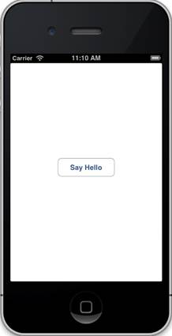

图 15:以编程方式创建一个 UIButton

你可以点击按钮查看默认状态，但实际上让它*做*任何事情都要多花一点功夫。我们将在[连接代码和用户界面组件](#_Connecting_Code_with)部分学习如何做到这一点。

请记住`UIButton`只是可以添加到场景中的众多`UIView`子类之一。幸运的是，所有其他用户界面组件都可以使用相同的过程来管理:实例化一个对象，配置它，并用父级`UIView`的`addSubview:`方法添加它。

### 界面构建器布局

在**界面构建器**中创建组件比编程方法更直观一点，但它本质上在幕后做同样的事情。您所需要做的就是将组件从*对象库*拖到场景中。**对象库**位于**实用程序**面板的底部，如下图所示:


图 16:对象库

在上一个截图中，我们通过从下拉菜单中选择**控件**来选择仅显示用户界面控件。这些是请求用户输入的基本图形组件。

让我们添加另一个**按钮**，以及一个**标签**和一个**文本字段**组件，方法是将相关对象从库中拖到代表根场景的大白色区域上。它们在舞台上之后，您可以通过拖动它们来定位它们，并且可以通过单击目标组件然后拖动其周围的白色方块来调整它们的大小。当您移动组件时，您会注意到虚线指导原则会弹出来帮助您对齐元素并创建一致的边距。尝试将布局安排成类似于图 17 的样子。**告别**按钮应位于 x 轴和 y 轴的中心:

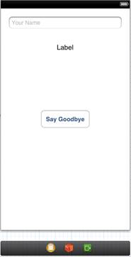

图 17:布局按钮、标签和文本字段组件

要更改按钮中的文本，只需双击它并输入所需的标题(在这种情况下，*说再见*)。**界面构建器**还提供了其他几个工具来编辑组件的外观和行为。例如，您可以在**属性**面板中设置我们文本字段的占位符文本。尝试将其更改为`Your Name`:

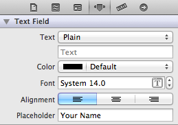

图 18:定义占位符文本

当字段为空时，这将显示一些说明性文本，从用户体验的角度来看，这通常是一个好主意。当你编译你的应用程序时，它应该看起来像这样(注意我们仍然在使用我们在`viewDidLoad`中添加的**打招呼**按钮):


图 19:地狱世界应用程序

如果你点击 iOS 模拟器中的文本字段，它会打开键盘——就像你从任何 iOS 应用程序中所期望的那样。你可以输入文本，但你*不能*关闭键盘。我们将在下一节的*代表*部分解决这个问题。在此之前，不要在测试应用程序时点击文本字段。

正如您可能想象的那样，试图使用编程方法和接口构建器来布局接口可能会有点混乱，因此对于现实世界的应用程序来说，通常最好坚持这两种方法中的一种。

这四个组件是我们这个项目需要的全部，但是请注意，我们只学习了如何将*组件添加到场景中——它们还不能做任何有用的事情。下一步是让这些用户界面组件与我们的代码进行通信。*

## 连接代码和用户界面组件

本节讨论源代码和用户界面组件之间三种最重要的连接类型:操作、出口和委托。**动作**是当特定事件发生时(例如，当用户点击按钮时)应该调用的方法。一个**出口**将一个源代码变量连接到界面构建器中的一个图形组件。我们已经在`AppDelegate`类中与代表合作过，但是这种设计模式在 iOS 的图形方面也很流行。它允许您从任意对象(例如，我们的自定义`ViewController`)控制组件的行为。

就像将组件添加到布局一样，可以通过编程方式或者通过接口生成器将组件连接到自定义类。我们将在接下来的*动作*部分介绍这两种方法，但是我们将依赖接口构建器来实现出口和代理。

### 行动

许多界面控件使用目标动作设计模式来响应用户输入。**目标**是知道如何执行期望动作的对象，**动作**只是方法名称。目标和动作都存储在需要响应用户输入的用户界面组件中，以及应该触发动作的事件中。当事件发生时，组件调用指定目标上的操作方法。

#### 方案行动

`UIButton`继承的 [UIControl](http://developer.apple.com/library/ios/#documentation/uikit/reference/UIControl_Class/Reference/Reference.html) 类定义了一个`addTarget:action:forControlEvents:`方法，允许您将目标动作对附加到事件。例如，我们可以通过将**视图控制器. m** 中的`viewDidLoad`方法更改为以下内容，使我们的*问好*按钮在点击时显示问候:

```objc
    - (void)viewDidLoad {
        [super viewDidLoad];

        UIButton *aButton = [UIButton buttonWithType:UIButtonTypeRoundedRect];
        [aButton setTitle:@"Say Hello" forState:UIControlStateNormal];
        aButton.frame = CGRectMake(100.0, 200.0, 120.0, 40.0);
        [[self view] addSubview:aButton];
        // Configure an action.
        [aButton addTarget:self
                    action:@selector(sayHello:)
          forControlEvents:UIControlEventTouchUpInside];
    }

```

该代码告诉按钮在`UIControlEventTouchUpInside`事件发生时调用`self`上的`sayHello:`方法。当用户释放按钮内部的触摸时，会触发此事件。其他事件由包含在 [UIControl](http://developer.apple.com/library/ios/#documentation/uikit/reference/UIControl_Class/Reference/Reference.html) 中的`UIControlEvents`枚举定义。

当然，为了让前面代码示例中的目标-动作对工作，我们需要定义动作方法。该操作应该接受单个参数，该参数表示触发事件的用户界面组件。在**视图控制器中增加以下方法:**

```objc
    - (void)sayHello:(id)sender {
        NSLog(@"Hello, World!");
    }

```

现在，当您编译项目并点击 iOS 模拟器中的**问好**按钮时，它应该会在 Xcode 输出面板中显示`Hello, World!`。如果你需要访问触发事件的`UIButton`，你可以通过`sender`参数来访问。例如，当您想在用户单击按钮后禁用它时，这可能会很有用。

#### 界面构建器操作

通过界面构建器配置操作需要更多的步骤，但是当使用非编程创建的组件时，它会更直观。在本节中，我们将使用界面构建器为**告别**按钮创建一个动作。

动作需要公开声明，所以我们的第一个任务是在 **ViewController.h** 中添加动作方法:

```objc
    - (IBAction)sayGoodbye:(id)sender;

```

注意`IBAction`返回类型。技术上，这只是`void`的一个`typedef`；然而，将它用作返回类型使 Xcode 和接口构建器意识到这是一个*动作—* 而不仅仅是一个普通的方法。这反映在源代码编辑器中方法旁边的小圆圈中:


图 20: Xcode 将方法识别为动作

接下来，我们需要实现动作方法。在**视图控制器. m** 中，增加以下方法:

```objc
    - (IBAction)sayGoodbye:(id)sender {
        NSLog(@"See you later!");
    }

```

我们将使用界面构建器将该方法连接到**告别**按钮，而不是通过编程将其附加到`addTarget:action:forControlEvents:`上。选择**主控制板.故事板**文件打开界面生成器，在 dock 中选择黄色的**视图控制器**图标:


图 21:选择视图控制器图标

然后，打开**实用程序**面板中最右边的**连接**检查器:

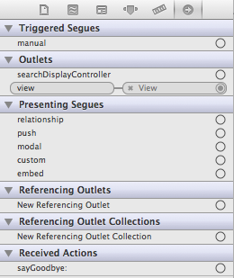

图 22:实用程序面板中的连接选项卡

该面板包含我们的`ViewController`类可用的所有关系。请注意**接收动作**下列出的`sayGoodbye:`方法。这仅仅是因为我们在方法声明中使用了`IBAction`返回类型。

要在`sayGoodbye:`方法和**告别**按钮之间创建连接，请单击**连接**面板中`sayGoodbye:`旁边的圆圈，然后将其拖动到场景中的按钮。当您拖动时，应该会看到一条蓝色的线，如下图所示:


图 23:将 say bypass:方法连接到界面构建器中的 UIButton

当您松开按钮时，将弹出一个菜单，其中包含所有可以触发该操作的可用事件。它应该如下所示:

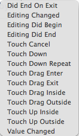

图 24:为动作选择一个事件

选择**内部润色**，相当于我们上一节使用的`UIControlEventTouchUpInside`枚举器。这将在`ViewController`和`UIButton`实例之间创建目标动作连接。本质上，这与我们在上一节中用于**问好**按钮的`addTarget:action:forControlEvents:`呼叫完全相同，但我们完全是通过界面构建器完成的。现在，您应该能够编译项目，并单击**告别**按钮，在输出面板中显示`See you later!`消息。

请注意，我们刚刚创建的连接没有存储为源代码，而是记录在*故事板*中。同样，在源代码和故事板中维护动作可能会令人困惑，因此在现实应用程序中，通常最好坚持一种方法或另一种方法。通常，如果您在界面构建器中创建布局，您也会希望在那里创建连接。

### 网点

插座是一种更简单的连接类型，它将源代码变量与用户界面组件链接起来。这是一项重要的能力，因为它允许您从自定义类访问和操作故事板的属性。出口总是源自自定义类，并由界面构建器中的用户界面组件接收。例如，这个部分创建了一个从名为`messageLabel`的变量到故事板中的`UILabel`组件的出口。这可以可视化如下:

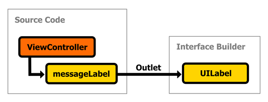

图 25:创建一个从视图控制器类到标签组件的出口

要创建一个出口，我们首先需要声明将与用户界面组件相关联的属性。插座通常配置在控制器中，因此打开**视图控制器. h** 并添加以下属性:

```objc
    @property (weak, nonatomic) IBOutlet UILabel *messageLabel;

```

这看起来像任何其他属性声明，除了新的`IBOutlet`限定符。就像`IBAction`一样，这将属性指定为一个出口，并通过接口生成器使其可用，但不影响变量本身。一旦我们建立了连接，我们可以使用`messageLabel`作为我们添加到故事板的`UILabel`实例的直接引用。

但是在此之前，我们需要综合 **ViewController.m** 中的访问器方法:

```objc
    @synthesize messageLabel = _messageLabel;

```

回到`MainStoryboard.storyboard`，再次选择黄色**查看控制器**图标，查看**连接**检查器:

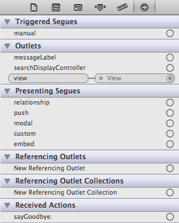

图 26:将消息标签添加到视图控制器后的连接检查器

注意我们刚刚创建的`messageLabel`房产是如何出现在**奥特莱斯**列表中的。我们现在可以将它连接到用户界面组件，就像我们在上一节中对按钮操作所做的那样。单击并从`messageLabel`旁边的圆圈拖动到场景中的`UILabel`，如下所示:

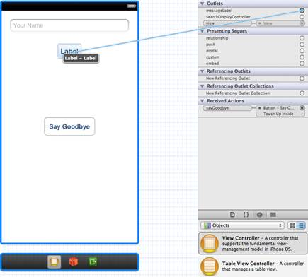

图 27:链接消息标签和构建标签实例

松开鼠标后，将创建插座，您可以使用`messageLabel`在界面构建器中设置[建筑标签](http://developer.apple.com/library/ios/#documentation/uikit/reference/UILabel_Class/Reference/UILabel.html)实例的属性。例如，尝试在**视图控制器. m** 的`sayHello:`和`sayGoodbye:`方法中更改标签的文本和颜色:

```objc
    - (void)sayHello:(id)sender {
        _messageLabel.text = @"Hello, World!";
        _messageLabel.textColor = [UIColor colorWithRed:0.0
                                                  green:0.3
                                                   blue:1.0
                                                  alpha:1.0];
    }

    - (IBAction)sayGoodbye:(id)sender {
        _messageLabel.text = @"See you later!";
        _messageLabel.textColor = [UIColor colorWithRed:1.0
                                                  green:0.0
                                                   blue:0.0
                                                  alpha:1.0];
    }

```

现在，当您编译项目并单击按钮时，它们应该会在标签中显示不同的消息。如您所见，插座是更新界面以响应用户输入或底层数据模型变化的必要工具。

在我们继续委派连接之前，我们需要为我们在界面构建器中添加的`UITextField`设置另一个出口。这将是与`UILabel`完全相同的过程。首先，声明属性并合成其访问器:

```objc
    // ViewController.h
    @property (weak, nonatomic) IBOutlet UITextField *nameField;
    // ViewController.m
    @synthesize nameField = _nameField;

```

然后，打开界面生成器，选择 dock 中黄色的**视图控制器**图标，并确保**连接**检查器可见。要创建连接，请单击并从`nameField`旁边的圆圈拖动到场景中的文本字段组件。在下一部分中，这个出口将允许我们访问用户输入的文本。

### 代表

委托设计模式为用户界面组件提供了与前面讨论的`AppDelegate`相同的目的:它允许组件将其部分职责转移到任意对象。对于我们当前的例子，我们将使用`ViewController`类作为我们添加到故事板的文本字段的委托。与`AppDelegate`一样，这允许我们对重要的文本字段事件做出反应，同时隐藏其内部工作的复杂性。

首先，让我们将`ViewController`类变成文本字段的正式委托。请记住，委托设计模式是通过协议实现的，因此我们所要做的就是告诉**视图控制器. h** 采用`UITextFieldDelegate`协议，如下所示:

```objc
    @interface ViewController : UIViewController <UITextFieldDelegate>

```

接下来，我们需要使用接口生成器连接文本字段和`ViewController`类。这种连接与我们在上一节中创建的出口方向相反，因此我们需要从文本字段拖动到`ViewController`，而不是从`ViewController`拖动到用户界面组件。在界面构建器中，选择文本字段组件并打开**连接**面板。您应该会在**网点**部分看到一个**委托**字段:


图 28:文本字段组件的连接面板的开始

要创建代理连接，请从**代理**旁边的圆圈拖动到 dock 中的黄色**视图控制器**图标:

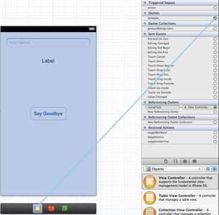

图 29:创建从文本字段到视图控制器的委托连接

现在，`ViewController`可以通过实现[中定义的方法来控制文本字段的行为。我们对`textFieldShouldReturn:`方法感兴趣，当用户点击键盘上的**返回**按钮时会调用该方法。在 **ViewController.m** 中，执行如下方法:](http://developer.apple.com/library/ios/#documentation/uikit/reference/UITextFieldDelegate_Protocol/UITextFieldDelegate/UITextFieldDelegate.html)

```objc
    - (BOOL)textFieldShouldReturn:(UITextField *)textField {
        self.name = textField.text;
        if (textField == self.nameField) {
            [textField resignFirstResponder];
        }
        return YES;
    }

```

这将用户按下**返回**按钮后输入的值(`textField.text`)保存到`name`属性中。然后，我们通过使用`resignFirstResponder`方法从文本字段中移除焦点来使键盘消失。`textField == self.nameField`条件是确保我们使用正确组件的最佳实践(除非`ViewController`是多个文本字段的委托，否则这实际上不是必需的)。请注意，我们仍然需要声明**视图控制器. h** 中的`name`字段:

```objc
    @property (copy, nonatomic) NSString *name;

```

以这种方式隔离专用属性中的模型数据总是比直接依赖存储在用户界面组件中的值更好。这确保了它们将是可访问的，即使用户界面组件在此期间已被移除或更改。我们的最后一步是使用这个新的`name`属性来个性化`sayHello:`和`sayGoodbye:`中的消息。在**视图控制器. m** 中，将这两种方法改为如下:

```objc
    - (void)sayHello:(id)sender {
        if ([self.name length] == 0) {
            self.name = @"World";
        }
        _messageLabel.text = [NSString stringWithFormat:@"Hello, %@!"
                                                        self.name];
        _messageLabel.textColor = [UIColor colorWithRed:0.0
                                                  green:0.3
                                                   blue:1.0
                                                  alpha:1.0];
    }

    - (IBAction)sayGoodbye:(id)sender {
        if ([self.name length] == 0) {
            self.name = @"World";
        }
        _messageLabel.text = [NSString stringWithFormat:@"See you later, %@!",
                                                        self.name];
        _messageLabel.textColor = [UIColor colorWithRed:1.0
                                                  green:0.0
                                                   blue:0.0
                                                  alpha:1.0];
    }

```

现在，您应该能够编译应用程序，编辑文本字段组件，关闭键盘，并在单击**问好**和**告别**按钮时看到结果值。


图 30:实现文本字段组件

## 总结

本章介绍了 iOS 开发的基础。我们了解了项目的基本文件结构:主文件、应用程序委托、自定义视图控制器和故事板。我们还通过以编程方式向舞台添加组件以及在界面构建器中可视化编辑组件来设计布局。而且，为了使我们的代码能够与故事板中的按钮、标签和文本字段进行通信，我们使用界面构建器创建了动作、出口和委托连接。

创建这样一个简单的应用程序需要做大量的工作，但是我们现在几乎拥有了构建真实应用程序所需的所有技能。一旦我们理解了连接代码和用户界面元素以及捕获用户输入背后的基本工作流程，剩下的就是探索单个组件/框架的功能，并使它们协同工作。

下一章通过遍历一个更复杂的应用程序来充实我们在前面的例子中所掩盖的一些主题。我们将学习场景之间转换的 segues，我们也将有机会更详细地讨论模型-视图-控制器模式。