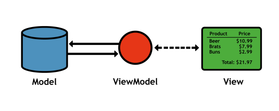
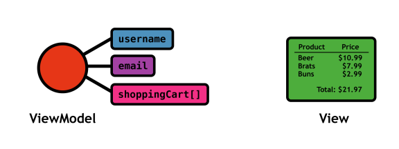

# 第 1 章概念概述

淘汰赛. js 使用模型-视图-视图模型(MVVM)设计模式，这是经典模型-视图-控制器(MVC)模式的变体。与 MVC 模式一样，**模型**是您存储的数据，**视图**是该数据的可视化表示。但是，淘汰赛没有使用控制器，而是使用一个**视图模型**作为模型和视图之间的中介。

视图模型是模型数据的 JavaScript 表示，以及用于操作数据的相关函数。knowledge . js 在 ViewModel 和视图之间创建了直接连接，这就是它如何检测底层数据的变化并自动更新用户界面的相关方面。

图 5:模型-视图-视图模型设计模式

购物车示例的 MVVM 组件如下所示:

*   **模型:**存储在数据库、cookie 或其他一些持久存储中的用户购物车的内容。淘汰赛. js 并不关心您的数据是如何存储的，而是由您来决定模型存储和淘汰赛. js 之间的通信。通常，您将通过 AJAX 调用来保存和加载模型数据。
*   **视图:**向用户显示的 HTML/CSS 购物车页面。将视图连接到视图模型后，当视图模型改变时，它将自动显示新的、删除的和更新的项目。
*   **ViewModel:** 表示购物车的纯 JavaScript 对象，包括项目列表和用于与模型交互的保存/加载方法。将您的 HTML 视图与视图模型连接后，您的应用程序只需要担心如何操作这个对象。

## 看得见的

淘汰赛. js 使用**可观察到的**来跟踪视图模型的属性。从概念上来说，observables 的行为就像普通的 JavaScript 变量一样，但是它们让 knowledge . js*观察*它们的变化，并自动更新视图的相关部分。

图 6:使用可观察的东西展示视图模型属性

## 粘合剂

仅可观察的*暴露*视图模型的属性。要将视图中的用户界面组件连接到特定的可观察对象，您必须将一个 HTML 元素绑定到它上面**。在将一个元素绑定到一个可观察到的对象之后，淘汰赛. js 就可以自动显示视图模型的变化了。**

图 7:将用户界面组件绑定到可观察的属性

敲除. js 包括几个内置绑定，它们决定了可观察的对象在用户界面中的显示方式。最常见的绑定类型是简单地显示观察到的属性的值，但是也可以在特定条件下更改其外观，或者在用户单击元素时调用视图模型的方法。所有这些用例将在接下来的几章中讨论。

## 摘要

模型-视图-视图模型设计模式、可观察的对象和绑定为淘汰赛. js 库提供了基础。一旦你理解了这些概念，学习 knowledge . js 就是一件简单的事情，弄清楚如何通过各种内置绑定来访问观察对象和操纵它们。在下一章中，我们将通过构建一个简单的“你好，世界！”应用程序。