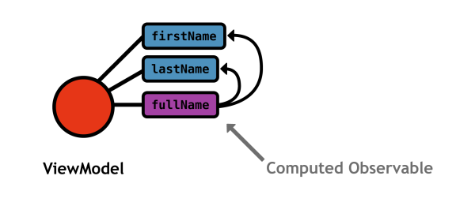
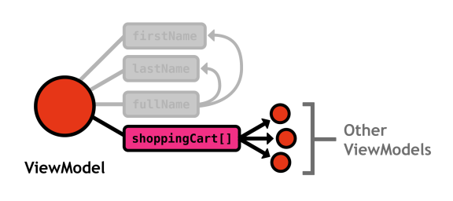

# 三、可观测对象

我们已经看到了当底层数据发生变化时，可观测的属性是如何让敲除器自动更新 HTML 元素的，但这只是它们实用的开始。knowledge . js 还提供了另外两种展示 ViewModel 属性的方式:计算可观测值和可观测数组。总之，这些为数据驱动的用户界面打开了一个全新的可能性世界。

**计算可观测值**允许您创建动态生成的属性。这意味着您可以将几个正常的可观测值组合成一个属性，每当任何基础值发生变化时，敲除. js 仍然会保持视图最新。



图 12:依赖于两个正常可观测值的计算可观测值

**可观测数组**结合了 cancel . js 的可观测能力和原生 JavaScript 数组。像本机数组一样，它们包含您可以操作的项目列表。但是由于它们是可观测的，所以每当添加或删除项目时，knockout. js 都会自动更新任何相关的 HTML 元素。



图 13:包含其他视图模型的可观测数组

组合观察值的能力，以及处理项目列表的能力，提供了视图模型中所需的所有数据结构。本章通过一个简单的购物车界面介绍了这两个主题。

## 计算的可观测值

首先，我们将从一个简单的计算可观测值开始。在`PersonViewModel`的`firstName`和`lastName`可观测值下，创建`fullName`计算可观测值:

样本代码:item5.htm

```js
          this.fullName = ko.computed(function() {         return this.firstName() + " " + this.lastName();       }, this);

```

这定义了一个匿名函数，每当访问`PersonViewModel.fullName`时，该函数都会返回该人的全名。从现有组件(`firstName`和`lastName`)动态生成全名可以防止我们存储冗余数据，但这只是成功的一半。我们需要将这个函数传递给`ko.computed()`来创建一个计算的可观测值。这告诉knockout. js，每当`firstName`或`lastName`发生变化时，它需要更新任何绑定到`fullName`属性的 HTML 元素。

让我们通过将“约翰的购物车”行绑定到`fullName`而不是`firstName`来确保我们计算的可观测值有效:

```js
    <p><span data-bind='text: fullName'></span>'s Shopping Cart</p>

```

现在你的页面应该是“约翰·史密斯的购物车”接下来，让我们确保当我们更改一个底层属性时，knockout. js 保持这个 HTML 元素同步。绑定`PersonViewModel`实例后，尝试更改其`firstName`属性:

```js
        var vm = new PersonViewModel();     ko.applyBindings(vm);     vm.firstName("Mary");

```

这应该会将该行更改为“玛丽·史密斯的购物车”同样，请记住，读取或设置可观测值应该通过函数调用来完成，而不是赋值(`=`)运算符。

计算出的可观测值提供了许多与敲除. js 的视图自动同步相同的好处。计算的可观测值让您可以围绕原子属性构建应用程序，并将依赖关系跟踪委托给 Lenking . js，而不必跟踪哪些属性依赖于 ViewModel 的其他部分。

## 可观测阵列

可观测的数组可以让 Lenking . js 跟踪项目列表。我们将通过为用户创建购物车显示页面来探索这一点。首先，我们需要创建一个自定义对象来表示产品。在我们的脚本顶部，在定义`PersonViewModel`之前，添加以下对象定义:

样本代码:item6.htm

```js
        function Product(name, price) {       this.name = ko.observable(name);       this.price = ko.observable(price);     }

```

这只是一个存储一些属性的简单数据对象。请注意，可以给多个对象提供可观测的属性，knockout. js 将自行管理所有的相互依赖关系。换句话说，可以在单个应用程序中创建多个视图模型之间的关系。

接下来，我们将创建几个新的`Product`类的实例，并将它们添加到用户的虚拟购物车中。在`PersonViewModel`内部，定义一个新的可观测属性，称为`shoppingCart`:

```js
        this.shoppingCart = ko.observableArray([       new Product("Beer", 10.99),       new Product("Brats", 7.99),       new Product("Buns", 1.49)     ]);

```

这是一个本机的 JavaScript 数组，包含三个包装在一个可观测数组中的产品，这样 Quicken . js 就可以跟踪添加和删除项目的时间。但是，在我们开始操作对象之前，让我们更新我们的视图，以便我们可以看到`shoppingCart`属性的内容。在`<p>`标签下方，添加以下内容:

样本代码:item6.htm

```js
      <table>
        <thead><tr>
          <th>Product</th>
          <th>Price</th>
        </tr></thead>
        <tbody data-bind='foreach: shoppingCart'>
          <tr>
            <td data-bind='text: name'></td>
            <td data-bind='text: price'></td>
          </tr>
        </tbody>
      </table>

```

这是一个典型的 HTML 5 表格，包含一列产品名称和另一列产品价格。这个例子还引入了一个名为`foreach`的新绑定。当knockout遇到`foreach: shoppingCart`时，它会遍历视图模型的`shoppingCart`属性中的每个项目。循环中的任何标记都是在每个项目的上下文中评估的，所以`text: name`实际上指的是`shoppingCart[i].name`。结果是一张物品及其价格的表格:


图 14:呈现的产品列表的截图

`foreach`绑定的细节不在本章范围内。下一章提供了对`foreach`的深入讨论，同时也介绍了 knowledge . js 的其他控制流绑定。现在，让我们回到可观测的数组。

### 添加项目

使用可观测的数组的全部意义在于，每当我们添加或移除项目时，都可以让 Lenking . js 同步视图。例如，我们可以在视图模型上定义一个添加新项目的方法，如下所示:

样本代码:item7.htm

```js
          this.addProduct = function() {          this.shoppingCart.push(new Product("More Beer", 10.99));       }; 

```

然后，我们可以创建一个按钮来调用该方法，这样我们就可以在运行时添加项目，并看到 Lenking . js 使列表保持最新。在视图代码中的“签出”按钮旁边，添加以下内容:

```js
      <button data-bind='click: addProduct'>Add Beer</button>

```

当你点击此按钮时，视图模型的`addProduct()`方法被执行。而且，由于`shoppingCart`是一个可观测的数组，所以knockout. js 会插入另一个`<tr>`元素来显示新项目。与每当我们更改底层数组时试图手动更新`<table>`相比，让knockout. js 跟踪这样的列表项更不容易出错。

还值得指出的是，knockout. js 总是使同步用户界面所需的*最小化*变化量。不是每次添加或删除一个项目就重新生成整个列表，knockout. js 跟踪 DOM 的哪些部分受到影响，并且只更新*那些元素。这种内置的优化可以将您的应用程序扩展到数百甚至数千个项目，而不会牺牲响应能力。*

### 删除项目

类似地，knockout. js 也可以通过`remove()`方法从可观测的数组中删除项目。在`PersonViewModel`定义中，添加另一种移除项目的方法:

样本代码:item8.htm

```js
          this.removeProduct = function(product) {         this.shoppingCart.remove(product);       };

```

然后，在`<tbody>`循环中为每个项目添加一个删除按钮:

```js
            <tr>
              <td data-bind='text: name'></td>
              <td data-bind='text: price'></td>
              <td><button data-bind='click: $root.removeProduct'>Remove</button></td>
            </tr>

```

因为我们在`foreach`上下文中，我们必须使用`$root`引用来访问我们的视图模型，而不是循环中的当前项目。如果我们试图在没有这个引用的情况下调用`removeProduct()`，那么knockout. js 就会试图调用`Product`类上的方法，而这个方法是不存在的。下一章将介绍`foreach`的所有可用绑定上下文。

我们在`foreach`循环中的事实也弄乱了`removeProduct()`中的`this`引用，所以点击**移除**按钮实际上会抛出`TypeError`。我们可以使用一个常见的 JavaScript 技巧来解决这类范围问题。在`PersonViewModel`定义的顶部，将`this`分配给一个名为`self`的新变量:

```js
        function PersonViewModel() {       var self = this;       ...

```

然后，用`removeProduct()`法中的`self`代替`this`:

```js
          this.removeProduct = function(product) {         self.shoppingCart.remove(product);       };

```

您现在应该能够使用**添加啤酒**和**移除**按钮来操作我们的可观测阵列。还要注意的是，knockout. js 会自动将循环中的当前项目作为第一个参数添加到`removeProduct()`中。

### 销毁物品

`remove()`方法对于列表的实时操作很有用，但是一旦您开始尝试将数据从视图模型发送到服务器端脚本，它就会变得很麻烦。

例如，考虑用户每次添加或删除商品时将购物车保存到数据库的任务。通过`remove()`，该项目将立即被删除*，因此您所能做的就是向您的服务器发送完整的新列表—无法确定哪些项目被添加或删除。您要么保存整个列表，要么手动找出存储在数据库中的前一个版本和从 AJAX 请求传入的新版本之间的区别。*

 *这两个选项都不是特别有效，尤其是考虑到 Quicken . js 精确地知道哪些项目被移除了。为了纠正这种情况，可观测阵列包括一种`destroy()`方法。尝试将`PersonViewModel.removeProduct()`更改为以下内容:

样本代码:item9.htm

```js
          this.removeProduct = function(product) {         self.shoppingCart.destroy(product);         alert(self.shoppingCart().length);       };

```

现在当你点击**移除**按钮时，knockout. js *不会*从底层数组中移除该项目。这显示在警告消息中，当您单击“删除”时，该消息应该会减少*而不是*方法`destroy()`不是改变列表，而是给产品添加一个`_destroy`属性，并将其设置为`true`。您可以通过添加另一条警报消息来显示此属性:

```js
            alert(product._destroy);

```

`_destroy`属性可以对一个可观测的列表进行排序，并且只拉出已经被删除的项目。然后，您可以仅将*那些项目发送到服务器端脚本进行删除。当处理 AJAX 请求时，这是一种更有效的管理列表的方法。*

 *请注意,`foreach`循环知道这个约定，并且仍然从视图中移除相关的`<tr>`元素，即使该项保留在底层数组中。

### 其他数组方法

从内部来说，可观测数组就像普通的可观测属性一样，只是它们由本机 JavaScript 数组而不是字符串、数字或对象支持。与普通的可观测值一样，您可以通过调用不含任何属性的可观测数组来访问基础值:

样本代码:item10.htm

```js
          this.debugItems = function() {         var message = "";         var nativeArray = this.shoppingCart();         for (var i=0; i<nativeArray.length; i++) {           message += nativeArray[i].name + "\n";         }         alert(message);       };

```

调用此方法将循环遍历本机列表的项目，并且它还提供对本机 JavaScript 数组方法的访问，如`push()`、`pop()`、`shift()`、`sort()`等。

然而，knockout. js 在可观测的数组对象上定义了*自己的*版本。例如，在本章前面，我们使用`shoppingCart.push()`来添加一个项目，而不是`shoppingCart().push()`。前者在原生 JavaScript 数组上调用“knockout. js”版本，后者调用`push()`。

通常使用敲除. js 的数组方法比直接访问底层数组好得多，因为它允许敲除. js 自动更新任何相关的视图组件。knockout. js 提供的可观测数组方法的完整列表如下。其中大多数行为与它们的原生 JavaScript 对应物完全一样。

*   `push()`
*   `pop()`
*   `unshift()`
*   `shift()`
*   `slice()`
*   `remove()`
*   `removeAll()`
*   `destroy()`
*   `destroyAll()`
*   `sort()`
*   `reversed()`
*   `indexOf()`

## 摘要

在这一章中，我们看到了如何使用计算出的可观测值来将正常的可观测值组合成敲除. js 可以跟踪的复合属性。我们还使用了可观测的数组，这是一种使视图模型中的数据列表与 HTML 组件同步的方法。

原子的、计算的和数组的可观测值一起提供了典型用户界面所需的所有底层数据类型。计算出的可观测值和可观测数组使得敲除成为快速原型开发的一个很好的选择。它们可以让你把所有复杂的功能放在一个地方，然后让knockout. js 处理剩下的部分。

例如，创建一个计算出的可观测值来计算`shoppingCart`列表中每个项目的总价格并将其显示在页面底部是很简单的。一旦你创建了这个功能，你就可以在任何你需要总价的地方重用它(例如，一个 AJAX 请求)，只需要访问一个视图模型属性。

下一章介绍控制流绑定。我们在本章中使用的`foreach`绑定可能是最常见的控制流工具，但是 cancel . js 还包含了一些用于对我们的 HTML 视图组件进行细粒度控制的绑定。**