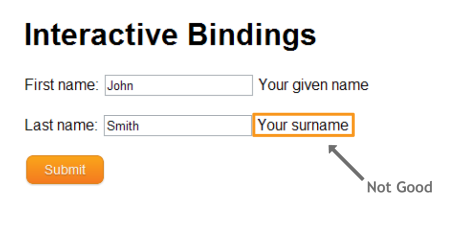
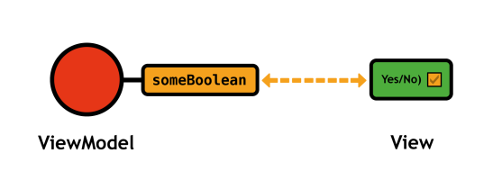
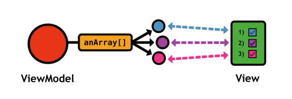

# 六、交互绑定

表单元素是通过网页与用户交互的常规方式。在 Denuke . js 中使用表单与使用外观绑定非常相似。但是，因为用户可以编辑表单域，所以knockout. js 管理两个方向的更新*。这意味着交互绑定是*双向的*。它们可以通过编程设置，视图将相应更新，*或*它们可以通过视图设置并通过编程读取。*

 *

图 19:knockout. js 在两个方向传播变化

例如，您可以从视图模型中设置文本输入字段的值，它将显示在视图中。但是，用户在输入字段中键入一些内容也会导致视图模型上的相关属性更新。关键是，knockout. js 总是确保视图和视图模型是同步的。

knockout. js 包括 11 个用于与用户交互的绑定:

*   `click: <method>`—单击元素时调用 ViewModel 方法。
*   `value: <property>`-将表单元素的值链接到视图模型属性。
*   `event: <object>`—当用户发起的事件发生时，调用一个方法。
*   `submit: <method>`—提交表单时调用方法。
*   `enable: <property>`—基于某个条件启用表单元素。
*   `disable: <property>`—根据特定条件禁用表单元素。
*   `checked: <property>`-将单选按钮或复选框链接到视图模型属性。
*   `options: <array>`-用视图模型数组定义`<select>`元素。
*   `selectedOptions: <array>`-在`<select>`字段中定义活动元素。
*   `hasfocus: <property>`—定义元素是否聚焦。

像上一章中介绍的外观绑定一样，这些都是在 HTML 元素的数据绑定属性中定义的。它们中的一些(像`click`绑定)对任何元素都有效，但是其他的(像`checked`)只能用于特定的元素。

使用knockout. js 管理 HTML 表单的一个主要好处是你*仍然*只需要担心数据。每当用户更改表单元素的值时，视图模型将自动反映该更新。这使得将用户输入集成到应用的其余部分变得非常容易。

## 一个超文本标记语言表单

本章使用一个新的 HTML 页面作为运行示例。我们将使用新客户登记表，而不是购物车显示页面。创建一个名为`interactive-bindings.html`的新 HTML 文件，并添加以下内容:

样本代码:item017.htm

```js
    <html lang='en'> <head>   <title>Interactive Bindings</title>   <meta charset='utf-8' />   <link rel='stylesheet' href='../style.css' /> </head> <body>
      <h1>Interactive Bindings</h1>

      <form action="#" method="post">
        <!-- ToDo -->
      </form>

      <script type='text/javascript' src='knockout-2.1.0.js'></script>
      <script type='text/javascript'>     function PersonViewModel() {       var self = this;       this.firstName = ko.observable("John");       this.lastName = ko.observable("Smith");     }
         ko.applyBindings(new PersonViewModel());   </script> </body> </html>

```

这是我们在整本书中使用的内容的简化版本。在本章中，我们将只关注*配置*表单元素。处理表单提交留待下一章。

## 点击绑定

`click`绑定是最简单的交互绑定之一。它只是在用户单击元素时调用视图模型的一个方法。例如，在`<form>`元素内添加以下按钮:

```js
    <p><button data-bind='click: saveUserData'>Submit</button></p>

```

当用户点击按钮时，敲除. js 调用`PersonViewModel`上的`saveUserData()`方法。此外，它将两个参数传递给处理程序方法:当前模型和 DOM 事件。利用这两个参数的`saveUserData()`方法看起来类似于:

```js
          this.saveUserData = function(model, event) {         alert(model.firstName() + " is trying to checkout!");         if (event.ctrlKey) {           alert("He was holding down the Control key for some reason.");         }       };

```

在这个特定的例子中，`model`指的是顶级视图模型实例，`event`是由用户点击触发的 DOM 事件。模型参数将始终是*当前的*视图模型，这使得在`foreach`循环中访问单个列表项成为可能。这就是我们如何实现[第三章](03.html#_Chapter_3_)中的`removeProduct()`方法。

## 绑定值

`value`装帧与我们在本书中一直使用的文字装帧非常相似。关键区别在于可以由*用户*更改，ViewModel 也会相应更新。例如，我们可以通过在表单中添加以下 HTML(在`<button>`之前)，将`firstName`和`lastName`观察点与输入字段链接起来:

```js
        <p>First name: <input data-bind='value: firstName' /></p>
        <p>Last name: <input data-bind='value: lastName' /></p>

```

`value: firstName`绑定确保了`<input>`元素的文本始终与视图模型的`firstName`属性相同，无论它是由用户还是由您的应用更改的。`lastName`物业也是如此。


图 20:可观测值和表单域之间的双向连接

我们可以通过包含一个显示用户名的按钮和另一个以编程方式设置用户名的按钮来进一步研究这个问题。这让我们从两端看到`value`绑定是如何工作的:

```js
        <p>
          <button data-bind='click: displayName'>
            Display Name
          </button>
          <button data-bind='click: setName'>
            Set Name
          </button>
        </p>

```

处理程序方法应该如下所示:

样本代码:item019.htm

```js
          this.displayName = function() {         alert(this.firstName());       };       this.setName = function() {         this.firstName("Bob");       };

```

单击**显示名称**将读取视图模型的`firstName`属性，该属性应与`<input>`元素匹配，即使它已经被用户编辑过。**设置名称**按钮设置视图模型的属性值，导致`<input>`元素更新。后者的行为本质上与正常`text`绑定相同。

同样，这种双向同步背后的全部意义是让您专注于数据。设置好`value`绑定后，就可以完全忘记 HTML 表单元素了。只需在 ViewModel 上获取或设置关联的属性，knockout. js 将处理剩下的事情。

我们不需要`displayName`和`setName`方法或它们各自的按钮，所以如果你愿意，你可以删除它们。

## 绑定事件

`event`绑定允许您监听任何 HTML 元素上的任意 DOM 事件。这就像是通用版的`click`绑定。但是，因为它可以监听多个事件，所以它需要一个对象来将事件映射到方法(这类似于`attr`绑定的参数)。例如，我们可以在第一个`<input>`元素上使用以下内容来监听`mouseover`和`mouseout`事件:

```js
        <p data-bind='event: {mouseover: showDetails, mouseout: hideDetails}'>
          First name: <input data-bind='value: firstName' />
        </p>

```

当用户触发`mouseover`事件时，knockout. js 调用我们视图模型的`showDetails()`方法。同样，当他或她离开元素时，会调用`hideDetails()`。这两者都采用与`click`绑定的处理程序相同的参数:事件的目标和事件对象本身。现在让我们实现这些方法:

```js
          this.showDetails = function(target, event) {           alert("Mouse over");       };       this.hideDetails = function(target, event) {           alert("Mouse out");       };

```

现在，当您与**名字**字段交互时，您应该会看到两条消息都弹出来了。但是，我们不要仅仅显示一条警告消息，让我们在用户滚动表单字段时显示一些额外的信息。为此，我们需要在`PersonViewModel`上进行另一个观察:

```js
          this.details = ko.observable(false);

```

`details`属性充当一个切换开关，我们可以使用事件处理程序方法来打开和关闭它:

```js
          this.showDetails = function(target, event) {         this.details(true);       };       this.hideDetails = function(target, event) {         this.details(false);       };

```

然后我们可以将切换与`visible`绑定相结合，在视图中显示或隐藏表单域的详细信息:

样本代码:item020.htm

```js
        <p data-bind='event: {mouseover: showDetails, mouseout: hideDetails}'>
          First name: <input data-bind='value: firstName' />
          <span data-bind='visible: details'>Your given name</span>
        </p>

```

当您将鼠标悬停在**名字**字段上时，`<span>`的内容会出现，当您将鼠标移出时，该内容会消失。这非常接近我们想要的功能，但是一旦我们想要显示多个表单域的详细信息，事情就会变得更加复杂。因为我们只有一个切换变量，显示细节是一个全有或全无的命题——要么显示所有字段的*的细节，要么不显示。*

 *

图 21:同时切换所有表单域细节

解决这个问题的一种方法是向处理函数传递一个自定义参数。

### 带有自定义参数的事件处理程序

可以将视图中的自定义参数传递给事件处理程序。这意味着您可以从视图中访问任意信息到视图模型中。在我们的例子中，我们将使用一个自定义参数来标识哪个表单域应该显示它的详细信息。可观测到的`details`将包含代表所选元素的字符串，而不是切换。首先，我们将对视图模型进行一些细微的修改:

```js
          this.details = ko.observable("");
           this.showDetails = function(target, event, details) {         this.details(details);       }       this.hideDetails = function(target, event) {         this.details("");       }

```

这里唯一的大变化是在`showDetails()`方法中增加了一个`details`参数。我们不需要`hideDetails()`功能的自定义参数，因为它只是清除了细节`observable`。

接下来，我们将使用`event`绑定中的函数文字将自定义参数传递给`showDetails()`:

```js
        <p data-bind='event: {mouseover: function(data, event) {          showDetails(data, event, "firstName")        }, mouseout: hideDetails}'>

```

`mouseover`的函数文字是我们的`showDetails()`处理程序的包装器，提供了一种简单的方法来传递额外的信息。`mouseout`处理器保持不变。最后，我们需要更新包含详细信息的`<span>`:

```js
          <span data-bind='visible: details() == "firstName"'>Your given name</span>

```

**名字**表单域应该在鼠标悬停时显示其详细描述，在鼠标移出时隐藏，就像上一节一样。只是现在，可以通过更改自定义参数向多个字段添加详细信息。例如，您可以通过以下方式启用**姓氏**输入元素的详细信息:

```js
        <p data-bind='event: {mouseover: function(data, event) {          showDetails(data, event, "lastName")        }, mouseout: hideDetails}'>
          Last name: <input data-bind='value: lastName' />
          <span data-bind='visible: details() == "lastName"'>Your surname</span>

```

事件绑定的设置可能有点复杂，但是一旦你理解了它们是如何工作的，它们就为反应式设计提供了无限的可能性。`event`绑定甚至可以连接到 jQuery 的动画功能，这将在[第 8 章](08.html#_Chapter_8_)中讨论。现在，我们将完成对剩下的knockout. js 交互绑定的探索。幸运的是，它们都没有`event`绑定复杂。

## 启用/禁用绑定

`enable`和`disable`绑定可用于根据特定条件启用或禁用表单域。例如，假设您想为每个用户记录一个主要电话号码和一个次要电话号码。这些可以作为正常观察值存储在`PersonViewModel`上:

```js
          this.primaryPhone = ko.observable("");       this.secondaryPhone = ko.observable("");

```

可观测到的`primaryPhone`可以通过正常的`value`绑定链接到表单域:

```js
        <p>
          Primary phone: <input data-bind='value: primaryPhone' />
        </p>

```

但是，没有指定主要电话号码就输入次要电话号码没有多大意义，所以只有当`primaryPhone`不为空时，我们才会为次要电话号码激活`<input>`:

```js
        <p>
          Secondary phone: <input data-bind='value: secondaryPhone,           enable: primaryPhone' />
        </p>

```

现在，用户只有在输入了`primaryPhone`的值后，才能与**辅助电话**字段进行交互。`disable`绑定是否定条件的便捷方式，但在其他方面与`enable`完全一样。

## 选中的绑定

`checked`是一个多功能绑定，根据您使用它的方式，它会显示不同的行为。一般来说，`checked`绑定用于选择和取消选择 HTML 的可检查表单元素:复选框和单选按钮。

### 简单复选框

让我们从一个简单的复选框开始:

```js
        <p>Annoy me with special offers: <input data-bind='checked: annoyMe' type='checkbox' /></p>

```

这将为我们的表单添加一个复选框，并将其链接到视图模型的`annoyMe`属性。一如既往，这是一个双向连接。当用户选择或取消选择该框时，淘汰机. js 会更新视图模型，当您设置视图模型属性的值时，它会更新视图。别忘了定义`annoyMe`的可观测性:

```js
          this.annoyMe = ko.observable(true);

```

以这种方式使用`checked`绑定就像在单个复选框和布尔可观测值之间创建一对一的关系。



图 22:用一个复选框连接一个布尔可观测值

### 复选框数组

也可以使用`checked`绑定数组。当您将复选框绑定到可观测的数组时，选定的框对应于数组中包含的元素，如下图所示:



图 23:用多个复选框连接一个可观测的数组

例如，考虑以下观察到的情况:

```js
          this.annoyTimes = ko.observableArray(['morning', 'evening']);

```

我们可以使用每个`<input>`元素上的`value`属性将这个可观测数组中的项目连接到复选框:

样本代码:item022.htm

```js
        <p>Annoy me with special offers: <input data-bind='checked: annoyMe' type='checkbox' /></p>
        <div data-bind='visible: annoyMe'>
          <div>
            <input data-bind='checked: annoyTimes'                value='morning'                type='checkbox' />
            In the morning
          </div>
          <div>
            <input data-bind='checked: annoyTimes'                value='afternoon'                type='checkbox' />
            In the afternoon
          </div>
          <div>
            <input data-bind='checked: annoyTimes'                value='evening'                type='checkbox' />
            In the evening
          </div>
        </div>

```

这使用了前一章的`annoyMe`属性来切换复选框列表，以便选择什么时候是生气的好时机。由于`value='morning'`在第一个复选框上，所以只要`"morning"`字符串在`annoyTimes`数组中，它就会被选中。其他复选框也是如此。`"morning"`和`"evening"`是数组的初始内容，所以你应该会在你的网页中看到如下内容:


图 24:显示`annoyTimes`可观测阵列初始状态的复选框

由于我们使用的是*可观测的*数组，连接是双向的——取消选择任何一个框都将从`annoyTimes`数组中移除相应的字符串。

### 单选按钮

`checked`绑定的最后一个上下文在单选按钮组中。单选按钮不是布尔或数组，而是将其`value`属性连接到视图模型中的字符串属性。例如，我们可以通过首先将可观测到的`annoyTimes`更改为字符串，将复选框数组变成单选按钮组:

```js
          this.annoyTimes = ko.observable('morning');

```

然后，我们所要做的就是将`<input>`元素变成单选按钮:

```js
            <input data-bind='checked: annoyTimes'                value='morning'                type='radio'                name='annoyGroup' />

```

每个`<input>`都应该以`"radio"`为其`type`，以`"annoyGroup"`为其`name`。后者与knockout. js 没有任何关系——它只是将它们全部添加到同一个 HTML 单选按钮组中。现在，所选单选按钮的`value`属性将始终存储在`annoyTimes`属性中。


图 25:用多个单选按钮连接一个可观测的字符串

## 选项绑定

`options`绑定定义了`<select>`元素的内容。这可以采用下拉列表或多选列表的形式。首先，我们来看看下拉列表。让我们再次编辑`annoyTimes`属性:

```js
          this.annoyTimes = ko.observableArray([         'In the morning',         'In the afternoon',         'In the evening'       ]);

```

然后我们可以将其绑定到一个`<select>`字段:

```js
        <div data-bind='visible: annoyMe'>
          <select data-bind='options: annoyTimes'></select>
        </div>

```

您现在应该有一个下拉列表，而不是单选按钮组，但是如果您不知道选择了哪个项目，那么有这样的列表是没有用的。为此，我们可以重用本章前面的`value`绑定:

```js
          <select data-bind='options: annoyTimes, value: selectedTime'></select>

```

这决定了视图模型上的哪个属性包含选定的字符串。我们仍然需要定义这个属性:

样本代码:item024.htm

```js
          this.selectedTime = ko.observable('In the afternoon');

```

同样，这种关系是双向的。设置`selectedTime`的值将改变下拉列表中的选定项目，反之亦然。

### 将对象用作选项

将选项和值绑定结合起来，您就拥有了使用包含字符串的下拉列表所需的所有工具。然而，使用下拉列表选择整个 JavaScript 对象通常要方便得多。例如，下面定义了一个产品列表，让人想起前一章:

```js
          this.products = ko.observableArray([         {name: 'Beer', price: 10.99},         {name: 'Brats', price: 7.99},         {name: 'Buns', price: 2.99}       ]);

```

当你试图创建一个`<select>`元素时，你所有的对象将被渲染为`[object Object]`:


图 26:试图使用带有`options`绑定的对象

幸运的是，knockout. js 允许您传递一个`optionsText`参数来定义要在`<select>`元素中渲染的对象属性:

```js
          <select data-bind='options: products,           optionsText: "name",           value: favoriteProduct'></select>

```

为了让这个片段起作用，您还必须在视图模型上定义一个`favoriteProduct`可观测的对象。knockout. js 将用来自`PersonViewModel.products`的*对象*填充这个属性，而不是像上一节那样的字符串。

## 所选选项绑定

HTML 的`<select>`元素的另一种呈现方式是多选列表。配置多选列表很像创建一个下拉列表，不同的是您没有选择*一个*项目，而是选择了一个*数组*项目。因此，不使用`value`绑定来存储选择，而是使用`selectedOptions`绑定:

```js
          <select data-bind='options: products,             optionsText: "name",             selectedOptions: favoriteProducts'           size='3'           multiple='true'></select>

```

`size`属性定义了可见选项的数量，`multiple='true'`将其变成多选列表。`favoriteProducts`应该指向一个数组，而不是字符串属性:

样本代码:item025.htm

```js
          var brats = {name: 'Brats', price: 7.99};       this.products = ko.observableArray([           {name: 'Beer', price: 10.99},           brats,           {name: 'Buns', price: 2.99}       ]);       this.favoriteProducts = ko.observableArray([brats]);

```

请注意，我们需要为knockout提供相同的对象引用(`brats`)给`products`和`favoriteProducts`，以正确初始化选择。

## hasfocus 绑定

因此，我们来到最后的交互绑定:`hasfocus`。这种恰当命名的绑定允许您使用 ViewModel 属性手动设置交互元素的焦点。如果出于某种奇怪的原因，您希望将“主电话”字段作为初始焦点，您可以添加一个`hasfocus`绑定，如下所示:

```js
        <p>
          Primary phone: <input data-bind='value: primaryPhone,            hasfocus: phoneHasFocus' />
        </p>

```

然后，您可以添加一个布尔可观测值来告诉knockout. js 给它焦点:

样本代码:item026.htm

```js
          this.phoneHasFocus = ko.observable(true);

```

通过在应用的其他地方设置此属性，可以精确控制窗体中的焦点流。此外，还可以使用`hasfocus`通过多个表单域跟踪用户进度。

## 摘要

本章介绍了交互式绑定，它利用了敲除器对 HTML 表单字段的自动依赖跟踪。与外观绑定不同，交互绑定是*双向*绑定——对用户界面组件的更改会自动反映在视图模型中，对视图模型属性的赋值会触发淘汰机. js 相应地更新视图。

交互式绑定、外观绑定和控制流绑定组成了 Quicken . js 的模板工具包。他们的共同目标是为您的 web 应用提供一个以数据为中心的界面。一旦您使用这些绑定定义了数据的表示，您所要担心的就是操作底层的视图模型。这是开发动态 web 应用的一种更加健壮的方法。

本章从视图和视图模型的角度讨论表单。交互式绑定是访问用户输入的一种直观的、可扩展的方法，但是我们还没有讨论如何将这些数据从前端获取到服务器端脚本中。下一章将通过将敲除. js 与 jQuery 的 AJAX 功能相集成来解决这个问题。**