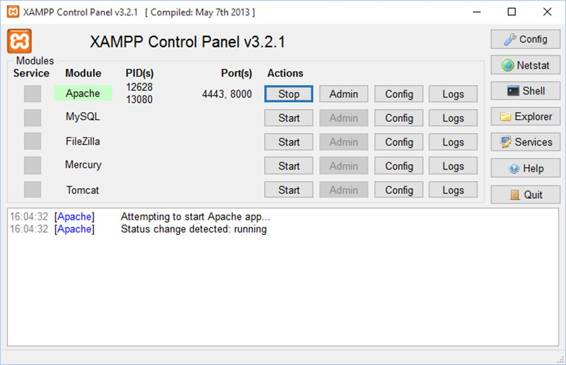
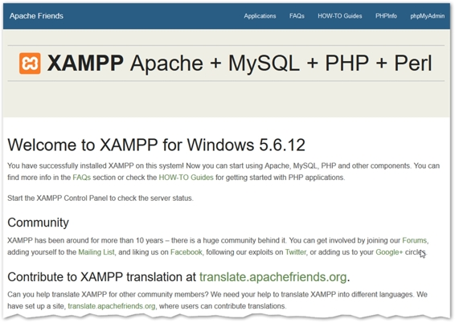
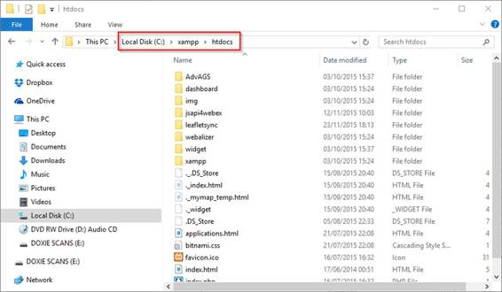
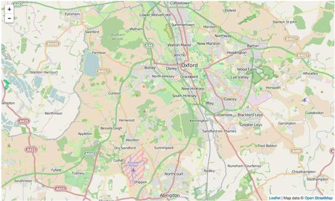

# 一、认识 Leaflet.js

Leaflet. js 是一个超轻量级的映射库。它由大约 34KB 的压缩 JavaScript 组成，绝对没有外部依赖。Leaflet. js 真正不同寻常的是，它在不牺牲特性的情况下做到了这一点。尽管随着时间的推移，许多框架很快变得臃肿和复杂，但 Labber . js 在场景中仍然相对较新，并且是由开发人员 Vladimir Agafonkin 从头开始设计的，简单、直观且易于使用。

Leaflet.js 是开源的，有一个非常活跃的开发者社区。尽管核心库在设计上非常小(为了避免你的应用不得不下载大量它不依赖的代码)，有许多插件可以用来扩展你的网络地图应用的功能。所以，如果你在看另一个网络地图框架，并想，“如果Leaflet. js 做到了，那不是很酷吗？”你几乎可以肯定，某个地方的某个人也想到了同样的事情，并为其编写了一个插件。

我可以继续介绍 lafob . js 的伟大设计及其惊人的功能，但这是一个简洁的指南，我们希望您能立即站起来并运行，并帮助您自己发现这些东西。让我们开始吧。

基本上，不多。您需要一个文本编辑器来编写代码；任何你熟悉的文本编辑器都可以正常工作。我使用的是一个跨平台编辑器，名为支架，是 Adobe 专门为网络开发设计的，但是你可以使用任何你喜欢的东西。尝试并获得一个支持 HTML、CSS 和 JavaScript 语法突出显示的工具，因为它将帮助您理解代码并快速发现任何语法错误。记事本++对于 Windows 用户来说是一个不错的选择。

你需要一个网络浏览器。同样，使用你最喜欢的，但我建议选择 Mozilla Firefox 或 Google Chrome，因为它们有如此优秀的开发工具。当你绞尽脑汁想知道为什么应用的某些功能不起作用，而 JavaScript 却不知道错误的本质时，这些确实很有帮助。

我还建议您使用网络服务器来托管您的 HTML 页面和 JavaScript 代码。虽然可以通过直接在浏览器中打开代码文件来运行本书中的大多数示例，但是除了琐碎的实验之外，您可能还想使用 web 服务器。我用的是 XAMPP，它超级容易配置和使用，在 Windows 和 Mac 上都有。XAMPP 提供了一个安装程序来设置一个本地的 Apache 网络服务器，以及其他组件，当你开始扩展你对 Layeb . js 的知识时，你可能会发现这些组件很有用。这些组件包括 MySQL(世界上最流行的开源网络数据库)和 MariaDB，MySQL 的替代插件，以及用于服务器端脚本的 PHP 语言。

其他选项包括 WAMP(适用于 Windows)和 MAMP(适用于 Mac OS)。

只需为您选择的解决方案运行安装程序，启动它，并注意服务器的*文档根*在哪里，以及网络服务器运行在哪个*端口*上。文档根目录是文件系统中放置您创建的 HTML 和 JavaScript(以及 PHP，如果您遵循第 5 章中的示例)文件的位置。当您尝试通过 web 浏览器访问特定页面时，web 服务器会在文档根目录中查找相应的文件。您需要输入端口号作为网址的一部分，以便您选择的网络服务器可以拦截任何请求。

启动应用的图形用户界面控制面板，并确保 Apache 和 MySQL 服务正在运行。(MySQL 在这里是可选的，但是如果您想运行第 5 章中的数据库示例，您将在以后需要它。)这是 XAMPP 的样子:



图 1: XAMPP 控制面板

我用的是稍旧版本的 XAMPP。最新版本的 XAMPP 包含马里亚数据库系统，而不是 MySQL。这两个数据库系统是二进制兼容的，所以如果你想遵循这本电子书中的代码示例，使用马里亚数据库没有问题。在我的环境中，我让 Apache 在端口 8000 上运行和侦听。Apache 的默认端口是 80，但是我有另一个使用该端口的网络服务器，所以我使用了“配置”选项来更改端口号。我可以在我的网页浏览器中访问 [http://localhost:8000](http://localhost:8000) ，看到确认页面:



图 2:XAMPP/阿帕奇确认页面

Apache 要求您将网页放在其 htdocs 文件夹中，在我的 XAMPP 环境中，该文件夹位于 C:\xampp\:



图 3:代码文件放在哪里

任何。html，。js，或者。您放在根目录中的 php 页面可以通过您的浏览器在 *http://localhost: <端口号> / <页面名称>* 进行访问。

本书所有代码清单的源代码，以及任何相关的图片和其他文件，都可以在[这里](http://www.appswithmaps.net/leaflet/leafletsync.zip)下载。

书中的每个代码列表都与一个文件相关，该文件在一个文件夹中进行了相应的编号，该文件夹以其所在章节的名称命名。例如*代码清单 1* 的源代码可以在名为 Ch01_gtk 的目录中找到，叫做 listing01.html。

我还包括了我在本书中提到的两个“助手”应用的源代码。它们可以在 zip 文件中的 extentfinder 和 mapdraw 目录中找到，也可以在以下位置在线访问:

*   [范围探测器](http://www.appswithmaps.net/leaflet/extentfinder)
*   [地图绘制工具](http://www.appswithmaps.net/leaflet/mapdraw)

只需几行代码就可以创建一个简单的交互式网络地图。因为这是一个网络地图，所以它需要托管在一个网页中。所以打开你选择的文本编辑器，创建一个名为 mymap.html 的文件。在文件中输入以下 HTML 标记:

代码清单 1:基本的网页

```js
         <!DOCTYPE html>
         <html>
         <head>
           <title>My Leaflet.js Map</title>
         </head>
         <body>
         </body>
         </html>

```

执行以下步骤创建第一张地图:

1.  参考传单. js 库和 CSS。
2.  在你的页面上创建一个元素，地图将出现在那里。
3.  创建地图对象。
4.  向地图添加图层。

有两种方法可以在应用中使用 libert . js:

1.  通过内容交付网络(CDN)参考该库的托管版本。
2.  下载Leaflet. js 库，并将其托管在您自己的网络服务器上。

#### 通过社区发展网络获取传单

要通过 CDN(内容交付网络)访问 leader . js，使用<link>标签引用其 CSS，使用

代码清单 2:通过 CDN 访问 Leaflet.js

```js
          ...
         <head>
           <title>My Leaflet.js Map</title>
             <link rel="stylesheet"
               href="http://cdnjs.cloudflare.com/ajax/libs/leaflet/0.7.3/leaflet.css" />
             <script src="http://cdnjs.cloudflare.com/ajax/libs/leaflet/0.7.3/leaflet.js">
             </script>
         </head>
          ...

```

|  | 注意:代码清单 2 中显示的 URL 应该引用最新稳定版本的Leaflet. js，在编写本文时，它是 0.7.3。查看[传单. js 网站](http://www.leafletjs.com/)获取最新的稳定版本。 |

我们将在本书的例子中使用 CDN。

#### 从你自己的网络服务器访问传单

如果你想自己主持 Leaflet.js，你有几个选择:

1.  从[Leaflet. js 网站](http://www.leafletjs.com/)下载一个预建包到你的文档根，在<脚本>和<链接>标签中设置合适的路径。包档案包含迷你化的 JavaScript 代码(Leaflet. js)和一个名为Leaflet-src.js 的未统一版本，这在调试时会有所帮助。它还包括所需的 CSS。
2.  从 [GitHub](https://github.com/Leaflet/Leaflet/releases) 下载源代码，并使用 Node.js 构建它。这让您可以访问几乎所有内容，包括原始源代码、单元测试等等。如果你想很好地了解Leaflet. js 的内部，甚至可能添加新的特性，让它对我们其他人更好，你就需要这样做！有关完整的说明，请参见 LinkedE . js 网站。

### 为地图创建 <分区>元素

在编写任何Leaflet. js 代码之前，您需要在页面上创建一个空间来存放地图。只需创建一个

元素，并给它一个合适的 id 属性，以便您以后可以在代码中引用它。您还必须(至少)为指定一个高度属性。如果不指定高度属性，地图将不会显示。如果需要，也可以指定宽度属性。如果您选择不这样做，则地图将覆盖其父元素的整个宽度(在以下示例中是标签)。

代码清单 3:创建和调整地图

```js
         <!DOCTYPE html>
         <html>
         <head>
           <title>My Leaflet.js Map</title>
             <link rel="stylesheet"
               href="http://cdnjs.cloudflare.com/ajax/libs/leaflet/0.7.3/leaflet.css" />
             <script src="http://cdnjs.cloudflare.com/ajax/libs/leaflet/0.7.3/leaflet.js">
             </script>
             <style>
               #map {
                 height: 400px;
               }
             </style>
         </head>
         <body>
           <div id="map"></div>
         </body>
         </html>

```

但那是一大堆空白页和一张小地图，对吗？如果你想让地图占据整个页面呢？只需确保地图

及其父元素的高度属性设置为 100%。

代码清单 4:全屏显示地图

```js
          ...
             <style>
               html, body, #map {
                 height: 100%;
               }
             </style>
          ...

```

现在我们在页面上有了一个放置地图的位置，我们需要创建 Labber . js 地图对象。为此，我们需要编写一个 JavaScript 函数，并在调用它之前等待页面中的所有元素加载。如果我们不等待，那么当我们试图在代码中引用它时，我们的地图

可能还不存在，我们会得到一个错误。

创建一个

代码清单 5:创建一个等待所有页面元素加载的函数

```js
          ...   
             <script type="text/javascript">
                 function init() {
                   alert("I'm ready!");
                 }
             </script>
         </head>
         <body onload=init()>
               <div id="map"></div>
         </body>
         </html>

```

保存它，在您的网络浏览器中启动它，并确认 init()函数被调用并显示“我准备好了！”消息。如果工作正常，我们可以用它来创建地图对象，并告诉它显示哪个

。用以下代码替换 init()函数中的代码:

代码清单 6:创建地图对象

```js
          ...  
             <script type="text/javascript">
                 function init() {
                   var map = L.map('map').setView([51.73, -1.28], 12);
                 } 
             </script>
          ...

```

这是怎么回事？

*   L.map('map ')是Leaflet. js 映射构造函数。构造函数接受两个参数:地图将显示的 HTML 元素(在我们的例子中，就是地图)，以及(可选的)为地图的外观和行为定义特定选项的对象文字。在本例中，我们没有指定地图选项对象。参见[活页. js 文档](http://leafletjs.com/reference.html#map-options)中的全部地图选项。
*   。setView(…)一旦我们有了地图对象，我们就调用它的 setView()方法来传入地图的*范围*。范围是我们想要显示的可见区域。setView()方法接受两个参数。第一个参数是表示地图中心的纬度和经度的数组，第二个参数是表示缩放级别的数字。
*   然后，我们用这两种方法定义的映射对象存储在我们的本地 JavaScript 变量映射中。

如果我们保存我们的文件并启动它，那么我们会看到…确切地说什么也没有。这是因为尽管我们有一张地图，但我们还没有告诉它要显示什么数据。我们下一步会这么做。

我们的地图对象只是一个容器。为了让我们的地图显示一些东西，我们需要添加一个或多个*层*。

通常，网络地图会有多个图层。这些将包括显示地形、道路或其他上下文信息的基础地图；和操作层，它们包含用户特别感兴趣的任何数据，例如咖啡店、餐馆或徒步旅行路线的位置。通常，基础地图由第三方托管。操作数据也可以来自其他来源，但通常是我们自己提供的，可以硬编码到应用中，在运行时从数据库加载，或者由用户输入。

将地图视为离散的图层允许很大的灵活性，因为它允许我们根据用户想要看到的内容来显示或隐藏信息。例如，如果我们的用户只想看餐馆，那么我们可以隐藏我们的“咖啡店”层。如果他们不在市场上吃点心，而是想去山上，那么我们可以隐藏我们的“餐馆”和“咖啡店”图层，用一些卫星图像替换街道地图，这样他们就可以更好地理解这些小径通向哪里。

例如，与谷歌地图不同，在谷歌地图中，您只能访问谷歌自己的基础地图，我们可以使用一系列惊人的不同基础地图，其中一些可以广泛获得；其他人需要更多的努力来追踪。借助一些专业软件，如地理服务器或地图服务器，我们甚至可以创建和托管自己的基础地图。

我们将在下一章详细介绍地图图层。现在，让我们只添加一个基础地图层，这样我们就可以玩一些东西。我们将使用[中的一个开放街道地图](http://www.openstreetmap.org/)，这是一个完全由众包地图数据制作的精彩地图。

在 init()函数中输入以下代码，将 OpenStreetMap 图层添加到地图中:

代码清单 7:添加基础地图图层

```js
          ...
           <script type="text/javascript">
             function init() {
               var osmLink = "<a href='http://www.openstreetmap.org'>Open StreetMap</a>"                                                
                   var map = L.map('map').setView([51.73, -1.28],12);
                   L.tileLayer(
                       'http://{s}.tile.openstreetmap.org/{z}/{x}/{y}.png', {
                       attribution: 'Map data &copy; ' + osmLink,
                       maxZoom: 18,
                   }).addTo(map);
               }                
           </script>
          ...

```

在这里，我们定义了一个类型为 TileLayer 的新层。我们使用 TileLayer，因为大多数基础地图都是由大量的图像组成，这些图像被分割成小块，这样浏览器只需下载特定范围内所需的图像小块。我们将在下一章更详细地讨论层。

TileLayer 对象的构造函数将一个 URL 作为其第一个参数，该 URL 告诉我们的应用从哪里获取切片数据。URL 中的{s}、{z}、{x}和{y}占位符表示以下内容:

*   {s}允许主域的一个子域为切片请求提供服务，使我们的应用能够同时发出多个请求，从而更快地下载切片。
*   {x}和{y}定义图块坐标。
*   {z}代表缩放级别。

谢天谢地，我们不用担心自己填充这些占位符；Leaflet.js 为我们解决了这个问题。

第二个参数是一个 JavaScript 对象文字，它定义了我们想要设置来配置图层的任何选项。在这种情况下，我们已经提供了一些属性数据和最大缩放级别，我们希望我们的用户能够在该层处于活动状态时放大。

最后，我们调用 TileLayer.addTo()方法，并传入我们希望该图层出现的地图对象。

保存您的代码，并在网络浏览器中导航到 mymap.html 页面。如果您使用的是与我相同的设置，请访问 http://localhost:8000/my map . html。



图 4:你的第一张活页地图

该地图显示了英国牛津周边地区的开放街道地图数据。要与地图互动:

缩放:

*   使用地图左上角的加号/减号按钮。
*   使用鼠标滚轮。
*   用鼠标按住 Shift 键并单击拖动(这称为“框缩放”)。

平移:

*   点击地图并拖动鼠标。

恭喜你！您已经创建了您的第一张 Labber . js 地图，现在正式成为新地理学家。(关于你刚刚加入的俱乐部的更多信息，请参见[维基百科](https://en.wikipedia.org/wiki/Neogeography)。)

但是英国牛津可能不是一个对你来说很重要的地方。所以，作为一个练习，改变地图的范围来关注你的家乡。这需要知道你想要的范围的中心的纬度和经度。由于大多数人脑子里没有那种信息，我写了一个小助手应用，你可以在这里访问。只需找到您想要的范围，点击**获取地图代码**。当对话框出现时，复制它包含的代码，并使用它来替换应用中的映射构造函数代码。


图 5:使用范围查找器应用

|  | 注意:范围查找器应用精确到太多的小数位。你通常不需要那种准确度；纬度或经度坐标超过小数点后三位可能是多余的。 |

在下一章中，我们将更详细地研究地图图层。