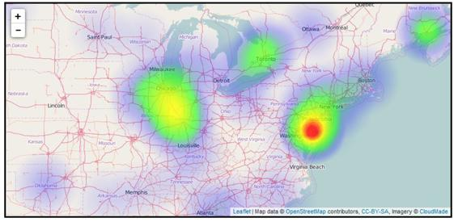
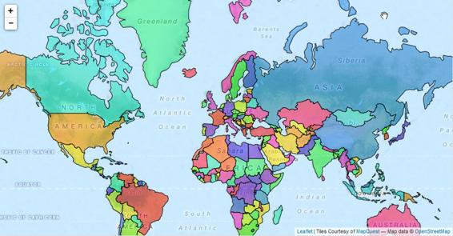
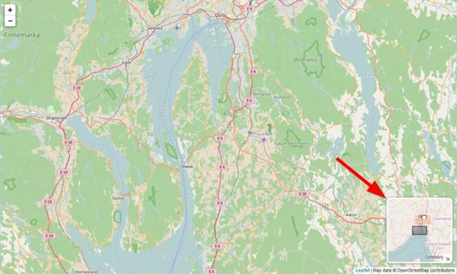
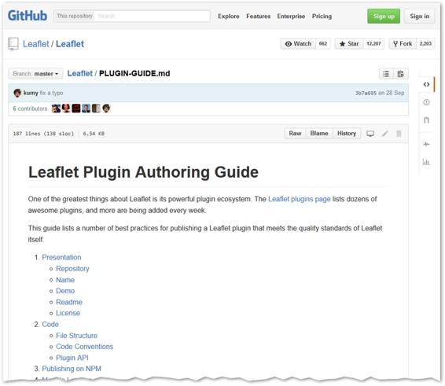

# 七、总结

所以现在你已经有机会玩了，我希望你和我一样对它的可能性感到兴奋。我可以说，毫无疑问，这是我用过的最好的网络地图应用编程接口，我已经尝试了大部分。

通过保持Leaflet. js 的核心小并通过插件扩展其功能，该 API 是一种愉快的工作方式，并且没有损害其一些竞争对手的努力的膨胀。事情只是按照你期望的方式运行，这在这个领域是不寻常的。许多地图应用编程接口是由地理学家创建的，他们倾向于在他们的应用编程接口中使用对普通人来说意义不大的特性和术语。传单的创造者弗拉基米尔·阿加丰金(Vladimir Agafonkin)首先是一名网络开发人员——这表明了这一点，因为他已经建立了一个其他网络开发人员可以与之相关的应用编程接口。

在这本书里，我们介绍了大部分的核心 API，甚至还看了一些插件。如果你想大大扩展你的网络地图应用程序的功能，那么你应该看看插件的种类。传单. js 上的官方插件页面列出了很多，几乎涵盖了你能想象到的所有功能。

图 57:传单. js 插件页面

有插件支持动画、位置书签、路线导航等等。

例如，如果您想要创建热点密度高的区域显示为“热”而点密度低的区域显示为“冷”的热图，那么您应该考虑 Patrick Wied 的 heatmap.js 插件:

图 58:帕特里克·维德的热图. js 插件

如果你想使用 D3.js 和 Leaflet . js 一起创建动态的、交互式的数据可视化，你应该看看 Kirill Zhuravlev 的 leader。D3SvgOverlay 插件，允许您将 D3.js 的强大功能与 SVG 的交互性结合起来:

图 59:传单。基里尔·朱拉夫列夫的 D3SvgOverlay 插件

如果你想在 Leaflet.js 中可视化时态数据，并允许你的用户使用时间滑块来改变他们想要查看数据的时间段，试试 leaf。SOCIB 的时间维度插件:

图 60:用活页可视化时间数据。时间维度

或者，如果你只关心可用性，看看罗伯特·诺丹提供的小概览图。它提供了一个控件，允许您查看当前地图视图所属的更大范围，甚至可以直接从中导航:

图 61:罗伯特·诺丹的传单。小地图

如果你想要的某些功能似乎不是由 leaf 的官方插件提供的，那么在 [GitHub](https://github.com/search) 上搜索通常会给你一系列惊人的可能性。不过要注意的是:非官方渠道的质量变化很大；

图 62:在 GitHub 上可以找到大量的插件，以及Leaflet. js 代码本身

最后，如果没有符合要求的东西，为什么不创建自己的插件，并与 Labber . js 社区共享呢？传单在 GitHub 上维护了一个非常全面的文档，名为[传单插件创作指南](https://github.com/Leaflet/Leaflet/blob/master/PLUGIN-GUIDE.md)。

图 63:传单插件创作指南

我希望您发现这篇简明扼要的 Syncfusion 指南很有用。马克·勒温，请随时在我的博客或推特上与我保持联系。谢谢你的时间！