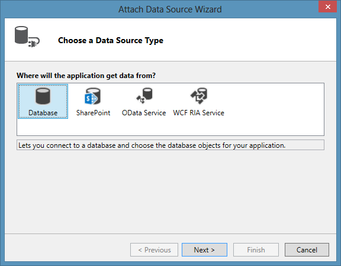
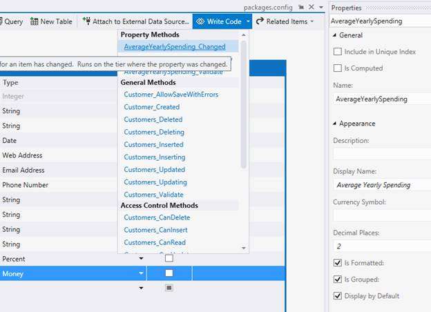
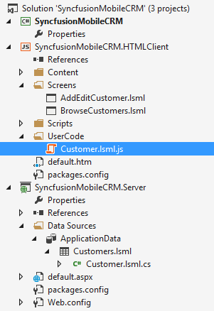
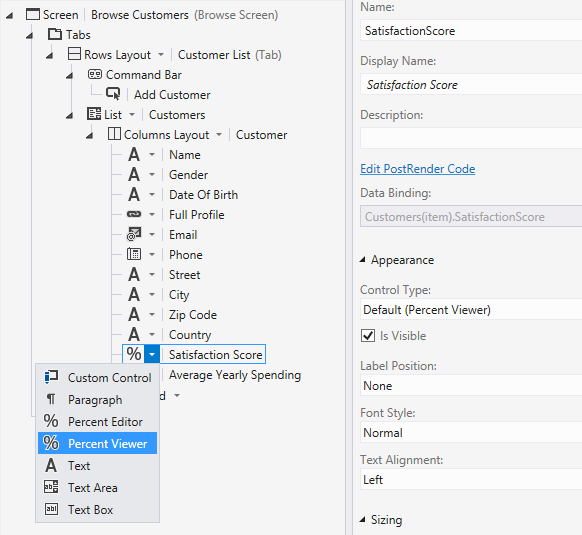
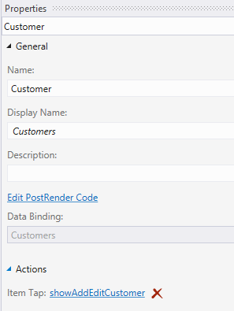
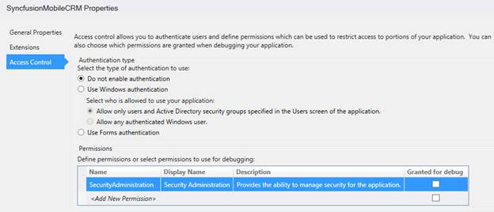
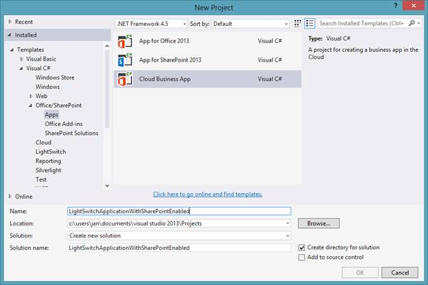
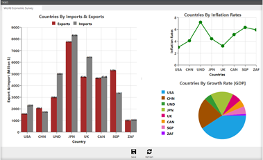

# 二、探索 LightSwitch

## 什么是 LightSwitch？

LightSwitch 没有一个官方的定义，由于它自第一次发布以来已经发展了很多，并且它可以帮助应对广泛的软件开发挑战，所以定义它并不是一件容易的事情。

就本电子书而言，LightSwitch 是框架和集成工具的结合，有助于专业开发人员在快速发布周期中构建高度专业化的 LOB 应用(独立的或作为更大生态系统的一部分)。它不需要在互操作性或灵活性上妥协，而是强制实施业经验证的标准和模式，并促进可扩展的架构设计。

## 什么是 LOB 应用？

业务线(LOB)应用是为特定公司私人使用而编写的应用。据估计，目前编写的所有软件中，大约 90%是 LOB 应用。每个业务线应用对于业务流程、公司文化和使用它的地理位置都是独特的。然而，有一些共同的标准。

大多数业务线应用在特定领域的软件结构中模拟真实世界，这种软件结构被恰当地称为模型。LightSwitch 开发人员将这些模型称为**实体**。需要存储实体，以便它们可以在运行之间重用，在不同的最终用户之间共享，甚至在不同的应用之间交换。一些业务线应用有一组非常独特的数据，可以存储在一个称为**内在数据源**的数据存储中，这是应用独有的。但是，业务线应用通常是更大的生态系统的一部分，并且会重用已经存在的数据源。

**数据源**不一定指数据库。实体可以存储在各种来源中并从中检索:新的或现有的数据库(来自另一个活动的或旧的业务线应用)、网络服务(如 SharePoint 列表、TFS 工作项、其他业务线应用和第三方来源)甚至网络共享上的文件。

实体代表现实生活中的对象(或其一部分)。它们不仅仅是数据结构，而是封装业务逻辑的智能二进制创作。某些业务逻辑对于实体或特定属性来说是唯一的，而其他逻辑在特定业务中甚至在一般情况下可能非常常见。LightSwitch 将这种常见的逻辑称为**业务类型**。业务类型是数据存储类型(字符串、int、二进制等)的超集。)具有一组独特的业务逻辑和验证规则，如货币、电子邮件地址和电话号码。

除了业务逻辑限制之外，所有实体都将受到支持数据源施加的系统限制，如特定字段的最大长度、可以存储的小数位数等。

实体不是孤立的细胞，而是根据一组平衡且受保护的**关系**相互作用。

在可能的情况下实施这些关系是最佳实践，但这在数据源中并不总是可能的。此外，根据业务，两个实体可能有关系，而不管它们是否保存在不同的、隔离的数据存储中。

几乎所有业务线应用都是为多用户目的而设计的。这意味着软件不能是一台个人电脑上的一整块字节，而是应该按照可重用性进行垂直切片，按照部署位置进行水平切片。这些水平切片的块通常称为层。多用户业务线应用通常由数据层、逻辑层和表示层组成。在 LightSwitch 开发人员的词汇中，这种多层架构中的这三种类型的层被称为**数据源**、**中间层、**和**客户端**。实体将真正存在于所有不同的层中。理想情况下，它们的业务逻辑和它们的关系也在每一层上执行，增加了层的**自治**的方式，从而增加了层的整体**可重用性**。

每一层都是根据特定的架构或库**设计模式**在内部构建的。例如，客户端层可以根据**模型-视图-视图模型(MVVM)** 模式构建，其中视图模型层准备模型和可重用命令，以便于表示层(视图)使用。LOB 应用的最终用户通常是非技术熟练的人，他们用特定的业务术语思考他们的工作。优秀的 LOB 应用开发人员会理解这一点，并且不会将最终用户限制为只使用 CRUD 命令(创建、读取、更新和删除)或只显示网格中的所有数据。*(顺便说一下，我有恐女生症。)*优秀的 LOB 应用开发人员将了解应用的具体用途，并根据特定的业务流程和特定的终端使用排版、颜色、自定义布局和专门的控件。

这还包括**自适应设计**(布局或控件根据设备的类型或屏幕因素而变化)，利用设备特定的功能或支持语音或触摸手势(如果适用)，以及在某些情况下支持多种语言。

最后，当开发人员完成新特性时，代码被推送到源代码管理，如果需要的话进行编译，然后部署。发布周期最好尽可能短，这样反馈可以尽早且经常地被纳入。一个好的**部署模型**应该是**高度自动化的**以免减缓发布周期。

最终用户然后安装应用(或者简单地浏览到 web 应用)，并开始使用他们可以访问的内容。存在大量已知的**认证**和有时复杂的**授权**模型，以确保数据和业务流程仅被授予具有适当授权的用户。

## LightSwitch IDE

LightSwitch IDE 主要利用专门的设计人员来设计实体、查询和屏幕。这些设计者抽象了技术方面，消除了许多繁琐的工作，让你作为一个专业的开发人员最初只关注业务方面。

如果像上一章一样启动应用，实体设计器将自动打开:右键单击服务器项目的数据源文件夹，然后选择添加表。

图 20:数据源上下文菜单

该命令自动导致 LightSwitch 添加一个名为 ApplicationData 的新数据源。

图 21:内在数据源

该数据源将生成一个相关的内部数据库，即 SQL Server 或 SQL Azure 数据库，该数据库将保存特定于您的应用的所有实体(**内部数据源**)。

LightSwitch 还有连接现有数据源(**数据源**)的选项。从同一上下文菜单中选择“添加数据源”选项将打开一个向导，帮助您连接到各种选项。

图 22:连接到现有数据源

数据库允许您连接到任何现有的数据库。

SharePoint 创建到 SharePoint 网站的连接，以便您可以在应用中使用任何 SharePoint 列表。

OData 服务允许您连接到通过开放数据协议([http://OData.org](http://OData.org))公开的任何网络服务。反过来，每个 LightSwitch 应用都使用 JSON Light(一个 OData 实现)向 LightSwitch 或第三方客户端公开中间层。这意味着您可以使用 OData Service 连接将新的 LightSwitch 应用连接到已经部署的 LightSwitch 应用中的实体，从而提高**的可重用性**。

WCF 放射免疫服务可以是任何继承自域服务基类的类。这允许开发人员在 LightSwitch 应用和他们可以从代码连接到的任何东西之间快速地用代码创建适配器:CSV 或 XML 文件、SOAP 服务、Office 文档或他们想要的任何专有格式。

实体设计者通过确保您在逻辑所属的地方实现它来促进面向对象的原则:由实体封装。每个字段都有一个业务类型(唯一的****业务类型**)。LightSwitch 几乎有 20 种内置业务类型，从简单的数据类型(如布尔值或字符串)到更复杂的类型(如电子邮件或货币)。**

 **

图 23:实体设计器中的客户实体

除了专有的内置验证(例如:电子邮件验证)之外，每种业务类型都会在属性窗口中公开一些额外的专用属性。例如，货币既有支持数据字段的典型属性(小数位数仅举一个例子)，也有业务类型固有的属性(例如货币符号)。

如果连接到现有数据源，以前的属性类型(如字段的最大长度或大小)将被禁用以进行更改。

图 24:屏幕设计器显示了扩展属性和代码入口点。

如果需要更多的控制来**封装业务逻辑**，可以通过点击实体设计器顶部的 Write Code 生成一个方法或者函数存根。有些方法将只在服务器端或客户端运行，其他方法在服务器端和客户端都运行(例如:创建特定实体的新实例时执行的“created”方法，用于初始化目的)。

为了避免歧义，请更改实体设计器底部的视角，以指示您希望自定义代码运行的位置。

图 25:改变视角

根据你的观点，一个 JavaScript 或者一个 C#-VB。NET 类将被自动添加。

图 26:存储在 JavaScript 或。NET 代码

虽然在实体设计器中看不到这一点，但是每个实体都自动维护了用于审核(命名为 CreatedBy、Created、ModifiedBy 和 Modified)和并发检查(RowVersion)的列。与其他平台不同，如 WPF、ASP.NET 或 Win Forms，您不会看到任何带有控件的页面(可能是 HTML 或 XAML)，而是用户界面外观的分层表示。LightSwitch 库将在运行时使用这个抽象来创建视图层，方法是在单个 HTML 页面中向根 HTML 元素动态添加新的 HTML 元素。桌面客户端中的视图不是以同样的方式在运行时生成的，但是技术实现细节超出了本电子书的范围。

图 27:视图

这个可视化树中的每个节点都被称为 ContentItem。ContentItem 数据绑定到视图模型的特定部分，并为用户提供有关可视化方式的附加信息。每个内容项都可以根据支持的业务类型使用适当的用户界面控件来显示。例如，百分比值可以通过百分比查看器或百分比编辑器控件显示。要选择不同的控件，请单击节点图标旁边的下拉箭头。

图 28:视图中内容项的可用控件和属性

此外，每个 ContentItem 节点在属性窗口中公开附加属性，以进一步控制布局、大小、字体和其他属性。移动应用中的活动级联样式表(CSS)或 Silverlight 桌面应用中的选定主题当然会进一步增强这一点。您还可以添加自定义代码来重写呈现。LightSwitch 还提供了专门的布局控件来排列、分组和组织用户界面中的元素，并能够从头开始创建自定义控件。通过**排版、颜色、自定义布局和专用控件**增强应用所需的所有工具都可用，我们将在后面的章节中尽可能多地介绍。

除了外观，一些属性还允许您设置动作或编写自定义代码，以通过单击来响应特定的**触摸手势**。

图 29:触摸手势动作，如项目点击

请注意，屏幕设计器中没有选项、属性或按钮来帮助创建**自适应设计，**，因为这是现成的，100%免费提供的。

设计好应用后，就该选择**认证**模型了。在解决方案资源管理器中选择 LightSwitch 应用，并打开属性。“访问控制”选项卡将允许您通过单击单选按钮来选择适合公司现有 IT 基础架构的身份验证模式。

图 30:访问控制选项卡

在同一个选项卡中，开发人员可以向应用添加自定义权限。然后可以在代码中检查这些权限，以允许或限制最终用户执行特定命令或打开特定屏幕，还可以用于垂直甚至水平数据安全，例如编辑实体上的特定字段，甚至对数据库隐藏特定行。然后，管理员(拥有安全管理权限的任何人)可以将最终用户分组到用户组中(或者在 Windows 身份验证的情况下重用活动目录安全组)，并将这些权限的子集分配给每个组。这允许**授权**像业务要求的那样细粒度。

从常规属性选项卡中，您可以从 41 种受支持的语言中选择应用的语言。

图 31:LightSwitch 应用的一般属性

单个应用也可以同时支持多种语言。这本书没有涉及到，但是你可以在[http://msdn . Microsoft . com/en-us/library/vstudio/xx130603 . aspx](http://msdn.microsoft.com/en-us/library/vstudio/xx130603.aspx)找到更多信息。

根据您的 LightSwitch 应用类型，可用选项卡的数量会有所不同。我们的使命是创建一个移动业务应用，但是如果您也想使用 LightSwitch 创建云业务应用，只需从 Office/SharePoint 节点下的云业务应用项目模板开始您的旅程。

图 32:云业务应用项目模板

此项目模板将创建一个 LightSwitch 应用，该应用预先配置为部署到 SharePoint 2013 服务器，无论是在内部还是在云中，如 Office 365 站点。SharePoint 开发不在本电子书范围内，但如果您想了解更多相关主题，请点击此链接:[http://msdn . Microsoft . com/en-us/library/vstudio/jj 969620 . aspx](http://msdn.microsoft.com/en-us/library/vstudio/jj969620.aspx)。

回到当前项目可用的选项卡，让我们看看扩展选项卡。LightSwitch 有一个 SDK，可以从[http://visualstudiogallery . msdn . Microsoft . com/2381 b 03 B- 5c 71-4847-a58e-5 CFA 48d 418 DC](http://visualstudiogallery.msdn.microsoft.com/2381b03b-5c71-4847-a58e-5cfa48d418dc)下载。使用这个软件开发工具包，您可以为不同的数据源、新的业务类型控件、屏幕模板，甚至公司特定的外壳和主题创建额外的、可重用的适配器。请注意，在撰写本文时，这四个扩展仅限于桌面客户端使用。然后，这些扩展将被打包到一个 VSIX 安装程序中。一旦您安装了这样一个 VSIX，您就可以在这个选项卡中按照 LightSwitch 项目激活它。

包括 Syncfusion 在内的一些主要组件供应商已经将其所有 Silverlight 控件包装在可重用的 LightSwitch 控件中。如果你有兴趣，可以在[http://www.syncfusion.com/products/lightswitch](http://www.syncfusion.com/products/lightswitch)看看 LightSwitch 的 Essential Studio，看看把 LightSwitch 的快速应用开发能力和 Syncfusion 的创新结合起来有多容易。

图 33:带有灯 LightSwitch 控件的 SilverLight 应用示例

请记住，这些 VSIX 文件也必须安装在您的构建服务器上，否则它将无法根据刚从**源代码控制**中提取的源代码编译您的 LightSwitch 项目。LightSwitch 在 IDE 中使用编辑器，但在幕后，LightSwitch 解决方案包含可以检入或推送到任何源代码管理的普通项目，就像任何其他项目一样。在[http://blogs . msdn . com/b/LightSwitch/archive/2013/07/09/team-development-series-introduction-Peter-hauge . aspx](http://blogs.msdn.com/b/lightswitch/archive/2013/07/09/team-development-series-introduction-peter-hauge.aspx)上可以找到关于同时与多个开发人员合作进行 light switch 项目的其他指南和最佳实践。

在继续之前，这里有一些关于常规选项卡中我还没有提到的元素的附加信息:版本号、发布和 SQL 数据库项目。

LightSwitch 使用语义版本控制。开发人员有责任保持主要和次要版本号的最新。每次单击发布按钮时，修补程序编号都会自动增加。

单击发布按钮将启动发布向导。这个过程将在后面详细介绍。目前，我将把我的案例放在 LightSwitch 上，它是 LOB 应用开发的绝佳工具；我将卷起袖子，深入到“常规属性”选项卡上我还没有提到的最后一个属性:SQL 数据库项目。**