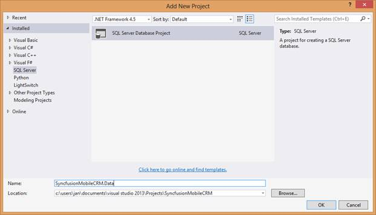
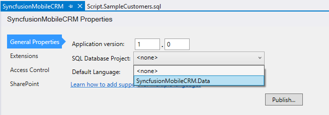
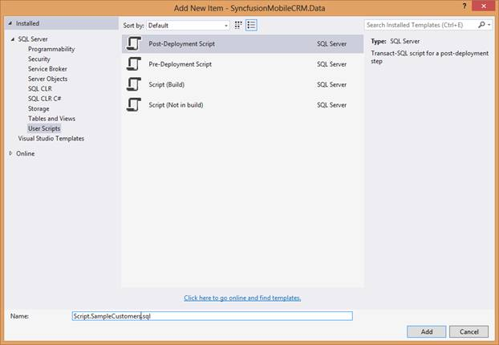
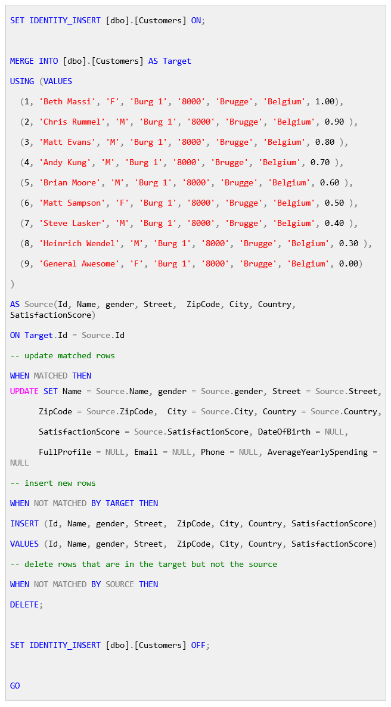
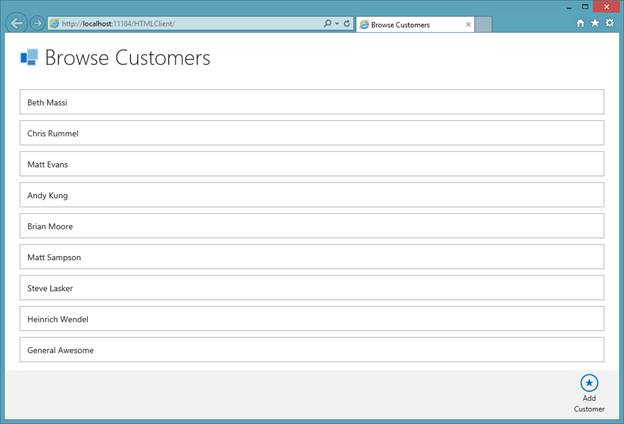

# 第三章 SQL 数据库项目介绍

我最喜欢的 LightSwitch 新特性之一是能够向解决方案中添加数据库项目，以帮助塑造内部数据库。最近增加的内容符合 LightSwitch 的愿景:使用简单的编辑器快速完成大部分工作，同时仍然保留在最低级别更改哪怕是最微小的技术细节的能力。

该数据库项目旨在提供一个位置来创建存储过程，该存储过程可以处理大量工作，或者添加默认或示例数据或配置。每次在实体设计器中进行布局更改时，LightSwitch 项目将保持该数据库项目的数据模型与实体设计器同步(并执行任何部署后脚本)。

这种同步只在一个方向上起作用。实体设计器被认为是数据模型的权威，您不应该使用数据库项目从根本上改变将基于您在实体设计器中的工作生成的表的布局。

SDET·克里斯·鲁梅尔在[上详细解释了这个特性。](http://blogs.msdn.com/b/lightswitch/archive/2013/07/03/intrinsic-database-management-with-database-projects-chris-rummel.aspx)

在这本电子书中，我们将重点介绍 SQL 数据库项目的要点。首先，右键单击解决方案并选择添加新项目。

图 34:添加新的 SQL Server 数据库项目

将项目添加到解决方案后，指示 LightSwitch 项目保持与其他项目同步。为此，右键单击 LightSwitch 项目并选择属性。从常规属性选项卡中，将 SQL 数据库项目设置为您刚刚创建的项目。

图 35:链接数据库项目

现在基本的基础结构已经就绪，向数据库项目添加一个新的部署后脚本。

图 36:添加部署后脚本

该部署后脚本将在每次部署数据库时执行。这包括首次发布应用时、发布更新时以及每次更改实体布局时。我已经更新了克里斯的 SQL 脚本来匹配我们的模型。

代码清单 1

该脚本的意图很简单:给定一组硬编码的客户，用相应的标识更新数据库中的行，插入缺失的行，并删除多余的数据。这个数据中的人物和任何人，无论是活着的还是死去的，之间的任何相似之处都是纯粹的巧合。

重新构建并再次启动应用，以验证我们的测试对象是否到位。

图 37:重建的应用

该应用如预期的那样显示客户。