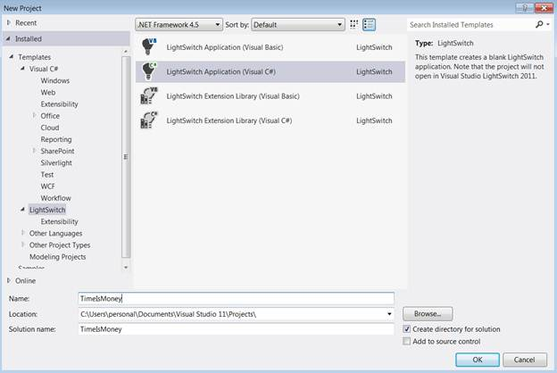
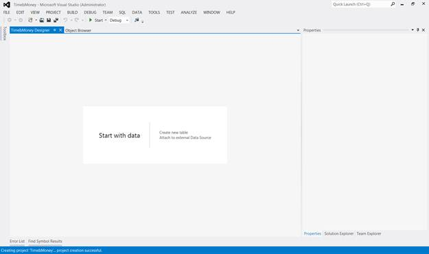
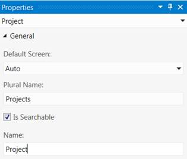
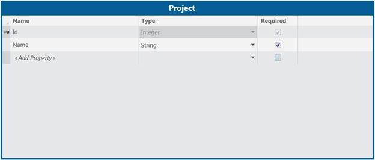

# 第二章你好世界

如果你和我一样，你有一些你想做的事情，有很多你必须做的项目，还有很多你应该已经完成的任务。作为本教程的一部分，我们将编写一个简单的 LightSwitch 应用程序来帮助您组织人员、任务和项目。毕竟*时间就是金钱*。

## 创建新项目

安装好 Visual Studio 2012 RC 后，启动它，从其**文件**菜单中选择**新项目**。在已安装的模板中，选择创建新的**光开关应用程序(Visual C#)** 的选项。您也可以选择使用 VB.NET 作为编码语言来创建您的应用程序。给你的项目取一个合适的名字，点击**确定**。

图 1:创建一个新的 LightSwitch 项目

## 永远从数据开始

显示了 LightSwitch 主页，它建议从数据开始——考虑到应用程序以数据为中心的特性，这是一个显而易见的建议，您会发现 LightSwitch 非常适合。单击**创建新表**链接，创建新实体。这将打开实体设计器。

图 2: LightSwitch 主屏幕

我们将在整本书中解释实体设计器中发生的一切。首先，让我们通过将实体重命名为**项目**并添加一个名为**名称**的字符串属性来创建一个工作的“hello world”应用程序。

要重命名实体，请在实体设计器中双击它或填写右侧的**属性**窗口。

图 3:重命名实体

图 4:添加名称字符串属性

## 添加一些屏幕

就在实体设计器的上面，你会发现一些可能的东西可以添加到这个实体中，或者用这个实体来做。右上角的**写代码**按钮(如图 5 所示)几乎是你在 LightSwitch 中使用的每一个设计师都会遇到的按钮，也可能是 LightSwitch 如此强大的原因。LightSwitch 不是黑盒；你可以用普通的旧东西控制每一部分。NET code—VB.NET 或 c#—使用这些定义良好的扩展点。

点击**屏幕**按钮，添加新的屏幕，如下图所示。

图 5:实体设计器中的工具栏

将出现一个弹出窗口，为您提供几个屏幕模板。就我个人而言，我几乎总是从**列表和详细信息屏幕**模板开始。

图 6:添加新屏幕向导

提供一个合适的屏幕名称——例如*所有项目*——并选择我们的项目实体作为要使用的屏幕数据。在点击**确定**之前，确保选择**附加数据包括:项目详情**复选框。然后，LightSwitch 自动使用第一个字符串属性作为实体的摘要，并在详细信息视图中显示所有属性的值。

## 按 F5 键将它们混合在一起

按下 **F5** 或从菜单中选择**调试** > **开始调试**来构建和启动您的应用程序。构建一个 LightSwitch 应用程序可能需要相当长的时间，但是经过这一小段延迟后，您的应用程序将会启动并准备使用。

图 7:你好世界应用程序

此时，我们有了一个工作应用程序，可以在其中添加、编辑或删除项目。虽然我们还没有编写任何代码，因为没有域逻辑(这是您必须编写的唯一代码)，但是该应用程序有大量的功能和非功能特性:可折叠菜单、数据分页、排序、搜索、将数据导出到 Excel、验证、并发管理等等。